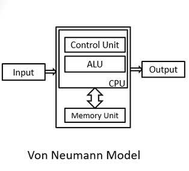
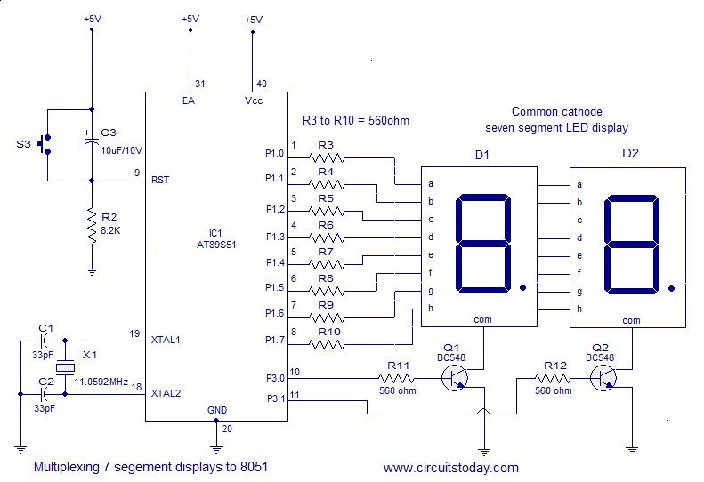

[TOC]

# Unit I: Introduction to Microprocessor

## Definition and History of Microprocessors

**Definition of a Microprocessor**

A microprocessor is a single integrated circuit (IC) that incorporates the core functions of a computer's central processing unit (CPU).  

* **The "Brain" of a Computer:**  It executes instructions, performs calculations, and manages the flow of data within a computer system.
* **Small and Powerful:** Microprocessors pack millions or even billions of transistors into a tiny chip, enabling complex processing in compact devices.
* **Essential for Modern Devices:** They power a vast range of devices from smartphones and laptops to cars, appliances, and industrial equipment.
* **Components:** Typical components of a microprocessor include:
  * Arithmetic Logic Unit (ALU) - Performs arithmetic and logical operations
  * Control Unit (CU) - Decodes instructions and coordinates the operations of other units
  * Registers - Small, high-speed memory locations for temporary data storage

* **Responsible for:**

  * **Fetching instructions:** Retrieving instructions from the computer's memory.

  * **Decoding instructions:** Translating instructions into a form the microprocessor understands.

  * **Executing instructions:** Performing calculations and logical operations based on the instructions.

  * **Controlling data flow:** Managing the movement of data between memory, input devices, output devices, and the microprocessor itself.


**History**

The evolution of microprocessors is a fascinating story of technological advancement:

* **Early Computers (1940s-1950s):** The first computers were massive, filling entire rooms. They used vacuum tubes for processing, which were bulky, power-hungry, and prone to failure.
* **Transistors (1950s-1960s):** The invention of the transistor revolutionized electronics. Transistors were smaller, faster, and more reliable than vacuum tubes, leading to smaller and more powerful computers.
* **Integrated Circuits (1960s):** Integrated circuits (ICs) combined multiple transistors, resistors, and other components onto a single chip. This enabled further miniaturization of computers.
* **The First Microprocessor (1971):** Intel released the Intel 4004, the first commercially available microprocessor on a single chip. While limited in power by today's standards, it paved the way for the computing revolution.
* **Rapid Advancement (1970s-1980s):** This period saw exponential growth in microprocessor performance with the introduction of iconic processors like the Intel 8080, Zilog Z80, and Motorola 6800. These processors found their way into the first personal computers.
* **Modern Era (1990s-Present):** Microprocessors have become incredibly powerful, with billions of transistors on a single chip. They power not only our computers but also smartphones, tablets, smart devices, cars, and countless other technologies.

**Key milestones in microprocessor history:**

* **1971:** Intel 4004 (4-bit)
* **1974:** Intel 8080 (8-bit)
* **1978:** Intel 8086 (16-bit) -  foundation of the x86 architecture used in many PCs today. 
* **1993:** Intel Pentium (32-bit) – brought significant performance gains
* **2000s:** Introduction of multi-core processors
* **Present:** Continued focus on performance, power efficiency, and specialized microprocessors for tasks like AI and machine learning.

## Basic Components of a Digital Computer


A digital computer is a versatile device capable of performing calculations and logical operations at incredible speeds. To achieve this, a computer relies on several fundamental components working together:

- **Input Unit:** This unit bridges the gap between the user and the computer. It allows data and instructions to be entered into the system. Some common input devices include:

  - Keyboard
  - Mouse
  - Touchscreen
  - Scanner
  - Microphone

- **Storage Unit:**  The storage unit preserves data, instructions, and results for short-term and long-term use. It's divided into two main categories:

  - **Primary Storage (Main Memory):** This fast, but relatively expensive memory temporarily holds the currently running programs, input data, and intermediate calculations. Since primary storage is volatile, data is lost when the computer powers down.  RAM (Random Access Memory) is the most common type of primary storage.

  - **Secondary Storage (Auxiliary Memory):**

     This type of storage acts as a permanent repository for programs, data, and the operating system. It's slower than primary storage but offers larger capacity at a lower cost. Examples include:

    - Hard Disk Drives (HDD)
    - Solid-State Drives (SSD)
    - Optical Disks (CDs, DVDs)

- **Central Processing Unit (CPU):** The CPU is the "brain" of the computer responsible for controlling and executing instructions.  It contains two primary parts:

  - **Control Unit (CU):** The orchestrator of the CPU. It fetches instructions from memory, decodes them, and generates signals to coordinate the activities of the other components within the system.
  - **Arithmetic Logic Unit (ALU):** The heart of calculations.  The ALU performs arithmetic operations (addition, subtraction, etc.) and logical operations (AND, OR, NOT, etc.).

- **Output Unit:**  The output unit presents the results of processing to the user in a human-readable form.  Examples include:

  - Monitor (display)
  - Printer
  - Speakers

**How These Components Work Together**

1. **Input:**  A user enters data or instructions through an input device like a keyboard or mouse.
2. **Storage:** Data and instructions are temporarily stored in the main memory (RAM) for quick access by the CPU.
3. Processing:
   - The Control Unit fetches an instruction from memory and decodes it.
   - The ALU executes the instruction, potentially involving calculations or logical comparisons.
   - Results might be stored back into memory (RAM or secondary storage).
4. **Output:**  The processed results are presented to the user through an output device, such as a monitor or printer.

## Basic Components of a Microprocessor

**CPU (Central Processing Unit)**

- **The Brain:** The CPU is the heart of a microprocessor, responsible for interpreting and executing instructions. Think of it as the decision-maker and coordinator of the entire system.
- Key Components:
  - **Control Unit (CU):** The manager that fetches instructions from memory, decodes them, and controls the flow of data and operations throughout the processor.
  - **Arithmetic Logic Unit (ALU):**  The "calculator" within the CPU that performs all arithmetic (addition, subtraction, etc.) and logical (AND, OR, NOT, etc.) operations.

**ALU (Arithmetic and Logic Unit)**

- **The Calculator:** The ALU is a core part of the CPU, dedicated to carrying out the calculations and logic comparisons that drive computations within the microprocessor.
- Operations:
  - Arithmetic: Addition, subtraction, multiplication, division, etc.
  - Logical:  AND, OR, XOR, NOT, comparisons, etc.

**Control Unit**

- **The Orchestrator:** The control unit is another essential part of the CPU. It directs all operations within the microprocessor.
- Responsibilities:
  - **Instruction Fetching:** Retrieves instructions from memory.
  - **Instruction Decoding:**  Interprets instructions to determine what needs to be done.
  - **Control Signals:** Generates signals to coordinate the ALU, memory, and other components, ensuring everything works in sync.

**Memory Unit (RAM, ROM)**

- **Data and Code Storage:** The memory unit is where the microprocessor stores important data and instructions.
- Types:
  - **RAM (Random Access Memory):**  Temporary, fast storage used for currently running programs and data. It's volatile, meaning data disappears when the power goes off.
  - **ROM (Read-Only Memory):** Permanent storage that typically holds the computer's startup instructions (BIOS) and other essential data that shouldn't change.

**Input/Output (I/O) Units**

- **Communication Bridge:** These units facilitate communication between the microprocessor and the outside world.
- Input Devices:
  - Keyboard
  - Mouse
  - Scanner
  - Microphone
  - Network interface card
- Output Devices:
  - Monitor
  - Printer
  - Speakers
  - Network interface card

**How It All Works Together**

1. **Fetch:** The Control Unit fetches an instruction from memory (RAM).
2. **Decode:** The Control Unit decodes the instruction to figure out the required operation.
3. Execute:
   - If it's a calculation or logical operation, the ALU gets involved.
   - Data may be moved between memory, the ALU, and internal registers (tiny, super-fast memory within the CPU).
4. **Store:** Results might be written back to memory or sent to an output device.

## Architectures

### Von Neumann Architecture

- **Key Features:**
  - **Single Unified Memory:** Both instructions and data reside in the same memory space.
  - **Single Bus:** A shared bus is used for transferring both data and instructions.
  - **Sequential Execution:** Instructions are fetched and executed one at a time.
- **Components:**
  - Central Processing Unit (CPU) with Control Unit (CU) & Arithmetic Logic Unit (ALU)
  - Unified Memory
  - Input/Output (I/O) devices
  - Bus
- **Advantages:**
  - **Simplicity:**  Easier to design and implement.
  - **Flexibility:** Programs can modify their own code, enabling dynamic behavior.
- **Limitations:**
  - **The von Neumann Bottleneck:** Limited bandwidth due to the shared data and instruction bus, potentially slowing down processing.
  - **Security Concerns:** Less separation between code and data can increase vulnerability to some types of cyber-attacks.

### Harvard Architecture

- **Key Features:**
  - **Separate Memories:** Distinct memory units for instructions and data.
  - **Dedicated Buses:** Separate buses for fetching instructions and accessing data.
  - **Parallel Execution:** The CPU can access instructions and data simultaneously.
- **Components:**
  - Central Processing Unit (CPU) with Control Unit (CU) & Arithmetic Logic Unit (ALU)
  - Separate instruction and data memory
  - Dedicated buses for each memory
  - Input/Output (I/O) devices
- **Advantages:**
  - **Speed and Efficiency:** Parallel access offers faster execution and eliminates the bottleneck present in Von Neumann architectures.
  - **Enhanced Security:** Improved isolation between code and data can aid security measures.
  - **Deterministic Behavior:** Reliable timing and performance make it ideal for real-time systems.
- **Limitations:**
  - **Increased Complexity:**  More complex to design due to additional memory units and buses.
  - **Less Flexible for Self-Modifying Code:** Separating code and data makes it more difficult for programs to modify their instructions on the fly.

### Von Neumann vs Harvard Architecture 

**Similarities**

- **Fundamental Components:**  Both architectures include a CPU (with CU and ALU), memory, and I/O devices.
- **Stored-Program Concept:**  Both can store programs in memory and execute them.

**Differences Summary Table**

| Feature                | Von Neumann Architecture                                     | Harvard Architecture                                         |
| ---------------------- | ------------------------------------------------------------ | ------------------------------------------------------------ |
| Memory Structure       | Single unified memory for instructions and data              | Separate memory spaces for instructions and data             |
| Buses                  | Single bus for instructions and data                         | Separate, dedicated buses for instructions and data          |
| Instruction Processing | Sequential                                                   | Potential for parallel instruction fetch and data access     |
| Performance            | Potential bottleneck due to shared bus                       | Faster, eliminates the bottleneck                            |
| Complexity             | Simpler to design and implement                              | Increased hardware complexity                                |
| Flexibility            | Programs can self-modify code                                | Less flexible for self-modifying code                        |
| Security               | Less isolation between code and data                         | Improved isolation                                           |
| Applications           | General-purpose computers, laptops, servers.                 | Embedded systems, microcontrollers, digital signal processors (DSPs). |
| Diagram                | [](http://www.polytechnichub.com/wp-content/uploads/2017/04/Harvard-architecture.jpg) | [](http://www.polytechnichub.com/wp-content/uploads/2017/04/Von-Neumann-architecture.jpg) |

## Instruction Formats & Related Terms

### Instruction Format

A microprocessor instruction is a fundamental command encoded in binary that tells the microprocessor to perform a specific operation.  Instructions generally have two core parts:

#### Opcode (Operation Code)

Specifies the operation the microprocessor should perform (e.g., add, subtract, move data, compare). The opcode is a unique binary pattern assigned to a particular action.

#### Operand

Data the operation acts upon. An operand could be:

- **Immediate Value:** Data directly included in the instruction itself.
- **Register:**  A small, fast memory location inside the processor.
- **Memory Address:**  A location in the main memory.

#### Example

Consider a simple 'ADD' instruction in a hypothetical microprocessor:

```
ADD  R1,  #5
```

- **Opcode:** 'ADD' tells the processor to perform an addition operation.
- **Operands**:
  - 'R1' is a register, indicating one value for the addition is stored in register R1.
  - '#5' is an immediate value, specifying the second value for the addition.

### Instruction Cycle

The instruction cycle is the complete sequence of steps a microprocessor takes to process a single instruction.  It involves:

1. **Fetch:** The Control Unit retrieves the instruction's opcode from memory.

2. **Decode:** The Control Unit decodes the opcode to understand the required operation.

3. **Execute**:

     The instruction is carried out.  This may involve:

   - Reading data from memory or registers.
   - Performing calculations or logical operations in the ALU.
   - Writing results back to memory or registers.

### Machine Cycle

A machine cycle represents a single, indivisible action performed by the microprocessor necessary to carry out part of an instruction's operation.  Some examples of machine cycles include:

- **Memory Read:**  Fetching data from memory.
- **Memory Write:**  Storing data into memory.
- **I/O Read:**  Reading data from an input device.
- **I/O Write:** Sending data to an output device.

An instruction cycle often comprises multiple machine cycles.

### T-State (Clock Cycle)

A T-state is the fundamental unit of time in a microprocessor, measured by a single period of the processor's internal clock. Each machine cycle typically takes one or more T-states.  Faster clocks mean more T-states per second, facilitating faster processing.

**Relationship**

- **Instructions** are built from opcodes and operands.
- An **instruction cycle** consists of the steps to execute one complete instruction.
- A **machine cycle** is a smaller unit of action within an instruction cycle.
- **T-States**  are the fundamental timing unit, with a machine cycle usually encompassing multiple T-states.

Instructions in the 8085 microprocessor can be 1, 2, or 3 bytes long. The structure varies depending on the specific instruction and the addressing modes used.

## RISC vs. CISC

| Feature            | RISC (Reduced Instruction Set Computer)                                      | CISC (Complex Instruction Set Computer)                                      |
|--------------------|-------------------------------------------------------------------------------|---------------------------------------------------------------------------------|
| Instruction Set    | Smaller, simpler instructions. Focus on individual operations.                 | Larger, more complex instructions capable of multiple operations within a single command. |
| Addressing Modes  | Limited addressing modes.                                                     | Extensive addressing modes for flexible data access.                            |
| Execution         | Emphasizes hardware optimization. Instructions often execute in one clock cycle. | Utilizes microcode to implement complex instructions, potentially requiring multiple clock cycles per instruction. |
| Compiler Design    |  Relies on simpler instructions, shifting complexity to the compiler.         |  Simplifies compiler design by offloading complexity to processor hardware.          |
| Memory Access     | Load/Store architecture: Data must be explicitly moved between registers and memory for operations. | Instructions can operate directly on memory.                                    |
| Pipelining       |  Highly efficient pipelining.                                               |  Pipelining can be less efficient due to variable-length instructions.          |
| Register Usage  | Large number of general-purpose registers for fast operand access.         |  Fewer registers, often with specialized purposes.                               |
| Speed | Simplicity enables faster instruction execution, higher overall throughput. | Compact code due to complex instructions can optimize memory usage. |
| Power Efficiency | Efficient due to simpler design and execution. | Reduced instruction count can lower power consumption in some cases. |
| Design Cost | Fewer transistors and simpler design can reduce development time and cost. | More transistors and complex design can increase development time and cost. |
| Code Size | Simpler instructions may require longer sequences to achieve the same task, increasing program size. | Complex instructions can increase complexity and potential for errors, impacting performance. |
| Compiler | Burden placed on the compiler to generate efficient code. | Can hide hardware complexity, simplifying software development. |
| Applications | High-performance computing, smartphones, embedded systems, devices where speed and power efficiency are crucial. | Legacy systems, applications prioritizing code density (smaller program size). |

# Unit II: Working of 8085 Microprocessor

## Pin Diagram of 8085


**Explanation of Pin Groups**

1. **Address Bus (A8-A15):** The upper 8-bits of the 16-bit address bus used for addressing memory and I/O devices.

2. **Multiplexed Address/Data Bus (AD0-AD7):** These pins serve two functions:
   * During the first clock state (T1), they carry the lower 8-bits of the address.
   * During subsequent clock states, they serve as the data bus for data transfer. 

3. **Control and Status Signals**
   * **ALE (Address Latch Enable):** Indicates that the AD0-AD7 lines contain a valid address.
   * **RD (Read):** Indicates a read operation from memory or I/O.
   * **WR (Write):**  Indicates a write operation to memory or I/O.
   * **IO/M (IO/Memory Select):**  Distinguishes between memory (IO/M = 0) and I/O  (IO/M = 1) operations.
   * **S0, S1 (Status signals):** These, along with IO/M, indicate the type of machine cycle (opcode fetch, memory read, I/O write, etc.).

4. **Power Supply and Clock**
   * **VCC:** +5V power supply.
   * **VSS:** Ground (0V).
   * **X1, X2:**  Connections for a crystal or external clock source to drive the internal clock generator.
    * **CLK (OUT):** Clock output signal for synchronizing external devices.

5. **Interrupts**
   * **TRAP:** Highest priority non-maskable interrupt.
   * **RST 7.5, RST 6.5, RST 5.5:** Maskable interrupts with decreasing priority.
   * **INTR:** General maskable interrupt.
   * **INTA:** Interrupt acknowledge signal sent by the 8085.

6. **Serial I/O**
   * **SID (Serial Input Data):**  Input line for serial data.
   * **SOD (Serial Output Data):** Output line for serial data.

7. **Reset**
   * **RESET IN:** When low, resets the microprocessor, clearing the program counter and registers.
   * **RESET OUT:** Indicates that the microprocessor is being reset.

8. **DMA (Direct Memory Access)**
   * **HOLD:** Input from a DMA device to request control of buses. 
   * **HLDA:** Acknowledge signal, indicating the 8085 has relinquished control of buses.

### Address, Data, and Control Buses

### Essential Signals

## Block Diagram of 8085


**Key Components and their Functions**

1. **Accumulator:** An 8-bit register that's central to arithmetic and logical operations performed by the ALU.

2. **Arithmetic and Logic Unit (ALU):**  Performs arithmetic operations (addition, subtraction, etc.) and logical operations (AND, OR, NOT, etc.). It sets flags (Carry, Zero, Sign, etc.) based on the results.

3. **Temporary Register:**  A temporary holding location for data used during instruction execution.

4. **Instruction Register:** Holds the currently fetched instruction.

5. **Instruction Decoder and Machine Cycle Encoder:**  Decodes the instruction in the instruction register and generates control signals to coordinate the microprocessor's actions during a machine cycle.

6. **Register Array:** Contains six general purpose 8-bit registers (B, C, D, E, H, and L), which can be used individually or in pairs (BC, DE, HL) for 16-bit operations.

7. **Program Counter (PC):**  A 16-bit register that holds the memory address of the next instruction to be fetched.

8. **Stack Pointer (SP):**  A 16-bit register pointing to the top of the stack in memory. The stack is used for storing return addresses of subroutines and temporarily storing data.

9. **Timing and Control Unit:** Generates timing and control signals for all operations within the microprocessor and synchronizes with external devices.

10. **Interrupt Control:** Handles incoming interrupt requests (if any), acknowledging them and allowing them to temporarily disrupt the current program execution.

11. **Serial I/O Control:** Facilitates serial input and output, useful for slower communication with certain types of peripherals.

12. **Address Bus (A8 - A15):**  The upper 8-bits of the 16-bit address bus, used to send the most significant portion of an address.

13. **Address/Data Bus (AD0 - AD7):** A multiplexed bus. It carries the lower 8 bits of an address during the beginning of a machine cycle and data during data transfer operations.

**How it Works (Simplified)**

1. **Fetch:**  The PC provides an address;  the instruction is fetched from memory and placed into the Instruction Register. 
2. **Decode:** The Instruction Decoder decodes the instruction to understand what needs to be done.
3. **Execute:** The Control Unit generates signals to coordinate the ALU, registers, and other components as they perform the necessary operations.
4. **Repeat:**  The process continues, fetching and executing instructions sequentially.

### Registers (Accumulator, Flags, Program Counter, Stack Pointer)

#### Q2a: Explain 16 bits registers of 8085 microprocessor.

**16-Bit Registers in the 8085**

The 8085 microprocessor, while primarily an 8-bit processor, features several 16-bit registers that are crucial for memory addressing and specific operations:

* **Program Counter (PC):** 
  * Holds the 16-bit memory address of the next instruction to be fetched and executed by the processor.
  * Essential for maintaining the correct sequence of program execution.

* **Stack Pointer (SP):**
  * Points to the current top of the stack in memory. 
  * The stack is a Last-In, First-Out (LIFO) data structure used for storing return addresses during subroutine calls, temporary data, and interrupt handling.

* **Register Pairs (BC, DE, HL):**
  * While B, C, D, E, H, and L are individual 8-bit registers, they can be paired together to form 16-bit registers:
    * BC
    * DE
    * HL
  * These register pairs allow for operations on 16-bit data and for holding 16-bit memory addresses. 

**Key Functions of 16-bit Registers**

1. **Memory Addressing:** The 8085 has a 16-bit address bus, meaning it can address up to 64KB of memory. The 16-bit registers are used to store and manipulate memory addresses for data storage and retrieval.

2. **Subroutine Calls and Returns:** When a subroutine is called (using instructions like CALL), the processor needs to store the address where it should return to after the subroutine is finished.  The Program Counter is pushed onto the stack for safekeeping.

3. **Data Manipulation:**  Some instructions treat these register pairs as a single unit for performing 16-bit operations (e.g., addition, loading immediate 16-bit values).

### Internal Architecture 

### The Flag Register

The Flag register in the 8085 is an 8-bit register, with only 5 bits actively used as flags. These flags act as individual flip-flops that are set (1) or reset (0) to reflect specific conditions arising from arithmetic, logical, and other operations performed by the ALU (Arithmetic and Logic Unit).

**The 5 Flags:**

1. **Sign Flag (S):**
   * Set (1) if the result of an operation is negative (the Most Significant Bit, or MSB, of the result is 1).
   * Reset (0) if the result is positive.

2. **Zero Flag (Z):**
   * Set (1) if the result of an operation is zero.
   * Reset (0) if the result is not zero.

3. **Auxiliary Carry Flag (AC):** 
   * Set (1) if there is a carry-out from the lower nibble (lower 4 bits) into the upper nibble (upper 4 bits) of a result.
   * Used primarily in instructions that perform decimal arithmetic. 

4. **Parity Flag (P):**
   * Set (1) if the result has even parity (contains an even number of 1s).
   * Reset (0) if the result has odd parity.

5. **Carry Flag (CY):** 
   * Set (1) if there is a carry-out from the most significant bit (MSB) of a result during addition, or a borrow during subtraction. 
   * Reset (0) otherwise.

**How the Flags are Used:**

* **Conditional Jumps:** Instructions like JZ (Jump if Zero), JNZ (Jump if Not Zero), JC (Jump if Carry), etc. use the status of these flags to determine whether to branch to different parts of the program.
* **Decision Making:** The processor can examine flag states to modify calculations or behaviors based on previous operations.

**Example:**

```assembly
; Assume the accumulator (A) holds the value 50
SUB B  ; Subtract the value in register B from the accumulator
JZ LABEL  ; If the result is zero, jump to the code section marked as LABEL
```

## Working of the 8085

### Demultiplexing

#### Q2b: Explain de-multiplexing lower order address and data lines with diagram of 8085 microprocessor.

**Why Demultiplexing is Needed**

The Intel 8085 utilizes a multiplexed address/data bus to reduce the number of pins required.  The lower 8 lines (AD0-AD7) carry two types of information:

1. **Address (during T1 state):** During the first clock cycle of a machine cycle, these lines hold the lower 8 bits of a 16-bit memory or I/O address.

2. **Data (during subsequent states):**  In the remaining clock cycles, those same lines transmit or receive the actual data being sent to or from a memory location or I/O device. 

**Demultiplexing Process**

Demultiplexing is the process of separating the address and data information so the 8085 and external devices can operate correctly. Here's how it's achieved:

1. **The ALE Signal:** During the first clock cycle (T1), the 8085 asserts the ALE (Address Latch Enable) control signal. This signal goes high.

2. **External Latch:**  An external latch circuit (e.g., 8282 or 74LS373 octal latch) is connected to the AD0-AD7 lines. When the ALE signal goes high, this latch captures and holds the lower 8 bits of the address.

3. **Address Decoded:** The latched lower-order address bits, along with the higher-order address bits (A8-A15), provide the complete 16-bit address for memory or I/O devices.

4. **Data Bus Freed:** After the T1 state, the ALE signal goes low. The AD0-AD7 lines are now free to be used as a data bus for the remainder of the machine cycle.

**Diagram**


**Key Points**

* Demultiplexing enables the 8085 to interface with memory and I/O devices correctly by separating the address and data functions of the same physical bus lines.
* The ALE signal plays a crucial role in timing the latching of address information.

#### Q2a: Explain function of ALE signal with diagram.

**What is the ALE Signal?**

* The ALE signal is a control signal generated by the 8085 microprocessor.
* It is a positive-going pulse that occurs during the first clock cycle (T1 state) of each machine cycle.

**Purpose of the ALE Signal**

The primary function of the ALE signal is to demultiplex the lower-order address/data bus (AD0-AD7). This bus is shared (multiplexed) to carry both:

1. **Lower 8-bits of the Address (during T1 state):** The 8085 needs to send out the 16-bit address of a memory location or I/O port. The lower 8 bits of the address are carried on lines AD0-AD7.
2. **Data (during subsequent states):**  The same lines are used to transmit or receive actual data to/from the memory or I/O device.

**How ALE Demultiplexes the Bus**

1. **T1 State:**  
   *  The ALE signal goes high.
   *  The 8085 places the lower 8 bits of the address on lines AD0-AD7. 
   *  An external latch (usually an 8282 or 8283 octal latch) connected to these lines "latches" or captures this address information.

2. **Subsequent States (T2, T3, ...):** 
   * ALE goes low.
   * The lower-order address lines (AD0-AD7) are now free to be used as a data bus for transferring data.

**Diagram**

A simple timing diagram can help visualize this:

```
          ______         ______
ALE      |      |_______|      |______
          _____           _____          
AD0-AD7  |Addr |_______| Data |________ 
         (T1)      (T2, T3, ...)
```

**Key Points:**

* The ALE signal is crucial for the 8085 to correctly interface with memory and I/O devices.
* The external latch holds the lower order address bits, freeing the 8085 to continue its fetch or write operation.

### Instruction Fetching, Decoding and Execution

#### **Instruction Fetching**

1. **Program Counter (PC):** The PC, a 16-bit register, holds the memory address of the next instruction to be fetched.
2. **Memory Address Register (MAR):**  The contents of the PC are copied into the MAR.
3. **Memory Read:** The 8085's control unit sends a read signal to the memory, and  the instruction code at the address specified by the MAR is placed on the data bus.
4. **Instruction Register (IR):** The instruction code is transferred from the data bus to the Instruction Register.
5. **PC Increment:**  The PC is incremented to point to the next instruction in memory.

#### **Instruction Decoding**

1. **Instruction Decoder:** The instruction code in the IR is interpreted by the 8085's instruction decoder circuitry. It identifies the specific operation to be performed (opcode) and the operands involved.
2. **Control Signals:** The instruction decoder generates appropriate control signals to coordinate the upcoming execution. These signals control the flow of data within the 8085, directing the ALU, registers, and the timing of operations.

#### **Instruction Execution**

The execution phase varies significantly depending on the specific instruction. Here's a general breakdown of the kinds of steps involved:

* **Operand Fetching:** If the instruction uses operands (data), additional machine cycles may be involved in fetching these from either:
    * **Registers:** Accessed directly within the microprocessor.
    * **Memory:**  The MAR is loaded with the memory address of the operand, and another memory read operation is performed.
* **ALU Operations:** For arithmetic or logical instructions, the ALU is engaged to perform the required calculation or comparison.
* **Result Storage:** The results of an operation may be stored in:
    * **Accumulator:** A special register within the 8085.
    * **Other General-Purpose Registers**
    * **Memory:** Another memory write operation might be needed.
* **Update Status Flags:** The ALU sets flags (Zero, Carry, Sign, etc.) to reflect the results of its operations, which can be used for conditional branching later.

#### **Example: ADD B Instruction**

Let's assume the instruction "ADD B" (add the value in register B to the accumulator) is being executed:

1. **Fetch:**  The opcode for ADD B is fetched from memory and placed in the IR.
2. **Decode:** The instruction decoder determines that this is an addition operation and that the operand is in register B.
3. **Execute:**
    *  The contents of register B are fetched. 
    *  The ALU performs the addition between the accumulator's current value and the value from register B.
    *  The result is stored back into the accumulator.


## Microprocessor vs. Microcontroller

**Core Distinction**

* **Microprocessor:** A Central Processing Unit (CPU) on a chip. It's the "brain" of a computer system, designed for general-purpose computing and requires external components to form a functional system.
* **Microcontroller:** A self-contained "computer-on-a-chip." It integrates a CPU, memory, and peripherals, optimized for embedded control applications.

**Key Features**

| Feature             | Microprocessor                                              | Microcontroller                                                 |
| ------------------- | ----------------------------------------------------------- | ---------------------------------------------------------------- |
| **System Design**  | Core of a complex system                                    | Often the entire system                                         |
| **Complexity**      | Less complex internally                                       | More complex internally due to integrated components           |
| **Instruction Set** | Larger, versatile instruction set for diverse operations     | Smaller, tailored instruction set for specific applications    |
| **Memory**          | External RAM, ROM, flash required                           | On-chip RAM, ROM, often with flash memory                     |
| **Peripherals**     | Requires external interfacing                               | Built-in peripherals (timers, ADCs, DACs, communication ports)  |
| **Power Consumption** | Generally higher power consumption                          | Optimized for low power operation                               |
| **Cost**            | Generally lower cost                                         | Can be higher due to integrated components                       |
| **Flexibility**     | Highly flexible for various tasks                            | More specialized, less adaptable to diverse use cases           |
| **Applications**    | Desktop computers, laptops, servers, complex systems        | Embedded systems, appliances, medical devices, IoT devices      |
| **Examples**        | Intel Core Series, AMD Ryzen, IBM Power                     | Atmel AVR, PIC, ARM Cortex-M, Texas Instruments MSP430         |

**Additional Considerations**

* **Programming:** Microcontrollers often require more low-level knowledge of hardware for efficient programming. 
* **Performance:** Microprocessors generally excel in raw computational performance, while microcontrollers prioritize power efficiency and responsiveness.
* **Bit Handling:** Microcontrollers frequently offer better support for bit-level operations on I/O pins.

**Illustrative Analogy**

Imagine building a custom robot:

* **Microprocessor:**  Like buying the high-performance brain for your robot.  You'd still need to buy sensors, motors, a power supply, and design the entire body.
* **Microcontroller:** Like buying a pre-assembled robot kit with a basic brain, sensors, and motors. You focus on programming behavior, potentially adding some external components if needed.

**When to Choose Which**

* **Microprocessor:**  Need high computational power, flexibility for a variety of tasks, or working with large amounts of data.
* **Microcontroller:** Self-contained solution, low-power, real-time control, or cost-sensitive applications are priorities.

# Unit III: Microcontroller Architecture

### List full form of these: RISC, CISC, ALU, PC, DPTR, PSW, SFR, SP. (4)

- RISC: Reduced Instruction Set Computer

- CISC: Complex Instruction Set Computer

- ALU: Arithmetic and Logical Unit

- PC: Program Counter

- DPTR: Data Pointer

- PSW: Program Status Word

- SFR: Special Function Register

- SP: Stack Pointer

## Common Features of Microcontrollers

Basically, a Microcontroller consists of the following components.

- Central Processing Unit (CPU)
- Program Memory (ROM – Read Only Memory)
- Data Memory (RAM – Random Access Memory)
- Timers and Counters
- I/O Ports (I/O – Input/Output)
- Serial Communication Interface
- Clock Circuit (Oscillator Circuit)
- Interrupt Mechanism

### Draw and Explain general block diagram of microcontroller. (3)

### CPU

Central Processing Unit or CPU is the brain of the Microcontroller. It consists of an Arithmetic Logic Unit (ALU) and a Control Unit (CU). A CPU reads, decodes and executes instructions to perform Arithmetic, Logic and Data Transfer operations.


### Memory

Any Computational System requires two types of Memory: Program Memory and Data Memory. Program Memory, as the name suggests, contains the program i.e. the instructions to be executed by the CPU. Data Memory on the other hand, is required to store temporary data while executing the instructions.

### RAM & ROM

Usually, Program Memory is a Read Only Memory or ROM and the Data Memory is a Random Access Memory or RAM. Data Memory is sometimes called as Read Write Memory (R/W M).

### I/O Ports

The interface for the Microcontroller to the external world is provided by the I/O Ports or Input/Output Ports. Inputs device like Switches, Keypads, etc. provide information from the user to the CPU in the form of Binary Data.

The CPU, upon receiving the data from the input devices, executes appropriate instructions and gives response through Output Devices like LEDs, Displays, Printers, etc.

### Bus

Another important component of a Microcontroller, but rarely discussed is the System Bus. A System bus is a group of connecting wire that connect the CPU with other peripherals like Memory, I/O Ports and other supporting components.

### Timers/Counters

One of the important components of a Microcontroller are the Timers and Counters. They provide the operations of Time Delays and counting external events. Additionally, Timers and Counters can provide Function Generation, Pulse Width Modulation, Clock Control, etc.

### Serial Port

One of the important requirement of a Microcontroller is to communicate with other device and peripherals (external). Serial Port proves such interface through serial communication. Most common serial communication implemented in Microcontrollers is UART.

### Interrupts

A very important feature of a Microcontroller is Interrupts and its Interrupt Handling Mechanism. Interrupts can be external, internal, hardware related or software related.

### ADC (Analog to Digital Converter)

Analog to Digital Converter or ADC is a circuit that converts Analog signals to Digital Signals. The ADC Circuit forms the interface between the external Analog Input devices and the CPU of the Microcontroller. Almost all sensors are analog devices and the analog data from these sensors must be converted in to digital data for the CPU to understand.

### DAC (Digital to Analog Converter)

DIgital to Analog Converter or DAC is a circuit, that works in contrast to an ADC i.e. it converts Digital Signals to Analog Signals. DAC forms the bridge between the CPU of the Microcontroller and the external analog devices.

### On-Chip Oscillator

### Special Function Registers

## 8051 Microcontroller Block Diagram

**Detailed Block Diagram Breakdown**

![Image of a detailed 8051 block diagram, similar to the [invalid URL removed] link, with labels and arrows showing data flow](https://codembedded.files.wordpress.com/2017/03/37899-architecture2bof2b80512bmicrocontroller.png)

**Central Processing Unit (CPU)**

* **Accumulator:**  A core 8-bit register involved in most arithmetic and logical operations with the ALU.
* **B Register:** A temporary register that can be used for multiplication, division, or as extra data storage.
* **Program Status Word (PSW):** Holds important status flags like Carry, Overflow, Parity, and register bank selection bits.
* **Stack Pointer (SP):** An 8-bit register pointing to the current top of the stack in RAM.
* **Program Counter (PC):** 16-bit register keeping track of the memory address of the next instruction to be fetched.
* **Instruction Register:** Holds the currently fetched instruction.
* **Instruction Decoder:**  Decodes the instruction in the instruction register, generating control signals that orchestrate what happens within the other blocks.
* **Timing and Control:**  Governs the fetch-decode-execute cycle of the CPU, synchronizes actions, and interfaces with external signals.

**Memory**

* **Internal RAM (128 bytes):**
  * **Register Banks 0-3:** Four sets of eight 8-bit general-purpose registers (R0-R7).
  * **Bit-addressable area (20h-2Fh):** 16 bytes with individually addressable bits.
  * **General-purpose area (30h-7Fh):** Remaining 80 bytes of RAM for data and variables.
* **Internal ROM (typically 4KB):** Non-volatile memory for storing the 8051's program code.

**Input/Output (I/O)**

* **Ports 0 through 3 (P0 - P3):**  Four bi-directional 8-bit I/O ports that can be individually configured as input or output.

**Timers/Counters**

* **Timer/Counter 0 and 1 (T0, T1):** 16-bit timers/counters with various modes of operation (counting external events, generating time intervals, etc.).

**Serial Port (UART)**

* **TXD: Transmit Data:** The line used for sending serial data out from the 8051.
* **RXD: Receive Data:** The line used for receiving serial data into the 8051.
* **SBUF: Serial Data Buffer:** A temporary register for holding data during serial transmission or reception.

**Interrupts**

* **External Interrupts (INT0, INT1):**  Triggered by signals on external pins.
* **Timer Interrupts (TF0, TF1):** Triggered when the timers/counters overflow or reach a specific value.
* **Serial Interrupt (RI, TI):**  Triggered by events related to UART transmission/reception.
* **Interrupt Control Logic:** Handles enabling/disabling, prioritizing, and managing these interrupts.

**Additional Notes**

* **Bus Structure:**  Notice the internal data bus that connects the CPU, memory, and I/O blocks. Instructions and data flow along this bus under the control of the CPU. 
* **Reset:** The RESET input initializes the 8051, setting registers and the Program Counter to their starting states.
* **Oscillator:** The XTAL1 and XTAL2 inputs are for connecting the crystal and other components that form the clock circuit for the microcontroller.


**OSC:** This is on chip RC Oscillator for providing Clock Signals to all the internals of 8051 MCU. We can connect Externals Quartz Crystal Oscillator to the pins XTAL1 and XTAL2. Crystal frequency ranges from 1MHz to 16MHz.

**IO PORTS:** There are 4 General purpose IO ports. P0, P1, P2 and P3. Port pins can be configured as I/P pin by writing a logic 1, and as an output by writing a logic 0 to that specific pin. Each port internally is made up of Port Latches and Port Drivers.

- **P0:** Port 0 provides Data cum Multiplexed Lower Byte of Address bus, (AD0-AD7) in addtition to 8 General Purpose Input/Output (GPIOs) Pins (P0.0 – P0.7)
- **P1:** Port 1 provides only 8 GPIOs (P1.0 – P1.7), No Special Functionality
- **P2:** Port 2 provides Higher Byte of Address bus, (A8 - A15) in addtition to 8 General Purpose Input/Output (GPIOs) Pins (P2.0 – P2.7)
- **P3:** Port 3 provides Special Alternate Functions (RXD, TXD, INT0, INT1, T0, T1, WR, RD) in addtition to 8 General Purpose Input/Output (GPIOs) Pins (P3.0 – P3.7)

**MEMORY:**

- **Internal Memory:** 8051 has on chip Program Memory (Flash) and Data Memory (RAM)
- **RAM:** Random Access Memory – is used for stroing runtime data variables. It is also called as Data Memory. 8051 has 128 Bytes of internal RAM. Interanal RAM is divided into three categories – Four Register Banks (32 Bytes - 00H to 1FH), Bit Addressable Area – (16 Bytes – 20H to 2FH), General Purpose Data Memory (80 Bytes – 30F to 7FH)
- **FLASH**: Flash memory is also called Program Memory. 8051 has 4KB of on chip Flash ROM, Hence usable address range for it is 0000H to 0FFFH.

- **External Memory:** In additon to On Chip internal memory we can extend both the memory upto 64KB by interfacing External Memories.


**System Bus:** 8051 has 16bit wide Address Bus and 8 bit wide Data Bus.

**ALU:** Arithmetic and Logical Unit is heart of CPU and it perfroms all the arithmetic and logical operations.

**TIMING AND CONTROL UNIT:** This Block works on Timing and control related followig singnals – ALE/PROG, PSEN, EA/VPP, RST

**REGISTER A (ACCUMULATOR):** It is main register for all the operations performed by ALU. Results of almost all the operations are collected in Accumulator.

**REGISTER B:** Register B is used in conjunction with Accumulator while performing multiplication and division operations.

**PC:** Program Counter is 16 bit register which holds address of the next instruction to be fetched. PC is automatically incremented after each execution. In short it works as Code Pointer. PC points to the memory location from where next instruction is required to be fetched.

**DPTR:** This is 16 bit register made up of two 8 bit registers – DPH & DPL. This register is used to point to Internal or External memory location. It stores the address of the Memory location, from where we need to fetch Data Byte.

**SP:** Stack is part of Internal RAM, which is used to store and retrieve temporary variable data, especially when entering and exiting subroutines. Data locations 07 H to 1F H are used as Stack. Stack pointer (SP) is 8 bit register, it indicate current RAM address available for stack.

**SFR:** Special Function Registers (SFRs) are special registers that contains control and status bits for Timer/Counter (TCON, TMOD), Interrupts (IE, IP), Serial Communication (SCON) and Power Control (PCON).

**PSW:** Program Status Word (PSW) is also called as Flag Register. This register contains flags to reflect result of last operation executed. It includes flags like Carry (C), Auxilliary Carry (AC), Parity (P), Overflow (OV) etc.

**Interrput, Serial Port and Timer Blocks:** These are some of the on chip provided peripheral blocks which are very useful in many applications. Hardware Interrupts are used for executing a higher priority tasks while processing normal tasks. Timers provide the operations of Time Delays and counting external events. Serial Port provides serial communication link to connect with other Devices spporting serial communication including Computers.

### ALU

### Registers

### Program Counter (PC)

**PC (Program Counter)**

* **Type:** 16-bit Register
* **Primary Function:** Keeping track of the memory address of the next instruction to be executed by the 8051's CPU.

**How PC Works**

1. **Fetch:**  The PC provides the address from which the next instruction is fetched from program memory (ROM).

2. **Increment:**  After the instruction is fetched, the PC is automatically incremented to point to the next sequential instruction, ensuring instructions are normally executed in order.

3. **Modifiying Program Flow:**  Instructions like jumps, calls, and returns alter the value in the PC, changing the execution flow of the program.

### Data Pointer (DPTR)

**DPTR (Data Pointer)**

* **Type:** 16-bit register, often visualized as two conjoined 8-bit registers DPH (Higher Byte) and DPL (Lower Byte).
* **Primary Function:**  Pointing to memory locations within the 8051's data memory space. This includes both the internal and external RAM.

**Key Uses of DPTR**

1. **Accessing External Memory:** The 8051 can access up to 64KB of external data memory. The DPTR holds the address when instructions like these are used:
   * `MOVX A,@DPTR`  (Read a byte from external RAM pointed to by DPTR)
   * `MOVX @DPTR,A` (Write a byte to external RAM pointed to by DPTR)

2. **Lookup Tables and Buffers:** DPTR can be used to conveniently access data stored within tables or buffers located in memory. You can change the value in DPTR to point to different areas of these data structures.

3. **Passing Parameters:** If a function or subroutine requires data stored in memory, the memory address can be passed using the DPTR register.

### Program Status Word (PSW)

#### Draw and explain function of all bits of PSW register. (4)

Commonly known as the PSW register, this is a vital SFR in the functioning of micro controller. This register reflects the status of the operation that is being carried out in the processor. The picture below shows PSW register and the way register banks are selected using PSW register bits – RS1 and RS0. PSW register is both bit and byte addressable. The physical address of PSW starts from D0H. The individual bits are then accessed using D1, D2 … D7. The various individual bits are explained below.

PSW Register:

| Address: 0D0H (Bit addressable) |       |       |       |       |       |       |       |
| ------------------------------- | ----- | ----- | ----- | ----- | ----- | ----- | ----- |
| PSW.7                           | PSW.6 | PSW.5 | PSW.4 | PSW.3 | PSW.2 | PSW.1 | PSW.0 |
| Bit 7                           | Bit 6 | Bit 5 | Bit 4 | Bit 3 | Bit 2 | Bit 1 | Bit 0 |
| CY                              | AC    | F0    | RS1   | RS0   | OV    | -     | P     |

Description of All the Bits of PSW:

| Bit      | Function                                                     |
| -------- | ------------------------------------------------------------ |
| CY       | Carry - Is set if data is coming out of bit 7 of Acc during an Arithmetic operation. |
| AC       | Auxiliary carry - This bit is set if data is coming out from bit 3 to bit 4 of Acc during an Arithmetic operation. |
| F0       | Flag 0 - User defined flag                                   |
| RS1, RS0 | Register Bank select bits                                    |
| OV       | Overflow - OV flag is set if there is a carry from bit 6 but not from bit 7 of an Arithmetic operation. It’s also set if there is a carry from bit 7 (but not from bit 6) of Acc. |
| P        | Parity - This bit will be set if ACC has odd number of 1’s after an operation. If not, bit will remain cleared. |

At a time registers can take value from R0,R1…to R7. You may already know there are 32 such registers. So how you access 32 registers with just 8 variables to address registers? Here comes the use of register banks. There are 4 register banks named 0,1,2 and 3. Each bank has 8 registers named from R0 to R7. At a time only one register bank can be selected. Selection of register bank is made possible through PSW register bits PSW.3 and PSW.4, named as RS0 and RS1.These two bits are known as register bank select bits as they are used to select register banks. The picture will talk more about selecting register banks.

Register Bank Selection:

| RS1 (PSW.4) | RS0(PSW.3) | Register Bank Selected |
| ----------- | ---------- | ---------------------- |
| 0           | 0          | RB0                    |
| 0           | 1          | RB1                    |
| 1           | 0          | RB2                    |
| 1           | 1          | RB3                    |

## Explain importance of accumulator in 8051. (3)

The Accumulator or Register A is the most important and most used 8051 Microcontroller SFRs. The Register A is located at the address E0H in the SFR memory space. The Accumulator is used to hold the data for almost all the ALU Operations.


Some of the operations where the Accumulator is used are:

- Arithmetic Operations like Addition, Subtraction, Multiplication etc.
- Logical Operations like AND, OR, NOT etc.
- Data Transfer Operations (between 8051 and External Memory)

The name “Accumulator” came from the fact this register is used to accumulate (or store) the result of all Arithmetic and most of the Logical Operations.

### Explain clock and reset circuit for 8051 with sketch. (3)

**Clock Circuit**

* **Crystal Oscillator:**  The foundation of the timing for the 8051 is a crystal oscillator connected to the XTAL1 and XTAL2 pins of the microcontroller.
  * The crystal, along with small capacitors (usually in the 20-30pF range), provides a stable and precise clock frequency.
  * Common crystal frequencies for 8051 systems are 11.0592 MHz or 12 MHz.

* **Internal Clock Generation:** The 8051 has an internal clock generator that takes the external crystal oscillator's signal and divides it down.  This ensures that the microcontroller and its various components operate at the correct internal clock speed.

**Diagram**


**Reset Circuit**

* **RC Network:**  A simple resistor-capacitor (RC) network is often used for the reset circuit.
  * When power is first applied, the capacitor begins to charge.  This holds the RESET pin low for a short period, guaranteeing the 8051 starts in a known state.
  * Once the capacitor voltage reaches a threshold, the RESET pin goes high, allowing the microcontroller to begin executing code.

* **Supervisory Circuit (Optional):**  For more robust reset control, a dedicated supervisory circuit/IC  provides more precise monitoring of the power supply voltage. This ensures reliable resets if the power supply fluctuates or becomes unstable.

**Diagram**


**Explanation**

1. **Power On:** When the system powers on, the capacitor of the reset circuit is initially discharged, holding the RESET pin low.
2. **Reset:** This low level on the RESET pin forces the 8051 microcontroller into a reset state. Internal registers are cleared, and the Program Counter begins at address 0000H.
3. **Capacitor Charging:** The capacitor in the reset circuit starts charging through the resistor. 
4. **Reset Released:** Once the capacitor charges beyond the RESET pin's threshold voltage, the pin goes high. The 8051 starts executing code from the beginning of its program memory. 
5. **Clock Stabilization:** While the reset circuit is active, the crystal oscillator begins to oscillate and the clock stabilizes. The 8051's internal clock generator uses this signal to provide the necessary timing for the microcontroller's operation.

**Key Points**

* The clock and reset circuits are essential for the correct initialization and operation of an 8051 microcontroller system.
* Simple and inexpensive reset circuits can be designed using just a capacitor and resistor.
* Supervisory circuits offer improved power monitoring and enhanced reset reliability.

An 8051 clock circuit is shown above. In general cases, a quartz crystal is used to make the clock circuit. The connection is shown in figure (a) and note the connections to XTAL 1 and XTAL 2. In some cases external clock sources are used and you can see the various connections above. Clock frequency limits (maximum and minimum) may change from device to device. Standard practice is to use 12MHz frequency. If serial communications are involved then its best to use 11.0592 MHz frequency.


Okay, take a look at the above machine cycle waveform. One complete oscillation of the clock source is called a pulse. Two pulses forms a state and six states forms one machine cycle. Also note that, two pulses of ALE are available for 1 machine cycle.


8051 can be reset in two ways 1) is power-on reset – which resets the 8051 when power is turned ON and 2) manual reset – in which a reset happens only when a push button is pressed manually. Two different reset circuits are shown above. A reset doesn’t affect contents of internal RAM. For reset to happen, the reset input pin (pin 9) must be active high for atleast 2 machine cycles. During a reset operation :- Program counter is cleared and it starts from 00H, register bank #0 is selected as default, Stack pointer is initialized to 07H, all ports are written with FFH.


## I/O Ports structure: Port 0, Port 1, Port2, Port 3.

Each port of 8051 has bidirectional capability. Port 0 is called 'true bidirectional port' as it floats (tristated) when configured as input. Port-1, 2, 3 are called 'quasi bidirectional port'.

**Port-0 Pin Structure:**

Port -0 has 8 pins (P0.0-P0.7).

The structure of a Port-0 pin is shown in fig.


Port-0 can be configured as a normal bidirectional I/O port or it can be used for address/data interfacing for accessing external memory. When control is '1', the port is used for address/data interfacing. When the control is '0', the port can be used as a normal bidirectional I/O port.

Let us assume that control is '0'. When the port is used as an input port, '1' is written to the latch. In this situation both the output MOSFETs are 'off'. Hence the output pin floats. This high impedance pin can be pulled up or low by an external source. When the port is used as an output port, a '1' written to the latch again turns 'off' both the output MOSFETs and causes the output pin to float. An external pull-up is required to output a '1'. But when '0' is written to the latch, the pin is pulled down by the lower MOSFET. Hence the output becomes zero.

When the control is '1', address/data bus controls the output driver MOSFETs. If the address/data bus (internal) is '0', the upper MOSFET is 'off' and the lower MOSFET is 'on'. The output becomes '0'. If the address/data bus is '1', the upper transistor is 'on' and the lower transistor is 'off'. Hence the output is '1'. Hence for normal address/data interfacing (for external memory access) no pull-up resistors are required. Port-0 latch is written to with 1's when used for external memory access.

**Port-1 Pin Structure**

Port-1 has 8 pins (P1.1-P1.7) .The structure of a port-1 pin is shown in fig


Port-1 does not have any alternate function i.e. it is dedicated solely for I/O interfacing. When used as output port, the pin is pulled up or down through internal pull-up. To use port-1 as input port, '1' has to be written to the latch. In this input mode when '1' is written to the pin by the external device then it read fine. But when '0' is written to the pin by the external device then the external source must sink current due to internal pull-up. If the external device is not able to sink the current the pin voltage may rise, leading to a possible wrong reading.

**PORT 2 Pin Structure:**

Port-2 has 8-pins (P2.0-P2.7) . The structure of a port-2 pin is shown in fig.


Port-2 is used for higher external address byte or a normal input/output port. The I/O operation is similar to Port-1. Port-2 latch remains stable when Port-2 pin are used for external memory access. Here again due to internal pull-up there is limited current driving capability.

**PORT 3 Pin Structure:**

Port-3 has 8 pin (P3.0-P3.7) . Port-3 pins have alternate functions. The structure of a port-3 pin is shown in fig.


Each pin of Port-3 can be individually programmed for I/O operation or for alternate function. The alternate function can be activated only if the corresponding latch has been written to '1'. To use the port as input port, '1' should be written to the latch. This port also has internal pull-up and limited current driving capability.

Alternate functions of Port-3 pins are - P3.0 - RxD, P3.1 TxD, P3.2 - INT0, P3.3 - INT1, P3.4 - T0, P3.5 - T1, P3.6 - WR, P3.7 - RD

## Memory Organization

### Draw and Explain program and data memory of 8051. (4)

The 8051 microcontroller's memory is divided into Program Memory and Data Memory. Program Memory (ROM) is used for permanent saving program being executed, while Data Memory (RAM) is used for temporarily storing and keeping intermediate results and variables.

**Program Memory (ROM):**

Now lets dive into the program memory organization 0f 8051. It has an internal program of 4K size and if needed an external memory can be added (by interfacing ) of size 60K maximum. So in total 64K size memory is available for 8051 micro controller. By default, the External Access (EA) pin should be connected Vcc so that instructions are fetched from internal memory initially. When the limit of internal memory (4K) is crossed, control will automatically move to external memory to fetch remaining instructions. If the programmer wants to fetch instruction from external memory only (bypassing the internal memory), then he must connect External Access (EA) pin to ground (GND).


**Data Memory (RAM):**

In the MCS-51 family, 8051 has 128 bytes of internal data memory and it allows interfacing external data memory of maximum size up to 64K. So the total size of data memory in 8051 can be upto 64K (external) + 128 bytes (internal). Observe the diagram carefully to get more understanding. So there are 3 separations/divisions of the data memory:- 1) Register banks 2) Bit addressable area 3) Scratch pad area.


Register banks form the lowest 32 bytes on internal memory and there are 4 register banks designated bank #0,#1, #2 and #3. Each bank has 8 registers which are designated as R0,R1…R7. At a time only one register bank is selected for operations and the registers inside the selected bank are accessed using mnemonics R0..R1.. etc. Other registers can be accessed simultaneously only by direct addressing. Registers are used to store data or operands during executions. By default register bank #0 is selected (after a system reset).


The bit addressable areas of 8051 is usually used to store bit variables. The bit addressable area is formed by the 16 bytes next to register banks. They are designated from address 20H to 2FH (total 128 bits). Each bits can be accessed from 00H to 7FH within this 128 bits from 20H to 2FH. Bit addressable area is mainly used to store bit variables from application program, like status of an output device like LED or Motor (ON/OFF) etc. We need only a bit to store this status and using a complete byte addressable area for storing this is really bad programming practice, since it results in wastage of memory.

The scratch pad area is the upper 80 bytes which is used for general purpose storage. Scratch pad area is from 30H to 7FH and this includes stack too.

### Draw and Explain External Memory Addressing and Decoding Logic of 8051.

We know that a typical 8051 Microcontroller has 4KB of ROM and 128B of RAM

The designer of an 8051 Microcontroller based system is not limited to the internal RAM and ROM present in the 8051 Microcontroller. There is a provision of connecting both external RAM and ROM i.e. Data Memory and Program.

The reason for interfacing external Program Memory or ROM is that complex programs written in high – level languages often tend to be larger and occupy more memory.

Another important reason is that chips like 8031 or 8032, which doesn’t have any internal ROM, have to be interfaced with external ROM.

A maximum of 64KB of Program Memory (ROM) and Data Memory (RAM) each can be interface with the 8051 Microcontroller.

The following image shows the block diagram of interfacing 64KB of External RAM and 64KB of External ROM with the 8051 Microcontroller.


### Draw and explain external memory interface for 8KB EPROM and 4KB RAM with 8051. (7)

#### Draw and explain internal RAM architecture of the 8051 microcontroller. (4)

**Internal RAM Organization**

The 8051 family of microcontrollers typically includes 128 bytes of internal RAM, although some derivatives like the 8052 offer an extended 256 bytes. This internal RAM is organized into several distinct sections:

1. **Register Banks (00H - 1FH):**
   * Four banks of eight general-purpose registers (R0-R7).
   * Each bank can be selected using two bits in the Program Status Word (PSW) register.
   * Used for storing temporary data and intermediate results during calculations.

2. **Bit-Addressable Area (20H to 2FH):**
   * 16 bytes of RAM where each bit can be individually addressed (128 individual bits in total).
   * Useful for storing single-bit variables (like flags or control signals).

3. **General Purpose RAM (30H - 7FH):**
   * The remaining 80 bytes of general-purpose RAM.
   * Used for variable storage, temporary data, and even as a small stack if needed. 

**Key Points**

* **Speed:** Internal RAM is extremely fast to access compared to external RAM, as it's located directly on the microcontroller chip.
* **Limited Size:** The internal RAM in 8051 is limited. Programs with larger data requirements often need external RAM.
* **Flexibility:** The bit-addressable area provides fine-grained control over individual bits, ideal for control and status flags.

**How Internal RAM Is Used**

* **Arithmetic and Logical Operations**: The register banks are heavily used by the ALU for arithmetic and logical operations.
* **Temporary Storage:** All sections of the internal RAM can be used for temporarily storing data during calculation or program execution.
* **Stack:** Although the 8051 has a dedicated hardware stack, the general-purpose RAM can also be used as a stack area in constrained situations.
* **Flags and Control:** The bit-addressable area often houses individual control flags and status bits for the 8051 or its peripherals.

**Example**

```assembly
MOV R1, #50H  ; Move the value 50H into register R1
ADD A, R1     ; Add the value in R1 to the accumulator
MOV 35H, A    ; Store the result in general-purpose RAM location 35H
SETB PSW.2    ; Set bit 2 (Carry flag) in the Program Status Word 
```

The Data Memory or RAM of the 8051 Microcontroller stores temporary data and intermediate results that are generated and used during the normal operation of the microcontroller. Original Intel’s 8051 Microcontroller had 128B of internal RAM.

But almost all modern variants of 8051 Microcontroller have 256B of RAM. In this 256B, the first 128B i.e. memory addresses from 00H to 7FH is divided in to Working Registers (organized as Register Banks), Bit – Addressable Area and General Purpose RAM (also known as Scratchpad area).

In the first 128B of RAM (from 00H to 7FH), the first 32B i.e. memory from addresses 00H to 1FH consists of 32 Working Registers that are organized as four banks with 8 Registers in each Bank.


The 4 banks are named as Bank0, Bank1, Bank2 and Bank3. Each Bank consists of 8 registers named as R0 – R7. Each Register can be addressed in two ways: either by name or by address.

To address the register by name, first the corresponding Bank must be selected. In order to select the bank, we have to use the RS0 and RS1 bits of the Program Status Word (PSW) Register (RS0 and RS1 are 3rd and 4th bits in the PSW Register).

When addressing the Register using its address i.e. 12H for example, the corresponding Bank may or may not be selected. (12H corresponds to R2 in Bank2).

The next 16B of the RAM i.e. from 20H to 2FH are Bit – Addressable memory locations. There are totally 128 bits that can be addressed individually using 00H to 7FH or the entire byte can be addressed as 20H to 2FH.

For example 32H is the bit 2 of the internal RAM location 26H.

The final 80B of the internal RAM i.e. addresses from 30H to 7FH, is the general purpose RAM area which are byte addressable.

These lower 128B of RAM can be addressed directly or indirectly.

The upper 128B of the RAM i.e. memory addresses from 80H to FFH is allocated for Special Function Registers (SFRs). SFRs control specific functions of the 8051 Microcontroller. Some of the SFRs are I/O Port Registers (P0, P1, P2 and P3), PSW (Program Status Word), A (Accumulator), IE (Interrupt Enable), PCON (Power Control), etc.


SRFs Memory addresses are only direct addressable. Even though some of the addresses between 80H and FFH are not assigned to any SFR, they cannot be used as additional RAM area.

In some microcontrollers, there is an additional 128B of RAM, which share the memory address with SFRs i.e. 80H to FFH. But, this additional RAM block is only accessed by indirect addressing.

## Pin Diagram of 8051 

The following image shows the 8051 Microcontroller Pin Diagram with respect to a 40 – pin Dual In-line Package (DIP).

**Pins 1 – 8 (PORT 1):**

- Pins 1 to 8 are the PORT 1 Pins of 8051. PORT 1 Pins consists of 8 – bit bidirectional Input / Output Port with internal pull – up resistors. In older 8051 Microcontrollers, PORT 1 doesn’t serve any additional purpose but just 8 – bit I/O PORT.
- In some of the newer 8051 Microcontrollers, few PORT 1 Pins have dual functions. P1.0 and P1.1 act as Timer 2 and Timer 2 Trigger Input respectively.

- P1.5, P1.6 and P1.7 act as In-System Programming Pins i.e. MOSI, MISO and SCK respectively.

**Pin 9 (RST):** Pin 9 is the Reset Input Pin. It is an active HIGH Pin i.e. if the RST Pin is HIGH for a minimum of two machine cycles, the microcontroller will be reset. During this time, the oscillator must be running.


**Pins 10 – 17 (PORT 3):** Pins 10 to 17 form the PORT 3 pins of the 8051 Microcontroller. PORT 3 also acts as a bidirectional Input / Output PORT with internal pull-ups. Additionally, all the PORT 3 Pins have special functions. The following table gives the details of the additional functions of PORT 3 Pins.

| PORT 3 Pin | Function | Description           |
| ---------- | -------- | --------------------- |
| P3.0       | RXD      | Serial Input          |
| P3.1       | TXD      | Serial Output         |
| P3.2       | INT0     | External Interrupt 0  |
| P3.3       | INT1     | External Interrupt 1  |
| P3.4       | T0       | Timer 0               |
| P3.5       | T1       | Timer 1               |
| P3.6       | WR       | External Memory Write |
| P3.7       | RD       | External Memory Read  |

**Pins 18 & 19:** Pins 18 and 19 i.e. XTAL 2 and XTAL 1 are the pins for connecting external oscillator. Generally, a Quartz Crystal Oscillator is connected here.

**Pin 20 (GND):** Pin 20 is the Ground Pin of the 8051 Microcontroller. It represents 0V and is connected to the negative terminal (0V) of the Power Supply.

**Pins 21 – 28 (PORT 2):** These are the PORT 2 Pins of the 8051 Microcontroller. PORT 2 is also a Bidirectional Port i.e. all the PORT 2 pins act as Input or Output. Additionally, when external memory is interfaced, PORT 2 pins act as the higher order address byte. PORT 2 Pins have internal pull-ups.

**Pin 29 (PSEN):** Pin 29 is the Program Store Enable Pin (PSEN). Using this pins, external Program Memory can be read.

**Pin 30 (ALE/PROG):** Pin 30 is the Address Latch Enable Pin. Using this Pins, external address can be separated from data (as they are multiplexed by 8051). During Flash Programming, this pin acts as program pulse input (PROG).

**Pin 31 (EA/VPP):** Pin 31 is the External Access Enable Pin i.e. allows external Program Memory. Code from external program memory can be fetched only if this pin is LOW. For normal operations, this pins is pulled HIGH. During Flash Programming, this Pin receives 12V Programming Enable Voltage (VPP).

**Pins 32 – 39 (PORT 0):** Pins 32 to 39 are PORT 0 Pins. They are also bidirectional Input / Output Pins but without any internal pull-ups. Hence, we need external pull-ups in order to use PORT 0 pins as I/O PORT. In addition to acting as I/O PORT, PORT 0 also acts as lower order address/data bus when external memory is accessed.

**Pin 40 (VCC):** Pin 40 is the power supply pin to which the supply voltage is given (+5V).

### Explain functions of all 8 pins of Port 3 in 8051. (3)

Port-3 has 8 pin (P3.0-P3.7) . Port-3 pins have alternate functions. The structure of a port-3 pin is shown in fig.


Each pin of Port-3 can be individually programmed for I/O operation or for alternate function. The alternate function can be activated only if the corresponding latch has been written to '1'. To use the port as input port, '1' should be written to the latch. This port also has internal pull-up and limited current driving capability.

Alternate functions of Port-3 pins are -

| PORT 3 Pin | Function | Description           |
| ---------- | -------- | --------------------- |
| P3.0       | RXD      | Serial Input          |
| P3.1       | TXD      | Serial Output         |
| P3.2       | INT0     | External Interrupt 0  |
| P3.3       | INT1     | External Interrupt 1  |
| P3.4       | T0       | Timer 0               |
| P3.5       | T1       | Timer 1               |
| P3.6       | WR       | External Memory Write |
| P3.7       | RD       | External Memory Read  |

## Stack, Stack Pointer, and Stack Operations

### Q4c: Explain stack operation of 8051 microcontroller, PUSH and POP instruction.

**The Stack in the 8051**

* **Purpose:** A Last-In, First-Out (LIFO) data structure residing in the internal RAM.
* **Stack Pointer (SP):** A dedicated 8-bit register that always points to the current top of the stack. 
* **Growth:** The 8051 stack grows downward in memory. The SP is decremented when data is pushed, and incremented when data is popped.

**PUSH Instruction**

1. **Decrement Stack Pointer:**  The SP is decremented by one.
2. **Write Data:** The byte to be pushed is written to the internal RAM location now pointed to by the SP.

**Example:**

```assembly
MOV R5, #37H  ; Load the value 37H into register R5
PUSH R5       ; Push the contents of R5 onto the stack
```

**POP Instruction**

1. **Read Data:** The byte pointed to by the SP is read from internal RAM.
2. **Increment Stack Pointer:** The SP is incremented by one.

**Example:**

```assembly
POP R6    ; Pop the top value from the stack into register R6 
```

**Common Uses of the Stack**

* **Temporary Storage:**  Storing the contents of registers during calculations when there aren't enough registers available.

* **Subroutine Calls:** When a subroutine (function) is called using the 'CALL' instruction, the return address (next instruction after the call) is automatically pushed onto the stack. The 'RET' instruction pops this return address, so execution continues correctly.

* **Interrupt Handling:**  When an interrupt occurs, the 8051 automatically pushes the Program Counter (PC) onto the stack, allowing seamless return to the interrupted code after the interrupt service routine.

**Important Points**

* **Stack Size:** The 8051's internal RAM for the stack is limited; it's crucial to prevent stack overflow.
* **Initialization:** The SP is initialized to 07H when the 8051 resets; your code often needs to set it to a custom location.

**Example: Swapping Two Numbers**

```assembly
MOV SP, #70H   ; Initialize Stack Pointer (assuming safe RAM space)

MOV A, #25H    ; Load the first number into the accumulator
PUSH A         ; Push the first number onto the stack

MOV A, #30H    ; Load the second number into the accumulator
PUSH A         ; Push the second number onto the stack

POP B         ; Pop the top (second) number into register B
POP A          ; Pop the original (first) number into the accumulator 
```

### Explain Stack, Stack Pointer and Stack operation using PUSH and POP instructions. (4)

**The Stack:** The stack is a section of RAM used by the CPU to store information temporarily. This information could be data or an address.


**The Stack Pointer:** The register used to access the stack is called the SP (stack pointer) register. The stack pointer in the 8051 is only 8 bit wide, which means that it can take value of 00 to FFH. When the 8051 is powered up, the SP register contains value 07 RAM location 08 is the first location begin used for the stack by the 8051.

**Pushing into the Stack:**

In the 8051, the stack pointer (SP) points to the last used location of the stack. When data is pushed onto the stack, the stack pointer (SP) is incremented by 1. When PUSH is executed, the contents of the register are saved on the stack and SP is incremented by 1. To push the registers onto the stack, we must use their RAM addresses. For example, the instruction "PUSH 1" pushes register R1 onto the stack.

PUSH Example:

```assembly
MOV R6, #25H
MOV R1, #12H
MOV R4, #0F3H
PUSH 6
PUSH 1
PUSH 4
```


**Popping from the Stack:**

Popping the contents of the stack back into a given register is the opposite to the process of pushing. With every pop operation, the top byte of the stack is copied to the register specified by the instruction and the stack pointer is decremented once.

POP Example:

```assembly
POP 3 ; POP stack into R3
POP 5 ; POP stack into R5
POP 2 ; POP stack into R2
```


## Timers/Counters

## Draw and explain function of all bits of TCON register. (4)

TCON register is also one of the registers whose bits are directly in control of timer operation. Only 4 bits of this register are used for this purpose, while rest of them is used for interrupt control.

TCON Register:

| Address: 088H (Bit addressable) |        |        |        |        |        |        |        |
| ------------------------------- | ------ | ------ | ------ | ------ | ------ | ------ | ------ |
| TCON.7                          | TCON.6 | TCON.5 | TCON.4 | TCON.3 | TCON.2 | TCON.1 | TCON.0 |
| Bit 7                           | Bit 6  | Bit 5  | Bit 4  | Bit 3  | Bit 2  | Bit 1  | Bit 0  |
| TF1                             | TR1    | TF0    | TR0    | IE1    | IT1    | IE0    | IT0    |

Description of All the Bits of TCON:

| Flag | Function                                                     |
| ---- | ------------------------------------------------------------ |
| TF1  | Timer 1 Overflow flag. Set when timer rolls from all 1's to 0. Cleared when processor vectors to execute interrupt service routine located at program address 001Bh. |
| TR1  | Timer 1 run control bit. Set to 1 by program to enable timer to count; cleared to 0 by program to halt timer. |
| TF0  | Timer 0 Overflow flag. Set when timer rolls from all 1's to 0. Cleared when processor vectors to execute interrupt service routine located at program address 000Bh. |
| TR0  | Timer 0 run control bit. Set to 1 by program to enable timer to count; cleared to 0 by program to halt timer. |
| IE1  | External interrupt 1 Edge flag. Set to 1 when a high-to-low edge signal is received on port 3.3 (INT1). Cleared when processor vectors to interrupt service routine at program address 0013h. Not related to timer operations. |
| IT1  | External interrupt 1 signal type control bit. Set to 1 by program to enable external interrupt 1 to be triggered by a falling edge signal. Set to 0 by program to enable a low-level signal on external interrupt 1 to generate an interrupt. |
| IE0  | External interrupt 0 Edge flag. Set to 1 when a high-to-low edge signal is received on port 3.2 (INT0). Cleared when processor vectors to interrupt service routine at program address 0003h. Not related to timer operations. |
| IT0  | External interrupt 0 signal type control bit. Set to 1 by program to enable external interrupt 1 to be triggered by a falling edge signal. Set to 0 by program to enable a low-level signal on external interrupt 0 to generate an interrupt. |

## Draw and explain function of all bits of TMOD register. (4)

This register contains bits controlling the operation of timer 0 & 1. To select the operating mode and the timer/counter operation of the timers we use TMOD register. Timer 0 and timer 1 are two timer registers in 8051. Both of these registers use the same register called TMOD to set various timer operation modes.

TMOD is an 8-bit register. The lower 4 bits are for Timer 0. The upper 4 bits are for Timer 1.

In each case, The lower 2 bits are used to set the timer mode. The upper 2 bits to specify the operation.

TMOD Register:

| Address: 089H (Bit addressable) |        |        |        |        |        |        |        |
| ------------------------------- | ------ | ------ | ------ | ------ | ------ | ------ | ------ |
| TMOD.7                          | TMOD.6 | TMOD.5 | TMOD.4 | TMOD.3 | TMOD.2 | TMOD.1 | TMOD.0 |
| Bit 7                           | Bit 6  | Bit 5  | Bit 4  | Bit 3  | Bit 2  | Bit 1  | Bit 0  |
| Timer1                          | Timer0 |        |        |        |        |        |        |
| GATE                            | C/T    | M1     | M0     | GATE   | C/T    | M1     | M0     |

Description of All the Bits of TMOD:

| Timer  | Bit  | Function                                                     |
| ------ | ---- | ------------------------------------------------------------ |
| Timer1 | GATE | GATE enables and disables Timer by means of a signal brought to the INTx pin:<br />1 – Timer operates only if the INTx bit is set.<br />0 – Timer operates regardless of the logic state of the INTx bit. |
|        | C/T  | C/T selects pulses to be counted up by the timer/counter:<br />1 – Timer counts pulses brought to the Tx(Timer) pin.<br />0 – Timer counts pulses from the internal oscillator. |
|        | M1   | M1, M0 These two bits select the operational mode Timer.     |
|        | M0   | M1, M0 These two bits select the operational mode Timer.     |
| Timer0 | GATE | GATE enables and disables Timer by means of a signal brought to the INTx pin:<br />1 – Timer operates only if the INTx bit is set.<br />0 – Timer operates regardless of the logic state of the INTx bit. |
|        | C/T  | C/T selects pulses to be counted up by the timer/counter:<br />1 – Timer counts pulses brought to the Tx(Timer) pin.<br />0 – Timer counts pulses from the internal oscillator. |
|        | M1   | M1, M0 These two bits select the operational mode Timer.     |
|        | M0   | M1, M0 These two bits select the operational mode Timer.     |

Timer Mode Control Bits:

| M1   | M0   | Mode | Operating Mode          |
| ---- | ---- | ---- | ----------------------- |
| 0    | 0    | 0    | 13-bit Mode             |
| 0    | 1    | 1    | 16-bit Mode             |
| 1    | 0    | 2    | 8-bit Auto Reaload Mode |
| 1    | 1    | 3    | Split Timer Mode        |

## Modes of Operation

### Explain different timer modes of 8051 microcontroller.

**Mode 0: 13-Bit Timer**

* **Configuration:**  The timer register is split into two parts:
  * Five high-order bits (THx)
  * Eight low-order bits (TLx), with the top 3 bits of TLx written as zeroes. 
* **Operation:** The 5 bits of TLx are automatically incremented. When TLx overflows, it increments THx. This forms a 13-bit timer. 
* **Use Cases:**  Often used for event counting or generating baud rates in serial communication, particularly when interfacing with legacy systems.

**Mode 1: 16-Bit Timer**

* **Configuration:** The full 16-bits of the Timer register (THx and TLx) function as a single timer unit.
* **Operation:** Each clock pulse increments the entire register.
* **Use Cases**  General-purpose time delays, long interval measurements, anything requiring 16-bit precision timing.

**Mode 2: 8-Bit Auto-Reload Timer**

* **Configuration:**  
  * THx holds a fixed reload value.
  * TLx operates as the 8-bit timer.
* **Operation:**
  * TLx counts up. When it overflows, it's automatically reloaded with the value stored in THx.
  * This creates a recurring time interval.
* **Use Cases:** Generating fixed, predictable time delays or timing periodic events.

**Mode 3: Split 8-bit Timers**

* **Configuration:**
  * Timer 0 is split into two independent 8-bit timers/counters: TL0 and TH0.
  * Timer 1 remains as a 16-bit timer if needed.
* **Operation:**
  * TL0 and TH0 function as two separate timers, often with TL0 used as a timer and TH0 used as a counter.
* **Use Cases:**
  * Situations requiring two independent timers 
  * Generating baud rates (TL0) while counting external events (TH0)

**Key Control Registers**

* **TMOD (Timer Mode):** This register selects the operating mode for Timer 0 and Timer 1.
* **TCON (Timer Control):** Contains flags and start/stop control bits for the timers.

**How to Select a Mode**

Mode selection depends on:

* **Timing Precision:**  16-bit vs. 8-bit 
* **Recurring Intervals:**  Auto-reload mode vs. manual restart.
* **Number of Timers Needed:** Split timer mode provides two independent 8-bit timers if needed within Timer 0.

### Timers/Counters logic diagram and its operation in various modes.

TIMER MODE 0 (13 bit mode)

MODE 0 is a 13 bit mode. In this mode the THx acts as an 8 bit timer & TLx acts as a 5 bit timer. The TLx counts up to 31 & then resets to 00 & increment THx by 1. Suppose you load 0 in the timer then the timer will overflow in 2^13 i.e. 8192 machine cycles.


Mode 0 is exactly same like mode 1 except that it is a 13-bit timer instead of 16-bit. The 13-bit counter can hold values between 0000 to 1FFFH in TH-TL. Therefore, when the timer reaches its maximum of 1FFH, it rolls over to 0000, and TF is raised.

TIMER MODE 1 (16 bit mode)

MODE 1 is similar to MODE 0 except it is a 16 bit mode. In this mode the THx & TLx both acts as an 8 bit timer. The TLx counts upto 255 & then resets to 00 & increment THx by 1. Since this is a full 16 bit timer we can get maximum of 2^16 i.e. 65536 Machine cycle before the timer overflows.


It is a 16-bit timer; therefore it allows values from 0000 to FFFFH to be loaded into the timer’s registers TL and TH. After TH and TL are loaded with a 16-bit initial value, the timer must be started. We can do it by “SETB TR0” for timer 0 and “SETB TR1” for timer 1. After the timer is started. It starts count up until it reaches its limit of FFFFH. When it rolls over from FFFF to 0000H, it sets high a flag bit called TF (timer flag). This timer flag can be monitored. When this timer flag is raised, one option would be stop the timer with the instructions “CLR TR0“ or CLR TR1 for timer 0 and timer 1 respectively. Again, it must be noted that each timer flag TF0 for timer 0 and TF1 for timer1. After the timer reaches its limit and rolls over, in order to repeat the process the registers TH and TL must be reloaded with the original value and TF must be reset to 0.

TIMER MODE 2 (8 bit mode)

In this Mode TLx acts as the timer & THx contains the Reload Value i.e. THx is loaded in TLx everytime it overflows i.e. when TLx reaches 255 & is incremented then instead of resetting it to 0 it will be reset to the value stored in THx. This mode is very commonly used for generating baud rate used in serial communication.


It is an 8 bit timer that allows only values of 00 to FFH to be loaded into the timer’s register TH. After TH is loaded with 8 bit value, the 8051 gives a copy of it to TL. Then the timer must be started. It is done by the instruction “SETB TR0” for timer 0 and “SETB TR1” for timer1. This is like mode 1. After timer is started, it starts to count up by incrementing the TL register. It counts up until it reaches its limit of FFH. When it rolls over from FFH to 00. It sets high the TF (timer flag). If we are using timer 0, TF0 goes high; if using TF1 then TF1 is raised. When Tl register rolls from FFH to 00 and TF is set to 1, TL is reloaded automatically with the original value kept by the TH register. To repeat the process, we must simply clear TF and let it go without any need by the programmer to reload the original value. This makes mode 2 auto reload, in contrast in mode 1 in which programmer has to reload TH and TL.

TIMER MODE 3 (Split Mode)

Timer mode “3” is known as split-timer mode. Timers 0 and 1 may be programmed to be in mode 0, 1, or 2 independently of a similar mode for the other timer. But in mode 3 the timers do not operate independently, if mode 3 is chosen for timer 0. When Timer 0 is placed in mode 3, it essentially becomes two separate 8-bit timers. Timer 0 is TL0 and Timer 1 is TH0. Both timers count from 0 to 255 and overflow back to 0. All the bits that are related to Timer 1 will now be tied to TH0. Now placing timer 1 in mode 3 causes it to stop counting, the control bit TR1 and the Timer 1 flag TF1 are now used by timer 0. So even if you use Timer 1 in Mode 0, 1 or 2 you won’t be able to START or STOP the timer & no INTERRUPT will be generated by Timer 1. The real Timer 1 will be incremented every machine cycle no matter what.


Mode 3 is also known as a split timer mode. Timer 0 and 1 may be programmed to be in mode 0, 1 and 2 independently of similar mode for other timer. This is not true for mode 3; timers do not operate independently if mode 3 is chosen for timer 0. Placing timer 1 in mode 3 causes it to stop counting; the control bit TR1 and the timer 1 flag TF1 are then used by timer0.

## Serial Communication

### Modes 

#### Explain Serial Communication in various modes.

The serial port of 8051 is full duplex, i.e., it can transmit and receive simultaneously. The register SBUF is used to hold the data. The special function register SBUF is physically two registers. One is, write-only and is used to hold data to be transmitted out of the 8051 via TXD. The other is, read-only and holds the received data from external sources via RXD. Both mutually exclusive registers have the same address 099H.

**Data Transmission:**

Transmission of serial data begins at any time when data is written to SBUF.

Pin P3.1 (Alternate function bit TXD) is used to transmit data to the serial data network.

TI is set to 1 when data has been transmitted. This signifies that SBUF is empty so that another byte can be sent.

**Data Reception :**

Reception of serial data begins if the receive enable bit is set to 1 for all modes.

Pin P3.0 (Alternate function bit RXD) is used to receive data from the serial data network.

Receive interrupt flag, RI, is set after the data has been received in all modes. The data gets stored in SBUF register from where it can be read.

**Serial Data Modes:**

8051 micro controller communicate with another peripheral device through RXD and TXD pin of port3.controller have four mode of serial communication.this four mode of serial communication are below.

1. Serial data mode 0-fixed buad Rate.
2. Serial data mode 1-variable baud rate.
3. Serial data mode 2 -fixed baud Rate.
4. Serial Data mode 3 -variable baud rate.

**Serial Data Mode-0 (Baud Rate Fixed):**

In this mode, the serial port works like a shift register and the data transmission works synchronously with a clock frequency of fosc /12.

Serial data is received and transmitted through RXD. 8 bits are transmitted/ received aty a time.

Pin TXD outputs the shift clock pulses of frequency fosc /12, which is connected to the external circuitry for synchronization.

The shift frequency or baud rate is always 1/12 of the oscillator frequency.

**Serial Data Mode-1 (standard UART mode) (baud rate is variable):**

In mode-1, the serial port functions as a standard Universal Asynchronous Receiver Transmitter (UART) mode. 10 bits are transmitted through TXD or received through RXD.

The 10 bits consist of one start bit (which is usually '0'), 8 data bits (LSB is sent first/received first), and a stop bit (which is usually '1'). Once received, the stop bit goes into RB8 in the special function register SCON. The baud rate is variable.

**Serial Data Mode-2 Multiprocessor (baud rate is fixed):**

In this mode 11 bits are transmitted through TXD or received through RXD.

The various bits are as follows: a start bit (usually '0'), 8 data bits (LSB first), a programmable 9 th (TB8 or RB8)bit and a stop bit (usually '1').

While transmitting, the 9 th data bit (TB8 in SCON) can be assigned the value '0' or '1'. For example, if the information of parity is to be transmitted, the parity bit (P) in PSW could be moved into TB8.

On reception of the data, the 9 th bit goes into RB8 in 'SCON', while the stop bit is ignored.

The baud rate is programmable to either 1/32 or 1/64 of the oscillator frequency.

fbaud = (2^SMOD/64)\*fosc

**Serial Data Mode-3 - Multi processor mode (Variable baud rate):**

In this mode 11 bits are transmitted through TXD or received through RXD.

The various bits are: a start bit (usually '0'), 8 data bits (LSB first), a programmable 9 th bit and a stop bit (usually '1').

Mode-3 is same as mode-2, except the fact that the baud rate in mode-3 is variable (i.e., just as in mode-1).

## Explain SCON register in brief.

Serial Port Control Register (SCON): Register SCON controls serial data communication. The serial port control and status register is the Special Function Register SCON. This register contains not only the mode selection bits, but also the 9th data bit for transmit and receive (TB8 and RB8), and the serial ports interrupt bits (TI and RI).

SCON Register:

| Address: 098H (Bit addressable) |        |        |        |        |        |        |        |
| ------------------------------- | ------ | ------ | ------ | ------ | ------ | ------ | ------ |
| SCON.7                          | SCON.6 | SCON.5 | SCON.4 | SCON.3 | SCON.2 | SCON.1 | SCON.0 |
| Bit 7                           | Bit 6  | Bit 5  | Bit 4  | Bit 3  | Bit 2  | Bit 1  | Bit 0  |
| SM0                             | SM1    | SM2    | REN    | TB8    | RB8    | TI     | RI     |

Description of All the Bits of SCON:

| SM0  | These 2 bits determine the framing of data by specifying number of bits per |
| ---- | ------------------------------------------------------------ |
| SM1  | character and start and stop bits. they take following combo.SM0 |
| SM2  | This enables multiprocessing capabilities of 8051. Usually set to 0 |
| REN  | Also referred to as SCON.4 as SCON is a bit addressable register. This is receive enable. When high or 1 it allows 8051 to receive data from RxD pin. Used or access as SET SCON.4 and CLR SCON.4. very useful in blocking external serial reception. |
| TB8  | Transfer bit 8. Used for serial mode 2 and 3 not generally used so set it always to 0 |
| RB8  | Receive bit 8. Again used for serial mode 2 and 3 not used so set it to 0 |
| TI   | Transmit interrupt. Important flag bit in SCON register. When 8051 finishes transfer of 8 bit character, it raises the T1 flag to indicate that it is ready to transfer another byte. Is used at beginning of stop bit. |
| RI   | Receive interrupt. Another important flag bit in SCON register. When 8051 finishes receiving data i.e when data is successfully stored in SBUF it raises R1 flag to indicate byte is received and to be picked before it gets lost. |

| SMO  | SM1  | Mode   | Baud Rate                                  | Description                           |
| ---- | ---- | ------ | ------------------------------------------ | ------------------------------------- |
| 0    | 0    | Mode 0 | Fixed Baud Rate (fosc/12)                  | 8-Bit Synchronous Shift Register Mode |
| 0    | 1    | Mode 1 | Variable Baud Rate (Can be set by Timer 1) | 8-bit Standard UART mode              |
| 1    | 0    | Mode 2 | Fixed Baud Rate (fosc/64) or (fosc/32)     | 9-bit Multiprocessor Comm. mode       |
| 1    | 1    | Mode 3 | Variable Baud Rate (Can be set by Timer 1) | 9-bit Multiprocessor Comm. mode       |

## Explain PCON register in brief. Or Explain idle and power down modes of 8051 in brief. (4)

Power Mode control Register (PCON): Register PCON controls processor powerdown, sleep modes and serial data bandrate. Only one bit of PCON is used with respect to serial communication. The seventh bit (b7)(SMOD) is used to generate the baud rate of serial communication.

The PCON or Power Control register, as the name suggests is used to control the 8051 Microcontroller’s Power Modes and is located at 87H of the SFR Memory Space. Using two bits in the PCON Register, the microcontroller can be set to Idle Mode and Power Down Mode.

During Idle Mode, the Microcontroller will stop the Clock Signal to the ALU (CPU) but it is given to other peripherals like Timer, Serial, Interrupts, etc. In order to terminate the Idle Mode, you have to use an Interrupt or Hardware Reset.

In the Power Down Mode, the oscillator will be stopped and the power will be reduced to 2V. To terminate the Power Down Mode, you have to use the Hardware Reset.

Apart from these two, the PCON Register can also be used for few additional purposes. The SMOD Bit in the PCON Register is used to control the Baud Rate of the Serial Port.

There are two general purpose Flag Bits in the PCON Register, which can be used by the programmer during execution.

PCON Register:

| Address: 087H (Byte addressable) |        |        |        |        |        |        |        |
| -------------------------------- | ------ | ------ | ------ | ------ | ------ | ------ | ------ |
| PCON.7                           | PCON.6 | PCON.5 | PCON.4 | PCON.3 | PCON.2 | PCON.1 | PCON.0 |
| Bit 7                            | Bit 6  | Bit 5  | Bit 4  | Bit 3  | Bit 2  | Bit 1  | Bit 0  |
| SMOD                             | -      | -      | -      | GF1    | GF0    | PD     | IDL    |

Description of All the Bits of PCON:

| Bit  | Function                                                     |
| ---- | ------------------------------------------------------------ |
| SMOD | Serial baud rate MODify bit – If SMOD = 1, the Baud rate is doubled when the serial port is used in mode 1,2 and 3 |
| GF1  | General Purpose Flag Bit 1                                   |
| GF0  | General Purpose Flag Bit 0                                   |
| PD   | Power Down Mode. If set, the oscillator is stopped. A reset or an interrupt can cancel this mode. |
| IDL  | Idle Mode. If set, the CPU is stopped. A reset or an interrupt can cancel this mode. |

## Interrupts

#### Q3c: Explain interrupts of 8051 microcontroller.

**What is an Interrupt?**

* An interrupt is an event that temporarily suspends the normal execution of a program and forces the 8051 to execute a special routine called an Interrupt Service Routine (ISR). 
* Interrupts allow the microcontroller to respond quickly to important events (e.g., button presses, timer overflow, data received) without needing to constantly poll for them in the main code.

**Types of Interrupts in the 8051**

1. **External Interrupts:**
   * **INT0 (Pin P3.2):** Triggered by a low-to-high transition on the INT0 pin.
   * **INT1 (Pin P3.3):**  Triggered by a low-to-high transition on the INT1 pin.

2. **Timer Interrupts:**
   * **TF0 (Timer 0 Overflow):**  Triggered when Timer 0 overflows.
   * **TF1 (Timer 1 Overflow):** Triggered when Timer 1 overflows.

3. **Serial Interrupt:**
   * **RI/TI (Receive Interrupt/Transmit Interrupt):** Triggered when the serial port finishes receiving a byte (RI) or transmitting a byte (TI). 

**Interrupt Process**

1. **Trigger:** An interrupt source (external pin, timer overflow, etc.) is triggered.
2. **Completion of Current Instruction:** The 8051 completes executing its current instruction.
3. **Saving State:** The microcontroller automatically pushes the current Program Counter (PC) onto the stack.
4. **Jump to ISR:**  The 8051 jumps to the pre-determined memory address of the corresponding Interrupt Service Routine (ISR).
5. **ISR Execution:** The ISR code executes, handling the event that triggered the interrupt.
6. **Returning:** After the ISR completes, a 'RETI' instruction pops the PC value from the stack, resuming the original program flow.

**Interrupt Control Registers**

* **IE (Interrupt Enable):** Enables or disables specific interrupts globally and individually within the system.
* **IP (Interrupt Priority):**  Assigns priority levels to each interrupt source. If multiple interrupts occur simultaneously, the one with higher priority is serviced first.

**Key Points**

* **Priority:** The 8051 has a fixed interrupt priority structure (e.g., INT0 has the highest priority).
* **Masking:** Interrupts can be turned on or off selectively using the IE register.
* **Nesting:** Interrupts can potentially interrupt other interrupts, depending on their priority.

**Example**

Imagine an 8051 system monitoring a sensor. A timer interrupt might trigger periodically to read the sensor value, while an external interrupt could signal a critical threshold being exceeded, requiring immediate action.

### Interrupt Vector Addresses

#### Interrupt structure, vector address, priority and operation.

An interrupt is an event that occurs randomly in the flow of continuity. It is just like a call you have when you are busy with some work and depending upon call priority you decide whether to attend or neglect it.

Same thing happens in microcontrollers. 8051 architecture handles 5 interrupt sources, out of which two are internal (Timer Interrupts), two are external and one is a serial interrupt. Each of these interrupts has their interrupt vector address. Highest priority interrupt is the Reset, with vector address 0x0000.

Now, it is necessary to explain a few details referring to external interrupts- INT0 and INT1. If the IT0 and IT1 bits of the TCON register are set, an interrupt will be generated on high to low transition, i.e. on the falling pulse edge (only in that moment). If these bits are cleared, an interrupt will be continuously executed as far as the pins are held low.


Vector Address: This is the address where controller jumps after the interrupt to serve the ISR (interrupt service routine).

| **Interrupt**      | **Flag** | **Interrupt vector address** |
| ------------------ | -------- | ---------------------------- |
| Reset              | -        | 0000H                        |
| INT0 (Ext. int. 0) | IE0      | 0003H                        |
| Timer 0            | TF0      | 000BH                        |
| INT1 (Ext. int. 1) | IE1      | 0013H                        |
| Timer 1            | TF1      | 001BH                        |
| Serial             | TI/RI    | 0023H                        |

Reset: Reset is the highest priority interrupt, upon reset 8051 microcontroller start executing code from 0x0000 address.

Internal interrupt (Timer Interrupt): 8051 has two internal interrupts namely timer0 and timer1. Whenever timer overflows, timer overflow flags (TF0/TF1) are set. Then the microcontroller jumps to their vector address to serve the interrupt. For this, global and timer interrupt should be enabled.

Serial interrupt: 8051 has serial communication port and have related serial interrupt flags (TI/RI). When the last bit (stop bit) of a byte is transmitted, TI serial interrupt flag is set and when last bit (stop bit) of receiving data byte is received, RI flag get set.

## Explain IE register in brief.

IE Register:

| Address: 0A8H (Byte addressable) |       |       |       |       |       |       |       |
| -------------------------------- | ----- | ----- | ----- | ----- | ----- | ----- | ----- |
| IE.7                             | IE.6  | IE.5  | IE.4  | IE.3  | IE.2  | IE.1  | IE.0  |
| Bit 7                            | Bit 6 | Bit 5 | Bit 4 | Bit 3 | Bit 2 | Bit 1 | Bit 0 |
| EA                               | -     | -     | ES    | ET1   | EX1   | ET0   | EX0   |

Description of All the Bits of IE:

| EA   | Global interrupt enable/disable Bit |
| ---- | ----------------------------------- |
| ES   | Enable Serial Interrupt Bit         |
| ET1  | Enable Timer1 Interrupt Bit         |
| EX1  | Enable External Interrupt 1 Bit     |
| ET0  | Enable Timer0 Interrupt Bit         |
| EX0  | Enable External Interrupt 1 Bit     |

## Priorities

### Explain IP register in brief. Or Explain Interrupt priority with vector address. (3)

Priority to the interrupt can be assigned by using interrupt priority register (IP)

Interrupt priority after Reset:

| **Priority** | **Interrupt source** | **Intr. bit / flag** |
| ------------ | -------------------- | -------------------- |
| 1            | External Interrupt 0 | INT0                 |
| 2            | Timer Interrupt 0    | TF0                  |
| 3            | External Interrupt 1 | INT1                 |
| 4            | Timer Interrupt 1    | TF1                  |
| 5            | Serial interrupt     | (TI/RI)              |

In the table, interrupts priorities upon reset are shown. As per 8051 interrupt priorities, lowest priority interrupts are not served until microcontroller is finished with higher priority ones. In a case when two or more interrupts arrives microcontroller queues them according to priority.

It is not possible to forseen when an interrupt request will arrive. If several interrupts are enabled, it may happen that while one of them is in progress, another one is requested. In order that the microcontroller knows whether to continue operation or meet a new interrupt request, there is a priority list instructing it what to do. The priority list offers 3 levels of interrupt priority:

- Reset! The apsolute master. When a reset request arrives, everything is stopped and the microcontroller restarts.
- Interrupt priority 1 can be disabled by Reset only.
- Interrupt priority 0 can be disabled by both Reset and interrupt priority 1.

The IP Register (Interrupt Priority Register) specifies which one of existing interrupt sources have higher and which one has lower priority. Interrupt priority is usually specified at the beginning of the program. According to that, there are several possibilities:

- If an interrupt of higher priority arrives while an interrupt is in progress, it will be immediately stopped and the higher priority interrupt will be executed first.
- If two interrupt requests, at different priority levels, arrive at the same time then the higher priority interrupt is serviced first.
- If the both interrupt requests, at the same priority level, occur one after another, the one which came later has to wait until routine being in progress ends.
- If two interrupt requests of equal priority arrive at the same time then the interrupt to be serviced is selected according to the following priority list:
  - External interrupt INT0
  - Timer 0 interrupt
  - External Interrupt INT1
  - Timer 1 interrupt
  - Serial Communication Interrupt

IP Register:

| Address: 0B8H (Byte addressable) |       |       |       |       |       |       |       |
| -------------------------------- | ----- | ----- | ----- | ----- | ----- | ----- | ----- |
| IP.7                             | IP.6  | IP.5  | IP.4  | IP.3  | IP.2  | IP.1  | IP.0  |
| Bit 7                            | Bit 6 | Bit 5 | Bit 4 | Bit 3 | Bit 2 | Bit 1 | Bit 0 |
| -                                | -     | -     | PS    | PT1   | PX1   | PT0   | PX0   |

Description of All the Bits of IP:

| PS   | Serial Interrupt Priority Bit     |
| ---- | --------------------------------- |
| PT1  | Timer1 Interrupt Priority Bit     |
| PX1  | External Interrupt 1 Priority Bit |
| PT0  | Timer0 Interrupt Priority Bit     |
| PX0  | External Interrupt 0 Priority Bit |

# Unit IV: 8051 Programming

## Addressing Modes

#### Q4b: List and explain different addressing modes of 8051 microcontroller.

**Key Addressing Modes in the 8051**

1. **Register Addressing** 

   * **How it Works:**  The operand of the instruction directly specifies one of the 8051's registers (A, B, R0-R7).
   * **Example:** `MOV A, R2` (Copy the contents of R2 into the accumulator)
   * **Fast and Efficient:**  No additional memory accesses are needed.

2. **Direct Addressing**

   * **How it Works:** The instruction contains an 8-bit address that directly points to a location in the internal RAM or Special Function Registers (SFRs). 
   * **Example:** `MOV 45H, A` (Store the value in the accumulator into internal RAM location 45H)
   * **Accesses only first 256 bytes:**  Limited to accessing the lower portion of internal RAM and SFRs.

3. **Indirect Addressing**

   * **How it Works:**  The instruction specifies a register (R0 or R1) that holds the memory address of where the data actually resides.
   * **Example:** `MOV A, @R0` (Copy the byte pointed to by the address in R0 into the accumulator).
   * **Flexibility:**  Allows dynamic calculation of data locations.

4. **Immediate Addressing**

   * **How it Works:** The data to be used is embedded directly within the instruction itself. Preceded by the '#' symbol.
   * **Example:** `MOV A, #60H` (Load the value 60H into the accumulator).
   * **Convenient for constants:** Useful for loading fixed values.

5. **Base Relative Addressing (with DPTR)**

   * **How it Works**:  Used for accessing external RAM. The Data Pointer (DPTR) provides a 16-bit base address, and an 8-bit offset within the instruction specifies a location relative to that base.
   * **Example**: `MOVX A, @DPTR` (Copy byte from external RAM pointed to by DPTR into the accumulator)
   * **Expanded Memory:** Access up to 64KB of external memory

**Important Notes**

* Different instructions support different combinations of addressing modes.
* The chosen addressing mode affects the instruction's length and execution time.
* Choosing the right addressing mode is a balance between flexibility and efficiency.

#### Q4b: Explain indexed addressing mode with example.

**What is Indexed Addressing Mode?**

* **Combination:** Indexed addressing mode combines the use of a base register and an offset to calculate the effective address of data.
  * **Base Register:** Can be either the Data Pointer (DPTR) or the Program Counter (PC).
  * **Offset:** The accumulator (A) holds the offset value.
* **Purpose:** Primarily used to access elements within data structures like arrays or lookup tables located in program memory (ROM).

**How Indexed Addressing Works**

1. The base register (DPTR or PC) is loaded with the starting address of the data structure (e.g., the array).
2. The accumulator (A) is loaded with an offset indicating the position of a specific element relative to the base address.
3. The effective address is calculated by adding the contents of the base register and the accumulator.
4. The instruction accesses the data at this calculated effective address.

**Example: Accessing an Array Element**

Suppose you have an array of bytes stored in program memory starting at address 2000H. Here's how to access the 5th element using indexed addressing:

```assembly
MOV DPTR, #2000H  ; Load DPTR with the base address of the array
MOV A, #04H       ; Load offset (index 4, since arrays are zero-based)

; Accessing the 5th element (assuming you want to load it into the accumulator)
MOVC A, @A+DPTR   ; Calculate effective address and fetch the data  
```

**Explanation of the Example**

* **MOV DPTR, #2000H:**  Sets the DPTR as the base register pointing to the beginning of the array.
* **MOV A, #04H:** Loads accumulator with offset 4, indicating we want the 5th element (remember: zero-based indexing).
* **MOVC A, @A+DPTR:** 
  * The 8051 adds the offset in A (4) to the base address in DPTR (2000H), resulting in the effective address 2004H.
  * The 'MOVC' instruction fetches the byte from program memory location 2004H and loads it into the accumulator.

**Key Points**

* Indexed addressing requires ROM access, so the source operand can only be program memory.
* It makes sequentially accessing elements within arrays or tables convenient.

### Explain Addressing Modes of 8051. (4)

**What is an Addressing Mode?**

An Addressing Mode is a way to locate a target Data, which is also called as Operand. The 8051 Family of Microcontrollers allows five types of Addressing Modes for addressing the Operands. They are:

- Immediate Addressing
- Register Addressing
- Direct Addressing
- Register – Indirect Addressing
- Indexed Addressing

**Immediate Addressing:**

In Immediate Addressing mode, the operand, which follows the Opcode, is a constant data of either 8 or 16 bits. The name Immediate Addressing came from the fact that the constant data to be stored in the memory immediately follows the Opcode.

The constant value to be stored is specified in the instruction itself rather than taking from a register. The destination register to which the constant data must be copied should be the same size as the operand mentioned in the instruction.

Example: MOV A, #030H

Here, the Accumulator is loaded with 30 (hexadecimal). The # in the operand indicates that it is a data and not the address of a Register.

Immediate Addressing is very fast as the data to be loaded is given in the instruction itself.

**Register Addressing:**

In the 8051 Microcontroller Memory Organization Tutorial, we have seen the organization of RAM and four banks of Working Registers with eight Registers in each bank.

In Register Addressing mode, one of the eight registers (R0 – R7) is specified as Operand in the Instruction.

It is important to select the appropriate Bank with the help of PSW Register. Let us see a example of Register Addressing assuming that Bank0 is selected.

Example: MOV A, R5

Here, the 8-bit content of the Register R5 of Bank0 is moved to the Accumulator.

**Direct Addressing:**

In Direct Addressing Mode, the address of the data is specified as the Operand in the instruction. Using Direct Addressing Mode, we can access any register or on-chip variable. This includes general purpose RAM, SFRs, I/O Ports, Control registers.

Example: MOV A, 47H

Here, the data in the RAM location 47H is moved to the Accumulator.

**Register Indirect Addressing:**

In the Indirect Addressing Mode or Register Indirect Addressing Mode, the address of the Operand is specified as the content of a Register. This will be clearer with an example.

Example: MOV A, @R1

The @ symbol indicates that the addressing mode is indirect. If the contents of R1 is 56H, for example, then the operand is in the internal RAM location 56H. If the contents of the RAM location 56H is 24H, then 24H is moved into accumulator.

Only R0 and R1 are allowed in Indirect Addressing Mode. These register in the indirect addressing mode are called as Pointer registers.

**Indexed Addressing Mode:**

With Indexed Addressing Mode, the effective address of the Operand is the sum of a base register and an offset register. The Base Register can be either Data Pointer (DPTR) or Program Counter (PC) while the Offset register is the Accumulator (A).

In Indexed Addressing Mode, only MOVC and JMP instructions can be used. Indexed Addressing Mode is useful when retrieving data from look-up tables.

Example: MOVC A, @A+DPTR

Here, the address for the operand is the sum of contents of DPTR and Accumulator.

### Immediate, Register, Direct, Indirect, Indexed, Relative, Bit 

## 8051 Instruction Set

## Classify instruction set of 8051 giving one example from each category. (4)

8051 has about 111 instructions. These can be grouped into the following categories

- Data Transfer instructions
- Arithmetic Instructions
- Logical Instructions
- Program Branching Instructions
- Boolean or Bit Manipulation Instructions

The following nomenclatures for register, data, address and variables are used while write instructions.

- A: Accumulator
- B: "B" register
- C: Carry bit
- Rn: Register R0 - R7 of the currently selected register bank
- Direct: 8-bit internal direct address for data. The data could be in lower 128bytes of RAM (00 - 7FH) or it could be in the special function register (80 - FFH).
- @Ri: 8-bit external or internal RAM address available in register R0 or R1. This is used for indirect addressing mode.
- \#data8: Immediate 8-bit data available in the instruction.
- \#data16: Immediate 16-bit data available in the instruction.
- Addr11: 11-bit destination address for short absolute jump. Used by instructions AJMP & ACALL. Jump range is 2 kbyte (one page).
- Addr16: 16-bit destination address for long call or long jump.
- Rel: 2's complement 8-bit offset (one - byte) used for short jump (SJMP) and all conditional jumps.
- bit: Directly addressed bit in internal RAM or SFR

### Data Transfer

## Q4a: Explain data transfer instruction with example for 8051.

**Data Transfer Instructions in the 8051**

These instructions move data between various registers, internal RAM, external RAM, and I/O ports of the 8051.  Here's a breakdown of the key types:

**1. Register-to-Register Transfers**

* **MOV instruction:**  The most versatile data transfer instruction.
* **Examples:**
  * `MOV A, R5`  - Copies the contents of register R5 into the accumulator.
  * `MOV R2, #45H` - Loads the immediate value 45H into register R2.
  * `MOV P1, A` - Copies the accumulator's contents to port P1 (output).

**2.  Direct Addressing**

* **MOV instruction with 'direct' addressing mode:** Accesses internal RAM or Special Function Registers (SFRs).
* **Examples:**
  * `MOV 50H, A` - Stores the value in the accumulator to internal RAM location 50H.
  * `MOV ACC, 55H` - Loads the byte from internal RAM location 55H into the accumulator.
  * `MOV TMOD, #01H` - Sets Timer 0 into mode 1.

**3. Indirect Addressing**

* **MOV instruction using registers as pointers:** The register holds the address of the data.
* **Examples:**
  * `MOV A, @R0` -  Copies the byte pointed to by register R0 into the accumulator.
  * `MOV @R1, 33H` - Stores the value 33H at the address pointed to by R1.

**4.  External Memory Transfers**

* **MOVX instruction:**  Used to access external RAM.
* **Examples:**
  * `MOVX A, @DPTR` – Copies a byte from external RAM (address in DPTR) into the accumulator.
  * `MOVX @DPTR, A` – Copies the contents of the accumulator into external RAM (address in DPTR).

**5. Special Data Transfers**

* **PUSH instruction:** Pushes data onto the stack (internal RAM).
* **POP instruction:**  Pops data off the stack.

**Example:  Data Sorting Routine**

Consider a simple routine to sort three numbers stored at internal RAM locations 40H, 41H, and 42H: 

```assembly
COMPARE: MOV A, 40H    ; Load the first number
         MOVC A, @A+DPTR ; Load the second number (assuming DPTR points to RAM)
         JC  SWAP        ; Jump to SWAP if the first is greater than the second

         MOV A, 41H     ; Load the second number
         MOVC A, @A+DPTR ; Load the third number
         JC  SWAP        ; Jump to SWAP if the second is greater than the third
         ; ... (rest of your code)

SWAP:    ; ... (Code to swap values)
```

**Data Transfer Instructions:**

Data transfer instructions move the content of one register to another. The register the content of which is moved remains unchanged. If they have the suffix “X” (MOVX), the data is exchanged with external memory.

| **Mnemonic**      | **Description**                                              | **Byte** | **Cycle** |
| ----------------- | ------------------------------------------------------------ | -------- | --------- |
| MOV A,Rn          | Moves the register to the accumulator                        | 1        | 1         |
| MOV A,direct      | Moves the direct byte to the accumulator                     | 2        | 2         |
| MOV A,@Ri         | Moves the indirect RAM to the accumulator                    | 1        | 2         |
| MOV A,#data       | Moves the immediate data to the accumulator                  | 2        | 2         |
| MOV Rn,A          | Moves the accumulator to the register                        | 1        | 2         |
| MOV Rn,direct     | Moves the direct byte to the register                        | 2        | 4         |
| MOV Rn,#data      | Moves the immediate data to the register                     | 2        | 2         |
| MOV direct,A      | Moves the accumulator to the direct byte                     | 2        | 3         |
| MOV direct,Rn     | Moves the register to the direct byte                        | 2        | 3         |
| MOV direct,direct | Moves the direct byte to the direct byte                     | 3        | 4         |
| MOV direct,@Ri    | Moves the indirect RAM to the direct byte                    | 2        | 4         |
| MOV direct,#data  | Moves the immediate data to the direct byte                  | 3        | 3         |
| MOV @Ri,A         | Moves the accumulator to the indirect RAM                    | 1        | 3         |
| MOV @Ri,direct    | Moves the direct byte to the indirect RAM                    | 2        | 5         |
| MOV @Ri,#data     | Moves the immediate data to the indirect RAM                 | 2        | 3         |
| MOV DPTR,#data    | Moves a 16-bit data to the data pointer                      | 3        | 3         |
| MOVC A,@A+DPTR    | Moves the code byte relative to the DPTR to the accumulator (address=A+DPTR) | 1        | 3         |
| MOVC A,@A+PC      | Moves the code byte relative to the PC to the accumulator (address=A+PC) | 1        | 3         |
| MOVX A,@Ri        | Moves the external RAM (8-bit address) to the accumulator    | 1        | 3-10      |
| MOVX A,@DPTR      | Moves the external RAM (16-bit address) to the accumulator   | 1        | 3-10      |
| MOVX @Ri,A        | Moves the accumulator to the external RAM (8-bit address)    | 1        | 4-11      |
| MOVX @DPTR,A      | Moves the accumulator to the external RAM (16-bit address)   | 1        | 4-11      |
| PUSH direct       | Pushes the direct byte onto the stack                        | 2        | 4         |
| POP direct        | Pops the direct byte from the stack/td>                      | 2        | 3         |
| XCH A,Rn          | Exchanges the register with the accumulator                  | 1        | 2         |
| XCH A,direct      | Exchanges the direct byte with the accumulator               | 2        | 3         |
| XCH A,@Ri         | Exchanges the indirect RAM with the accumulator              | 1        | 3         |
| XCHD A,@Ri        | Exchanges the low-order nibble indirect RAM with the accumulator | 1        | 3         |

#### Compare MOV, MOVX and MOVC instruction using one example of each.

**MOV:** The MOV instruction moves data bytes between the two specified operands. The byte specified by the second operand is copied to the location specified by the first operand. The source data byte is not affected.

Examples:

| MOV A,Rn          | Moves the register to the accumulator        |
| ----------------- | -------------------------------------------- |
| MOV A,direct      | Moves the direct byte to the accumulator     |
| MOV A,@Ri         | Moves the indirect RAM to the accumulator    |
| MOV A,#data       | Moves the immediate data to the accumulator  |
| MOV Rn,A          | Moves the accumulator to the register        |
| MOV Rn,direct     | Moves the direct byte to the register        |
| MOV Rn,#data      | Moves the immediate data to the register     |
| MOV direct,A      | Moves the accumulator to the direct byte     |
| MOV direct,Rn     | Moves the register to the direct byte        |
| MOV direct,direct | Moves the direct byte to the direct byte     |
| MOV direct,@Ri    | Moves the indirect RAM to the direct byte    |
| MOV direct,#data  | Moves the immediate data to the direct byte  |
| MOV @Ri,A         | Moves the accumulator to the indirect RAM    |
| MOV @Ri, direct   | Moves the direct byte to the indirect RAM    |
| MOV @Ri,#data     | Moves the immediate data to the indirect RAM |
| MOV DPTR,#data    | Moves a 16-bit data to the data pointer      |

**MOVX:** The MOVX instruction transfers data between the accumulator and external data memory. External memory may be addressed via 16-bits in the DPTR register or via 8-bits in the R0 or R1 registers. When using 8-bit addressing, Port 2 must contain the high-order byte of the address.

Examples:

| MOVX A, @Ri   | Moves the external RAM (8-bit address) to the accumulator  |
| ------------- | ---------------------------------------------------------- |
| MOVX A, @DPTR | Moves the external RAM (16-bit address) to the accumulator |
| MOVX @Ri, A   | Moves the accumulator to the external RAM (8-bit address)  |
| MOVX @DPTR, A | Moves the accumulator to the external RAM (16-bit address) |

**MOVC:** The MOVC instruction moves a byte from the code or program memory to the accumulator.

Examples:

| MOVC A,@A+DPTR | Moves the code byte relative to the DPTR to the accumulator (address=A+DPTR) |
| -------------- | ------------------------------------------------------------ |
| MOVC A,@A+PC   | Moves the code byte relative to the PC to the accumulator (address=A+PC) |

### Arithmetic

**Arithmetic instructions:**

Arithmetic instructions perform several basic operations such as addition, subtraction, division, multiplication etc. After execution, the result is stored in the first operand. For example: ADD A,R1 - The result of addition (A+R1) will be stored in the accumulator.

| **Mnemonic**  | **Description**                                              | **Byte** | **Cycle** |
| ------------- | ------------------------------------------------------------ | -------- | --------- |
| ADD A,Rn      | Adds the register to the accumulator                         | 1        | 1         |
| ADD A,direct  | Adds the direct byte to the accumulator                      | 2        | 2         |
| ADD A,@Ri     | Adds the indirect RAM to the accumulator                     | 1        | 2         |
| ADD A,#data   | Adds the immediate data to the accumulator                   | 2        | 2         |
| ADDC A,Rn     | Adds the register to the accumulator with a carry flag       | 1        | 1         |
| ADDC A,direct | Adds the direct byte to the accumulator with a carry flag    | 2        | 2         |
| ADDC A,@Ri    | Adds the indirect RAM to the accumulator with a carry flag   | 1        | 2         |
| ADDC A,#data  | Adds the immediate data to the accumulator with a carry flag | 2        | 2         |
| SUBB A,Rn     | Subtracts the register from the accumulator with a borrow    | 1        | 1         |
| SUBB A,direct | Subtracts the direct byte from the accumulator with a borrow | 2        | 2         |
| SUBB A,@Ri    | Subtracts the indirect RAM from the accumulator with a borrow | 1        | 2         |
| SUBB A,#data  | Subtracts the immediate data from the accumulator with a borrow | 2        | 2         |
| INC A         | Increments the accumulator by 1                              | 1        | 1         |
| INC Rn        | Increments the register by 1                                 | 1        | 2         |
| INC Rx        | Increments the direct byte by 1                              | 2        | 3         |
| INC @Ri       | Increments the indirect RAM by 1                             | 1        | 3         |
| DEC A         | Decrements the accumulator by 1                              | 1        | 1         |
| DEC Rn        | Decrements the register by 1                                 | 1        | 1         |
| DEC Rx        | Decrements the direct byte by 1                              | 1        | 2         |
| DEC @Ri       | Decrements the indirect RAM by 1                             | 2        | 3         |
| INC DPTR      | Increments the Data Pointer by 1                             | 1        | 3         |
| MUL AB        | Multiplies A and B                                           | 1        | 5         |
| DIV AB        | Divides A by B                                               | 1        | 5         |
| DA A          | Decimal adjustment of the accumulator according to BCD code  | 1        | 1         |

### Logical

#### Q5a: Explain logical instruction with example.

**What are Logical Instructions?**

Logical instructions perform bitwise operations on individual bits within registers or between a register and an immediate value.  These include:

* **AND:**  Bitwise logical AND operation.
* **OR:** Bitwise logical OR operation.
* **XOR:** Bitwise logical XOR (Exclusive OR) operation.
* **NOT:** Bitwise inversion (Complement)
* **Rotate/Shift:** Move bits within a register or memory location

**How they work**

Each bit of the first operand is compared to the corresponding bit of the second operand according to the following truth tables:

| Input A | Input B | AND  | OR   | XOR  |
| ------- | ------- | ---- | ---- | ---- |
| 0       | 0       | 0    | 0    | 0    |
| 0       | 1       | 0    | 1    | 1    |
| 1       | 0       | 0    | 1    | 1    |
| 1       | 1       | 1    | 1    | 0    |

**Key Takeaways:**

* **AND:** Outputs 1 only when both inputs are 1.
* **OR:** Outputs 1 when at least one input is 1.
* **XOR:** Outputs 1 when the inputs are different.

**Examples**

1. **Masking Bits (AND)**

   ```assembly
   MOV A, #53H  ; A = 0101 0011 
   ANL A, #0FH  ; AND with 0000 1111 (mask to keep only the lower 4 bits)
   ; A now holds 0000 0011 
   ```

2. **Setting Bits (OR)**

   ```assembly
   MOV A, #7BH  ; A = 0111 1011
   ORL A, #80H  ; OR with 1000 0000 (set the most significant bit)
   ; A now holds 1111 1011 
   ```

3. **Toggling Bits (XOR)**

   ```assembly
   MOV A, #96H  ; A = 1001 0110
   XOR A, #05H  ; XOR with 0000 0101 (toggle specific bits)
   ; A now holds 1001 0011
   ```

4. **Rotating Bits**

   ```assembly
   MOV A, #0AH  ; A = 0000 1010
   RL A         ; Rotate left through carry (assume Carry flag is 0)
   ; A now holds 0001 0100
   ```

**Common Uses**

* **Testing if specific bits are set or clear.**
* **Manipulating flags (e.g., setting the Carry flag).**
* **Isolating sections of data within a byte.**
* **Implementing simple cryptographic functions.**

**Logical Instructions:**

Logic instructions perform logic operations upon corresponding bits of two registers. After execution, the result is stored in the first operand.

| **Mnemonic**      | **Description**                                     | **Byte** | **Cycle** |
| ----------------- | --------------------------------------------------- | -------- | --------- |
| ANL A,Rn          | AND register to accumulator                         | 1        | 1         |
| ANL A,direct      | AND direct byte to accumulator                      | 2        | 2         |
| ANL A,@Ri         | AND indirect RAM to accumulator                     | 1        | 2         |
| ANL A,#data       | AND immediate data to accumulator                   | 2        | 2         |
| ANL direct,A      | AND accumulator to direct byte                      | 2        | 3         |
| ANL direct,#data  | AND immediae data to direct register                | 3        | 4         |
| ORL A,Rn          | OR register to accumulator                          | 1        | 1         |
| ORL A,direct      | OR direct byte to accumulator                       | 2        | 2         |
| ORL A,@Ri         | OR indirect RAM to accumulator                      | 1        | 2         |
| ORL direct,A      | OR accumulator to direct byte                       | 2        | 3         |
| ORL direct,#data  | OR immediate data to direct byte                    | 3        | 4         |
| XRL A,Rn          | Exclusive OR register to accumulator                | 1        | 1         |
| XRL A,direct      | Exclusive OR direct byte to accumulator             | 2        | 2         |
| XRL A,@Ri         | Exclusive OR indirect RAM to accumulator            | 1        | 2         |
| XRL A,#data       | Exclusive OR immediate data to accumulator          | 2        | 2         |
| XRL direct,A      | Exclusive OR accumulator to direct byte             | 2        | 3         |
| XORL direct,#data | Exclusive OR immediate data to direct byte          | 3        | 4         |
| CLR A             | Clears the accumulator                              | 1        | 1         |
| CPL A             | Complements the accumulator (1=0, 0=1)              | 1        | 1         |
| SWAP A            | Swaps nibbles within the accumulator                | 1        | 1         |
| RL A              | Rotates bits in the accumulator left                | 1        | 1         |
| RLC A             | Rotates bits in the accumulator left through carry  | 1        | 1         |
| RR A              | Rotates bits in the accumulator right               | 1        | 1         |
| RRC A             | Rotates bits in the accumulator right through carry | 1        | 1         |

### Branching

#### Explain branching instruction with example.

**What are Branching Instructions?**

Branching instructions, often also called jump instructions, allow you to alter the normal sequential flow of program execution. They cause the Program Counter (PC) to jump to a different memory location, breaking the usual 'execute the next instruction' pattern.

**Types of Branching Instructions**

1. **Unconditional Branching**

   * **LJMP (Long Jump):** Jumps to the specified 16-bit address.
     * _Example:_ `LJMP 2050H` (jumps to memory location 2050H)

2. **Conditional Branching**

   * **These depend on the status of flags (Carry, Parity, Overflow, etc.) set by previous operations**
   * **Examples:**
     * `JC LABEL` (Jump if Carry flag is set)
     * `JNC LABEL` (Jump if Carry flag is not set)
     * `JZ LABEL` (Jump if Zero flag is set)
     * `JNZ LABEL` (Jump if Zero flag is not set)

3. **Short Jump (Relative Jump)**

   * **SJMP:** Jumps to an address within a limited range relative (+127 or -128 bytes) to the current instruction.
    * _Example:_ `SJMP LOOP_START` (jumps to a label relatively nearby)

**Example: Conditional Loop**

```assembly
MOV R0, #10    ; Initialize a counter
LOOP:
   ; ... some code here ...
   DJNZ R0, LOOP  ; Decrement and jump if not zero 
```

**Explanation**

1. The counter register R0 is loaded with 10.
2. The code in the `LOOP` section executes.
3. `DJNZ R0, LOOP`
   * Decrements R0 by one.
   * If the Zero flag is NOT set (R0 is not zero), jumps back to the `LOOP` label.

**Key Points**

* Branching instructions are core to creating loops, decision structures (if-else), and subroutines within programs.
* The destination of a jump can be an explicit address (e.g., `LJMP 2050H`) or often a label that the assembler translates to the correct address.

**Program Branching Instructions:**

There are two kinds of branch instructions: Unconditional jump instructions: upon their execution a jump to a new location from where the program continues execution is executed. Conditional jump instructions: a jump to a new program location is executed only if a specified condition is met. Otherwise, the program normally proceeds with the next instruction.

| **Mnemonic**       | **Description**                                              | **Byte** | **Cycle** |
| ------------------ | ------------------------------------------------------------ | -------- | --------- |
| ACALL addr11       | Absolute subroutine call                                     | 2        | 6         |
| LCALL addr16       | Long subroutine call                                         | 3        | 6         |
| RET                | Returns from subroutine                                      | 1        | 4         |
| RETI               | Returns from interrupt subroutine                            | 1        | 4         |
| AJMP addr11        | Absolute jump                                                | 2        | 3         |
| LJMP addr16        | Long jump                                                    | 3        | 4         |
| SJMP rel           | Short jump (from –128 to +127 locations relative to the following instruction) | 2        | 3         |
| JC rel             | Jump if carry flag is set. Short jump.                       | 2        | 3         |
| JNC rel            | Jump if carry flag is not set. Short jump.                   | 2        | 3         |
| JB bit,rel         | Jump if direct bit is set. Short jump.                       | 3        | 4         |
| JBC bit,rel        | Jump if direct bit is set and clears bit. Short jump.        | 3        | 4         |
| JMP @A+DPTR        | Jump indirect relative to the DPTR                           | 1        | 2         |
| JZ rel             | Jump if the accumulator is zero. Short jump.                 | 2        | 3         |
| JNZ rel            | Jump if the accumulator is not zero. Short jump.             | 2        | 3         |
| CJNE A,direct,rel  | Compares direct byte to the accumulator and jumps if not equal. Short jump. | 3        | 4         |
| CJNE A,#data,rel   | Compares immediate data to the accumulator and jumps if not equal. Short jump. | 3        | 4         |
| CJNE Rn,#data,rel  | Compares immediate data to the register and jumps if not equal. Short jump. | 3        | 4         |
| CJNE @Ri,#data,rel | Compares immediate data to indirect register and jumps if not equal. Short jump. | 3        | 4         |
| DJNZ Rn,rel        | Decrements register and jumps if not 0. Short jump.          | 2        | 3         |
| DJNZ Rx,rel        | Decrements direct byte and jump if not 0. Short jump.        | 3        | 4         |
| NOP                | No operation                                                 | 1        | 1         |

**Boolean or Bit-manipulation Instructions:**

Similar to logic instructions, bit-oriented instructions perform logic operations. The difference is that these are performed upon single bits.

| **Mnemonic** | **Description**                                 | **Byte** | **Cycle** |
| ------------ | ----------------------------------------------- | -------- | --------- |
| CLR C        | Clears the carry flag                           | 1        | 1         |
| CLR bit      | Clears the direct bit                           | 2        | 3         |
| SETB C       | Sets the carry flag                             | 1        | 1         |
| SETB bit     | Sets the direct bit                             | 2        | 3         |
| CPL C        | Complements the carry flag                      | 1        | 1         |
| CPL bit      | Complements the direct bit                      | 2        | 3         |
| ANL C,bit    | AND direct bit to the carry flag                | 2        | 2         |
| ANL C,/bit   | AND complements of direct bit to the carry flag | 2        | 2         |
| ORL C,bit    | OR direct bit to the carry flag                 | 2        | 2         |
| ORL C,/bit   | OR complements of direct bit to the carry flag  | 2        | 2         |
| MOV C,bit    | Moves the direct bit to the carry flag          | 2        | 2         |
| MOV bit,C    | Moves the carry flag to the direct bit          | 2        | 3         |

### Machine Control

## Assembly Language Programming Examples

###  Refer Dedicated Notes for Programming Examples

# Unit V: Interfacing & Applications of Microcontroller

## Input Devices

### Push Button Switches

#### Interface Input Devices with 8051 micro-controller: Switch, Push-button & DIP.


### LM35 Temperature Sensor

#### Q5c: Interface LM 35 with 8051 microcontroller and explain block diagram of temperature controller.

**Interfacing LM35 with 8051**

1. **Connections:**
   * Connect the Vout pin of the LM35 to one of the 8051's analog input channels (ADC).
   * Connect the VSS pin of the LM35 to ground.
   * Connect the VS pin of the LM35 to the power supply (+5V).

2. **ADC Configuration:**
   * Select the ADC channel connected to the LM35.
   * Set the ADC's resolution (e.g., 10-bit).
   * In your program, initiate the ADC conversion process.

3. **Reading and Conversion:**
   * After the conversion completes, read the digital value from the ADC data register.
   * The LM35 outputs 10mV per degree Celsius.  To convert the digital ADC reading to temperature:
     * Scale the ADC value based on its resolution and reference voltage.
     * Divide by 10 to get the temperature in Celsius.

**Code Snippet (Illustrative)**

```assembly
; ... (ADC Initialization)
START_CONVERSION: 
    SETB ADC_START_BIT  ; Trigger ADC conversion 
    JBC ADC_BUSY_BIT, START_CONVERSION ; Wait for conversion to complete

    MOV A, ADC_DATA_REG   ; Read ADC result
    ; ... (Calculate temperature from ADC value) 
```

**Block Diagram: Temperature Controller**


* **Temperature Sensor (LM35):**  Measures the ambient temperature and generates an analog voltage proportional to the temperature.
* **ADC (Analog-to-Digital Converter):** Part of the 8051 microcontroller, it converts the analog voltage from the LM35 into a digital value.
* **8051 Microcontroller:**
  * Reads the temperature from the ADC.
  * Compares the measured temperature with a desired setpoint.
  * Generates control signals based on the comparison.
* **Control Output (Relay, etc.):** Controls a device (e.g., heater, fan) to regulate the temperature. Could be a simple on/off relay or more complex control like PWM.
* **Display (Optional):**  A display (LCD, 7-segment) to show the current temperature or setpoint.

**How it Works**

1. The LM35 senses temperature and sends the analog signal to the ADC.
2. The ADC converts the analog signal to a digital value.
3. The 8051 microcontroller reads this value, calculates the temperature, and compares it to the desired setpoint.
4. If the temperature deviates from the setpoint, the 8051 sends control signals to turn a heater or cooler on or off, aiming to bring the temperature back to the setpoint.

#### Explain temperature sensor LM35 in brief. (3)


## Output Devices

### LEDs

#### Q5b: Interface 8 leds with 8051 microcontroller and write a program to turn on and off.

**Hardware Setup**

1. **8 LEDs:** Choose standard LEDs considering the current requirements of the 8051's I/O ports.
2. **Current-Limiting Resistors:** Calculate the appropriate resistor values for your specific LEDs to prevent damage (search for an online "LED resistor calculator" if needed).
3. **8051 Microcontroller:**  We'll assume you have an 8051 development board with an I/O port (e.g., Port 1).
4. **Connections:**
   * Connect one leg of each LED to a separate pin on Port 1 of the 8051 (P1.0 to P1.7).
   * Connect the other leg of each LED through a current-limiting resistor to ground.

**Programming (Assembly)**

Here's a simple 8051 assembly program to repeatedly turn the LEDs on and then off with a delay:

```assembly
ORG 0000H  ; Program starts at address 0000H 

MAIN_LOOP: 
    MOV A, #FFH   ; Set all port pins high (LEDs on)
    MOV P1, A     ; Send data to Port 1
    CALL DELAY    ; Call a delay subroutine

    MOV A, #00H   ; Set all port pins low (LEDs off) 
    MOV P1, A  
    CALL DELAY  

    SJMP MAIN_LOOP  ; Jump back to the beginning

DELAY:  ; Simple delay subroutine - adjust for desired time
    MOV R0, #200   ; Adjust these values for timing 
    MOV R1, #150  
DLY_LOOP: DJNZ R1, DLY_LOOP  
          DJNZ R0, DLY_LOOP
          RET  ; Return from subroutine  

END 
```

**Explanation**

1. **MAIN_LOOP:**
   * `MOV A, #FFH`: Loads the accumulator with FFH (all bits 1), which will turn all LEDs on.
   * `MOV P1, A`:  Sends this value to Port 1.
   * `CALL DELAY`: Calls a subroutine to create a delay.
   * `MOV A, #00H`: Loads the accumulator with 00H (all bits 0), which will turn all LEDs off.
   * `SJMP MAIN_LOOP`:  Creates an infinite loop.

2. **DELAY Subroutine:**
   * Provides a simple software delay using nested loops. You might want a more precise timer-based delay in a real application.

**Key Points:**

* **Port Choice:** I used Port 1(P1); adapt the code if you connect the LEDs to a different port.
* **LED Polarity:** If your LEDs light up in the opposite manner, reverse the logic (use 00H to turn them on and FFH to turn them off)
* **Delay Adjustment:** Modify the values in the DELAY subroutine to change the on and off duration.

#### Interface Output devices with 8051 microcontroller: LED.


### 7-Segment Displays

#### Q5b: Interface 7 segment with 8051 microcontroller.

**Assumptions**

* **Common Anode Display:** The segments have a common positive connection. We'll  control them by sinking current (connecting  to ground) through the 8051's pins.  
  * Adapt the segment patterns if you have a Common Cathode display.
* **Single Digit:** We'll interface a single digit display. This can be extended for multiple digits using multiplexing techniques.
* **Connections:** We'll assume you'll connect the 7-segment pins (a through g) to a port of the 8051 (e.g., Port 1).

**Hardware Setup**

1. **7-Segment Display:** Choose a common anode 7-segment LED display.
2. **Current-Limiting Resistors:** Calculate and use resistors in series with each segment LED to prevent damage. Search for a  "LED resistor calculator" to find the right values.
3. **Connections:**
   * Connect the anodes of all segments (a through g) to the corresponding pins of Port 1 (P1.0 through P1.6) of the 8051.
   * Connect the common anode pin to the power supply (+5V).
   * Connect each segment's cathode through the resistor to ground.

**Lookup Table**

Create a lookup table in your program memory that maps the digit you want to display (0-9) to the corresponding segment patterns:

```assembly
SEGMENT_PATTERNS:
    DB 0C0H ; Pattern for 0 (abcdefg)
    DB 0F9H ; Pattern for 1 
    DB 0A4H ; Pattern for 2
     ; ... Add patterns for 3-9 
```

Note: For a common anode display, '1' means the segment should be ON, so it's connected to ground.

**Assembly Code Example**

```assembly
ORG 0000H 

; Assume display is connected to Port 1
DISPLAY_PORT EQU P1

; ... (Segment patterns lookup table from above) 

MAIN_LOOP: 
    MOV R0, #2   ; Example: Load the digit 2 to display
    MOV A, @R0   ; Point to the segment pattern in the table
    ADD A, SEGMENT_PATTERNS  ; Calculate the address
    MOVC A, @A+DPTR          ; Fetch the segment pattern 
    MOV DISPLAY_PORT, A      ;  Send the pattern to the display port 

    ; ... (Add display refreshing if you want to multiplex multiple digits)
END
```

**Explanation**

* **Table Usage:** The code loads the digit to be displayed into R0, uses indirect addressing to get the corresponding pattern from the lookup table, and sends it to the display port.
* **Multiplexing:** If you have multiple 7-segment displays, you need to switch between them rapidly and update the display port accordingly to create the illusion they are all on simultaneously.

**Important:**

* **Port Output:** Ensure the port you use is configured as output.
* **Resistors:** Don't forget the current-limiting resistors!

#### Draw block diagram to interface one common anode seven segment LED with port P0 of 8051.




### LCDs

#### Q5c: Interface LCD with 8051 microcontroller and write a program to display “welcome”.

**Hardware Setup**

* **LCD:** We'll assume a standard 16x2 character LCD module with a common HD44780 compatible controller.
* **Connections:**
  * **Data Pins (D0-D7):** Connect to an 8051 I/O Port (e.g., Port 2)
  * **Control Pins:**
    * RS (Register Select): Connect to an 8051 pin (e.g., P1.0)
    * RW (Read/Write): Connect to an 8051 pin (e.g., P1.1)
    * E (Enable): Connect to an 8051 pin (e.g., P1.2)
  * **Contrast Adjustment (Vo):** Connect to a potentiometer for controlling display contrast.
  * **Backlight (if present):** Power according to its requirements.

**Assembly Programming**

Here's an 8051 assembly program to initialize the LCD and display "Welcome":

```assembly
ORG 0000H 

; Constants 
LCD_PORT EQU P2    
RS_PIN   EQU P1.0  
RW_PIN   EQU P1.1  
E_PIN    EQU P1.2  

; --- LCD Initialization ---
LCD_INIT: 
    MOV A, #38H  ; Function set: 8-bit, 2 lines, 5x7 font 
    CALL LCD_CMD 
    MOV A, #0CH  ; Display on, cursor off, no blinking
    CALL LCD_CMD 
    MOV A, #01H  ; Clear display
    CALL LCD_CMD
    MOV A, #06H  ; Entry mode: Increment cursor 
    CALL LCD_CMD
    RET  

; --- Send Command to LCD  ---
LCD_CMD:  
    CLR RS_PIN     
    CLR RW_PIN     
    MOV LCD_PORT, A 
    SETB E_PIN     ; Pulse Enable
    CLR E_PIN  
    CALL DELAY     ; Small delay (important for LCD)
    RET

; --- Send Data (Character) to LCD ---
LCD_DATA: 
    SETB RS_PIN    
    CLR RW_PIN     
    MOV LCD_PORT, A 
    SETB E_PIN      ; Pulse Enable
    CLR E_PIN
    CALL DELAY      ; Small delay
    RET

; --- Simple Delay Subroutine ---
DELAY:
    MOV R5, #50    ; Adjust these for approximate delay
    DLOOP: MOV R6, #200
           DJNZ R6, DLOOP
           DJNZ R5, DLOOP
           RET

; -- Main Program --
MAIN:
    CALL LCD_INIT   

    MOV A, #80H     ; Set cursor to first line, first position
    CALL LCD_CMD

    MOV A, #'W'    ; Load characters to send
    CALL LCD_DATA
    MOV A, #'e'
    CALL LCD_DATA
    MOV A, #'l'
    CALL LCD_DATA
    ; ... (Send rest of "come") 

END ; Add an infinite loop if needed for display to stay
```

**Explanation**

* **Constants:** `LCD_PORT` is defined to make the code adaptable if your connections change.
* **Subroutines:**  These encapsulate the interaction details with the LCD (sending commands, sending data), making the main program cleaner. You'll need to fill in the details of these subroutines according to your LCD's datasheet.
* **Main Program:**
  * Calls `LCD_INIT` to configure the LCD.
  * Sends commands to select the desired display mode (2 lines, 5x7 font) and clear the display.
  * Sends each character of the message "Welcome" to the LCD using `LCD_DATA`.

**Key Points**

* **LCD Datasheet:** You MUST adapt the initialization and command sequences based on your specific LCD module.
* **8051 Timing:** You might need short delays within the subroutines to ensure the LCD processes commands correctly.
* **Subroutine Implementation:** The core logic of sending commands/data to the LCD involves setting the RS/RW lines, placing data on the data port, and pulsing the Enable pin.

#### Write steps to Initialize LCD. (3)


```c
void LCD_init()
{
    LCD_data = 0x38; // Function set: 2 Line, 8-bit, 5x7 dots
    LCD_rs = 0; // Selected command register
    LCD_rw = 0; // We are writing in data register
    LCD_en = 1; // Enable H->
    LCD_en = 0;
    LCD_busy(); // Wait for LCD to process the command
    LCD_data = 0x0F; // Display on, Curson blinking command
    LCD_rs = 0; // Selected command register
    LCD_rw = 0; // We are writing in data register
    LCD_en = 1; // Enable H->
    LCD_en = 0;
    LCD_busy(); // Wait for LCD to process the command
    LCD_data = 0x01; // Clear LCD
    LCD_rs = 0; // Selected command register
    LCD_rw = 0; // We are writing in data register
    LCD_en = 1; // Enable H->
    LCD_en = 0;
    LCD_busy(); // Wait for LCD to process the command
    LCD_data = 0x06; // Entry mode, auto increment with no shift
    LCD_rs = 0; // Selected command register
    LCD_rw = 0; // We are writing in data register
    LCD_en = 1; // Enable H->
    LCD_busy();
}
```

#### Explain interfacing of LCD in brief. (4)


### Relays

#### Draw circuit diagram for interfacing of relay with 8051. (3)


### DC Motors

## Draw diagram of interfacing dc motor and explain in brief. (4)


### Stepper Motors

#### Draw diagram of interfacing stepper motor and explain in brief. (4)


**Wave Drive**

| A    | B    | C    | D    |
| ---- | ---- | ---- | ---- |
| 1    | 0    | 0    | 0    |
| 0    | 1    | 0    | 0    |
| 0    | 1    | 0    | 0    |
| 0    | 0    | 0    | 1    |

**Full Drive**

| A    | B    | C    | D    |
| ---- | ---- | ---- | ---- |
| 1    | 1    | 0    | 0    |
| 0    | 1    | 1    | 0    |
| 0    | 0    | 1    | 1    |
| 1    | 0    | 0    | 1    |

**Half Drive**

| A    | B    | C    | D    |
| ---- | ---- | ---- | ---- |
| 1    | 0    | 0    | 0    |
| 1    | 1    | 0    | 0    |
| 0    | 1    | 0    | 0    |
| 0    | 1    | 1    | 0    |
| 0    | 0    | 1    | 0    |
| 0    | 0    | 1    | 1    |
| 0    | 0    | 0    | 1    |
| 1    | 0    | 0    | 1    |

## ADC and DAC Interfacing

#### Draw circuit diagram for interfacing ADC 0804 with 8051. (3)


#### Interface ADC 0808 with 8051 and write a program to read digital output. (3)


#### Interface DAC 0808 with 8051 and write a program to create ramp signal. (4) & Draw interface diagram of DAC 0808 with 8051 microcontroller and write a program to generate Triangular wave. (7)


### ADC0804, DAC0808

## Real-World Applications

### List applications of mocrocontrollers in various fields. (2)

- Consumer Electronics Products: Toys, Cameras, Robots, Washing Machine, Microwave Ovens etc. [any automatic home appliance]
- Instrumentation and Process Control: Oscilloscopes, Multi-meter, Leakage Current Tester, Data Acquisition and Control etc.
- Medical Instruments: ECG Machine, Accu-Check etc.
- Communication: Cell Phones, Telephone Sets, Answering Machines etc.
- Office Equipment: Fax, Printers etc.
- Multimedia Application: Mp3 Player, PDAs etc.
- Automobile: Speedometer, Auto-breaking system etc.

### Industrial Automation

### Embedded Systems

### Consumer Electronics

### Automotive Systems

### Miscellaneous

#### Draw block diagram of room temperature indicator system using 8051, LM35, ADCC0804, Microcontroller, 7 segment LED. (3)


#### Explain GSM based security system GSM Modem, Microcontroller, Relay, Switches. (3)


#### Explain RPM meter using Photo interrupter, Microcontroller, 7 Segment LED. (3)


#### Draw circuit diagram of application based on RTC DS1307.


