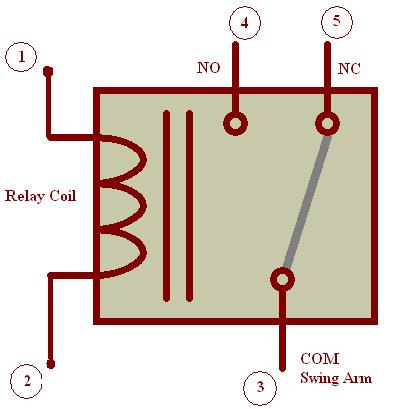
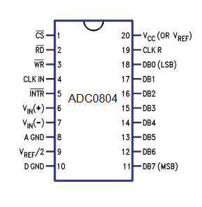

[TOC]

# Unit – 1: Introduction of Microcontrollers

## Describe block diagram of generic digital computer. (3)

A digital computer is considered to be a calculating device that can perform arithmetic operations at enormous speed. It is defined as a device that operates upon information/data. To be able to process data the computer is made of various functional units to perform its specified task.


### Input Unit:

The data and instructions are inputted into the computer using keyboard which is one of the most commonly used input devices. Other commonly used input devices are mouse, floppy disk drive, magnetic tape etc. Thus, we can conclude that, all the input devices accepts the data and instruction from outside world, convert it to a form that the computer can understand, supply the converted data to the computer system for further processing.

### Storage Unit:

The storage unit of a computer holds data and instructions that are entered through the input unit, before they are processed. It stores programs, data as well as intermediate results and results for output. Its main function is to store information. The various storage devices can be divided into two main categories:

#### Primary Storage (Main Memory):

This memory is generally used to hold the program being currently executed in the computer, the data being received from input device, the intermediate and final results of a program. The primary memory is temporary in nature. The data is lost when the computer is switched off. The data is electronically represented in the main memory chip’s circuitry and while it remains in the main memory, central processing unit (CPU) can access it directly at a very fast speed. Primary storage has limited storage capacity because it is very expensive and generally made up of semiconductor devices.

#### Secondary Storage (Auxiliary Memory):

It is used like an archive. It stores operating system, data files, compilers, assemblers, application programs etc. The Program and data if needed by central processing unit (CPU) are first transferred from the secondary memory to main memory. The results are also stored in secondary memory to main memory. It is a mass storage memory, slower but cheaper. It is non-volatile in nature i.e. data is not lost even if the power supply is switched off. Some of the most commonly used secondary storage devices are Hard Disk, Compact Disk etc. Their access time is in milliseconds.

### Central Processing Unit (CPU) :

The control unit and arithmetic logic unit of computer are together known as central processing unit (CPU). The CPU is like brain and performs following functions: It performs all calculations, it takes all decisions, and it controls all units of a computer.

A personal computer may have CPU-IC such as Intel 8088, 80386, 80486, Celeron, Pentium, Pentium Pro, Pentium II, III, IV, Dual Core, AMD etc.z

#### (a) Control Unit:

It controls all other units in a computer. The control unit instructs the input unit where to store the data after receiving it from user. It controls the flow of data and instructions from the storage unit to Arithmetic logic unit (ALU), it does not perform any actual processing of data. It manages and coordinates the entire computer system and synchronizes its working, thus referred to as “Central Nervous System” or “Brain of the Computer”.

#### (b) Arithmetic and Logic Unit:

The function of an Arithmetic logic unit (ALU) is to perform arithmetic and logical operations such as addition, subtraction, multiplication, division, AND, OR, NOT, Exclusive OR etc. It also performs increment, decrements, shift and clear operations. It is the place where the actual execution of instructions takes place during processing operation. To be precise, all calculations and comparisons are made in the Arithmetic and Logical Unit (ALU).

### Output Unit:

An output unit performs the reverse operation of that of an input unit. As computers, work with binary code the results produced are also in binary form. So before applying results to the outside world it must be converted to human acceptable (readable) form. So, it supplies information obtained from processing to outside world. Units called output interfaces accomplish this task.

## Draw and Explain general block diagram of microcontroller. (3)

### CPU

Central Processing Unit or CPU is the brain of the Microcontroller. It consists of an Arithmetic Logic Unit (ALU) and a Control Unit (CU). A CPU reads, decodes and executes instructions to perform Arithmetic, Logic and Data Transfer operations.


### Memory

Any Computational System requires two types of Memory: Program Memory and Data Memory. Program Memory, as the name suggests, contains the program i.e. the instructions to be executed by the CPU. Data Memory on the other hand, is required to store temporary data while executing the instructions.

Usually, Program Memory is a Read Only Memory or ROM and the Data Memory is a Random Access Memory or RAM. Data Memory is sometimes called as Read Write Memory (R/W M).

### I/O Ports

The interface for the Microcontroller to the external world is provided by the I/O Ports or Input/Output Ports. Inputs device like Switches, Keypads, etc. provide information from the user to the CPU in the form of Binary Data.

The CPU, upon receiving the data from the input devices, executes appropriate instructions and gives response through Output Devices like LEDs, Displays, Printers, etc.

### Bus

Another important component of a Microcontroller, but rarely discussed is the System Bus. A System bus is a group of connecting wire that connect the CPU with other peripherals like Memory, I/O Ports and other supporting components.

### Timers/Counters

One of the important components of a Microcontroller are the Timers and Counters. They provide the operations of Time Delays and counting external events. Additionally, Timers and Counters can provide Function Generation, Pulse Width Modulation, Clock Control, etc.

### Serial Port

One of the important requirement of a Microcontroller is to communicate with other device and peripherals (external). Serial Port proves such interface through serial communication. Most common serial communication implemented in Microcontrollers is UART.

### Interrupts

A very important feature of a Microcontroller is Interrupts and its Interrupt Handling Mechanism. Interrupts can be external, internal, hardware related or software related.

### ADC (Analog to Digital Converter)

Analog to Digital Converter or ADC is a circuit that converts Analog signals to Digital Signals. The ADC Circuit forms the interface between the external Analog Input devices and the CPU of the Microcontroller. Almost all sensors are analog devices and the analog data from these sensors must be converted in to digital data for the CPU to understand.

### DAC (Digital to Analog Converter)

DIgital to Analog Converter or DAC is a circuit, that works in contrast to an ADC i.e. it converts Digital Signals to Analog Signals. DAC forms the bridge between the CPU of the Microcontroller and the external analog devices.

## Common features of Microcontrollers. (2)

Basically, a Microcontroller consists of the following components.

- Central Processing Unit (CPU)
- Program Memory (ROM – Read Only Memory)
- Data Memory (RAM – Random Access Memory)
- Timers and Counters
- I/O Ports (I/O – Input/Output)
- Serial Communication Interface
- Clock Circuit (Oscillator Circuit)
- Interrupt Mechanism

## Explain Hierarchy of Microcontroller. (4)

| **DEVICE** | ON-CHIP DATA MEMORY (bytes) | ON-CHIP PROGRAM MEMORY (bytes) | 16-BIT TIMER/COUNTER | NO. OF VECTORED INTERUPTS | FULL DUPLEX I/O |
| ---------- | --------------------------- | ------------------------------ | -------------------- | ------------------------- | --------------- |
| 8031       | 128                         | None                           | 2                    | 5                         | 1               |
| 8032       | 256                         | none                           | 2                    | 6                         | 1               |
| 8051       | 128                         | 4k ROM                         | 2                    | 5                         | 1               |
| 8052       | 256                         | 8k ROM                         | 3                    | 6                         | 1               |
| 8751       | 128                         | 4k EPROM                       | 2                    | 5                         | 1               |
| 8752       | 256                         | 8k EPROM                       | 3                    | 6                         | 1               |
| AT89C51    | 128                         | 4k Flash Memory                | 2                    | 5                         | 1               |
| AT89C52    | 256                         | 8k Flash memory                | 3                    | 6                         | 1               |

## Compare Microprocessor and Microcontroller. (3)

| Microprocessors                                                            | Microcontrollers                                                    |
| -------------------------------------------------------------------------- | ------------------------------------------------------------------- |
| It is only a general purpose computer CPU                                  | It is a micro computer itself                                       |
| Memory, I/O ports, timers, interrupts are not available inside the chip    | All are integrated inside the microcontroller chip                  |
| This must have many additional digital components to perform its operation | Can function as a micro computer without any additional components. |
| Systems become bulkier and expensive.                                      | Make the system simple, economic and compact                        |
| Not capable for handling Boolean functions                                 | Handling Boolean functions                                          |
| Higher accessing time required                                             | Low accessing time                                                  |
| Very few pins are programmable                                             | Most of the pins are programmable                                   |
| Very few number of bit handling instructions                               | Many bit handling instructions                                      |
| Widely Used in modern PC and laptops                                       | widely in small control systems                                     |
| INTEL 8086,INTEL Pentium series                                            | INTEL8051,89960,PIC16F877                                           |

## Compare Von Neumann and Harvard architecture. (3)

| Harvard architecture                                                                                                                                                                                                     | Von Neumann architecture                                                                                                                                                                                                             |
| ------------------------------------------------------------------------------------------------------------------------------------------------------------------------------------------------------------------------ | ------------------------------------------------------------------------------------------------------------------------------------------------------------------------------------------------------------------------------------ |
| Harvard architecture – diagram [](http://www.polytechnichub.com/wp-content/uploads/2017/04/Harvard-architecture.jpg) | Von Neumann architecture – diagram [](http://www.polytechnichub.com/wp-content/uploads/2017/04/Von-Neumann-architecture.jpg) |
| The name is originated from “Harvard Mark I” a relay based old computer.                                                                                                                                                 | It is named after the mathematician and early computer scientist John Von Neumann.                                                                                                                                                   |
| It required two memories for their instruction and data.                                                                                                                                                                 | It required only one memory for their instruction and data.                                                                                                                                                                          |
| Design of Harvard architecture is complicated.                                                                                                                                                                           | Design of the von Neumann architecture is simple.                                                                                                                                                                                    |
| Harvard architecture is required separate bus for instruction and data.                                                                                                                                                  | Von Neumann architecture is required only one bus for instruction and data.                                                                                                                                                          |
| Processor can complete an instruction in one cycle                                                                                                                                                                       | Processor needs two clock cycles to complete an instruction.                                                                                                                                                                         |
| Easier to pipeline, so high performance can be achieve.                                                                                                                                                                  | Low performance as compared to Harvard architecture.                                                                                                                                                                                 |
| Comparatively high cost.                                                                                                                                                                                                 | It is cheaper.                                                                                                                                                                                                                       |

## Compare RISC and CISC architecture. (3)

|                 | RISC                                                                                             | CISC                                                                              |
| --------------- | ------------------------------------------------------------------------------------------------ | --------------------------------------------------------------------------------- |
| Acronym         | It stands for ‘Reduced Instruction Set Computer’.                                                | It stands for ‘Complex Instruction Set Computer’.                                 |
| Definition      | The RISC processors have a smaller set of instructions with few addressing nodes.                | The CISC processors have a larger set of instructions with many addressing nodes. |
| Memory unit     | It has no memory unit and uses a separate hardware to implement instructions.                    | It has a memory unit to implement complex instructions.                           |
| Program         | It has a hard-wired unit of programming.                                                         | It has a micro-programming unit.                                                  |
| Design          | It is a complex complier design.                                                                 | It is an easy complier design.                                                    |
| Calculations    | The calculations are faster and precise.                                                         | The calculations are slow and precise.                                            |
| Decoding        | Decoding of instructions is simple.                                                              | Decoding of instructions is complex.                                              |
| Time            | Execution time is very less.                                                                     | Execution time is very high.                                                      |
| External memory | It does not require external memory for calculations.                                            | It requires external memory for calculations.                                     |
| Pipelining      | Pipelining does function correctly.                                                              | Pipelining does not function correctly.                                           |
| Stalling        | Stalling is mostly reduced in processors.                                                        | The processors often stall.                                                       |
| Code expansion  | Code expansion can be a problem.                                                                 | Code expansion is not a problem.                                                  |
| Disc space      | The space is saved.                                                                              | The space is wasted.                                                              |
| Applications    | Used in high end applications such as video processing, telecommunications and image processing. | Used in low end applications such as security systems, home automations, etc.     |

## List applications of mocrocontrollers in various fields. (2)

- Consumer Electronics Products: Toys, Cameras, Robots, Washing Machine, Microwave Ovens etc. [any automatic home appliance]
- Instrumentation and Process Control: Oscilloscopes, Multi-meter, Leakage Current Tester, Data Acquisition and Control etc.
- Medical Instruments: ECG Machine, Accu-Check etc.
- Communication: Cell Phones, Telephone Sets, Answering Machines etc.
- Office Equipment: Fax, Printers etc.
- Multimedia Application: Mp3 Player, PDAs etc.
- Automobile: Speedometer, Auto-breaking system etc.

# **Unit – 2: 8051 Hardware**

## Draw and Explain Block diagram of 8051. (4)


**OSC:** This is on chip RC Oscillator for providing Clock Signals to all the internals of 8051 MCU. We can connect Externals Quartz Crystal Oscillator to the pins XTAL1 and XTAL2. Crystal frequency ranges from 1MHz to 16MHz.

**IO PORTS:** There are 4 General purpose IO ports. P0, P1, P2 and P3. Port pins can be configured as I/P pin by writing a logic 1, and as an output by writing a logic 0 to that specific pin. Each port internally is made up of Port Latches and Port Drivers.

- **P0:** Port 0 provides Data cum Multiplexed Lower Byte of Address bus, (AD0-AD7) in addtition to 8 General Purpose Input/Output (GPIOs) Pins (P0.0 – P0.7)
- **P1:** Port 1 provides only 8 GPIOs (P1.0 – P1.7), No Special Functionality
- **P2:** Port 2 provides Higher Byte of Address bus, (A8 - A15) in addtition to 8 General Purpose Input/Output (GPIOs) Pins (P2.0 – P2.7)
- **P3:** Port 3 provides Special Alternate Functions (RXD, TXD, INT0, INT1, T0, T1, WR, RD) in addtition to 8 General Purpose Input/Output (GPIOs) Pins (P3.0 – P3.7)

**MEMORY:**

- **Internal Memory:** 8051 has on chip Program Memory (Flash) and Data Memory (RAM)
- **RAM:** Random Access Memory – is used for stroing runtime data variables. It is also called as Data Memory. 8051 has 128 Bytes of internal RAM. Interanal RAM is divided into three categories – Four Register Banks (32 Bytes - 00H to 1FH), Bit Addressable Area – (16 Bytes – 20H to 2FH), General Purpose Data Memory (80 Bytes – 30F to 7FH)
- **FLASH**: Flash memory is also called Program Memory. 8051 has 4KB of on chip Flash ROM, Hence usable address range for it is 0000H to 0FFFH.

- **External Memory:** In additon to On Chip internal memory we can extend both the memory upto 64KB by interfacing External Memories.


**System Bus:** 8051 has 16bit wide Address Bus and 8 bit wide Data Bus.

**ALU:** Arithmetic and Logical Unit is heart of CPU and it perfroms all the arithmetic and logical operations.

**TIMING AND CONTROL UNIT:** This Block works on Timing and control related followig singnals – ALE/PROG, PSEN, EA/VPP, RST

**REGISTER A (ACCUMULATOR):** It is main register for all the operations performed by ALU. Results of almost all the operations are collected in Accumulator.

**REGISTER B:** Register B is used in conjunction with Accumulator while performing multiplication and division operations.

**PC:** Program Counter is 16 bit register which holds address of the next instruction to be fetched. PC is automatically incremented after each execution. In short it works as Code Pointer. PC points to the memory location from where next instruction is required to be fetched.

**DPTR:** This is 16 bit register made up of two 8 bit registers – DPH & DPL. This register is used to point to Internal or External memory location. It stores the address of the Memory location, from where we need to fetch Data Byte.

**SP:** Stack is part of Internal RAM, which is used to store and retrieve temporary variable data, especially when entering and exiting subroutines. Data locations 07 H to 1F H are used as Stack. Stack pointer (SP) is 8 bit register, it indicate current RAM address available for stack.

**SFR:** Special Function Registers (SFRs) are special registers that contains control and status bits for Timer/Counter (TCON, TMOD), Interrupts (IE, IP), Serial Communication (SCON) and Power Control (PCON).

**PSW:** Program Status Word (PSW) is also called as Flag Register. This register contains flags to reflect result of last operation executed. It includes flags like Carry (C), Auxilliary Carry (AC), Parity (P), Overflow (OV) etc.

**Interrput, Serial Port and Timer Blocks:** These are some of the on chip provided peripheral blocks which are very useful in many applications. Hardware Interrupts are used for executing a higher priority tasks while processing normal tasks. Timers provide the operations of Time Delays and counting external events. Serial Port provides serial communication link to connect with other Devices spporting serial communication including Computers.

## Explain importance of accumulator in 8051. (3)

The Accumulator or Register A is the most important and most used 8051 Microcontroller SFRs. The Register A is located at the address E0H in the SFR memory space. The Accumulator is used to hold the data for almost all the ALU Operations.


Some of the operations where the Accumulator is used are:

- Arithmetic Operations like Addition, Subtraction, Multiplication etc.
- Logical Operations like AND, OR, NOT etc.
- Data Transfer Operations (between 8051 and External Memory)

The name “Accumulator” came from the fact this register is used to accumulate (or store) the result of all Arithmetic and most of the Logical Operations.

## Draw Pin diagram and Explain Functions of each pin of 8051. (4)

The following image shows the 8051 Microcontroller Pin Diagram with respect to a 40 – pin Dual In-line Package (DIP).

**Pins 1 – 8 (PORT 1):**

- Pins 1 to 8 are the PORT 1 Pins of 8051. PORT 1 Pins consists of 8 – bit bidirectional Input / Output Port with internal pull – up resistors. In older 8051 Microcontrollers, PORT 1 doesn’t serve any additional purpose but just 8 – bit I/O PORT.
- In some of the newer 8051 Microcontrollers, few PORT 1 Pins have dual functions. P1.0 and P1.1 act as Timer 2 and Timer 2 Trigger Input respectively.

- P1.5, P1.6 and P1.7 act as In-System Programming Pins i.e. MOSI, MISO and SCK respectively.

**Pin 9 (RST):** Pin 9 is the Reset Input Pin. It is an active HIGH Pin i.e. if the RST Pin is HIGH for a minimum of two machine cycles, the microcontroller will be reset. During this time, the oscillator must be running.


**Pins 10 – 17 (PORT 3):** Pins 10 to 17 form the PORT 3 pins of the 8051 Microcontroller. PORT 3 also acts as a bidirectional Input / Output PORT with internal pull-ups. Additionally, all the PORT 3 Pins have special functions. The following table gives the details of the additional functions of PORT 3 Pins.

| PORT 3 Pin | Function | Description           |
| ---------- | -------- | --------------------- |
| P3.0       | RXD      | Serial Input          |
| P3.1       | TXD      | Serial Output         |
| P3.2       | INT0     | External Interrupt 0  |
| P3.3       | INT1     | External Interrupt 1  |
| P3.4       | T0       | Timer 0               |
| P3.5       | T1       | Timer 1               |
| P3.6       | WR       | External Memory Write |
| P3.7       | RD       | External Memory Read  |

**Pins 18 & 19:** Pins 18 and 19 i.e. XTAL 2 and XTAL 1 are the pins for connecting external oscillator. Generally, a Quartz Crystal Oscillator is connected here.

**Pin 20 (GND):** Pin 20 is the Ground Pin of the 8051 Microcontroller. It represents 0V and is connected to the negative terminal (0V) of the Power Supply.

**Pins 21 – 28 (PORT 2):** These are the PORT 2 Pins of the 8051 Microcontroller. PORT 2 is also a Bidirectional Port i.e. all the PORT 2 pins act as Input or Output. Additionally, when external memory is interfaced, PORT 2 pins act as the higher order address byte. PORT 2 Pins have internal pull-ups.

**Pin 29 (PSEN):** Pin 29 is the Program Store Enable Pin (PSEN). Using this pins, external Program Memory can be read.

**Pin 30 (ALE/PROG):** Pin 30 is the Address Latch Enable Pin. Using this Pins, external address can be separated from data (as they are multiplexed by 8051). During Flash Programming, this pin acts as program pulse input (PROG).

**Pin 31 (EA/VPP):** Pin 31 is the External Access Enable Pin i.e. allows external Program Memory. Code from external program memory can be fetched only if this pin is LOW. For normal operations, this pins is pulled HIGH. During Flash Programming, this Pin receives 12V Programming Enable Voltage (VPP).

**Pins 32 – 39 (PORT 0):** Pins 32 to 39 are PORT 0 Pins. They are also bidirectional Input / Output Pins but without any internal pull-ups. Hence, we need external pull-ups in order to use PORT 0 pins as I/O PORT. In addition to acting as I/O PORT, PORT 0 also acts as lower order address/data bus when external memory is accessed.

**Pin 40 (VCC):** Pin 40 is the power supply pin to which the supply voltage is given (+5V).

## Explain functions of all 8 pins of Port 3 in 8051. (3)

Port-3 has 8 pin (P3.0-P3.7) . Port-3 pins have alternate functions. The structure of a port-3 pin is shown in fig.


Each pin of Port-3 can be individually programmed for I/O operation or for alternate function. The alternate function can be activated only if the corresponding latch has been written to '1'. To use the port as input port, '1' should be written to the latch. This port also has internal pull-up and limited current driving capability.

Alternate functions of Port-3 pins are -

| PORT 3 Pin | Function | Description           |
| ---------- | -------- | --------------------- |
| P3.0       | RXD      | Serial Input          |
| P3.1       | TXD      | Serial Output         |
| P3.2       | INT0     | External Interrupt 0  |
| P3.3       | INT1     | External Interrupt 1  |
| P3.4       | T0       | Timer 0               |
| P3.5       | T1       | Timer 1               |
| P3.6       | WR       | External Memory Write |
| P3.7       | RD       | External Memory Read  |

## Explain clock and reset circuit for 8051 with sketch. (3)

An 8051 clock circuit is shown above. In general cases, a quartz crystal is used to make the clock circuit. The connection is shown in figure (a) and note the connections to XTAL 1 and XTAL 2. In some cases external clock sources are used and you can see the various connections above. Clock frequency limits (maximum and minimum) may change from device to device. Standard practice is to use 12MHz frequency. If serial communications are involved then its best to use 11.0592 MHz frequency.


Okay, take a look at the above machine cycle waveform. One complete oscillation of the clock source is called a pulse. Two pulses forms a state and six states forms one machine cycle. Also note that, two pulses of ALE are available for 1 machine cycle.


8051 can be reset in two ways 1) is power-on reset – which resets the 8051 when power is turned ON and 2) manual reset – in which a reset happens only when a push button is pressed manually. Two different reset circuits are shown above. A reset doesn’t affect contents of internal RAM. For reset to happen, the reset input pin (pin 9) must be active high for atleast 2 machine cycles. During a reset operation :- Program counter is cleared and it starts from 00H, register bank #0 is selected as default, Stack pointer is initialized to 07H, all ports are written with FFH.


## Draw and Explain program and data memory of 8051. (4)

The 8051 microcontroller's memory is divided into Program Memory and Data Memory. Program Memory (ROM) is used for permanent saving program being executed, while Data Memory (RAM) is used for temporarily storing and keeping intermediate results and variables.

**Program Memory (ROM):**

Now lets dive into the program memory organization 0f 8051. It has an internal program of 4K size and if needed an external memory can be added (by interfacing ) of size 60K maximum. So in total 64K size memory is available for 8051 micro controller. By default, the External Access (EA) pin should be connected Vcc so that instructions are fetched from internal memory initially. When the limit of internal memory (4K) is crossed, control will automatically move to external memory to fetch remaining instructions. If the programmer wants to fetch instruction from external memory only (bypassing the internal memory), then he must connect External Access (EA) pin to ground (GND).


**Data Memory (RAM):**

In the MCS-51 family, 8051 has 128 bytes of internal data memory and it allows interfacing external data memory of maximum size up to 64K. So the total size of data memory in 8051 can be upto 64K (external) + 128 bytes (internal). Observe the diagram carefully to get more understanding. So there are 3 separations/divisions of the data memory:- 1) Register banks 2) Bit addressable area 3) Scratch pad area.


Register banks form the lowest 32 bytes on internal memory and there are 4 register banks designated bank #0,#1, #2 and #3. Each bank has 8 registers which are designated as R0,R1…R7. At a time only one register bank is selected for operations and the registers inside the selected bank are accessed using mnemonics R0..R1.. etc. Other registers can be accessed simultaneously only by direct addressing. Registers are used to store data or operands during executions. By default register bank #0 is selected (after a system reset).


The bit addressable areas of 8051 is usually used to store bit variables. The bit addressable area is formed by the 16 bytes next to register banks. They are designated from address 20H to 2FH (total 128 bits). Each bits can be accessed from 00H to 7FH within this 128 bits from 20H to 2FH. Bit addressable area is mainly used to store bit variables from application program, like status of an output device like LED or Motor (ON/OFF) etc. We need only a bit to store this status and using a complete byte addressable area for storing this is really bad programming practice, since it results in wastage of memory.

The scratch pad area is the upper 80 bytes which is used for general purpose storage. Scratch pad area is from 30H to 7FH and this includes stack too.

## Draw and Explain External Memory Addressing and Decoding Logic of 8051.

We know that a typical 8051 Microcontroller has 4KB of ROM and 128B of RAM

The designer of an 8051 Microcontroller based system is not limited to the internal RAM and ROM present in the 8051 Microcontroller. There is a provision of connecting both external RAM and ROM i.e. Data Memory and Program.

The reason for interfacing external Program Memory or ROM is that complex programs written in high – level languages often tend to be larger and occupy more memory.

Another important reason is that chips like 8031 or 8032, which doesn’t have any internal ROM, have to be interfaced with external ROM.

A maximum of 64KB of Program Memory (ROM) and Data Memory (RAM) each can be interface with the 8051 Microcontroller.

The following image shows the block diagram of interfacing 64KB of External RAM and 64KB of External ROM with the 8051 Microcontroller.


## Draw and explain external memory interface for 8KB EPROM and 4KB RAM with 8051. (7)

## Draw and explain internal RAM architecture of the 8051 microcontroller. (4)

The Data Memory or RAM of the 8051 Microcontroller stores temporary data and intermediate results that are generated and used during the normal operation of the microcontroller. Original Intel’s 8051 Microcontroller had 128B of internal RAM.

But almost all modern variants of 8051 Microcontroller have 256B of RAM. In this 256B, the first 128B i.e. memory addresses from 00H to 7FH is divided in to Working Registers (organized as Register Banks), Bit – Addressable Area and General Purpose RAM (also known as Scratchpad area).

In the first 128B of RAM (from 00H to 7FH), the first 32B i.e. memory from addresses 00H to 1FH consists of 32 Working Registers that are organized as four banks with 8 Registers in each Bank.


The 4 banks are named as Bank0, Bank1, Bank2 and Bank3. Each Bank consists of 8 registers named as R0 – R7. Each Register can be addressed in two ways: either by name or by address.

To address the register by name, first the corresponding Bank must be selected. In order to select the bank, we have to use the RS0 and RS1 bits of the Program Status Word (PSW) Register (RS0 and RS1 are 3rd and 4th bits in the PSW Register).

When addressing the Register using its address i.e. 12H for example, the corresponding Bank may or may not be selected. (12H corresponds to R2 in Bank2).

The next 16B of the RAM i.e. from 20H to 2FH are Bit – Addressable memory locations. There are totally 128 bits that can be addressed individually using 00H to 7FH or the entire byte can be addressed as 20H to 2FH.

For example 32H is the bit 2 of the internal RAM location 26H.

The final 80B of the internal RAM i.e. addresses from 30H to 7FH, is the general purpose RAM area which are byte addressable.

These lower 128B of RAM can be addressed directly or indirectly.

The upper 128B of the RAM i.e. memory addresses from 80H to FFH is allocated for Special Function Registers (SFRs). SFRs control specific functions of the 8051 Microcontroller. Some of the SFRs are I/O Port Registers (P0, P1, P2 and P3), PSW (Program Status Word), A (Accumulator), IE (Interrupt Enable), PCON (Power Control), etc.


SRFs Memory addresses are only direct addressable. Even though some of the addresses between 80H and FFH are not assigned to any SFR, they cannot be used as additional RAM area.

In some microcontrollers, there is an additional 128B of RAM, which share the memory address with SFRs i.e. 80H to FFH. But, this additional RAM block is only accessed by indirect addressing.

## Explain Stack, Stack Pointer and Stack operation using PUSH and POP instructions. (4)

**The Stack:** The stack is a section of RAM used by the CPU to store information temporarily. This information could be data or an address.


**The Stack Pointer:** The register used to access the stack is called the SP (stack pointer) register. The stack pointer in the 8051 is only 8 bit wide, which means that it can take value of 00 to FFH. When the 8051 is powered up, the SP register contains value 07 RAM location 08 is the first location begin used for the stack by the 8051.

**Pushing into the Stack:**

In the 8051, the stack pointer (SP) points to the last used location of the stack. When data is pushed onto the stack, the stack pointer (SP) is incremented by 1. When PUSH is executed, the contents of the register are saved on the stack and SP is incremented by 1. To push the registers onto the stack, we must use their RAM addresses. For example, the instruction "PUSH 1" pushes register R1 onto the stack.

PUSH Example:

```assembly
MOV R6, #25H
MOV R1, #12H
MOV R4, #0F3H
PUSH 6
PUSH 1
PUSH 4
```


**Popping from the Stack:**

Popping the contents of the stack back into a given register is the opposite to the process of pushing. With every pop operation, the top byte of the stack is copied to the register specified by the instruction and the stack pointer is decremented once.

POP Example:

```assembly
POP 3 ; POP stack into R3
POP 5 ; POP stack into R5
POP 2 ; POP stack into R2
```


## I/O Ports structure: Port 0, Port 1, Port2, Port 3.

Each port of 8051 has bidirectional capability. Port 0 is called 'true bidirectional port' as it floats (tristated) when configured as input. Port-1, 2, 3 are called 'quasi bidirectional port'.

**Port-0 Pin Structure:**

Port -0 has 8 pins (P0.0-P0.7).

The structure of a Port-0 pin is shown in fig.


Port-0 can be configured as a normal bidirectional I/O port or it can be used for address/data interfacing for accessing external memory. When control is '1', the port is used for address/data interfacing. When the control is '0', the port can be used as a normal bidirectional I/O port.

Let us assume that control is '0'. When the port is used as an input port, '1' is written to the latch. In this situation both the output MOSFETs are 'off'. Hence the output pin floats. This high impedance pin can be pulled up or low by an external source. When the port is used as an output port, a '1' written to the latch again turns 'off' both the output MOSFETs and causes the output pin to float. An external pull-up is required to output a '1'. But when '0' is written to the latch, the pin is pulled down by the lower MOSFET. Hence the output becomes zero.

When the control is '1', address/data bus controls the output driver MOSFETs. If the address/data bus (internal) is '0', the upper MOSFET is 'off' and the lower MOSFET is 'on'. The output becomes '0'. If the address/data bus is '1', the upper transistor is 'on' and the lower transistor is 'off'. Hence the output is '1'. Hence for normal address/data interfacing (for external memory access) no pull-up resistors are required. Port-0 latch is written to with 1's when used for external memory access.

**Port-1 Pin Structure**

Port-1 has 8 pins (P1.1-P1.7) .The structure of a port-1 pin is shown in fig


Port-1 does not have any alternate function i.e. it is dedicated solely for I/O interfacing. When used as output port, the pin is pulled up or down through internal pull-up. To use port-1 as input port, '1' has to be written to the latch. In this input mode when '1' is written to the pin by the external device then it read fine. But when '0' is written to the pin by the external device then the external source must sink current due to internal pull-up. If the external device is not able to sink the current the pin voltage may rise, leading to a possible wrong reading.

**PORT 2 Pin Structure:**

Port-2 has 8-pins (P2.0-P2.7) . The structure of a port-2 pin is shown in fig.


Port-2 is used for higher external address byte or a normal input/output port. The I/O operation is similar to Port-1. Port-2 latch remains stable when Port-2 pin are used for external memory access. Here again due to internal pull-up there is limited current driving capability.

**PORT 3 Pin Structure:**

Port-3 has 8 pin (P3.0-P3.7) . Port-3 pins have alternate functions. The structure of a port-3 pin is shown in fig.


Each pin of Port-3 can be individually programmed for I/O operation or for alternate function. The alternate function can be activated only if the corresponding latch has been written to '1'. To use the port as input port, '1' should be written to the latch. This port also has internal pull-up and limited current driving capability.

Alternate functions of Port-3 pins are - P3.0 - RxD, P3.1 TxD, P3.2 - INT0, P3.3 - INT1, P3.4 - T0, P3.5 - T1, P3.6 - WR, P3.7 - RD

## Draw and explain function of all bits of PSW register. (4)

Commonly known as the PSW register, this is a vital SFR in the functioning of micro controller. This register reflects the status of the operation that is being carried out in the processor. The picture below shows PSW register and the way register banks are selected using PSW register bits – RS1 and RS0. PSW register is both bit and byte addressable. The physical address of PSW starts from D0H. The individual bits are then accessed using D1, D2 … D7. The various individual bits are explained below.

PSW Register:

| Address: 0D0H (Bit addressable) |       |       |       |       |       |       |       |
| ------------------------------- | ----- | ----- | ----- | ----- | ----- | ----- | ----- |
| PSW.7                           | PSW.6 | PSW.5 | PSW.4 | PSW.3 | PSW.2 | PSW.1 | PSW.0 |
| Bit 7                           | Bit 6 | Bit 5 | Bit 4 | Bit 3 | Bit 2 | Bit 1 | Bit 0 |
| CY                              | AC    | F0    | RS1   | RS0   | OV    | -     | P     |

Description of All the Bits of PSW:

| CY       | Carry - Is set if data is coming out of bit 7 of Acc during an Arithmetic operation.                                                                                              |
| -------- | --------------------------------------------------------------------------------------------------------------------------------------------------------------------------------- |
| AC       | Auxiliary carry - This bit is set if data is coming out from bit 3 to bit 4 of Acc during an Arithmetic operation.                                                                |
| F0       | Flag 0 - User defined flag                                                                                                                                                        |
| RS1, RS0 | Register Bank select bits                                                                                                                                                         |
| OV       | Overflow - OV flag is set if there is a carry from bit 6 but not from bit 7 of an Arithmetic operation. It’s also set if there is a carry from bit 7 (but not from bit 6) of Acc. |
| P        | Parity - This bit will be set if ACC has odd number of 1’s after an operation. If not, bit will remain cleared.                                                                   |

At a time registers can take value from R0,R1…to R7. You may already know there are 32 such registers. So how you access 32 registers with just 8 variables to address registers? Here comes the use of register banks. There are 4 register banks named 0,1,2 and 3. Each bank has 8 registers named from R0 to R7. At a time only one register bank can be selected. Selection of register bank is made possible through PSW register bits PSW.3 and PSW.4, named as RS0 and RS1.These two bits are known as register bank select bits as they are used to select register banks. The picture will talk more about selecting register banks.

Register Bank Selection:

| RS1 (PSW.4) | RS0(PSW.3) | Register Bank Selected |
| ----------- | ---------- | ---------------------- |
| 0           | 0          | RB0                    |
| 0           | 1          | RB1                    |
| 1           | 0          | RB2                    |
| 1           | 1          | RB3                    |

## Draw and explain function of all bits of TCON register. (4)

TCON register is also one of the registers whose bits are directly in control of timer operation. Only 4 bits of this register are used for this purpose, while rest of them is used for interrupt control.

TCON Register:

| Address: 088H (Bit addressable) |        |        |        |        |        |        |        |
| ------------------------------- | ------ | ------ | ------ | ------ | ------ | ------ | ------ |
| TCON.7                          | TCON.6 | TCON.5 | TCON.4 | TCON.3 | TCON.2 | TCON.1 | TCON.0 |
| Bit 7                           | Bit 6  | Bit 5  | Bit 4  | Bit 3  | Bit 2  | Bit 1  | Bit 0  |
| TF1                             | TR1    | TF0    | TR0    | IE1    | IT1    | IE0    | IT0    |

Description of All the Bits of TCON:

| Flag | Function                                                                                                                                                                                                                                      |
| ---- | --------------------------------------------------------------------------------------------------------------------------------------------------------------------------------------------------------------------------------------------- |
| TF1  | Timer 1 Overflow flag. Set when timer rolls from all 1's to 0. Cleared when processor vectors to execute interrupt service routine located at program address 001Bh.                                                                          |
| TR1  | Timer 1 run control bit. Set to 1 by program to enable timer to count; cleared to 0 by program to halt timer.                                                                                                                                 |
| TF0  | Timer 0 Overflow flag. Set when timer rolls from all 1's to 0. Cleared when processor vectors to execute interrupt service routine located at program address 000Bh.                                                                          |
| TR0  | Timer 0 run control bit. Set to 1 by program to enable timer to count; cleared to 0 by program to halt timer.                                                                                                                                 |
| IE1  | External interrupt 1 Edge flag. Set to 1 when a high-to-low edge signal is received on port 3.3 (INT1). Cleared when processor vectors to interrupt service routine at program address 0013h. Not related to timer operations.                |
| IT1  | External interrupt 1 signal type control bit. Set to 1 by program to enable external interrupt 1 to be triggered by a falling edge signal. Set to 0 by program to enable a low-level signal on external interrupt 1 to generate an interrupt. |
| IE0  | External interrupt 0 Edge flag. Set to 1 when a high-to-low edge signal is received on port 3.2 (INT0). Cleared when processor vectors to interrupt service routine at program address 0003h. Not related to timer operations.                |
| IT0  | External interrupt 0 signal type control bit. Set to 1 by program to enable external interrupt 1 to be triggered by a falling edge signal. Set to 0 by program to enable a low-level signal on external interrupt 0 to generate an interrupt. |

## Draw and explain function of all bits of TMOD register. (4)

This register contains bits controlling the operation of timer 0 & 1. To select the operating mode and the timer/counter operation of the timers we use TMOD register. Timer 0 and timer 1 are two timer registers in 8051. Both of these registers use the same register called TMOD to set various timer operation modes.

TMOD is an 8-bit register. The lower 4 bits are for Timer 0. The upper 4 bits are for Timer 1.

In each case, The lower 2 bits are used to set the timer mode. The upper 2 bits to specify the operation.

TMOD Register:

| Address: 089H (Bit addressable) |        |        |        |        |        |        |        |
| ------------------------------- | ------ | ------ | ------ | ------ | ------ | ------ | ------ |
| TMOD.7                          | TMOD.6 | TMOD.5 | TMOD.4 | TMOD.3 | TMOD.2 | TMOD.1 | TMOD.0 |
| Bit 7                           | Bit 6  | Bit 5  | Bit 4  | Bit 3  | Bit 2  | Bit 1  | Bit 0  |
| Timer1                          | Timer0 |        |        |        |        |        |        |
| GATE                            | C/T    | M1     | M0     | GATE   | C/T    | M1     | M0     |

Description of All the Bits of TMOD:

| Timer  | Bit  | Function                                                                                                                                                                                                  |
| ------ | ---- | --------------------------------------------------------------------------------------------------------------------------------------------------------------------------------------------------------- |
| Timer1 | GATE | GATE enables and disables Timer by means of a signal brought to the INTx pin:<br />1 – Timer operates only if the INTx bit is set.<br />0 – Timer operates regardless of the logic state of the INTx bit. |
|        | C/T  | C/T selects pulses to be counted up by the timer/counter:<br />1 – Timer counts pulses brought to the Tx(Timer) pin.<br />0 – Timer counts pulses from the internal oscillator.                           |
|        | M1   | M1, M0 These two bits select the operational mode Timer.                                                                                                                                                  |
|        | M0   | M1, M0 These two bits select the operational mode Timer.                                                                                                                                                  |
| Timer0 | GATE | GATE enables and disables Timer by means of a signal brought to the INTx pin:<br />1 – Timer operates only if the INTx bit is set.<br />0 – Timer operates regardless of the logic state of the INTx bit. |
|        | C/T  | C/T selects pulses to be counted up by the timer/counter:<br />1 – Timer counts pulses brought to the Tx(Timer) pin.<br />0 – Timer counts pulses from the internal oscillator.                           |
|        | M1   | M1, M0 These two bits select the operational mode Timer.                                                                                                                                                  |
|        | M0   | M1, M0 These two bits select the operational mode Timer.                                                                                                                                                  |

Timer Mode Control Bits:

| M1  | M0  | Mode | Operating Mode          |
| --- | --- | ---- | ----------------------- |
| 0   | 0   | 0    | 13-bit Mode             |
| 0   | 1   | 1    | 16-bit Mode             |
| 1   | 0   | 2    | 8-bit Auto Reaload Mode |
| 1   | 1   | 3    | Split Timer Mode        |

## Timers/Counters logic diagram and its operation in various modes.

TIMER MODE 0 (13 bit mode)

MODE 0 is a 13 bit mode. In this mode the THx acts as an 8 bit timer & TLx acts as a 5 bit timer. The TLx counts up to 31 & then resets to 00 & increment THx by 1. Suppose you load 0 in the timer then the timer will overflow in 2^13 i.e. 8192 machine cycles.


Mode 0 is exactly same like mode 1 except that it is a 13-bit timer instead of 16-bit. The 13-bit counter can hold values between 0000 to 1FFFH in TH-TL. Therefore, when the timer reaches its maximum of 1FFH, it rolls over to 0000, and TF is raised.

TIMER MODE 1 (16 bit mode)

MODE 1 is similar to MODE 0 except it is a 16 bit mode. In this mode the THx & TLx both acts as an 8 bit timer. The TLx counts upto 255 & then resets to 00 & increment THx by 1. Since this is a full 16 bit timer we can get maximum of 2^16 i.e. 65536 Machine cycle before the timer overflows.


It is a 16-bit timer; therefore it allows values from 0000 to FFFFH to be loaded into the timer’s registers TL and TH. After TH and TL are loaded with a 16-bit initial value, the timer must be started. We can do it by “SETB TR0” for timer 0 and “SETB TR1” for timer 1. After the timer is started. It starts count up until it reaches its limit of FFFFH. When it rolls over from FFFF to 0000H, it sets high a flag bit called TF (timer flag). This timer flag can be monitored. When this timer flag is raised, one option would be stop the timer with the instructions “CLR TR0“ or CLR TR1 for timer 0 and timer 1 respectively. Again, it must be noted that each timer flag TF0 for timer 0 and TF1 for timer1. After the timer reaches its limit and rolls over, in order to repeat the process the registers TH and TL must be reloaded with the original value and TF must be reset to 0.

TIMER MODE 2 (8 bit mode)

In this Mode TLx acts as the timer & THx contains the Reload Value i.e. THx is loaded in TLx everytime it overflows i.e. when TLx reaches 255 & is incremented then instead of resetting it to 0 it will be reset to the value stored in THx. This mode is very commonly used for generating baud rate used in serial communication.


It is an 8 bit timer that allows only values of 00 to FFH to be loaded into the timer’s register TH. After TH is loaded with 8 bit value, the 8051 gives a copy of it to TL. Then the timer must be started. It is done by the instruction “SETB TR0” for timer 0 and “SETB TR1” for timer1. This is like mode 1. After timer is started, it starts to count up by incrementing the TL register. It counts up until it reaches its limit of FFH. When it rolls over from FFH to 00. It sets high the TF (timer flag). If we are using timer 0, TF0 goes high; if using TF1 then TF1 is raised. When Tl register rolls from FFH to 00 and TF is set to 1, TL is reloaded automatically with the original value kept by the TH register. To repeat the process, we must simply clear TF and let it go without any need by the programmer to reload the original value. This makes mode 2 auto reload, in contrast in mode 1 in which programmer has to reload TH and TL.

TIMER MODE 3 (Split Mode)

Timer mode “3” is known as split-timer mode. Timers 0 and 1 may be programmed to be in mode 0, 1, or 2 independently of a similar mode for the other timer. But in mode 3 the timers do not operate independently, if mode 3 is chosen for timer 0. When Timer 0 is placed in mode 3, it essentially becomes two separate 8-bit timers. Timer 0 is TL0 and Timer 1 is TH0. Both timers count from 0 to 255 and overflow back to 0. All the bits that are related to Timer 1 will now be tied to TH0. Now placing timer 1 in mode 3 causes it to stop counting, the control bit TR1 and the Timer 1 flag TF1 are now used by timer 0. So even if you use Timer 1 in Mode 0, 1 or 2 you won’t be able to START or STOP the timer & no INTERRUPT will be generated by Timer 1. The real Timer 1 will be incremented every machine cycle no matter what.


Mode 3 is also known as a split timer mode. Timer 0 and 1 may be programmed to be in mode 0, 1 and 2 independently of similar mode for other timer. This is not true for mode 3; timers do not operate independently if mode 3 is chosen for timer 0. Placing timer 1 in mode 3 causes it to stop counting; the control bit TR1 and the timer 1 flag TF1 are then used by timer0.

## Interrupt structure, vector address, priority and operation.

An interrupt is an event that occurs randomly in the flow of continuity. It is just like a call you have when you are busy with some work and depending upon call priority you decide whether to attend or neglect it.

Same thing happens in microcontrollers. 8051 architecture handles 5 interrupt sources, out of which two are internal (Timer Interrupts), two are external and one is a serial interrupt. Each of these interrupts has their interrupt vector address. Highest priority interrupt is the Reset, with vector address 0x0000.

Now, it is necessary to explain a few details referring to external interrupts- INT0 and INT1. If the IT0 and IT1 bits of the TCON register are set, an interrupt will be generated on high to low transition, i.e. on the falling pulse edge (only in that moment). If these bits are cleared, an interrupt will be continuously executed as far as the pins are held low.


Vector Address: This is the address where controller jumps after the interrupt to serve the ISR (interrupt service routine).

| **Interrupt**      | **Flag** | **Interrupt vector address** |
| ------------------ | -------- | ---------------------------- |
| Reset              | -        | 0000H                        |
| INT0 (Ext. int. 0) | IE0      | 0003H                        |
| Timer 0            | TF0      | 000BH                        |
| INT1 (Ext. int. 1) | IE1      | 0013H                        |
| Timer 1            | TF1      | 001BH                        |
| Serial             | TI/RI    | 0023H                        |

Reset: Reset is the highest priority interrupt, upon reset 8051 microcontroller start executing code from 0x0000 address.

Internal interrupt (Timer Interrupt): 8051 has two internal interrupts namely timer0 and timer1. Whenever timer overflows, timer overflow flags (TF0/TF1) are set. Then the microcontroller jumps to their vector address to serve the interrupt. For this, global and timer interrupt should be enabled.

Serial interrupt: 8051 has serial communication port and have related serial interrupt flags (TI/RI). When the last bit (stop bit) of a byte is transmitted, TI serial interrupt flag is set and when last bit (stop bit) of receiving data byte is received, RI flag get set.

## Explain IE register in brief.

IE Register:

| Address: 0A8H (Byte addressable) |       |       |       |       |       |       |       |
| -------------------------------- | ----- | ----- | ----- | ----- | ----- | ----- | ----- |
| IE.7                             | IE.6  | IE.5  | IE.4  | IE.3  | IE.2  | IE.1  | IE.0  |
| Bit 7                            | Bit 6 | Bit 5 | Bit 4 | Bit 3 | Bit 2 | Bit 1 | Bit 0 |
| EA                               | -     | -     | ES    | ET1   | EX1   | ET0   | EX0   |

Description of All the Bits of IE:

| EA  | Global interrupt enable/disable Bit |
| --- | ----------------------------------- |
| ES  | Enable Serial Interrupt Bit         |
| ET1 | Enable Timer1 Interrupt Bit         |
| EX1 | Enable External Interrupt 1 Bit     |
| ET0 | Enable Timer0 Interrupt Bit         |
| EX0 | Enable External Interrupt 1 Bit     |

## Explain IP register in brief. Or Explain Interrupt priority with vector address. (3)

Priority to the interrupt can be assigned by using interrupt priority register (IP)

Interrupt priority after Reset:

| **Priority** | **Interrupt source** | **Intr. bit / flag** |
| ------------ | -------------------- | -------------------- |
| 1            | External Interrupt 0 | INT0                 |
| 2            | Timer Interrupt 0    | TF0                  |
| 3            | External Interrupt 1 | INT1                 |
| 4            | Timer Interrupt 1    | TF1                  |
| 5            | Serial interrupt     | (TI/RI)              |

In the table, interrupts priorities upon reset are shown. As per 8051 interrupt priorities, lowest priority interrupts are not served until microcontroller is finished with higher priority ones. In a case when two or more interrupts arrives microcontroller queues them according to priority.

It is not possible to forseen when an interrupt request will arrive. If several interrupts are enabled, it may happen that while one of them is in progress, another one is requested. In order that the microcontroller knows whether to continue operation or meet a new interrupt request, there is a priority list instructing it what to do. The priority list offers 3 levels of interrupt priority:

- Reset! The apsolute master. When a reset request arrives, everything is stopped and the microcontroller restarts.
- Interrupt priority 1 can be disabled by Reset only.
- Interrupt priority 0 can be disabled by both Reset and interrupt priority 1.

The IP Register (Interrupt Priority Register) specifies which one of existing interrupt sources have higher and which one has lower priority. Interrupt priority is usually specified at the beginning of the program. According to that, there are several possibilities:

- If an interrupt of higher priority arrives while an interrupt is in progress, it will be immediately stopped and the higher priority interrupt will be executed first.
- If two interrupt requests, at different priority levels, arrive at the same time then the higher priority interrupt is serviced first.
- If the both interrupt requests, at the same priority level, occur one after another, the one which came later has to wait until routine being in progress ends.
- If two interrupt requests of equal priority arrive at the same time then the interrupt to be serviced is selected according to the following priority list:
  - External interrupt INT0
  - Timer 0 interrupt
  - External Interrupt INT1
  - Timer 1 interrupt
  - Serial Communication Interrupt

IP Register:

| Address: 0B8H (Byte addressable) |       |       |       |       |       |       |       |
| -------------------------------- | ----- | ----- | ----- | ----- | ----- | ----- | ----- |
| IP.7                             | IP.6  | IP.5  | IP.4  | IP.3  | IP.2  | IP.1  | IP.0  |
| Bit 7                            | Bit 6 | Bit 5 | Bit 4 | Bit 3 | Bit 2 | Bit 1 | Bit 0 |
| -                                | -     | -     | PS    | PT1   | PX1   | PT0   | PX0   |

Description of All the Bits of IP:

| PS  | Serial Interrupt Priority Bit     |
| --- | --------------------------------- |
| PT1 | Timer1 Interrupt Priority Bit     |
| PX1 | External Interrupt 1 Priority Bit |
| PT0 | Timer0 Interrupt Priority Bit     |
| PX0 | External Interrupt 0 Priority Bit |

## Explain Serial Communication in various modes.

The serial port of 8051 is full duplex, i.e., it can transmit and receive simultaneously. The register SBUF is used to hold the data. The special function register SBUF is physically two registers. One is, write-only and is used to hold data to be transmitted out of the 8051 via TXD. The other is, read-only and holds the received data from external sources via RXD. Both mutually exclusive registers have the same address 099H.

**Data Transmission:**

Transmission of serial data begins at any time when data is written to SBUF.

Pin P3.1 (Alternate function bit TXD) is used to transmit data to the serial data network.

TI is set to 1 when data has been transmitted. This signifies that SBUF is empty so that another byte can be sent.

**Data Reception :**

Reception of serial data begins if the receive enable bit is set to 1 for all modes.

Pin P3.0 (Alternate function bit RXD) is used to receive data from the serial data network.

Receive interrupt flag, RI, is set after the data has been received in all modes. The data gets stored in SBUF register from where it can be read.

**Serial Data Modes:**

8051 micro controller communicate with another peripheral device through RXD and TXD pin of port3.controller have four mode of serial communication.this four mode of serial communication are below.

1. Serial data mode 0-fixed buad Rate.
2. Serial data mode 1-variable baud rate.
3. Serial data mode 2 -fixed baud Rate.
4. Serial Data mode 3 -variable baud rate.

**Serial Data Mode-0 (Baud Rate Fixed):**

In this mode, the serial port works like a shift register and the data transmission works synchronously with a clock frequency of fosc /12.

Serial data is received and transmitted through RXD. 8 bits are transmitted/ received aty a time.

Pin TXD outputs the shift clock pulses of frequency fosc /12, which is connected to the external circuitry for synchronization.

The shift frequency or baud rate is always 1/12 of the oscillator frequency.

**Serial Data Mode-1 (standard UART mode) (baud rate is variable):**

In mode-1, the serial port functions as a standard Universal Asynchronous Receiver Transmitter (UART) mode. 10 bits are transmitted through TXD or received through RXD.

The 10 bits consist of one start bit (which is usually '0'), 8 data bits (LSB is sent first/received first), and a stop bit (which is usually '1'). Once received, the stop bit goes into RB8 in the special function register SCON. The baud rate is variable.

**Serial Data Mode-2 Multiprocessor (baud rate is fixed):**

In this mode 11 bits are transmitted through TXD or received through RXD.

The various bits are as follows: a start bit (usually '0'), 8 data bits (LSB first), a programmable 9 th (TB8 or RB8)bit and a stop bit (usually '1').

While transmitting, the 9 th data bit (TB8 in SCON) can be assigned the value '0' or '1'. For example, if the information of parity is to be transmitted, the parity bit (P) in PSW could be moved into TB8.

On reception of the data, the 9 th bit goes into RB8 in 'SCON', while the stop bit is ignored.

The baud rate is programmable to either 1/32 or 1/64 of the oscillator frequency.

fbaud = (2^SMOD/64)\*fosc

**Serial Data Mode-3 - Multi processor mode (Variable baud rate):**

In this mode 11 bits are transmitted through TXD or received through RXD.

The various bits are: a start bit (usually '0'), 8 data bits (LSB first), a programmable 9 th bit and a stop bit (usually '1').

Mode-3 is same as mode-2, except the fact that the baud rate in mode-3 is variable (i.e., just as in mode-1).

## Explain SCON register in brief.

Serial Port Control Register (SCON): Register SCON controls serial data communication. The serial port control and status register is the Special Function Register SCON. This register contains not only the mode selection bits, but also the 9th data bit for transmit and receive (TB8 and RB8), and the serial ports interrupt bits (TI and RI).

SCON Register:

| Address: 098H (Bit addressable) |        |        |        |        |        |        |        |
| ------------------------------- | ------ | ------ | ------ | ------ | ------ | ------ | ------ |
| SCON.7                          | SCON.6 | SCON.5 | SCON.4 | SCON.3 | SCON.2 | SCON.1 | SCON.0 |
| Bit 7                           | Bit 6  | Bit 5  | Bit 4  | Bit 3  | Bit 2  | Bit 1  | Bit 0  |
| SM0                             | SM1    | SM2    | REN    | TB8    | RB8    | TI     | RI     |

Description of All the Bits of SCON:

| SM0 | These 2 bits determine the framing of data by specifying number of bits per                                                                                                                                                                           |
| --- | ----------------------------------------------------------------------------------------------------------------------------------------------------------------------------------------------------------------------------------------------------- |
| SM1 | character and start and stop bits. they take following combo.SM0                                                                                                                                                                                      |
| SM2 | This enables multiprocessing capabilities of 8051. Usually set to 0                                                                                                                                                                                   |
| REN | Also referred to as SCON.4 as SCON is a bit addressable register. This is receive enable. When high or 1 it allows 8051 to receive data from RxD pin. Used or access as SET SCON.4 and CLR SCON.4. very useful in blocking external serial reception. |
| TB8 | Transfer bit 8. Used for serial mode 2 and 3 not generally used so set it always to 0                                                                                                                                                                 |
| RB8 | Receive bit 8. Again used for serial mode 2 and 3 not used so set it to 0                                                                                                                                                                             |
| TI  | Transmit interrupt. Important flag bit in SCON register. When 8051 finishes transfer of 8 bit character, it raises the T1 flag to indicate that it is ready to transfer another byte. Is used at beginning of stop bit.                               |
| RI  | Receive interrupt. Another important flag bit in SCON register. When 8051 finishes receiving data i.e when data is successfully stored in SBUF it raises R1 flag to indicate byte is received and to be picked before it gets lost.                   |

| SMO | SM1 | Mode   | Baud Rate                                  | Description                           |
| --- | --- | ------ | ------------------------------------------ | ------------------------------------- |
| 0   | 0   | Mode 0 | Fixed Baud Rate (fosc/12)                  | 8-Bit Synchronous Shift Register Mode |
| 0   | 1   | Mode 1 | Variable Baud Rate (Can be set by Timer 1) | 8-bit Standard UART mode              |
| 1   | 0   | Mode 2 | Fixed Baud Rate (fosc/64) or (fosc/32)     | 9-bit Multiprocessor Comm. mode       |
| 1   | 1   | Mode 3 | Variable Baud Rate (Can be set by Timer 1) | 9-bit Multiprocessor Comm. mode       |

## Explain PCON register in brief. Or Explain idle and power down modes of 8051 in brief. (4)

Power Mode control Register (PCON): Register PCON controls processor powerdown, sleep modes and serial data bandrate. Only one bit of PCON is used with respect to serial communication. The seventh bit (b7)(SMOD) is used to generate the baud rate of serial communication.

The PCON or Power Control register, as the name suggests is used to control the 8051 Microcontroller’s Power Modes and is located at 87H of the SFR Memory Space. Using two bits in the PCON Register, the microcontroller can be set to Idle Mode and Power Down Mode.

During Idle Mode, the Microcontroller will stop the Clock Signal to the ALU (CPU) but it is given to other peripherals like Timer, Serial, Interrupts, etc. In order to terminate the Idle Mode, you have to use an Interrupt or Hardware Reset.

In the Power Down Mode, the oscillator will be stopped and the power will be reduced to 2V. To terminate the Power Down Mode, you have to use the Hardware Reset.

Apart from these two, the PCON Register can also be used for few additional purposes. The SMOD Bit in the PCON Register is used to control the Baud Rate of the Serial Port.

There are two general purpose Flag Bits in the PCON Register, which can be used by the programmer during execution.

PCON Register:

| Address: 087H (Byte addressable) |        |        |        |        |        |        |        |
| -------------------------------- | ------ | ------ | ------ | ------ | ------ | ------ | ------ |
| PCON.7                           | PCON.6 | PCON.5 | PCON.4 | PCON.3 | PCON.2 | PCON.1 | PCON.0 |
| Bit 7                            | Bit 6  | Bit 5  | Bit 4  | Bit 3  | Bit 2  | Bit 1  | Bit 0  |
| SMOD                             | -      | -      | -      | GF1    | GF0    | PD     | IDL    |

Description of All the Bits of PCON:

| Bit  | Function                                                                                                           |
| ---- | ------------------------------------------------------------------------------------------------------------------ |
| SMOD | Serial baud rate MODify bit – If SMOD = 1, the Baud rate is doubled when the serial port is used in mode 1,2 and 3 |
| GF1  | General Purpose Flag Bit 1                                                                                         |
| GF0  | General Purpose Flag Bit 0                                                                                         |
| PD   | Power Down Mode. If set, the oscillator is stopped. A reset or an interrupt can cancel this mode.                  |
| IDL  | Idle Mode. If set, the CPU is stopped. A reset or an interrupt can cancel this mode.                               |

## List full form of these: RISC, CISC, ALU, PC, DPTR, PSW, SFR, SP. (4)

- RISC: Reduced Instruction Set Computer

- CISC: Complex Instruction Set Computer

- ALU: Arithmetic and Logical Unit

- PC: Program Counter

- DPTR: Data Pointer

- PSW: Program Status Word

- SFR: Special Function Register

- SP: Stack Pointer

# Unit – 3: 8051 Programming

## Explain Addressing Modes of 8051. (4)

**What is an Addressing Mode?**

An Addressing Mode is a way to locate a target Data, which is also called as Operand. The 8051 Family of Microcontrollers allows five types of Addressing Modes for addressing the Operands. They are:

- Immediate Addressing
- Register Addressing
- Direct Addressing
- Register – Indirect Addressing
- Indexed Addressing

**Immediate Addressing:**

In Immediate Addressing mode, the operand, which follows the Opcode, is a constant data of either 8 or 16 bits. The name Immediate Addressing came from the fact that the constant data to be stored in the memory immediately follows the Opcode.

The constant value to be stored is specified in the instruction itself rather than taking from a register. The destination register to which the constant data must be copied should be the same size as the operand mentioned in the instruction.

Example: MOV A, #030H

Here, the Accumulator is loaded with 30 (hexadecimal). The # in the operand indicates that it is a data and not the address of a Register.

Immediate Addressing is very fast as the data to be loaded is given in the instruction itself.

**Register Addressing:**

In the 8051 Microcontroller Memory Organization Tutorial, we have seen the organization of RAM and four banks of Working Registers with eight Registers in each bank.

In Register Addressing mode, one of the eight registers (R0 – R7) is specified as Operand in the Instruction.

It is important to select the appropriate Bank with the help of PSW Register. Let us see a example of Register Addressing assuming that Bank0 is selected.

Example: MOV A, R5

Here, the 8-bit content of the Register R5 of Bank0 is moved to the Accumulator.

**Direct Addressing:**

In Direct Addressing Mode, the address of the data is specified as the Operand in the instruction. Using Direct Addressing Mode, we can access any register or on-chip variable. This includes general purpose RAM, SFRs, I/O Ports, Control registers.

Example: MOV A, 47H

Here, the data in the RAM location 47H is moved to the Accumulator.

**Register Indirect Addressing:**

In the Indirect Addressing Mode or Register Indirect Addressing Mode, the address of the Operand is specified as the content of a Register. This will be clearer with an example.

Example: MOV A, @R1

The @ symbol indicates that the addressing mode is indirect. If the contents of R1 is 56H, for example, then the operand is in the internal RAM location 56H. If the contents of the RAM location 56H is 24H, then 24H is moved into accumulator.

Only R0 and R1 are allowed in Indirect Addressing Mode. These register in the indirect addressing mode are called as Pointer registers.

**Indexed Addressing Mode:**

With Indexed Addressing Mode, the effective address of the Operand is the sum of a base register and an offset register. The Base Register can be either Data Pointer (DPTR) or Program Counter (PC) while the Offset register is the Accumulator (A).

In Indexed Addressing Mode, only MOVC and JMP instructions can be used. Indexed Addressing Mode is useful when retrieving data from look-up tables.

Example: MOVC A, @A+DPTR

Here, the address for the operand is the sum of contents of DPTR and Accumulator.

## Classify instruction set of 8051 giving one example from each category. (4)

8051 has about 111 instructions. These can be grouped into the following categories

- Data Transfer instructions
- Arithmetic Instructions
- Logical Instructions
- Program Branching Instructions
- Boolean or Bit Manipulation Instructions

The following nomenclatures for register, data, address and variables are used while write instructions.

- A: Accumulator
- B: "B" register
- C: Carry bit
- Rn: Register R0 - R7 of the currently selected register bank
- Direct: 8-bit internal direct address for data. The data could be in lower 128bytes of RAM (00 - 7FH) or it could be in the special function register (80 - FFH).
- @Ri: 8-bit external or internal RAM address available in register R0 or R1. This is used for indirect addressing mode.
- \#data8: Immediate 8-bit data available in the instruction.
- \#data16: Immediate 16-bit data available in the instruction.
- Addr11: 11-bit destination address for short absolute jump. Used by instructions AJMP & ACALL. Jump range is 2 kbyte (one page).
- Addr16: 16-bit destination address for long call or long jump.
- Rel: 2's complement 8-bit offset (one - byte) used for short jump (SJMP) and all conditional jumps.
- bit: Directly addressed bit in internal RAM or SFR

**Data Transfer Instructions:**

Data transfer instructions move the content of one register to another. The register the content of which is moved remains unchanged. If they have the suffix “X” (MOVX), the data is exchanged with external memory.

| **Mnemonic**      | **Description**                                                              | **Byte** | **Cycle** |
| ----------------- | ---------------------------------------------------------------------------- | -------- | --------- |
| MOV A,Rn          | Moves the register to the accumulator                                        | 1        | 1         |
| MOV A,direct      | Moves the direct byte to the accumulator                                     | 2        | 2         |
| MOV A,@Ri         | Moves the indirect RAM to the accumulator                                    | 1        | 2         |
| MOV A,#data       | Moves the immediate data to the accumulator                                  | 2        | 2         |
| MOV Rn,A          | Moves the accumulator to the register                                        | 1        | 2         |
| MOV Rn,direct     | Moves the direct byte to the register                                        | 2        | 4         |
| MOV Rn,#data      | Moves the immediate data to the register                                     | 2        | 2         |
| MOV direct,A      | Moves the accumulator to the direct byte                                     | 2        | 3         |
| MOV direct,Rn     | Moves the register to the direct byte                                        | 2        | 3         |
| MOV direct,direct | Moves the direct byte to the direct byte                                     | 3        | 4         |
| MOV direct,@Ri    | Moves the indirect RAM to the direct byte                                    | 2        | 4         |
| MOV direct,#data  | Moves the immediate data to the direct byte                                  | 3        | 3         |
| MOV @Ri,A         | Moves the accumulator to the indirect RAM                                    | 1        | 3         |
| MOV @Ri,direct    | Moves the direct byte to the indirect RAM                                    | 2        | 5         |
| MOV @Ri,#data     | Moves the immediate data to the indirect RAM                                 | 2        | 3         |
| MOV DPTR,#data    | Moves a 16-bit data to the data pointer                                      | 3        | 3         |
| MOVC A,@A+DPTR    | Moves the code byte relative to the DPTR to the accumulator (address=A+DPTR) | 1        | 3         |
| MOVC A,@A+PC      | Moves the code byte relative to the PC to the accumulator (address=A+PC)     | 1        | 3         |
| MOVX A,@Ri        | Moves the external RAM (8-bit address) to the accumulator                    | 1        | 3-10      |
| MOVX A,@DPTR      | Moves the external RAM (16-bit address) to the accumulator                   | 1        | 3-10      |
| MOVX @Ri,A        | Moves the accumulator to the external RAM (8-bit address)                    | 1        | 4-11      |
| MOVX @DPTR,A      | Moves the accumulator to the external RAM (16-bit address)                   | 1        | 4-11      |
| PUSH direct       | Pushes the direct byte onto the stack                                        | 2        | 4         |
| POP direct        | Pops the direct byte from the stack/td>                                      | 2        | 3         |
| XCH A,Rn          | Exchanges the register with the accumulator                                  | 1        | 2         |
| XCH A,direct      | Exchanges the direct byte with the accumulator                               | 2        | 3         |
| XCH A,@Ri         | Exchanges the indirect RAM with the accumulator                              | 1        | 3         |
| XCHD A,@Ri        | Exchanges the low-order nibble indirect RAM with the accumulator             | 1        | 3         |

**Arithmetic instructions:**

Arithmetic instructions perform several basic operations such as addition, subtraction, division, multiplication etc. After execution, the result is stored in the first operand. For example: ADD A,R1 - The result of addition (A+R1) will be stored in the accumulator.

| **Mnemonic**  | **Description**                                                 | **Byte** | **Cycle** |
| ------------- | --------------------------------------------------------------- | -------- | --------- |
| ADD A,Rn      | Adds the register to the accumulator                            | 1        | 1         |
| ADD A,direct  | Adds the direct byte to the accumulator                         | 2        | 2         |
| ADD A,@Ri     | Adds the indirect RAM to the accumulator                        | 1        | 2         |
| ADD A,#data   | Adds the immediate data to the accumulator                      | 2        | 2         |
| ADDC A,Rn     | Adds the register to the accumulator with a carry flag          | 1        | 1         |
| ADDC A,direct | Adds the direct byte to the accumulator with a carry flag       | 2        | 2         |
| ADDC A,@Ri    | Adds the indirect RAM to the accumulator with a carry flag      | 1        | 2         |
| ADDC A,#data  | Adds the immediate data to the accumulator with a carry flag    | 2        | 2         |
| SUBB A,Rn     | Subtracts the register from the accumulator with a borrow       | 1        | 1         |
| SUBB A,direct | Subtracts the direct byte from the accumulator with a borrow    | 2        | 2         |
| SUBB A,@Ri    | Subtracts the indirect RAM from the accumulator with a borrow   | 1        | 2         |
| SUBB A,#data  | Subtracts the immediate data from the accumulator with a borrow | 2        | 2         |
| INC A         | Increments the accumulator by 1                                 | 1        | 1         |
| INC Rn        | Increments the register by 1                                    | 1        | 2         |
| INC Rx        | Increments the direct byte by 1                                 | 2        | 3         |
| INC @Ri       | Increments the indirect RAM by 1                                | 1        | 3         |
| DEC A         | Decrements the accumulator by 1                                 | 1        | 1         |
| DEC Rn        | Decrements the register by 1                                    | 1        | 1         |
| DEC Rx        | Decrements the direct byte by 1                                 | 1        | 2         |
| DEC @Ri       | Decrements the indirect RAM by 1                                | 2        | 3         |
| INC DPTR      | Increments the Data Pointer by 1                                | 1        | 3         |
| MUL AB        | Multiplies A and B                                              | 1        | 5         |
| DIV AB        | Divides A by B                                                  | 1        | 5         |
| DA A          | Decimal adjustment of the accumulator according to BCD code     | 1        | 1         |

**Logical Instructions:**

Logic instructions perform logic operations upon corresponding bits of two registers. After execution, the result is stored in the first operand.

| **Mnemonic**      | **Description**                                     | **Byte** | **Cycle** |
| ----------------- | --------------------------------------------------- | -------- | --------- |
| ANL A,Rn          | AND register to accumulator                         | 1        | 1         |
| ANL A,direct      | AND direct byte to accumulator                      | 2        | 2         |
| ANL A,@Ri         | AND indirect RAM to accumulator                     | 1        | 2         |
| ANL A,#data       | AND immediate data to accumulator                   | 2        | 2         |
| ANL direct,A      | AND accumulator to direct byte                      | 2        | 3         |
| ANL direct,#data  | AND immediae data to direct register                | 3        | 4         |
| ORL A,Rn          | OR register to accumulator                          | 1        | 1         |
| ORL A,direct      | OR direct byte to accumulator                       | 2        | 2         |
| ORL A,@Ri         | OR indirect RAM to accumulator                      | 1        | 2         |
| ORL direct,A      | OR accumulator to direct byte                       | 2        | 3         |
| ORL direct,#data  | OR immediate data to direct byte                    | 3        | 4         |
| XRL A,Rn          | Exclusive OR register to accumulator                | 1        | 1         |
| XRL A,direct      | Exclusive OR direct byte to accumulator             | 2        | 2         |
| XRL A,@Ri         | Exclusive OR indirect RAM to accumulator            | 1        | 2         |
| XRL A,#data       | Exclusive OR immediate data to accumulator          | 2        | 2         |
| XRL direct,A      | Exclusive OR accumulator to direct byte             | 2        | 3         |
| XORL direct,#data | Exclusive OR immediate data to direct byte          | 3        | 4         |
| CLR A             | Clears the accumulator                              | 1        | 1         |
| CPL A             | Complements the accumulator (1=0, 0=1)              | 1        | 1         |
| SWAP A            | Swaps nibbles within the accumulator                | 1        | 1         |
| RL A              | Rotates bits in the accumulator left                | 1        | 1         |
| RLC A             | Rotates bits in the accumulator left through carry  | 1        | 1         |
| RR A              | Rotates bits in the accumulator right               | 1        | 1         |
| RRC A             | Rotates bits in the accumulator right through carry | 1        | 1         |

**Program Branching Instructions:**

There are two kinds of branch instructions: Unconditional jump instructions: upon their execution a jump to a new location from where the program continues execution is executed. Conditional jump instructions: a jump to a new program location is executed only if a specified condition is met. Otherwise, the program normally proceeds with the next instruction.

| **Mnemonic**       | **Description**                                                                  | **Byte** | **Cycle** |
| ------------------ | -------------------------------------------------------------------------------- | -------- | --------- |
| ACALL addr11       | Absolute subroutine call                                                         | 2        | 6         |
| LCALL addr16       | Long subroutine call                                                             | 3        | 6         |
| RET                | Returns from subroutine                                                          | 1        | 4         |
| RETI               | Returns from interrupt subroutine                                                | 1        | 4         |
| AJMP addr11        | Absolute jump                                                                    | 2        | 3         |
| LJMP addr16        | Long jump                                                                        | 3        | 4         |
| SJMP rel           | Short jump (from –128 to +127 locations relative to the following instruction)   | 2        | 3         |
| JC rel             | Jump if carry flag is set. Short jump.                                           | 2        | 3         |
| JNC rel            | Jump if carry flag is not set. Short jump.                                       | 2        | 3         |
| JB bit,rel         | Jump if direct bit is set. Short jump.                                           | 3        | 4         |
| JBC bit,rel        | Jump if direct bit is set and clears bit. Short jump.                            | 3        | 4         |
| JMP @A+DPTR        | Jump indirect relative to the DPTR                                               | 1        | 2         |
| JZ rel             | Jump if the accumulator is zero. Short jump.                                     | 2        | 3         |
| JNZ rel            | Jump if the accumulator is not zero. Short jump.                                 | 2        | 3         |
| CJNE A,direct,rel  | Compares direct byte to the accumulator and jumps if not equal. Short jump.      | 3        | 4         |
| CJNE A,#data,rel   | Compares immediate data to the accumulator and jumps if not equal. Short jump.   | 3        | 4         |
| CJNE Rn,#data,rel  | Compares immediate data to the register and jumps if not equal. Short jump.      | 3        | 4         |
| CJNE @Ri,#data,rel | Compares immediate data to indirect register and jumps if not equal. Short jump. | 3        | 4         |
| DJNZ Rn,rel        | Decrements register and jumps if not 0. Short jump.                              | 2        | 3         |
| DJNZ Rx,rel        | Decrements direct byte and jump if not 0. Short jump.                            | 3        | 4         |
| NOP                | No operation                                                                     | 1        | 1         |

**Boolean or Bit-manipulation Instructions:**

Similar to logic instructions, bit-oriented instructions perform logic operations. The difference is that these are performed upon single bits.

| **Mnemonic** | **Description**                                 | **Byte** | **Cycle** |
| ------------ | ----------------------------------------------- | -------- | --------- |
| CLR C        | Clears the carry flag                           | 1        | 1         |
| CLR bit      | Clears the direct bit                           | 2        | 3         |
| SETB C       | Sets the carry flag                             | 1        | 1         |
| SETB bit     | Sets the direct bit                             | 2        | 3         |
| CPL C        | Complements the carry flag                      | 1        | 1         |
| CPL bit      | Complements the direct bit                      | 2        | 3         |
| ANL C,bit    | AND direct bit to the carry flag                | 2        | 2         |
| ANL C,/bit   | AND complements of direct bit to the carry flag | 2        | 2         |
| ORL C,bit    | OR direct bit to the carry flag                 | 2        | 2         |
| ORL C,/bit   | OR complements of direct bit to the carry flag  | 2        | 2         |
| MOV C,bit    | Moves the direct bit to the carry flag          | 2        | 2         |
| MOV bit,C    | Moves the carry flag to the direct bit          | 2        | 3         |

## Compare MOV, MOVX and MOVC instruction using one example of each.

**MOV:** The MOV instruction moves data bytes between the two specified operands. The byte specified by the second operand is copied to the location specified by the first operand. The source data byte is not affected.

Examples:

| MOV A,Rn          | Moves the register to the accumulator        |
| ----------------- | -------------------------------------------- |
| MOV A,direct      | Moves the direct byte to the accumulator     |
| MOV A,@Ri         | Moves the indirect RAM to the accumulator    |
| MOV A,#data       | Moves the immediate data to the accumulator  |
| MOV Rn,A          | Moves the accumulator to the register        |
| MOV Rn,direct     | Moves the direct byte to the register        |
| MOV Rn,#data      | Moves the immediate data to the register     |
| MOV direct,A      | Moves the accumulator to the direct byte     |
| MOV direct,Rn     | Moves the register to the direct byte        |
| MOV direct,direct | Moves the direct byte to the direct byte     |
| MOV direct,@Ri    | Moves the indirect RAM to the direct byte    |
| MOV direct,#data  | Moves the immediate data to the direct byte  |
| MOV @Ri,A         | Moves the accumulator to the indirect RAM    |
| MOV @Ri, direct   | Moves the direct byte to the indirect RAM    |
| MOV @Ri,#data     | Moves the immediate data to the indirect RAM |
| MOV DPTR,#data    | Moves a 16-bit data to the data pointer      |

**MOVX:** The MOVX instruction transfers data between the accumulator and external data memory. External memory may be addressed via 16-bits in the DPTR register or via 8-bits in the R0 or R1 registers. When using 8-bit addressing, Port 2 must contain the high-order byte of the address.

Examples:

| MOVX A, @Ri   | Moves the external RAM (8-bit address) to the accumulator  |
| ------------- | ---------------------------------------------------------- |
| MOVX A, @DPTR | Moves the external RAM (16-bit address) to the accumulator |
| MOVX @Ri, A   | Moves the accumulator to the external RAM (8-bit address)  |
| MOVX @DPTR, A | Moves the accumulator to the external RAM (16-bit address) |

**MOVC:** The MOVC instruction moves a byte from the code or program memory to the accumulator.

Examples:

| MOVC A,@A+DPTR | Moves the code byte relative to the DPTR to the accumulator (address=A+DPTR) |
| -------------- | ---------------------------------------------------------------------------- |
| MOVC A,@A+PC   | Moves the code byte relative to the PC to the accumulator (address=A+PC)     |

# Unit – 4: 8051 Interfacing

## Interface Input Devices with 8051 micro-controller: Switch, Push-button & DIP.


## Interface Output devices with 8051 microcontroller: LED.


## Draw circuit diagram for interfacing of relay with 8051. (3)





## Draw block diagram to interface one common anode seven segment LED with port P0 of 8051.


## Write steps to Initialize LCD. (3)


```c
void LCD_init()
{
    LCD_data = 0x38; // Function set: 2 Line, 8-bit, 5x7 dots
    LCD_rs = 0; // Selected command register
    LCD_rw = 0; // We are writing in data register
    LCD_en = 1; // Enable H->
    LCD_en = 0;
    LCD_busy(); // Wait for LCD to process the command
    LCD_data = 0x0F; // Display on, Curson blinking command
    LCD_rs = 0; // Selected command register
    LCD_rw = 0; // We are writing in data register
    LCD_en = 1; // Enable H->
    LCD_en = 0;
    LCD_busy(); // Wait for LCD to process the command
    LCD_data = 0x01; // Clear LCD
    LCD_rs = 0; // Selected command register
    LCD_rw = 0; // We are writing in data register
    LCD_en = 1; // Enable H->
    LCD_en = 0;
    LCD_busy(); // Wait for LCD to process the command
    LCD_data = 0x06; // Entry mode, auto increment with no shift
    LCD_rs = 0; // Selected command register
    LCD_rw = 0; // We are writing in data register
    LCD_en = 1; // Enable H->
    LCD_busy();
}
```

## Explain interfacing of LCD in brief. (4)


## Explain temperature sensor LM35 in brief. (3)


## Draw circuit diagram for interfacing ADC 0804 with 8051. (3)




## Interface ADC 0808 with 8051 and write a program to read digital output. (3)


## Interface DAC 0808 with 8051 and write a program to create ramp signal. (4) & Draw interface diagram of DAC 0808 with 8051 microcontroller and write a program to generate Triangular wave. (7)


## Draw diagram of interfacing dc motor and explain in brief. (4)


## Draw diagram of interfacing stepper motor and explain in brief. (4)


**Wave Drive**

| A   | B   | C   | D   |
| --- | --- | --- | --- |
| 1   | 0   | 0   | 0   |
| 0   | 1   | 0   | 0   |
| 0   | 1   | 0   | 0   |
| 0   | 0   | 0   | 1   |

**Full Drive**

| A   | B   | C   | D   |
| --- | --- | --- | --- |
| 1   | 1   | 0   | 0   |
| 0   | 1   | 1   | 0   |
| 0   | 0   | 1   | 1   |
| 1   | 0   | 0   | 1   |

**Half Drive**

| A   | B   | C   | D   |
| --- | --- | --- | --- |
| 1   | 0   | 0   | 0   |
| 1   | 1   | 0   | 0   |
| 0   | 1   | 0   | 0   |
| 0   | 1   | 1   | 0   |
| 0   | 0   | 1   | 0   |
| 0   | 0   | 1   | 1   |
| 0   | 0   | 0   | 1   |
| 1   | 0   | 0   | 1   |

## Draw block diagram of MAX 232 and explain in brief. (4)


# Unit – 5: 8051 Applications

## Draw block diagram of room temperature indicator system using 8051, LM35, ADCC0804, Microcontroller, 7 segment LED. (3)


## Explain GSM based security system GSM Modem, Microcontroller, Relay, Switches. (3)


## Explain RPM meter using Photo interrupter, Microcontroller, 7 Segment LED. (3)


## Draw circuit diagram of application based on RTC DS1307.


