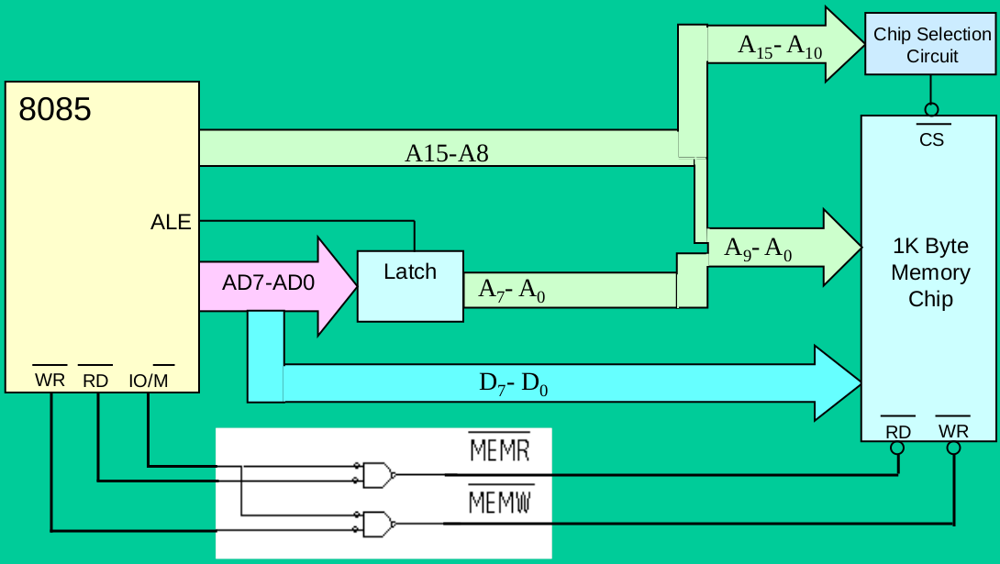

\newpage

# Unit I: Introduction to Microprocessor

## Definition and History of Microprocessors

**Definition of a Microprocessor**

A microprocessor is a single integrated circuit (IC) that incorporates the core functions of a computer's central processing unit (CPU).

- **The "Brain" of a Computer:** It executes instructions, performs calculations, and manages the flow of data within a computer system.
- **Small and Powerful:** Microprocessors pack millions or even billions of transistors into a tiny chip, enabling complex processing in compact devices.
- **Essential for Modern Devices:** They power a vast range of devices from smartphones and laptops to cars, appliances, and industrial equipment.
- **Components:** Typical components of a microprocessor include:

  - Arithmetic Logic Unit (ALU) - Performs arithmetic and logical operations
  - Control Unit (CU) - Decodes instructions and coordinates the operations of other units
  - Registers - Small, high-speed memory locations for temporary data storage

- **Responsible for:**

  - **Fetching instructions:** Retrieving instructions from the computer's memory.
  - **Decoding instructions:** Translating instructions into a form the microprocessor understands.
  - **Executing instructions:** Performing calculations and logical operations based on the instructions.
  - **Controlling data flow:** Managing the movement of data between memory, input devices, output devices, and the microprocessor itself.

**History**

The evolution of microprocessors is a fascinating story of technological advancement:

- **Early Computers (1940s-1950s):** The first computers were massive, filling entire rooms. They used vacuum tubes for processing, which were bulky, power-hungry, and prone to failure.
- **Transistors (1950s-1960s):** The invention of the transistor revolutionized electronics. Transistors were smaller, faster, and more reliable than vacuum tubes, leading to smaller and more powerful computers.
- **Integrated Circuits (1960s):** Integrated circuits (ICs) combined multiple transistors, resistors, and other components onto a single chip. This enabled further miniaturization of computers.
- **The First Microprocessor (1971):** Intel released the Intel 4004, the first commercially available microprocessor on a single chip. While limited in power by today's standards, it paved the way for the computing revolution.
- **Rapid Advancement (1970s-1980s):** This period saw exponential growth in microprocessor performance with the introduction of iconic processors like the Intel 8080, Zilog Z80, and Motorola 6800. These processors found their way into the first personal computers.
- **Modern Era (1990s-Present):** Microprocessors have become incredibly powerful, with billions of transistors on a single chip. They power not only our computers but also smartphones, tablets, smart devices, cars, and countless other technologies.

**Key milestones in microprocessor history:**

- **1971:** Intel 4004 (4-bit)
- **1974:** Intel 8080 (8-bit)
- **1978:** Intel 8086 (16-bit) - foundation of the x86 architecture used in many PCs today.
- **1993:** Intel Pentium (32-bit) – brought significant performance gains
- **2000s:** Introduction of multi-core processors
- **Present:** Continued focus on performance, power efficiency, and specialized microprocessors for tasks like AI and machine learning.

## Basic Components of a Digital Computer


A digital computer is a versatile device capable of performing calculations and logical operations at incredible speeds. To achieve this, a computer relies on several fundamental components working together:

- **Input Unit:** This unit bridges the gap between the user and the computer. It allows data and instructions to be entered into the system. Some common input devices include:

  - Keyboard
  - Mouse
  - Touchscreen
  - Scanner
  - Microphone

- **Storage Unit:** The storage unit preserves data, instructions, and results for short-term and long-term use. It's divided into two main categories:

  - **Primary Storage (Main Memory):** This fast, but relatively expensive memory temporarily holds the currently running programs, input data, and intermediate calculations. Since primary storage is volatile, data is lost when the computer powers down. RAM (Random Access Memory) is the most common type of primary storage.

  - **Secondary Storage (Auxiliary Memory):**

    This type of storage acts as a permanent repository for programs, data, and the operating system. It's slower than primary storage but offers larger capacity at a lower cost. Examples include:

    - Hard Disk Drives (HDD)
    - Solid-State Drives (SSD)
    - Optical Disks (CDs, DVDs)

- **Central Processing Unit (CPU):** The CPU is the "brain" of the computer responsible for controlling and executing instructions. It contains two primary parts:

  - **Control Unit (CU):** The orchestrator of the CPU. It fetches instructions from memory, decodes them, and generates signals to coordinate the activities of the other components within the system.
  - **Arithmetic Logic Unit (ALU):** The heart of calculations. The ALU performs arithmetic operations (addition, subtraction, etc.) and logical operations (AND, OR, NOT, etc.).

- **Output Unit:** The output unit presents the results of processing to the user in a human-readable form. Examples include:

  - Monitor (display)
  - Printer
  - Speakers

**How These Components Work Together**

1. **Input:** A user enters data or instructions through an input device like a keyboard or mouse.
2. **Storage:** Data and instructions are temporarily stored in the main memory (RAM) for quick access by the CPU.
3. **Processing:**
   - The Control Unit fetches an instruction from memory and decodes it.
   - The ALU executes the instruction, potentially involving calculations or logical comparisons.
   - Results might be stored back into memory (RAM or secondary storage).
4. **Output:** The processed results are presented to the user through an output device, such as a monitor or printer.

## Basic Components of a Microprocessor

**CPU (Central Processing Unit)**

- **The Brain:** The CPU is the heart of a microprocessor, responsible for interpreting and executing instructions. Think of it as the decision-maker and coordinator of the entire system.
- Key Components:
  - **Control Unit (CU):** The manager that fetches instructions from memory, decodes them, and controls the flow of data and operations throughout the processor.
  - **Arithmetic Logic Unit (ALU):** The "calculator" within the CPU that performs all arithmetic (addition, subtraction, etc.) and logical (AND, OR, NOT, etc.) operations.

**ALU (Arithmetic and Logic Unit)**

- **The Calculator:** The ALU is a core part of the CPU, dedicated to carrying out the calculations and logic comparisons that drive computations within the microprocessor.
- Operations:
  - Arithmetic: Addition, subtraction, multiplication, division, etc.
  - Logical: AND, OR, XOR, NOT, comparisons, etc.

**Control Unit**

- **The Orchestrator:** The control unit is another essential part of the CPU. It directs all operations within the microprocessor.
- Responsibilities:
  - **Instruction Fetching:** Retrieves instructions from memory.
  - **Instruction Decoding:** Interprets instructions to determine what needs to be done.
  - **Control Signals:** Generates signals to coordinate the ALU, memory, and other components, ensuring everything works in sync.

**Memory Unit (RAM, ROM)**

- **Data and Code Storage:** The memory unit is where the microprocessor stores important data and instructions.
- Types:
  - **RAM (Random Access Memory):** Temporary, fast storage used for currently running programs and data. It's volatile, meaning data disappears when the power goes off.
  - **ROM (Read-Only Memory):** Permanent storage that typically holds the computer's startup instructions (BIOS) and other essential data that shouldn't change.

**Input/Output (I/O) Units**

- **Communication Bridge:** These units facilitate communication between the microprocessor and the outside world.
- Input Devices:
  - Keyboard
  - Mouse
  - Scanner
  - Microphone
  - Network interface card
- Output Devices:
  - Monitor
  - Printer
  - Speakers
  - Network interface card

**How It All Works Together**

1. **Fetch:** The Control Unit fetches an instruction from memory (RAM).
2. **Decode:** The Control Unit decodes the instruction to figure out the required operation.
3. **Execute:**
   - If it's a calculation or logical operation, the ALU gets involved.
   - Data may be moved between memory, the ALU, and internal registers (tiny, super-fast memory within the CPU).
4. **Store:** Results might be written back to memory or sent to an output device.

## Architectures

### Von Neumann Architecture

- **Key Features:**
  - **Single Unified Memory:** Both instructions and data reside in the same memory space.
  - **Single Bus:** A shared bus is used for transferring both data and instructions.
  - **Sequential Execution:** Instructions are fetched and executed one at a time.
- **Components:**
  - Central Processing Unit (CPU) with Control Unit (CU) & Arithmetic Logic Unit (ALU)
  - Unified Memory
  - Input/Output (I/O) devices
  - Bus
- **Advantages:**
  - **Simplicity:** Easier to design and implement.
  - **Flexibility:** Programs can modify their own code, enabling dynamic behavior.
- **Limitations:**
  - **The von Neumann Bottleneck:** Limited bandwidth due to the shared data and instruction bus, potentially slowing down processing.
  - **Security Concerns:** Less separation between code and data can increase vulnerability to some types of cyber-attacks.

### Harvard Architecture

- **Key Features:**
  - **Separate Memories:** Distinct memory units for instructions and data.
  - **Dedicated Buses:** Separate buses for fetching instructions and accessing data.
  - **Parallel Execution:** The CPU can access instructions and data simultaneously.
- **Components:**
  - Central Processing Unit (CPU) with Control Unit (CU) & Arithmetic Logic Unit (ALU)
  - Separate instruction and data memory
  - Dedicated buses for each memory
  - Input/Output (I/O) devices
- **Advantages:**
  - **Speed and Efficiency:** Parallel access offers faster execution and eliminates the bottleneck present in Von Neumann architectures.
  - **Enhanced Security:** Improved isolation between code and data can aid security measures.
  - **Deterministic Behavior:** Reliable timing and performance make it ideal for real-time systems.
- **Limitations:**
  - **Increased Complexity:** More complex to design due to additional memory units and buses.
  - **Less Flexible for Self-Modifying Code:** Separating code and data makes it more difficult for programs to modify their instructions on the fly.

### Von Neumann vs Harvard Architecture

**Similarities**

- **Fundamental Components:** Both architectures include a CPU (with CU and ALU), memory, and I/O devices.
- **Stored-Program Concept:** Both can store programs in memory and execute them.

**Differences Summary Table**

| Feature                | Von Neumann Architecture                                         | Harvard Architecture                                                  |
| ---------------------- | ---------------------------------------------------------------- | --------------------------------------------------------------------- |
| Memory Structure       | Single unified memory for instructions and data                  | Separate memory spaces for instructions and data                      |
| Buses                  | Single bus for instructions and data                             | Separate, dedicated buses for instructions and data                   |
| Instruction Processing | Sequential                                                       | Potential for parallel instruction fetch and data access              |
| Performance            | Potential bottleneck due to shared bus                           | Faster, eliminates the bottleneck                                     |
| Complexity             | Simpler to design and implement                                  | Increased hardware complexity                                         |
| Flexibility            | Programs can self-modify code                                    | Less flexible for self-modifying code                                 |
| Security               | Less isolation between code and data                             | Improved isolation                                                    |
| Applications           | General-purpose computers, laptops, servers.                     | Embedded systems, microcontrollers, digital signal processors (DSPs). |
| Diagram                |  |           |

Table: Von Neumann vs Harvard Architecture

## Instruction Formats & Related Terms

### Instruction Format

A microprocessor instruction is a fundamental command encoded in binary that tells the microprocessor to perform a specific operation. Instructions generally have two core parts:

#### Opcode (Operation Code)

Specifies the operation the microprocessor should perform (e.g., add, subtract, move data, compare). The opcode is a unique binary pattern assigned to a particular action.

#### Operand

Data the operation acts upon. An operand could be:

- **Immediate Value:** Data directly included in the instruction itself.
- **Register:** A small, fast memory location inside the processor.
- **Memory Address:** A location in the main memory.

#### Example

Consider a simple 'ADD' instruction in a hypothetical microprocessor:

```
ADD  R1,  #5
```

- **Opcode:** 'ADD' tells the processor to perform an addition operation.
- **Operands**:
  - 'R1' is a register, indicating one value for the addition is stored in register R1.
  - '#5' is an immediate value, specifying the second value for the addition.

### Instruction Cycle

The instruction cycle is the complete sequence of steps a microprocessor takes to process a single instruction. It involves:

1. **Fetch:** The Control Unit retrieves the instruction's opcode from memory.

2. **Decode:** The Control Unit decodes the opcode to understand the required operation.

3. **Execute**:

   The instruction is carried out. This may involve:

   - Reading data from memory or registers.
   - Performing calculations or logical operations in the ALU.
   - Writing results back to memory or registers.

### Machine Cycle

A machine cycle represents a single, indivisible action performed by the microprocessor necessary to carry out part of an instruction's operation. Some examples of machine cycles include:

- **Memory Read:** Fetching data from memory.
- **Memory Write:** Storing data into memory.
- **I/O Read:** Reading data from an input device.
- **I/O Write:** Sending data to an output device.

An instruction cycle often comprises multiple machine cycles.

### T-State (Clock Cycle)

A T-state is the fundamental unit of time in a microprocessor, measured by a single period of the processor's internal clock. Each machine cycle typically takes one or more T-states. Faster clocks mean more T-states per second, facilitating faster processing.

**Relationship**

- **Instructions** are built from opcodes and operands.
- An **instruction cycle** consists of the steps to execute one complete instruction.
- A **machine cycle** is a smaller unit of action within an instruction cycle.
- **T-States** are the fundamental timing unit, with a machine cycle usually encompassing multiple T-states.

Instructions in the 8085 microprocessor can be 1, 2, or 3 bytes long. The structure varies depending on the specific instruction and the addressing modes used.

## RISC vs. CISC

| Feature          | RISC (Reduced Instruction Set Computer)                                                                          | CISC (Complex Instruction Set Computer)                                                                            |
| ------------------- | ---------------------------------------------------------------------------------------------------------------- | ------------------------------------------------------------------------------------------------------------------ |
| Instruction Set  | Smaller, simpler instructions. Focus on individual operations.                                                   | Larger, more complex instructions capable of multiple operations within a single command.                          |
| Addressing Modes | Limited addressing modes.                                                                                        | Extensive addressing modes for flexible data access.                                                               |
| Execution        | Emphasizes hardware optimization. Instructions often execute in one clock cycle.                                 | Utilizes microcode to implement complex instructions, potentially requiring multiple clock cycles per instruction. |
| Compiler Design  | Relies on simpler instructions, shifting complexity to the compiler.                                             | Simplifies compiler design by offloading complexity to processor hardware.                                         |
| Memory Access    | Load/Store architecture: Data must be explicitly moved between registers and memory for operations.              | Instructions can operate directly on memory.                                                                       |
| Pipelining       | Highly efficient pipelining.                                                                                     | Pipelining can be less efficient due to variable-length instructions.                                              |
| Register Usage   | Large number of general-purpose registers for fast operand access.                                               | Fewer registers, often with specialized purposes.                                                                  |
| Speed            | Simplicity enables faster instruction execution, higher overall throughput.                                      | Compact code due to complex instructions can optimize memory usage.                                                |
| Power Efficiency | Efficient due to simpler design and execution.                                                                   | Reduced instruction count can lower power consumption in some cases.                                               |
| Design Cost      | Fewer transistors and simpler design can reduce development time and cost.                                       | More transistors and complex design can increase development time and cost.                                        |
| Code Size        | Simpler instructions may require longer sequences to achieve the same task, increasing program size.             | Complex instructions can increase complexity and potential for errors, impacting performance.                      |
| Compiler         | Burden placed on the compiler to generate efficient code.                                                        | Can hide hardware complexity, simplifying software development.                                                    |
| Applications     | High-performance computing, smartphones, embedded systems, devices where speed and power efficiency are crucial. | Legacy systems, applications prioritizing code density (smaller program size).                                     |

:RISC vs. CISC

\newpage

# Unit II: Working of 8085 Microprocessor

## Pin Diagram of 8085


**Explanation of Pin Groups**

1. **Address Bus (A8-A15):** The upper 8-bits of the 16-bit address bus used for addressing memory and I/O devices.

2. **Multiplexed Address/Data Bus (AD0-AD7):** These pins serve two functions:

   - During the first clock state (T1), they carry the lower 8-bits of the address.
   - During subsequent clock states, they serve as the data bus for data transfer.

3. **Control and Status Signals**

   - **ALE (Address Latch Enable):** Indicates that the AD0-AD7 lines contain a valid address.
   - **RD (Read):** Indicates a read operation from memory or I/O.
   - **WR (Write):** Indicates a write operation to memory or I/O.
   - **IO/M (IO/Memory Select):** Distinguishes between memory (IO/M = 0) and I/O (IO/M = 1) operations.
   - **S0, S1 (Status signals):** These, along with IO/M, indicate the type of machine cycle (opcode fetch, memory read, I/O write, etc.).

4. **Power Supply and Clock**

   - **VCC:** +5V power supply.
   - **VSS:** Ground (0V).
   - **X1, X2:** Connections for a crystal or external clock source to drive the internal clock generator.
   - **CLK (OUT):** Clock output signal for synchronizing external devices.

5. **Interrupts**

   - **TRAP:** Highest priority non-maskable interrupt.
   - **RST 7.5, RST 6.5, RST 5.5:** Maskable interrupts with decreasing priority.
   - **INTR:** General maskable interrupt.
   - **INTA:** Interrupt acknowledge signal sent by the 8085.

6. **Serial I/O**

   - **SID (Serial Input Data):** Input line for serial data.
   - **SOD (Serial Output Data):** Output line for serial data.

7. **Reset**

   - **RESET IN:** When low, resets the microprocessor, clearing the program counter and registers.
   - **RESET OUT:** Indicates that the microprocessor is being reset.

8. **DMA (Direct Memory Access)**
   - **HOLD:** Input from a DMA device to request control of buses.
   - **HLDA:** Acknowledge signal, indicating the 8085 has relinquished control of buses.

### Power Supply, Clock & Reset Pins

Let's delve into the power supply, clock, and reset aspects of the 8085 microprocessor, along with a discussion on common 8085 modules:

**Power Supply**

- **Vcc:** The 8085 requires a +5V DC power supply. It is crucial to supply a regulated, stable 5V for reliable operation.
- **Vss:** This is the ground reference (0V) for the power supply.
- **Current Requirements:** Make sure the power supply can handle the current draw of the 8085 as well as other components in your system.

**Clock**

- **X1, X2:** These pins connect to an external crystal oscillator circuit. The crystal's resonant frequency determines the fundamental clock speed of the 8085.
- **Frequency:** The 8085 supports frequencies up to 3 MHz or 6 MHz (depending on the specific version). You need to choose a crystal with double the desired operating frequency due to the internal clock divider.
- **CLK (OUT):** This signal is an output from the 8085 with the same frequency as its internal clock. It can serve as a system clock for synchronizing other devices.

**Reset**

- **RESET IN:** This active-low signal is used to reset the 8085. When asserted:
  - The program counter is set to 0000H.
  - Interrupts are disabled.
  - Registers are cleared.
- **RESET OUT:** This active-high output signal can be used to reset other devices in the system during a microprocessor reset.

### Control and Status Signal Pins

**Control Signals**

These are signals generated by the 8085 microprocessor to direct and synchronize operations with memory and I/O devices. Key control signals include:

- **RD (Read):**

  - **Active Low** (asserted when the signal is low)
  - Issued by the 8085 to indicate that data should be placed on the data bus by the selected memory or I/O device.
  - Signals that the microprocessor is reading data.

- **WR (Write):**

  - **Active Low**
  - Issued by the 8085 to indicate that data on the data bus should be stored into the selected memory location or I/O port.
  - Signals that the microprocessor is writing data.

- **IO/M (Input/Output or Memory):**

  - Used to distinguish between memory and I/O operations.
  - **IO/M = 1:** Indicates the address bus holds an I/O device address.
  - **IO/M = 0:** Indicates the address bus holds a memory address.

- **ALE (Address Latch Enable):**
  - Active high pulse generated at the beginning of a machine cycle.
  - Used to signal external devices to latch the lower 8-bits of the address (AD0-AD7) which are multiplexed with the data bus. This allows the address to remain stable for use by memory and I/O devices.

**Status Signals**

These signals are provided by the 8085 to reflect its current operational state. Here are the main status signals:

- **S0, S1:**

  - These signals indicate the type of operation the 8085 is currently performing:

    | S1  | S0  | Operation    |
    | --- | --- | ------------ |
    | 0   | 0   | HALT         |
    | 0   | 1   | Write        |
    | 1   | 0   | Read         |
    | 1   | 1   | Opcode Fetch |

    :Status Signals

**How Control and Status Signals Work Together**

A simplified interaction using these signals would look like this:

1. **Address Output:** The 8085 places a 16-bit address on the address bus and sends a pulse on ALE to latch the lower order address bits.
2. **IO/M Signal:** The 8085 sets the IO/M line to indicate whether it's a memory or I/O operation.
3. **Read or Write:**
   - **Read:** The 8085 asserts the RD line (sets it low). The addressed device places data on the data bus for the microprocessor to read.
   - **Write:** The 8085 asserts the WR line (sets it low). Data on the data bus is written to the addressed location.
4. **Status:** The 8085 updates S0 and S1 to indicate the type of operation that was just performed.

#### Role of ALE signal in Demultiplexing

**What is the ALE Signal?**

- The ALE signal is a control signal generated by the 8085 microprocessor.
- It is a positive-going pulse that occurs during the first clock cycle (T1 state) of each machine cycle.

**Purpose of the ALE Signal**

The primary function of the ALE signal is to demultiplex the lower-order address/data bus (AD0-AD7). This bus is shared (multiplexed) to carry both:

1. **Lower 8-bits of the Address (during T1 state):** The 8085 needs to send out the 16-bit address of a memory location or I/O port. The lower 8 bits of the address are carried on lines AD0-AD7.
2. **Data (during subsequent states):** The same lines are used to transmit or receive actual data to/from the memory or I/O device.

**How ALE Demultiplexes the Bus**

1. **T1 State:**

   - The ALE signal goes high.
   - The 8085 places the lower 8 bits of the address on lines AD0-AD7.
   - An external latch (usually an 8282 or 8283 octal latch) connected to these lines "latches" or captures this address information.

2. **Subsequent States (T2, T3, ...):**
   - ALE goes low.
   - The lower-order address lines (AD0-AD7) are now free to be used as a data bus for transferring data.

**Diagram**

A simple timing diagram can help visualize this:

```
          ______         ______
ALE      |      |_______|      |______
          _____           _____
AD0-AD7  |Addr |_______| Data |________
         (T1)      (T2, T3, ...)
```

**Key Points:**

- The ALE signal is crucial for the 8085 to correctly interface with memory and I/O devices.
- The external latch holds the lower order address bits, freeing the 8085 to continue its fetch or write operation.

### Interrupt Pins

**What are Interrupts?**

Interrupts are mechanisms that allow an external device or an internal event to temporarily halt the currently running program and transfer control to a special routine called the Interrupt Service Routine (ISR). ISRs are designed to handle specific events, providing a way to respond to situations without continuously polling for them.

**Types of Interrupts in 8085**

The 8085 supports two classes of interrupts:

1. **Hardware Interrupts:**

   - Initiated by signals on dedicated interrupt pins of the 8085.
   - Maskable: Can be selectively enabled or disabled using software instructions.
   - The 8085 has five hardware interrupts:
     - **TRAP (RST 4.5):** Highest priority, non-maskable (cannot be disabled). Typically used for critical events like power failures.
     - **RST 7.5:** Edge-triggered (responds to a signal transition). Maskable.
     - **RST 6.5, RST 5.5:** Level-triggered (responds to a high or low level on the pin). Maskable.
     - **INTR:** General-purpose interrupt. Non-vectored, which means the requesting device needs to provide the ISR address. Maskable.

2. **Software Interrupts:**
   - Embedded directly into the program using the RST instructions (RST 0 through RST 7).
   - These are essentially subroutine calls triggered by software instead of hardware.
   - Non-maskable (always execute).

**Interrupt Handling Process**

Here's a general outline of how the 8085 handles interrupts:

1.  **Interrupt Request:** A device asserts its interrupt pin (or an RST instruction is executed).
2.  **Acknowledgement:** If interrupts are enabled (using the EI instruction), the 8085 finishes its current instruction and sends an interrupt acknowledge signal (INTA).
3.  **ISR Execution:**
    - **Vectored Interrupts (TRAP, RST 7.5, 6.5, 5.5):** The 8085 automatically jumps to a predefined memory location (vector address) associated with the interrupt.
    - **Non-Vectored Interrupt (INTR):** The interrupting device must provide the starting address of its ISR.
4.  **Saving State:** The 8085 pushes the current Program Counter (PC) onto the stack to preserve the return address.
5.  **Executing ISR:** The ISR code is executed to handle the specific event.
6.  **Return:** Upon completion of the ISR, the RET instruction is used to pop the saved PC from the stack, resuming the main program.

**Key Points**

- **Interrupt Masking:** The SIM instruction allows you to selectively enable or disable maskable interrupts (RST 7.5, 6.5, 5.5).
- **Interrupt Priority:** If multiple interrupts occur simultaneously, they are handled according to fixed priority (TRAP has the highest priority).
- **ISR Placement:** You must carefully place the ISRs in memory, especially for vectored interrupts.

### Serial Communication Pins

The 8085 microprocessor doesn't have a dedicated built-in UART for serial communication. However, its software can be used to implement serial communication through its regular input/output pins. Let's explore this in detail:

**Serial I/O on the 8085**

The 8085 has two pins dedicated to software-implemented serial communication:

- **SID (Serial Input Data):** Used to receive serial data into the microprocessor.
- **SOD (Serial Output Data):** Used to transmit serial data from the microprocessor.

**How Serial Communication Works**

Serial communication involves sending or receiving one bit of data at a time over a single wire. Here's how the 8085 can achieve this:

1. **Bit Manipulation:** Software instructions are used to set or read the voltage level of the SID and SOD pins individually, allowing you to transmit and receive bits.

2. **Timing:** Precise timing is crucial in serial communication to ensure the receiver correctly interprets transmitted bits. This usually involves using delay loops or timers in your 8085 code to generate specific intervals.

3. **Protocol:** Serial communication follows standards such as RS-232. This means adhering to:
   - **Baud Rate:** The speed of transmission (bits per second). Sender and receiver must agree on a common baud rate.
   - **Start/Stop bits:** Special bits to signal the beginning and end of a byte transmission.
   - **Parity (optional):** An error-checking bit.

**RIM and SIM Instructions**

The 8085 has two special instructions to help in serial communication:

- **RIM (Read Interrupt Mask):**

  - Allows checking the status of various interrupt flags including status bits for serial data.
  - The Serial Input Data (SID) pin's status can be read using this instruction.

- **SIM (Set Interrupt Mask):**
  - Used to enable/disable interrupts and also sets the SOD pin's status.
  - Setting the SOD bit allows you to transmit data using the SOD pin.

**Example**

A common use case is to implement a simple serial communication program to send and receive characters to or from a computer terminal. Your code would typically involve:

- **Initialization:** Setting up baud rate, parity, etc., using SIM and RIM.
- **Sending Data:**
  1. Using SIM to set the SOD bit corresponding to the bit you want to send.
  2. Introducing an appropriate delay for the required baud rate.
  3. Repeat for all bits of the character including start/stop bits.
- **Receiving Data:**
  1. Sampling the SID pin using RIM at regular intervals matching the baud rate.
  2. Assembling bits into a byte.

**Limitations**

- **Speed:** Software-based serial communication on the 8085 is relatively slow and limited by your timing precision.
- **CPU Overhead:** Handling serial communication through software uses up a significant amount of the 8085's processing time.

### DMA Pins

The 8085 microprocessor has the HOLD and HLDA pins, and these signals are essential for facilitating a limited form of DMA-like behavior. Here's how it works:

**How the 8085 Can Mimic DMA Operations**

1. **DMA Request:** An external peripheral or device (acting as a DMA controller of sorts) asserts the HOLD signal, signaling to the 8085 that it wants to take control of the address and data bus.

2. **CPU Acknowledgement** At the end of its current machine cycle, the 8085 will respond by:

   - Completing any outstanding bus operations.
   - Placing its buses in a high-impedance (tri-stated) mode, effectively disconnecting itself from those buses.
   - Asserting the HLDA (Hold Acknowledge) signal, indicating it has relinquished control.

3. **Peripheral Takes Over:** The requesting peripheral takes control of the address and data buses. It can now perform memory read or write operations directly, transferring data without further involvement of the 8085 CPU.

4. **Releasing Control:** Once the peripheral is done with the data transfer, it releases the HOLD signal.

5. **CPU Regains Control:** The 8085 detects that HOLD is de-asserted and subsequently takes back control of the buses, resuming its previous operations.

**Important Considerations**

- **Not True DMA:** This isn't true DMA in the strictest sense since it lacks a fully dedicated DMA controller with its own registers and transfer logic. The 8085 CPU is still somewhat involved in the process.

- **Limited Speed:** The CPU needs to actively respond to HOLD and HLDA signals, adding some latency and limiting how efficiently large blocks of data can be transferred compared to a system with a full-fledged DMA controller.

- **Synchronization:** You need careful synchronization between the 8085 and the peripheral to ensure they don't clash while attempting to access the buses.

**Use Cases**

Even with its limitations, this technique can be useful for devices that need to transfer data in bursts, like disk drives or high-speed I/O devices.

**Example**

Imagine an external device that needs to quickly transfer a block of data into the 8085's memory. Using the HOLD/HLDA mechanism, this device can efficiently transfer the data without the CPU needing to actively read in each individual byte.

## Block Diagram of 8085


**Key Components and their Functions**

1. **Accumulator:** An 8-bit register that's central to arithmetic and logical operations performed by the ALU.

2. **Arithmetic and Logic Unit (ALU):** Performs arithmetic operations (addition, subtraction, etc.) and logical operations (AND, OR, NOT, etc.). It sets flags (Carry, Zero, Sign, etc.) based on the results.

3. **Temporary Register:** A temporary holding location for data used during instruction execution.

4. **Instruction Register:** Holds the currently fetched instruction.

5. **Instruction Decoder and Machine Cycle Encoder:** Decodes the instruction in the instruction register and generates control signals to coordinate the microprocessor's actions during a machine cycle.

6. **Register Array:** Contains six general purpose 8-bit registers (B, C, D, E, H, and L), which can be used individually or in pairs (BC, DE, HL) for 16-bit operations.

7. **Program Counter (PC):** A 16-bit register that holds the memory address of the next instruction to be fetched.

8. **Stack Pointer (SP):** A 16-bit register pointing to the top of the stack in memory. The stack is used for storing return addresses of subroutines and temporarily storing data.

9. **Timing and Control Unit:** Generates timing and control signals for all operations within the microprocessor and synchronizes with external devices.

10. **Interrupt Control:** Handles incoming interrupt requests (if any), acknowledging them and allowing them to temporarily disrupt the current program execution.

11. **Serial I/O Control:** Facilitates serial input and output, useful for slower communication with certain types of peripherals.

12. **Address Bus (A8 - A15):** The upper 8-bits of the 16-bit address bus, used to send the most significant portion of an address.

13. **Address/Data Bus (AD0 - AD7):** A multiplexed bus. It carries the lower 8 bits of an address during the beginning of a machine cycle and data during data transfer operations.

**How it Works (Simplified)**

1. **Fetch:** The PC provides an address; the instruction is fetched from memory and placed into the Instruction Register.
2. **Decode:** The Instruction Decoder decodes the instruction to understand what needs to be done.
3. **Execute:** The Control Unit generates signals to coordinate the ALU, registers, and other components as they perform the necessary operations.
4. **Repeat:** The process continues, fetching and executing instructions sequentially.

### Arithmetic & Logic Unit (ALU) and Timing & Control Unit (CU)

**Arithmetic and Logic Unit (ALU)**

- **The Heart of Calculations:** The ALU is responsible for performing all the arithmetic and logical operations within the 8085.

- **Operations:** The 8085's ALU supports the following:

  - **Arithmetic:** Addition, subtraction, increment, decrement
  - **Logical:** AND, OR, XOR, NOT, comparison
  - **Rotate/Shift:** For bit manipulation.

- **Inputs and Outputs:**

  - **Inputs:** The ALU typically takes two 8-bit operands as inputs. One operand usually comes from a temporary register, while the other comes from the Accumulator (a special register) or directly from the instruction itself.
  - **Output:** The result of the operation is stored back into the Accumulator.

- **Flags:** The ALU sets or clears various flags in the Flag Register based on the result of the operation:
  - Carry Flag (CY)
  - Zero Flag (Z)
  - Sign Flag (S)
  - Parity Flag (P)
  - Auxiliary Carry Flag (AC)

**Timing and Control Unit**

- **Conductor of the Orchestra:** The Timing and Control Unit is responsible for synchronizing all the operations within the 8085. It ensures the correct sequencing of steps for instruction execution and communication with other system elements.

- **Key Functions:**

  - **Control signal generation:** Generates control signals (like RD, WR, IO/M) for internal components, memory, and I/O devices. These signals dictate the direction and timing of data flow.
  - **Timing Signals:** Creates clock and timing signals for the synchronization of the entire system.
  - **Instruction Execution Coordination:** Governs the fetch, decode, and execution stages of instruction processing.
  - **Interrupt Handling:** Acknowledges and manages the priority of interrupts.

- **Internal Components:**
  - **Oscillator:** Generates the fundamental clock signal used as a timing reference.
  - **Control Sequencer:** Logic responsible for producing the correct sequence of control signals based on the instructions being executed.

**Relationship Between ALU and Timing and Control Unit**

The Timing and Control Unit is the mastermind behind the entire operation of the 8085. It issues control signals that direct the ALU to perform specific operations at the appropriate time during instruction execution. The ALU executes the operations, and its resulting flags provide information to the Timing and Control Unit, influencing the flow and decision-making during instruction processing.

### Registers

**1. Accumulator (A)**

- **The Workhorse:** The 8-bit Accumulator is the most heavily used register in the 8085. It's involved in a vast majority of arithmetic, logical, and I/O operations.
- **Arithmetic and Logic:** One of the input operands for the ALU typically comes from the Accumulator, and the result of operations is also stored back into it.
- **I/O:** Data transferred during input and output operations passes through the Accumulator.

**2. Temporary Register (T)**

- **Hidden Helper:** The Temporary Register is also an 8-bit register, but it's not directly accessible to the programmer through instructions.
- **ALU Support:** It serves as a temporary holding space for the second operand during some ALU operations.
- **Indirect Addressing:** The Temporary Register is sometimes involved in memory operations where the memory address is specified by a register pair (like HL).

**3. Program Counter (PC)**

- **Keeps Track of Execution:** The PC is a 16-bit register that holds the memory address of the next instruction to be fetched and executed by the 8085.
- **Automatic Incrementing:** After fetching an instruction, the PC automatically increments to point to the next sequential instruction in memory.
- **Control Flow Changes:** Instructions like JUMP and CALL modify the Program Counter to change the execution flow of your program.

**4. Stack Pointer (SP)**

- **LIFO Structure:** The Stack Pointer is a 16-bit register that points to the current top of the stack in memory. The stack is a Last-In, First-Out data structure.
- **PUSH and POP:** Instructions like PUSH and POP add data to or remove data from the top of the stack respectively, with the SP automatically adjusting.
- **Subroutine Calls and Interrupts:** The stack is used to temporarily store the return address during subroutine calls (CALL) and during interrupt handling. This ensures the program can return to the correct place when the subroutine or interrupt service routine finishes.

**5. Register Array (B, C, D, E, H, L)**

- **General Purpose Registers:** These are six 8-bit registers that can be used individually or in pairs:
  - BC (16-bit)
  - DE (16-bit)
  - HL (16-bit)
- **Data Storage:** Used to temporarily hold data during program execution.
- **Memory Addressing:** The HL register pair, in particular, is often used to hold 16-bit memory addresses for addressing data in memory.

**Key Points**

- **Limited Registers:** The 8085 has a limited set of registers, so programmers need to manage register use efficiently.
- **Special Roles:** Registers like the Accumulator, Stack Pointer, and Program Counter have very specific roles, while the other general-purpose registers provide more flexibility.

### Instruction Register, Instruction Decoder, and Machine Cycle Encoder

**1. Instruction Register (IR)**

- **Purpose:** The Instruction Register serves as a temporary holding area for the current instruction being executed by the 8085.
- **Operation:** When an instruction is fetched from memory, it is placed into the Instruction Register.
- **Connection:** The IR is directly connected to the internal data bus of the 8085.

**2. Instruction Decoder**

- **Purpose:** The Instruction Decoder is a complex combinatorial circuit that analyzes the instruction currently in the Instruction Register. Its main function is to determine the nature of the instruction and figure out what actions the 8085 needs to take to execute it.
- **Decoding Process:**
  - Breaks down the instruction's opcode (the part that specifies the operation).
  - Identifies any operands or addressing modes involved.
  - Generates internal control signals to orchestrate the various steps required to execute the specific instruction.

**3. Machine Cycle Encoder**

- **Purpose:** The Machine Cycle Encoder is responsible for generating the timing and control signals necessary to carry out the steps required for instruction execution.
- **Machine Cycles:** Instructions in the 8085 consist of one or more machine cycles. Examples include:
  - Opcode Fetch cycle: To retrieve the instruction from memory.
  - Memory Read cycle: To read data from memory
  - Memory Write cycle: To write data to memory
  - I/O Read/Write cycles: To communicate with input/output devices
- **Control Signals:** The Machine Cycle Encoder produces control signals to direct the flow of data, activate specific registers or the ALU, and interface with the memory and I/O systems.

**How They Work Together**

1. **Fetch:** The opcode of an instruction is fetched from memory and placed into the Instruction Register.
2. **Decode:** The Instruction Decoder analyzes the opcode, figuring out what operation needs to be performed and any data locations involved.
3. **Execute:** The Machine Cycle Encoder generates the necessary sequence of control signals to carry out the instruction, potentially over multiple machine cycles. These signals direct the actions of the 8085's internal components.

### The Flag Register

The Flag register in the 8085 is an 8-bit register, with only 5 bits actively used as flags. These flags act as individual flip-flops that are set (1) or reset (0) to reflect specific conditions arising from arithmetic, logical, and other operations performed by the ALU (Arithmetic and Logic Unit).

**The 5 Flags:**

1. **Sign Flag (S):**

   - Set (1) if the result of an operation is negative (the Most Significant Bit, or MSB, of the result is 1).
   - Reset (0) if the result is positive.

2. **Zero Flag (Z):**

   - Set (1) if the result of an operation is zero.
   - Reset (0) if the result is not zero.

3. **Auxiliary Carry Flag (AC):**

   - Set (1) if there is a carry-out from the lower nibble (lower 4 bits) into the upper nibble (upper 4 bits) of a result.
   - Used primarily in instructions that perform decimal arithmetic.

4. **Parity Flag (P):**

   - Set (1) if the result has even parity (contains an even number of 1s).
   - Reset (0) if the result has odd parity.

5. **Carry Flag (CY):**
   - Set (1) if there is a carry-out from the most significant bit (MSB) of a result during addition, or a borrow during subtraction.
   - Reset (0) otherwise.

**How the Flags are Used:**

- **Conditional Jumps:** Instructions like JZ (Jump if Zero), JNZ (Jump if Not Zero), JC (Jump if Carry), etc. use the status of these flags to determine whether to branch to different parts of the program.
- **Decision Making:** The processor can examine flag states to modify calculations or behaviors based on previous operations.

**Example:**

```assembly
; Assume the accumulator (A) holds the value 50
SUB B  ; Subtract the value in register B from the accumulator
JZ LABEL  ; If the result is zero, jump to the code section marked as LABEL
```

### Bus Organization

A bus, in a microprocessor system, is a collection of signal lines used to transfer data between the CPU and other components (memory, I/O devices). The 8085 microprocessor has a well-defined bus organization consisting of three main buses:

- **Address Bus**
  - **Unidirectional** (data flows from the microprocessor outwards)
  - **16-bit wide** (Can address up to 64KB of memory)
  - Carries the memory address of the location the microprocessor wants to access.
- **Data Bus**
  - **Bidirectional** (data can flow in both directions)
  - **8-bit wide** (carries 8 bits of data at a time)
  - Used to transfer both data and instructions between the microprocessor and memory/IO.
- **Control Bus**
  - **Mixture of unidirectional and bidirectional lines**
  - Consists of various control signals like:
    - **RD (Read):** Indicates the CPU wants to read data from memory or an I/O port.
    - **WR (Write):** Indicates the CPU wants to write data to memory or an I/O port.
    - **IO/M:** Distinguishes between a memory operation (IO/M = 0) or I/O operation (IO/M = 1).

**Simplified Diagram**

```
        +--------------------+
        |    Microprocessor  |
        |       8085         |
        +--------------------+
               |       |
               | (Address Bus)
               |       |
   +-----------+-----------+-----------+
   | Memory    | I/O Ports | Other     |
   |           |           | Devices   |
   +-----------+-----------+-----------+
               |       |
               | (Data Bus)
               |       |
      <--------+--------->
               | (Control Bus)
```

**Explanation**

1. **Microprocessor:** The 8085 is the heart of the system, initiating and controlling data transfers.
2. **Address Bus** : Used by the microprocessor to specify the location in memory or I/O it wants to communicate with.
3. **Data Bus:** The actual data or instructions are transferred over the data bus.
4. **Control Bus:** The microprocessor uses the control bus to send signals that coordinate the timing and direction of data transfers.

**Key Points**

- **Multiplexing:** The 8085 multiplexes the lower 8-bits of the address bus (AD0-AD7) with the data bus (D0-D7) to reduce pin count. This means the same set of lines carries both address bits (at the beginning of a cycle) and data.
- **Interfacing:** The bus organization dictates how you connect and control memory chips and I/O devices within an 8085-based system.

## Working of the 8085

### Memory Interfacing

**Key Concepts**

- **Address Bus:** The 8085 has a 16-bit address bus (A0-A15), allowing it to address up to 64KB of memory.
- **Data Bus:** The 8085 has an 8-bit data bus (D0-D7) for transferring data between the microprocessor and memory.
- **Control Signals:** Control signals (like RD, WR, IO/M) are crucial for indicating the direction of data flow and the type of operation.

**Memory Organization**

- **Memory Map:** The 64KB address space of the 8085 is often divided into portions for specific purposes:
  - **ROM (Read-Only Memory):** Used to store the program instructions, which usually reside at the lower end of the address space.
  - **RAM (Random Access Memory):** Used for storing variables, temporary data, and the stack, which often starts at the higher end of the address space.
- **I/O Mapped I/O:** Some address space can be reserved for interfacing with input/output devices.



**Memory Read Cycle**

1. **Address Output:** The 8085 places the 16-bit address of the memory location it wants to read on the address bus.
2. **Control Signals:**
   - The IO/M signal is set low (IO/M = 0), indicating a memory operation.
   - The RD (Read) signal is asserted (set low) to signal a read operation.
3. **Data Transfer:** The addressed memory chip places the data from the specified location onto the data bus.
4. **Data Latch:** The 8085 microprocessor reads the data from the data bus and stores it internally (likely in a register).

**Memory Write Cycle**

1. **Address Output:** Similar to a read cycle, the 8085 places the 16-bit memory address on the address bus.
2. **Data Output:** The 8085 places the data it intends to write onto the data bus.
3. **Control Signals:**
   - IO/M is set low (IO/M = 0) to indicate a memory operation.
   - The WR (Write) signal is asserted (set low) to signal a write operation.
4. **Data Storage:** The addressed memory location stores the data from the data bus.

**Memory Interfacing Techniques**

- **Address Decoding:** To interface multiple memory (and I/O) devices, you'll need address decoding logic. Using gates and logic circuits, you can ensure that the correct memory chip or I/O device is activated based on the address on the address bus.

- **Multiplexing:** The lower 8-bits of the address bus (A0-A7) are multiplexed with the data bus (D0-D7). The ALE signal is used to latch the address and demultiplex it.

### Demultiplexing of Lower Order Address Bus & Data Bus

**Why Demultiplexing is Needed**

The Intel 8085 utilizes a multiplexed address/data bus to reduce the number of pins required. The lower 8 lines (AD0-AD7) carry two types of information:

1. **Address (during T1 state):** During the first clock cycle of a machine cycle, these lines hold the lower 8 bits of a 16-bit memory or I/O address.

2. **Data (during subsequent states):** In the remaining clock cycles, those same lines transmit or receive the actual data being sent to or from a memory location or I/O device.

**Demultiplexing Process**

Demultiplexing is the process of separating the address and data information so the 8085 and external devices can operate correctly. Here's how it's achieved:

1. **The ALE Signal:** During the first clock cycle (T1), the 8085 asserts the ALE (Address Latch Enable) control signal. This signal goes high.

2. **External Latch:** An external latch circuit (e.g., 8282 or 74LS373 octal latch) is connected to the AD0-AD7 lines. When the ALE signal goes high, this latch captures and holds the lower 8 bits of the address.

3. **Address Decoded:** The latched lower-order address bits, along with the higher-order address bits (A8-A15), provide the complete 16-bit address for memory or I/O devices.

4. **Data Bus Freed:** After the T1 state, the ALE signal goes low. The AD0-AD7 lines are now free to be used as a data bus for the remainder of the machine cycle.

**Diagram**


**Key Points**

- Demultiplexing enables the 8085 to interface with memory and I/O devices correctly by separating the address and data functions of the same physical bus lines.
- The ALE signal plays a crucial role in timing the latching of address information.

### Instruction Fetching, Decoding and Execution

**Instruction Fetching**

1. **Program Counter (PC):** The PC, a 16-bit register, holds the memory address of the next instruction to be fetched.
2. **Memory Address Register (MAR):** The contents of the PC are copied into the MAR.
3. **Memory Read:** The 8085's control unit sends a read signal to the memory, and the instruction code at the address specified by the MAR is placed on the data bus.
4. **Instruction Register (IR):** The instruction code is transferred from the data bus to the Instruction Register.
5. **PC Increment:** The PC is incremented to point to the next instruction in memory.

**Instruction Decoding**

1. **Instruction Decoder:** The instruction code in the IR is interpreted by the 8085's instruction decoder circuitry. It identifies the specific operation to be performed (opcode) and the operands involved.
2. **Control Signals:** The instruction decoder generates appropriate control signals to coordinate the upcoming execution. These signals control the flow of data within the 8085, directing the ALU, registers, and the timing of operations.

**Instruction Execution**

The execution phase varies significantly depending on the specific instruction. Here's a general breakdown of the kinds of steps involved:

- **Operand Fetching:** If the instruction uses operands (data), additional machine cycles may be involved in fetching these from either:
  - **Registers:** Accessed directly within the microprocessor.
  - **Memory:** The MAR is loaded with the memory address of the operand, and another memory read operation is performed.
- **ALU Operations:** For arithmetic or logical instructions, the ALU is engaged to perform the required calculation or comparison.
- **Result Storage:** The results of an operation may be stored in:
  - **Accumulator:** A special register within the 8085.
  - **Other General-Purpose Registers**
  - **Memory:** Another memory write operation might be needed.
- **Update Status Flags:** The ALU sets flags (Zero, Carry, Sign, etc.) to reflect the results of its operations, which can be used for conditional branching later.

**Example: ADD B Instruction**

Let's assume the instruction "ADD B" (add the value in register B to the accumulator) is being executed:

1. **Fetch:** The opcode for ADD B is fetched from memory and placed in the IR.
2. **Decode:** The instruction decoder determines that this is an addition operation and that the operand is in register B.
3. **Execute:**
   - The contents of register B are fetched.
   - The ALU performs the addition between the accumulator's current value and the value from register B.
   - The result is stored back into the accumulator.

#### Instruction Fetching

1. **Program Counter (PC):** The PC, a 16-bit register, holds the memory address of the next instruction to be fetched.
2. **Memory Address Register (MAR):** The contents of the PC are copied into the MAR.
3. **Memory Read:** The 8085's control unit sends a read signal to the memory, and the instruction code at the address specified by the MAR is placed on the data bus.
4. **Instruction Register (IR):** The instruction code is transferred from the data bus to the Instruction Register.
5. **PC Increment:** The PC is incremented to point to the next instruction in memory.

#### Instruction Decoding

1. **Instruction Decoder:** The instruction code in the IR is interpreted by the 8085's instruction decoder circuitry. It identifies the specific operation to be performed (opcode) and the operands involved.
2. **Control Signals:** The instruction decoder generates appropriate control signals to coordinate the upcoming execution. These signals control the flow of data within the 8085, directing the ALU, registers, and the timing of operations.

#### Instruction Execution

The execution phase varies significantly depending on the specific instruction. Here's a general breakdown of the kinds of steps involved:

- **Operand Fetching:** If the instruction uses operands (data), additional machine cycles may be involved in fetching these from either:
  - **Registers:** Accessed directly within the microprocessor.
  - **Memory:** The MAR is loaded with the memory address of the operand, and another memory read operation is performed.
- **ALU Operations:** For arithmetic or logical instructions, the ALU is engaged to perform the required calculation or comparison.
- **Result Storage:** The results of an operation may be stored in:
  - **Accumulator:** A special register within the 8085.
  - **Other General-Purpose Registers**
  - **Memory:** Another memory write operation might be needed.
- **Update Status Flags:** The ALU sets flags (Zero, Carry, Sign, etc.) to reflect the results of its operations, which can be used for conditional branching later.

#### Example: ADD B Instruction

Let's assume the instruction "ADD B" (add the value in register B to the accumulator) is being executed:

1. **Fetch:** The opcode for ADD B is fetched from memory and placed in the IR.
2. **Decode:** The instruction decoder determines that this is an addition operation and that the operand is in register B.
3. **Execute:**
   - The contents of register B are fetched.
   - The ALU performs the addition between the accumulator's current value and the value from register B.
   - The result is stored back into the accumulator.

## Microprocessor vs. Microcontroller

**Core Distinction**

- **Microprocessor:** A Central Processing Unit (CPU) on a chip. It's the "brain" of a computer system, designed for general-purpose computing and requires external components to form a functional system.
- **Microcontroller:** A self-contained "computer-on-a-chip." It integrates a CPU, memory, and peripherals, optimized for embedded control applications.

**Key Features**

| Feature               | Microprocessor                                           | Microcontroller                                                |
| --------------------- | -------------------------------------------------------- | -------------------------------------------------------------- |
| **System Design**     | Core of a complex system                                 | Often the entire system                                        |
| **Complexity**        | Less complex internally                                  | More complex internally due to integrated components           |
| **Instruction Set**   | Larger, versatile instruction set for diverse operations | Smaller, tailored instruction set for specific applications    |
| **Memory**            | External RAM, ROM, flash required                        | On-chip RAM, ROM, often with flash memory                      |
| **Peripherals**       | Requires external interfacing                            | Built-in peripherals (timers, ADCs, DACs, communication ports) |
| **Power Consumption** | Generally higher power consumption                       | Optimized for low power operation                              |
| **Cost**              | Generally lower cost                                     | Can be higher due to integrated components                     |
| **Flexibility**       | Highly flexible for various tasks                        | More specialized, less adaptable to diverse use cases          |
| **Applications**      | Desktop computers, laptops, servers, complex systems     | Embedded systems, appliances, medical devices, IoT devices     |
| **Examples**          | Intel Core Series, AMD Ryzen, IBM Power                  | Atmel AVR, PIC, ARM Cortex-M, Texas Instruments MSP430         |

:Microprocessor vs. Microcontroller

**Additional Considerations**

- **Programming:** Microcontrollers often require more low-level knowledge of hardware for efficient programming.
- **Performance:** Microprocessors generally excel in raw computational performance, while microcontrollers prioritize power efficiency and responsiveness.
- **Bit Handling:** Microcontrollers frequently offer better support for bit-level operations on I/O pins.

**Illustrative Analogy**

Imagine building a custom robot:

- **Microprocessor:** Like buying the high-performance brain for your robot. You'd still need to buy sensors, motors, a power supply, and design the entire body.
- **Microcontroller:** Like buying a pre-assembled robot kit with a basic brain, sensors, and motors. You focus on programming behavior, potentially adding some external components if needed.

**When to Choose Which**

- **Microprocessor:** Need high computational power, flexibility for a variety of tasks, or working with large amounts of data.
- **Microcontroller:** Self-contained solution, low-power, real-time control, or cost-sensitive applications are priorities.

\newpage

# Unit III: Microcontroller Architecture

## General Block Diagram of a Microcontroller


**Understanding the Core Components and Their Interconnections**

- **CPU (Central Processing Unit)**

  - **ALU (Arithmetic Logic Unit):** The heart of calculations and logic operations. Performs arithmetic (addition, subtraction, etc.), logical (AND, OR, NOT) comparisons, and data manipulation.
  - **Control Unit (CU):** The manager that fetches instructions from memory, decodes them, and generates control signals to orchestrate the actions of all components within the microcontroller.
  - **Registers:** Small, incredibly fast memory units built into the CPU for temporarily storing data, instructions, and intermediate results.

- **Memory**

  - **ROM (Read-Only Memory):** Non-volatile memory used to permanently store the microcontroller's firmware (program code) and essential data.
  - **RAM (Random Access Memory):** Volatile memory for storing temporary data and variables used while the microcontroller is running a program.
  - **Flash Memory:** In modern microcontrollers, flash memory often replaces traditional ROM for its flexibility, offering reprogrammable program memory.

- **I/O Ports (Input/Output Ports):** Versatile pins that can be configured as either inputs or outputs.

  - **Inputs:** Connect to external sensors, switches, keypads, and other input devices that provide information to the microcontroller.
  - **Outputs:** Drive LEDs, displays, motors, actuators and other devices for interacting with the external world.

- **Bus System:** A communication network of wires connecting the CPU, memory, I/O ports, and other components.

  - **Address Bus:** Carries memory addresses to specify locations for data transfer.
  - **Data Bus:** Transfers data between the various components.
  - **Control Bus:** Transmits control signals (read/write, timing, etc.) to synchronize operations.

- **Timers/Counters:** Specialized modules for:

  - **Generating Accurate Time Delays:** Essential for controlling the timing of operations.
  - **Counting External Events:** Measuring frequencies, pulse widths, and more.
  - **Output Waveform Generation:** Like Pulse Width Modulation (PWM) for motor control, dimming LEDs, etc.

- **Serial Port:** Facilitates communication with other devices using standard protocols like:

  - **UART:** Universal Asynchronous Receiver/Transmitter (common for simple serial communication).
  - **SPI, I2C:** For interfacing with various sensors and peripherals.

- **Interrupts:** Signals that allow the microcontroller to respond to high-priority events immediately

  - **External Interrupts:** Triggered by changes on input pins (e.g., button presses).
  - **Internal Interrupts:** Generated by timers, ADCs, or other peripherals.

- **ADC (Analog to Digital Converter):** Converts incoming analog signals (e.g., from temperature sensors) into digital values that the CPU can process.

- **DAC (Digital to Analog Converter):** Transforms digital data from the CPU into analog signals useful for driving devices like speakers or creating smooth control voltages.

- **On-Chip Oscillator:** Provides the internal clock signal that drives the microcontroller's timing.

- **Special Function Registers (SFRs):** Registers dedicated to controlling the configuration and operation of the microcontroller's peripherals.

## Pin Diagram of 8051

The following image shows the 8051 Microcontroller Pin Diagram with respect to a 40 – pin Dual In-line Package (DIP).

**Pins 1 – 8 (PORT 1):**

- Pins 1 to 8 are the PORT 1 Pins of 8051. PORT 1 Pins consists of 8 – bit bidirectional Input / Output Port with internal pull – up resistors. In older 8051 Microcontrollers, PORT 1 doesn’t serve any additional purpose but just 8 – bit I/O PORT.
- In some of the newer 8051 Microcontrollers, few PORT 1 Pins have dual functions. P1.0 and P1.1 act as Timer 2 and Timer 2 Trigger Input respectively.

- P1.5, P1.6 and P1.7 act as In-System Programming Pins i.e. MOSI, MISO and SCK respectively.

**Pin 9 (RST):** Pin 9 is the Reset Input Pin. It is an active HIGH Pin i.e. if the RST Pin is HIGH for a minimum of two machine cycles, the microcontroller will be reset. During this time, the oscillator must be running.


**Pins 10 – 17 (PORT 3):** Pins 10 to 17 form the PORT 3 pins of the 8051 Microcontroller. PORT 3 also acts as a bidirectional Input / Output PORT with internal pull-ups. Additionally, all the PORT 3 Pins have special functions. The following table gives the details of the additional functions of PORT 3 Pins.

| PORT 3 Pin | Function | Description           |
| ---------- | -------- | --------------------- |
| P3.0       | RXD      | Serial Input          |
| P3.1       | TXD      | Serial Output         |
| P3.2       | INT0     | External Interrupt 0  |
| P3.3       | INT1     | External Interrupt 1  |
| P3.4       | T0       | Timer 0               |
| P3.5       | T1       | Timer 1               |
| P3.6       | WR       | External Memory Write |
| P3.7       | RD       | External Memory Read  |

:PORT 3 Pins

**Pins 18 & 19:** Pins 18 and 19 i.e. XTAL 2 and XTAL 1 are the pins for connecting external oscillator. Generally, a Quartz Crystal Oscillator is connected here.

**Pin 20 (GND):** Pin 20 is the Ground Pin of the 8051 Microcontroller. It represents 0V and is connected to the negative terminal (0V) of the Power Supply.

**Pins 21 – 28 (PORT 2):** These are the PORT 2 Pins of the 8051 Microcontroller. PORT 2 is also a Bidirectional Port i.e. all the PORT 2 pins act as Input or Output. Additionally, when external memory is interfaced, PORT 2 pins act as the higher order address byte. PORT 2 Pins have internal pull-ups.

**Pin 29 (PSEN):** Pin 29 is the Program Store Enable Pin (PSEN). Using this pins, external Program Memory can be read.

**Pin 30 (ALE/PROG):** Pin 30 is the Address Latch Enable Pin. Using this Pins, external address can be separated from data (as they are multiplexed by 8051). During Flash Programming, this pin acts as program pulse input (PROG).

**Pin 31 (EA/VPP):** Pin 31 is the External Access Enable Pin i.e. allows external Program Memory. Code from external program memory can be fetched only if this pin is LOW. For normal operations, this pins is pulled HIGH. During Flash Programming, this Pin receives 12V Programming Enable Voltage (VPP).

**Pins 32 – 39 (PORT 0):** Pins 32 to 39 are PORT 0 Pins. They are also bidirectional Input / Output Pins but without any internal pull-ups. Hence, we need external pull-ups in order to use PORT 0 pins as I/O PORT. In addition to acting as I/O PORT, PORT 0 also acts as lower order address/data bus when external memory is accessed.

**Pin 40 (VCC):** Pin 40 is the power supply pin to which the supply voltage is given (+5V).

## 8051 Microcontroller Block Diagram


**Central Processing Unit (CPU)**

- **ALU (Arithmetic Logic Unit):** The heart of calculations and logic operations. Performs arithmetic (addition, subtraction, etc.), logical (AND, OR, NOT) comparisons, and data manipulation.
- **Instruction Decoder:** Decodes the instruction and generates control signals for other parts of the CPU.
- **Timing and Control Unit:** Manages the fetch-decode-execute cycle of the CPU and synchronizes actions with other blocks.

**Registers**

- **Accumulator (A):** An 8-bit register used for most arithmetic and logical operations.
- **B Register:** An 8-bit temporary register used for multiplication, division, and other data manipulation.
- **Program Status Word (PSW):** Holds status flags like carry, overflow, parity, and register bank selection.
- **Stack Pointer (SP):** Points to the top of the stack in RAM, used for subroutine calls and data storage.
- **Program Counter (PC):** Keeps track of the memory address of the next instruction to be fetched.
- **DPTR:** This is 16 bit register made up of two 8 bit registers – DPH & DPL. This register is used to point to Internal or External memory location.
- **SFR:** Special Function Registers (SFRs) are special registers that contains control and status bits for Timer/Counter (TCON, TMOD), Interrupts (IE, IP), Serial Communication (SCON) and Power Control (PCON).
- **Instruction Register:** Holds the currently fetched instruction.


**Memory**

- **Internal RAM (128 bytes):** Stores temporary data and variables during program execution.
  - **Register Banks 0-3:** Four sets of eight 8-bit general-purpose registers.
  - **Bit-addressable area (20h-2Fh):** 16 bytes with individually addressable bits.
  - **General-purpose area (30h-7Fh):** Remaining 80 bytes for data and variables.
- **Internal ROM (typically 4KB):** Stores the program code of the microcontroller.

**Input/Output (I/O)**

- **Ports 0-3 (P0-P3):** Four 8-bit I/O ports that can be individually configured as input or output pins.

**Timers/Counters**

- **Timers/Counters 0 and 1 (T0, T1):** 16-bit timers/counters that can be used for various purposes like measuring time intervals, counting external events, and generating waveforms.

**Serial Port (UART)**

- **TXD (Transmit Data):** Transmits serial data out of the microcontroller.
- **RXD (Receive Data):** Receives serial data into the microcontroller.
- **SBUF (Serial Buffer):** Temporarily stores data during serial transmission or reception.

**Interrupts**

- **External Interrupts (INT0, INT1):** Triggered by signals on external pins.
- **Timer Interrupts (TF0, TF1):** Triggered when timers overflow or reach a specific value.
- **Serial Interrupts (RI, TI):** Triggered by events related to serial communication.
- **Interrupt Control Logic:** Manages the enabling/disabling, prioritizing, and handling of interrupts.

**Additional Notes**

- **Bus Structure:** The 8051 uses an internal data bus to connect the CPU, memory, and I/O blocks. Instructions and data flow along this bus under the control of the CPU.
- **Reset:** The RESET input initializes the 8051, setting registers and the Program Counter to their starting states.
- **Oscillator:** The XTAL1 and XTAL2 inputs connect to the crystal and other components that generate the clock signal for the microcontroller.

### ALU (Arithmetic Logic Unit) & Timing and Control Unit

**8051 ALU (Arithmetic Logic Unit)**

- **The Computational Heart:** The ALU is responsible for executing the core calculations and logical manipulations within the 8051 microcontroller. As its name suggests, it handles two primary types of operations:

- **Arithmetic Operations**

  - Addition (`ADD`)
  - Subtraction (`SUBB`)
  - Multiplication (`MUL`)
  - Division (`DIV`)
  - Incrementing (`INC`)
  - Decrementing (`DEC`)

- **Logical Operations**

  - AND (`ANL`)
  - OR (`ORL`)
  - Exclusive-OR (`XRL`)
  - NOT (`CLR`, `CPL`)
  - Comparisons (for setting flags in the PSW register)

- **Key Components:**

  - **Accumulator:** Data typically flows in and out of the Accumulator (A Register) during ALU operations.
  - **Temporary Register:** Holds the second operand during calculations.
  - **Arithmetic/Logic Circuits:** The actual hardware circuitry that performs the computations and manipulations.

- **Relationship to PSW:** The ALU interacts closely with the PSW register. ALU operations set flags like Carry (CY), Auxiliary Carry (AC), Overflow (OV), and Parity (P) in the PSW, which then become decision points for control flow in the program.

**8051 Timing and Control Unit**

- **Conductor of the Orchestra:** The Timing and Control Unit is the mastermind that synchronizes all the actions within the 8051 microcontroller. It ensures everything happens at the right time and in the correct sequence.

- **Key Functions:**

  - **Instruction Fetching and Decoding:** Fetches instructions from memory and interprets their meaning, figuring out what actions need to be performed.
  - **Machine Cycle and State Control:** Divides instructions into smaller steps (machine cycles) and generates timing signals that tell each part of the microcontroller when to do what.
  - **Signal Generation:** Produces the precise electrical pulses that activate registers, the ALU, data buses, and other components within the microcontroller.
  - **Interrupt Handling:** Coordinates what happens when an external event (like a timer overflow or a button press) interrupts the currently executing program.

- **Crystal Oscillator's Role:** The Timing and Control Unit relies on a crystal oscillator, generating a steady clock signal. This clock signal determines the fundamental speed at which the microcontroller operates.

### Instruction Register and Instruction Decoder

**Instruction Register (IR)**

- **Temporary Holding Area:** The Instruction Register is a special, temporary holding space within the microcontroller where the currently fetched instruction resides. It's closely connected to the Instruction Decoder.

- **Size:** The size of the Instruction Register typically matches the width of instructions for the microcontroller. In the case of the 8051, instructions can be 1, 2, or 3 bytes long, so the Instruction Register has to accommodate that.

- **Two Main Parts (often):** In some architectures, the Instruction Register is divided into:
  - **Shift Register:** Shifts in the instruction, bit by bit, as it's retrieved from memory. This process is synchronized with the microcontroller's clock.
  - **Hold Register:** Holds the fully fetched instruction once the shifting is complete, making it available to the Instruction Decoder.

**Instruction Decoder**

- **The Translator:** The Instruction Decoder is the circuit that analyzes the instruction currently residing in the Instruction Register. It breaks the instruction down into its meaningful components:

- **Opcode:** The opcode (operation code) is the part of the instruction that tells the microcontroller what fundamental operation to perform (ADD, MOV, JUMP, etc.).

- **Operands:** Operands are the pieces of data the instruction acts upon. This could be register names, immediate data (values hard-coded into the instruction), or memory addresses.

- **Decoding Process:** The Instruction Decoder possesses 'knowledge' of all valid instructions in the microcontroller's instruction set. It compares the opcode to this knowledge base to determine:

  - What the operation is
  - What type of operands are involved
  - How many machine cycles are likely needed for execution

- **Control Signal Generation:** The Instruction Decoder produces control signals that activate different parts of the microcontroller, ensuring the correct actions are taken for the specified instruction. These signals will direct things like:
  - Data transfers from registers to the ALU
  - ALU operation selection (add, subtract, etc.)
  - Setting of flags in the PSW register
  - Flow of data to and from memory

**The Dance of Fetching, Decoding, and Execution**

1. **Fetch:** An instruction is retrieved from program memory, often with the help of the Program Counter.

2. **Load:** The instruction is shifted into the Instruction Register.

3. **Decode:** The Instruction Decoder analyzes the instruction and generates the appropriate control signals.

4. **Execute:** The microcontroller, directed by the control signals, carries out the steps required by the instruction.

### Accumulator (A)

- **The Workhorse:** The Accumulator is the central hub for most arithmetic, logical, and data transfer operations within the microcontroller. If you think of the microcontroller as a tiny calculator, the Accumulator is where you see the numbers being entered and the results being displayed.

- **Key Operations:**
  - **Arithmetic:** Addition, subtraction, incrementing, decrementing.
  - **Logical:** AND, OR, XOR, NOT (complements), bit rotations, shifts.
  - **Data Movement:** Transfers data to and from internal RAM or external memory.
- **Special Role in Instructions:** Many instructions in the microcontroller's instruction set implicitly use the Accumulator as either the source of data, the destination for the result, or both.

### Register B

- **Versatile Assistant:** The B Register serves as a secondary register, often used to temporarily hold values to assist in calculations or data manipulation.

- **Specialized Tasks:**
  - **Multiplication and Division:** The B Register is essential for the `MUL AB` (multiply) and `DIV AB` (divide) instructions. It holds one of the operands and, in the case of division, stores the remainder of the operation.
  - **Data Manipulation:** It can be used as a temporary holding space for values during complex operations that might involve multiple steps.

**Key Points**

- **Size:** Both the Accumulator and B Register are usually 8-bit registers. This means they can each store a single byte of data (a value from 0 to 255).
- **Not General Purpose:** Unlike general-purpose registers (like R0, R1, etc. in the 8051), the Accumulator and B Register have more defined roles due to their connection to specific instructions.

### PC (Program Counter)

- **The Program's Navigator:** The Program Counter holds the address of the next instruction to be executed by the microcontroller. It's like the microcontroller's bookmark within the program.

- **How it Works:**

  1. **Fetch:** The PC sends its current address to fetch the next instruction from program memory.
  2. **Increment:** By default, the PC is automatically incremented after fetching, preparing it for the following instruction.
  3. **Control Flow Changes:** Instructions like jumps (`JMP`) and calls (`CALL`) can change the PC's value, altering the program's execution order.

- **Size:** The PC is 16 bits wide in the 8051, allowing it to address up to 64KB of program memory.

### SP (Stack Pointer)

- **LIFO Storage:** The Stack Pointer points to the current 'top' of the stack. The stack is a last-in, first-out (LIFO) data structure within the 8051's internal RAM.

- **Key Operations:**

  - **PUSH:** Adds data to the top of the stack. The SP is then decremented to point to the new top.
  - **POP:** Removes data from the top of the stack. The SP is incremented as data is removed.

- **Essential for:**

  - **Subroutines (CALL and RET):** Stores the return address when a subroutine is called so the program knows where to resume after the subroutine finishes.
  - **Interrupt Handling:** Stores register values when an interrupt occurs, preserving the state before the interrupt routine is executed.

- **Size:** The SP is 8 bits wide in the 8051.

### DPTR (Data Pointer)

- **Accessing External Data:** The DPTR is a special 16-bit register used for addressing external memory (data memory outside the 8051's internal space).

- **Key Functions:**
  - **Indirect Addressing:** The value in DPTR acts as a pointer. Instructions like `MOVX` (move external data) use DPTR to specify the source or destination address in external memory.
  - **Lookup Tables:** DPTR is useful for storing the starting address of tables or data structures located in external memory.

### Special Function Registers (SFRs)

**What is an SFR?**

- **Special Function Registers (SFRs)** are unique memory locations within the 8051 microcontroller's architecture. Unlike general-purpose RAM, SFRs directly control and configure various hardware peripherals and functions of the microcontroller.
- **Location:** They occupy the address space from 80H to FFH within the internal RAM.

**Important 8051 SFRs**

| Address (hex) | Register Name | Description                          |
| ------------- | ------------- | ------------------------------------ |
| 80            | P0            | Port 0 (Input/Output)                |
| 90            | P1            | Port 1 (Input/Output)                |
| A0            | P2            | Port 2 (Input/Output)                |
| B0            | P3            | Port 3 (Input/Output)                |
| 81            | SP            | Stack Pointer                        |
| 82            | DPL           | Data Pointer Low Byte                |
| 83            | DPH           | Data Pointer High Byte               |
| 87            | PCON          | Power Control Register               |
| 88            | TCON          | Timer/Counter 0 Control Register     |
| 89            | TMOD          | Timer/Counter 0/1 Mode Register      |
| 8A            | TL0           | Timer/Counter 0 Low Byte             |
| 8B            | TL1           | Timer/Counter 1 Low Byte             |
| 8C            | TH0           | Timer/Counter 0 High Byte            |
| 8D            | TH1           | Timer/Counter 1 High Byte            |
| 98            | SCON          | Serial Control Register              |
| 99            | SBUF          | Serial Data Buffer                   |
| A8            | IE            | Interrupt Enable Register            |
| B8            | IP            | Interrupt Priority Register          |
| D0            | PSW           | Program Status Word (contains flags) |
| E0            | ACC           | Accumulator                          |
| F0            | B             | B Register (auxiliary)               |

:8051 SFRs

Here's a breakdown of the most common 8051 SFRs, along with their roles:

**1. Accumulator (A)**

- **Address:** E0H
- **Function:** The heart of most arithmetic and logical operations in the 8051. It acts as a source or destination for data.

**2. Program Status Word (PSW)**

- **Address:** D0H
- **Function:** Contains critical flags indicating the status of the microcontroller, including:
  - CY (Carry Flag)
  - AC (Auxiliary Carry Flag)
  - F0 (User-definable flag)
  - RS1, RS0 (Register Bank select bits)
  - OV (Overflow Flag)
  - P (Parity Flag)

**3. B Register (B)**

- **Address:** F0H
- **Function:** Often used in conjunction with the Accumulator:
  - Multiplication and division operations
  - Temporary storage of data

**4. Timer Registers**

- **TH0, TL0 (Timer 0):** 98H, 99H
- **TH1, TL1 (Timer 1):** 8AH, 8BH
- **Function:** Generate time delays, count external events, and form the basis of baud rate generation for serial communication.

**5. Serial Port Registers**

- **SBUF:** 99H
  - Holds the data to be transmitted (write) or received data (read) during serial communication.
- **SCON:** 98H
  - Controls the mode of serial communication (framing, baud rate, etc.).

**6. Interrupt Registers**

- **IE (Interrupt Enable):** A0H
  - Enables or disables specific interrupts.
- **IP (Interrupt Priority):** B0H
  - Determines the priority level of different interrupt sources.

**7. Port Registers (P0, P1, P2, P3)**

- **P0:** 80H
- **P1:** 90H
- **P2:** A0H
- **P3:** B0H
- **Function:** Control input and output operations on the 8051's I/O pins.

**8. Power Control Register (PCON)**

- **Address:** 87H
- **Function:** Manages power-saving modes of the 8051 (idle mode, power-down mode).

**Note:** The exact set of SFRs can vary slightly depending on the specific 8051 microcontroller variant you are using.

**How SFRs Work**

You can interact with SFRs in your programs just like regular memory locations, using assembly language instructions or C extensions (like `sfr`, `sfr16`, and `sbit`). By manipulating the values in SFRs, you effectively configure the operation of the 8051.

### PSW: Program Status Word (Address: 0D0H, Bit addressable)

| PSW.7 | PSW.6 | PSW.5 | PSW.4 | PSW.3 | PSW.2 | PSW.1 | PSW.0 |
| ----- | ----- | ----- | ----- | ----- | ----- | ----- | ----- |
| CY    | AC    | F0    | RS1   | RS0   | OV    | -     | P     |

:PSW Register

The PSW register is a vital SFR (Special Function Register) in the functioning of a microcontroller. It reflects the status of the operation that is being carried out in the processor. The PSW register is bit and byte addressable. The physical address of PSW starts from D0H. The individual bits are then accessed using D1, D2 … D7.

| Bit      | Description                                                                                                                                                                       |
| -------- | --------------------------------------------------------------------------------------------------------------------------------------------------------------------------------- |
| CY       | Carry - Is set if data is coming out of bit 7 of Acc during an Arithmetic operation.                                                                                              |
| AC       | Auxiliary carry - This bit is set if data is coming out from bit 3 to bit 4 of Acc during an Arithmetic operation.                                                                |
| F0       | Flag 0 - User defined flag                                                                                                                                                        |
| RS1, RS0 | Register Bank select bits                                                                                                                                                         |
| OV       | Overflow - OV flag is set if there is a carry from bit 6 but not from bit 7 of an Arithmetic operation. It’s also set if there is a carry from bit 7 (but not from bit 6) of Acc. |
| P        | Parity - This bit will be set if ACC has odd number of 1's after an operation. If not, bit will remain cleared.                                                                   |

:PSW Register Bit Function

**Register Bank Selection:**

| RS1 (PSW.4) | RS0(PSW.3) | Register Bank Selected |
| ----------- | ---------- | ---------------------- |
| 0           | 0          | RB0                    |
| 0           | 1          | RB1                    |
| 1           | 0          | RB2                    |
| 1           | 1          | RB3                    |

:Register Bank Selection

### Clock & Reset Circuit

**Clock Circuit**

- **Crystal Oscillator:** The foundation of the timing for the 8051 is a crystal oscillator connected to the XTAL1 and XTAL2 pins of the microcontroller.

  - The crystal, along with small capacitors (usually in the 20-30pF range), provides a stable and precise clock frequency.
  - Common crystal frequencies for 8051 systems are 11.0592 MHz or 12 MHz.

- **Internal Clock Generation:** The 8051 has an internal clock generator that takes the external crystal oscillator's signal and divides it down. This ensures that the microcontroller and its various components operate at the correct internal clock speed.

**Diagram**


**Reset Circuit**

- **RC Network:** A simple resistor-capacitor (RC) network is often used for the reset circuit.

  - When power is first applied, the capacitor begins to charge. This holds the RESET pin low for a short period, guaranteeing the 8051 starts in a known state.
  - Once the capacitor voltage reaches a threshold, the RESET pin goes high, allowing the microcontroller to begin executing code.

- **Supervisory Circuit (Optional):** For more robust reset control, a dedicated supervisory circuit/IC provides more precise monitoring of the power supply voltage. This ensures reliable resets if the power supply fluctuates or becomes unstable.

**Diagram**


**Explanation**

1. **Power On:** When the system powers on, the capacitor of the reset circuit is initially discharged, holding the RESET pin low.
2. **Reset:** This low level on the RESET pin forces the 8051 microcontroller into a reset state. Internal registers are cleared, and the Program Counter begins at address 0000H.
3. **Capacitor Charging:** The capacitor in the reset circuit starts charging through the resistor.
4. **Reset Released:** Once the capacitor charges beyond the RESET pin's threshold voltage, the pin goes high. The 8051 starts executing code from the beginning of its program memory.
5. **Clock Stabilization:** While the reset circuit is active, the crystal oscillator begins to oscillate and the clock stabilizes. The 8051's internal clock generator uses this signal to provide the necessary timing for the microcontroller's operation.

**Key Points**

- The clock and reset circuits are essential for the correct initialization and operation of an 8051 microcontroller system.
- Simple and inexpensive reset circuits can be designed using just a capacitor and resistor.
- Supervisory circuits offer improved power monitoring and enhanced reset reliability.

### I/O Ports

**General I/O Port Features**

- **Bidirectional:** All four I/O ports (Port 0, Port 1, Port 2, and Port 3) are bidirectional. Each pin can be configured as either an input or an output.
- **Latches:** Each port has an associated latch that holds the output data. When a value is written to a port, it is stored in this latch, driving the output pins.
- **Internal Pull-ups (Except Port 0):** Ports 1, 2, and 3 have built-in pull-up resistors. When configured as inputs, these resistors weakly pull the pins high. If you need a strong pull-down for a '0' input, you'll need to add external resistors.
- **Dual Functionality:** Some port pins serve additional purposes, as explained below.

**Port 0 (P0)**

- **Address/Data Bus Duties:** Port 0 shares its pins to serve as:
  - **The lower 8-bits of the address bus (AD0-AD7)** when connecting to external memory.
  - **An 8-bit data bus (D0-D7)** for external memory read/write operations.
- **Open Drain:** Port 0's output drivers have an open-drain configuration. This means they can actively drive a pin low (logic '0'), but for high outputs (logic '1'), an external pull-up resistor is required.
- **Needs Pull-Ups:** When used as general-purpose I/O, Port 0 needs external pull-up resistors.

**Port 1 (P1)**

- **Standard I/O:** Primarily used as a general-purpose I/O port.
- **No Additional Functions:** Pins of Port 1 don't have other roles like addressing.

**Port 2 (P2)**

- **Address Bus Duties:** When external memory is used, Port 2 provides the upper 8-bits of the 16-bit address (A8-A15).
- **Limited I/O Availability:** In systems with external memory, Port 2 loses its ability to be used for general-purpose input/output.

**Port 3 (P3)**

- **Diverse Roles:** Pins on Port 3 have multiple alternate functions, making it quite versatile:
  - Serial Communication (RXD, TXD)
  - Timer/Counter External Inputs
  - Control Signals for External Memory (RD, WR)
  - Interrupts

**Important Notes:**

- **Initial State:** Upon reset, all I/O ports are configured as inputs.
- **Configuring as Outputs:** To use a port pin as an output, you need to write a '1' to the corresponding bit in the port's SFR.
- **Configuring as Inputs:** To use a port pin as an input, you must write a '1' to the corresponding bit in the port's SFR, ensuring the internal pull-ups are working as intended.

**Example (C code):**

```c
#include <reg51.h> // Header file for 8051 SFRs

// Configure P1.0 as output, the rest of Port 1 as input
P1 = 0x01;

// Write a logic 1 (high) to P1.0
P1_0 = 1;

// Read the value from P1.5
unsigned char input_value = P1_5;
```

#### Port-0 Pin Structure

- **Dual Purpose:**
  - **General Purpose I/O:** Can be configured as a standard 8-bit bidirectional input/output port.
  - **Address/Data Bus:** Serves as the lower 8-bits of the address bus (AD0-AD7) and the data bus (D0-D7) when interfacing with external memory.
- **Open-Drain Outputs:** Port 0 pins use an open-drain configuration for outputs. This means they can actively drive a pin low (logic '0'), but require an external pull-up resistor to achieve a high output (logic '1').

- **Latch:** Each Port 0 pin is connected to a latch. Data written to the P0 SFR (Special Function Register) is held in this latch.

- **Internal Diagram (Simplified):**


**Operation**

- **Input Mode:**

  1. To configure as input, write a '1' to the corresponding latch bit.
  2. Both output MOSFETs are turned off, resulting in a high-impedance state.
  3. External devices or pull-up resistors determine the pin's voltage level.

- **Output Mode:**

  1. **Writing '0':** The lower MOSFET turns on, pulling the pin to ground (logic '0').
  2. **Writing '1':**
     - Both MOSFETs turn off, resulting in a high-impedance state.
     - An external pull-up resistor is **required** to achieve a high output (logic '1').

- **External Memory Interfacing:**
  1.  A control signal (likely ALE) determines if Port 0 functions in address/data mode.
  2.  When acting as the address/data bus:
      - **'0' Output:** Lower MOSFET on, upper MOSFET off.
      - **'1' Output:** Lower MOSFET off, upper MOSFET on (the bus itself will pull the line high).

**Key Points**

- **Pull-up Resistors:** Port 0 absolutely requires external pull-up resistors when used as general-purpose I/O in situations where you need to output a logic '1'.
- **Versatility with Tradeoffs:** The dual-functionality of Port 0 offers flexibility, but adds a layer of complexity when interfacing external memory.

#### Port 1 Pin Structure

- **Dedicated I/O:** Port 1 is a simple 8-bit bidirectional I/O port. Its pins do not have any additional alternate functionality like serving as address lines or special control signals.

- **Internal Pull-up Resistors:** A crucial feature of Port 1 is that each pin is connected to a weak internal pull-up resistor. These resistors are automatically enabled when the port pin is configured as an input.

- **Internal Diagram (Simplified):**


**Operation**

- **Input Mode:**

  1. To configure as input, write a '1' to the corresponding latch bit.
  2. The internal pull-up resistor weakly pulls the pin towards a high voltage level (logic '1').
  3. To read a logic '0', an external device must be strong enough to overcome the internal pull-up and pull the pin to ground.

- **Output Mode:**
  1. To configure as output, write a '0' or '1' to the corresponding latch bit.
  2. The internal pull-up resistor is effectively overridden.
  3. **Writing '0':** The output driver actively pulls the pin low.
  4. **Writing '1':** The output becomes high-impedance, but the internal pull-up resistor weakly pulls the pin towards a high state.

**Important Considerations**

- **Weak Pull-ups:** The internal pull-up resistors on Port 1 are relatively weak. If a connected external device attempts to strongly drive a pin low, it might not be able to fully bring the voltage to a valid logic '0' level.
- **Sinking Current:** When a Port 1 pin is configured as an input and an external device drives it low, the external circuitry needs to be able to sink the current flowing through the internal pull-up resistor.
- **Potential for Incorrect Readings:** If an external device is not strong enough or is configured incorrectly, the input may not register a true '0' even when the external device intends to drive it low.

**Recommendations**

- **Input Considerations:** If using Port 1 for inputs where strong logic '0' signals are needed, consider either:
  - Disabling the internal pull-ups (if software/hardware allows it) and using external pull-down resistors.
  - Using a different port without built-in pull-ups.
- **Output Considerations:** Port 1 can drive outputs effectively, but keep in mind that writing a '1' relies on the internal pull-up or an external pull-up to achieve the high state.

#### Port 2 Pin Structure

- **Dual Roles:**

  1. **Higher Order Address Bus:** When the 8051 is interfaced with external memory, Port 2 provides the upper 8-bits of the 16-bit address (A8-A15).
  2. **General Purpose I/O:** If external memory is not in use, Port 2 can function as a standard 8-bit bidirectional I/O port.

- **Internal Pull-up Resistors:** Similar to Port 1, each pin of Port 2 has an internal pull-up resistor that is active when the pin is configured as an input.

- **Internal Diagram (Simplified):**


**Operation**

- **Input Mode:**

  1. To configure as input, write a '1' to the corresponding latch bit.
  2. The internal pull-up weakly pulls the pin high (logic '1').
  3. External devices must be strong enough to overcome the pull-up resistor to drive a logic '0'.

- **Output Mode:**

  1. To configure as output, write a '0' or '1' to the corresponding latch bit.
  2. The output driver actively drives the pin high or low, overriding the internal pull-up.

- **External Memory Interfacing:**
  1. When used as the higher address byte, the Port 2 latch holds the address information.
  2. Latch values remain stable during external memory operations.

**Important Considerations**

- **Limited Current Capacity:** As with Port 1, the internal pull-ups on Port 2 mean it's not ideal for driving heavy loads or sinking significant current, especially in input mode.
- **Conflict with External Memory:** When using external memory, Port 2's general-purpose I/O functionality is effectively unavailable.
- **Design Trade-offs:** The dual-role capability of Port 2 adds flexibility, but requires careful consideration of its function in relation to other system requirements.

**Recommendations**

- **Input Considerations:** The same recommendations for Port 1 apply to Port 2. Consider external pull-down resistors or disabling the internal pull-ups if reliable '0' inputs are crucial and your external devices are weak drivers.
- **External Memory Considerations:** If using external memory, avoid relying on Port 2 for general-purpose inputs.

#### Port 3 Pin Structure

- **Multifunctional:** Port 3, unlike Ports 1 and 2, is the most versatile port on the 8051. Each of its 8 pins (P3.0-P3.7) can serve either as a general-purpose I/O pin or take on a specialized alternate function.

- **Internal Pull-ups:** Each pin on Port 3 has a weak internal pull-up resistor, similar to Ports 1 and 2. This pull-up is active when the pin is configured as an input.

- **Alternate Function Control:**

  - **Latch:** Each Port 3 bit has a corresponding latch bit. Writing a '1' to the latch allows the alternate function to be used.
  - **Priority:** If multiple alternate functions compete for the same pin, a priority system exists to determine which function takes precedence.

- **Internal Diagram (Simplified):**


**Alternate Functions of Port 3**

| PORT 3 Pin | Function | Description                                  |
| ---------- | -------- | -------------------------------------------- |
| P3.0       | RXD      | Serial Data Receive for UART communication.  |
| P3.1       | TXD      | Serial Data Transmit for UART communication. |
| P3.2       | INT0     | External Interrupt 0 input.                  |
| P3.3       | INT1     | External Interrupt 1 input.                  |
| P3.4       | T0       | Timer/Counter 0 external input.              |
| P3.5       | T1       | Timer/Counter 1 external input.              |
| P3.6       | WR       | Write strobe for external memory.            |
| P3.7       | RD       | Read strobe for external memory.             |

:Alternate Functions of Port 3

**Operation**

- **Input Mode:**

  1.  Write a '1' to the pin's latch bit.
  2.  The internal pull-up pulls the pin high.
  3.  External devices must overcome the pull-up to drive a strong logic '0'.

- **Output Mode:**

  1.  Write a '0' or '1' to the pin's latch bit.
  2.  Output drivers actively drive the pin high or low.

- **Alternate Function Mode:**
  1.  Write a '1' to the corresponding latch bit to enable the alternate function.
  2.  The pin is now dedicated to its special role (serial communication, interrupt, etc.).

**Important Notes**

- **Flexibility and Tradeoffs:** Port 3's versatility comes at the cost of reduced I/O capability if many alternate functions are in use.
- **Configuration:** Careful software configuration is essential to determine whether a Port 3 pin acts as general-purpose I/O or in its alternate function role.

## Memory Organization

### Program Memory (ROM)

- **Purpose:** The program memory is where the 8051 stores the instructions that make up the program it's executing. Think of it as the microcontroller's 'recipe book' of code.
- **Types:**
  - **Internal ROM:** Most 8051 derivatives have some amount of built-in program memory (often around 4KB).
  - **External ROM:** If a program is too large to fit in the internal ROM, the 8051 can interface with external memory chips to expand its program storage.
- **Non-volatile:** This means that the program code remains stored even when the 8051 loses power.
- **Access Control:** The external memory is accessed through the External Access (EA) pin. By default, the EA pin is connected to VCC, so the microcontroller fetches instructions from internal memory first. If the program size exceeds 4KB, the microcontroller will automatically switch to external memory. To force the microcontroller to use external memory only, connect the EA pin to GND.

**Diagram (Program Memory)**


A simplified visual representation of program memory might look like this:

```
+--------------------+
| Program Memory (ROM)|
+--------------------+
|  Instruction 1      |
|  Instruction 2      |
|        ...          |
|  Instruction N      |
+--------------------+
```

### Data Memory (RAM)

- **Purpose:** The data memory acts as the 8051's workspace. It holds temporary variables, intermediate calculations, and other data the program needs while running.
- **Types**
  - **Internal RAM:** The 8051 has a limited amount of internal RAM (usually 128 bytes).
  - **External RAM:** Like with program memory, the 8051 can utilize external RAM for additional data storage.
- **Volatile:** Data in RAM is lost when the 8051 loses power.

**Structure of Internal Data Memory**


Most modern 8051 variants provide 256 bytes of internal RAM, which is organized into the following distinct areas:

**1. Working Registers (00H - 1FH)**

- **Register Banks:** The first 32 bytes of RAM are divided into four register banks (Bank 0, Bank 1, Bank 2, Bank 3). Each bank contains eight general-purpose registers (R0-R7).
- **Addressing:**
  - **By Name:** Access registers by name (R0, R1, etc.) after selecting the appropriate bank using the RS0 and RS1 bits in the Program Status Word (PSW) register.
  - **By Address** Access registers directly by their address (e.g., 12H for R2 in Bank 2), regardless of the currently selected bank.

**2. Bit-Addressable Memory (20H - 2FH)**

- **Individual Bit Control:** This area contains 128 individually addressable bits (00H - 7FH within the byte range 20H-2FH). This is efficient for storing single-bit values like flags or control signals.

**3. General Purpose RAM (Scratchpad) (30H - 7FH)**

- **Flexible Storage:** This 80-byte area provides general-purpose data storage for variables and temporary data.
- **Stack:** The stack, used for storing function call return addresses and temporary storage during interrupts, also resides within this area.

**4. Special Function Registers (SFRs) (80H - FFH)**

| Address (hex) | Register Name | Description                          |
| ------------- | ------------- | ------------------------------------ |
| 80            | P0            | Port 0 (Input/Output)                |
| 90            | P1            | Port 1 (Input/Output)                |
| A0            | P2            | Port 2 (Input/Output)                |
| B0            | P3            | Port 3 (Input/Output)                |
| 81            | SP            | Stack Pointer                        |
| 82            | DPL           | Data Pointer Low Byte                |
| 83            | DPH           | Data Pointer High Byte               |
| 87            | PCON          | Power Control Register               |
| 88            | TCON          | Timer/Counter 0 Control Register     |
| 89            | TMOD          | Timer/Counter 0/1 Mode Register      |
| 8A            | TL0           | Timer/Counter 0 Low Byte             |
| 8B            | TL1           | Timer/Counter 1 Low Byte             |
| 8C            | TH0           | Timer/Counter 0 High Byte            |
| 8D            | TH1           | Timer/Counter 1 High Byte            |
| 98            | SCON          | Serial Control Register              |
| 99            | SBUF          | Serial Data Buffer                   |
| A8            | IE            | Interrupt Enable Register            |
| B8            | IP            | Interrupt Priority Register          |
| D0            | PSW           | Program Status Word (contains flags) |
| E0            | ACC           | Accumulator                          |
| F0            | B             | B Register (auxiliary)               |

:Special Function Registers (SFRs)

- **Hardware Control:** SFRs occupy the upper 128 bytes of RAM and directly control various hardware functions of the 8051, such as:
  - I/O Ports (P0, P1, P2, P3)
  - Program Status Word (PSW)
  - Accumulator (A)
  - Interrupt Control (IE, IP)
  - Power Management (PCON)
- **Direct Addressing Only:** SFRs can only be accessed using their specific addresses. Unused addresses within this range are reserved and cannot be used for general-purpose data storage.

**Key Points**

- **Indirect Addressing:** The lower 128 bytes of RAM (working registers, bit-addressable area, and scratchpad) can be addressed both directly (by their address) and indirectly (using a register to hold the address).
- **Limited RAM Capacity:** The 8051's internal RAM is relatively small. Many applications require interfacing external RAM to support larger datasets.
- **Variant Differences:** Some 8051 variants may have an additional 128 bytes of RAM sharing the same address space as SFRs. This extra RAM is usually only accessible via indirect addressing.
- **Speed:** Internal RAM is extremely fast to access compared to external RAM, as it's located directly on the microcontroller chip.
- **Flexibility:** The bit-addressable area provides fine-grained control over individual bits, ideal for control and status flags.

**How Internal RAM Is Used**

- **Arithmetic and Logical Operations**: The register banks are heavily used by the ALU for arithmetic and logical operations.
- **Temporary Storage:** All sections of the internal RAM can be used for temporarily storing data during calculation or program execution.
- **Stack:** Although the 8051 has a dedicated hardware stack, the general-purpose RAM can also be used as a stack area in constrained situations.
- **Flags and Control:** The bit-addressable area often houses individual control flags and status bits for the 8051 or its peripherals.

**Example**

```assembly
MOV R1, #50H  ; Move the value 50H into register R1
ADD A, R1     ; Add the value in R1 to the accumulator
MOV 35H, A    ; Store the result in general-purpose RAM location 35H
SETB PSW.2    ; Set bit 2 (Carry flag) in the Program Status Word
```

### External Memory Interfacing and Decoding Logic

**External Memory Interfacing in the 8051**

The 8051 microcontroller offers limited internal program and data memory, which might not be sufficient for complex applications. To expand its memory capacity, the 8051 can be interfaced with external memory devices like ROM and RAM. This capability allows you to store larger programs and work with more data.

**Key Components Involved:**

- **Microcontroller:** The 8051 itself, responsible for controlling data flow and program execution.
- **External Memory:** ROM chips for program storage and RAM chips for data storage. Both can be up to 64KB in size.
- **Address Decoding Logic:** Circuitry that translates the microcontroller's memory addresses into specific chip select signals for each external memory device.
- **Control Signals:** Signals like PSEN (Program Store Enable), RD (Read), and WR (Write) from the microcontroller to control external memory operations.
- **Data Bus:** A bidirectional bus that carries data between the microcontroller and external memory.

**Addressing and Decoding Process:**

1. **Memory Access Initiation:** The microcontroller initiates a memory access operation, specifying an address and indicating whether it's a read or write operation.
2. **Address Bus Decoding:** The address decoding logic receives the address from the microcontroller.
3. **Chip Select Generation:** Based on the decoded address and the memory map, the decoding logic generates individual chip select signals for the appropriate ROM or RAM chip(s).
4. **Control Signal Assertion:** The microcontroller asserts control signals like PSEN, RD, or WR along with the data (for write operations) onto the control and data buses.
5. **Data Transfer:** The selected memory chip(s) perform the read or write operation based on the control signals and data provided.
6. **Data Bus Interaction:** The data is transferred between the microcontroller and the selected memory chip(s) on the data bus.

**Example:**

Imagine the microcontroller wants to read data from byte address 40000 (64KB ROM, 0-31KB for ROM, 32KB-63KB for RAM) in external memory.

1. The address 40000 is sent to the address decoding logic.
2. The logic recognizes it's within the ROM address range (0-31KB) and generates a chip select for the ROM chip.
3. The microcontroller asserts the RD (read) signal and places the address 40000 on the address bus.
4. The selected ROM chip reads the data at byte address 40000 and places it on the data bus.
5. The microcontroller reads the data from the data bus and stores it internally.

The below image shows a simplified block diagram of interfacing 64KB ROM and 64KB RAM with the 8051:


- **Microcontroller:** Represented by the 8051 block.
- **External Memory:** ROM and RAM blocks labeled as "64K ROM" and "64K RAM".
- **Address Decoding Logic:** Not explicitly shown but implied by the connections between the address bus and chip select signals.
- **Control Signals:** PSEN, RD, and WR signals are shown from the microcontroller.
- **Data Bus:** Represented by the bidirectional "Data (0-7)" lines.

## Stack, Stack Pointer, and Stack Operations

**What is the Stack?**

- **LIFO Structure:** The stack is a section of the 8051's internal RAM that follows a Last-In, First-Out (LIFO) principle. Imagine it like a stack of plates; you always add and remove from the top.
- **Purpose:**
  - **Temporary Storage:** The stack stores data temporarily during program execution.
  - **Function Calls:** It saves the return address when a function (subroutine) is called, allowing the program to return to the correct point after the function completes.
  - **Interrupts:** When an interrupt occurs, the 8051 temporarily pushes the current program counter (PC) onto the stack, allowing it to later resume execution where it was interrupted.

**Stack Pointer (SP)**

- **Address Tracker:** The Stack Pointer (SP) is an 8-bit register that holds the address of the top of the stack (the last item added).
- **Initialization:** Upon reset, the SP is usually initialized to 07H within the 8051's internal RAM.
- **Dynamic:** The SP changes automatically during stack operations (push and pop).


**Stack Operations**

1. **PUSH Instruction:**
   - **Stores Data:** The PUSH instruction puts a byte of data onto the top of the stack.
   - **SP Modification:**
     1. The SP is incremented.
     2. The data is then stored at the memory location now pointed to by the SP.

**PUSH Example:**

```assembly
MOV R6, #25H
MOV R1, #12H
MOV R4, #0F3H
PUSH R6
PUSH R1
PUSH R4
```


2. **POP Instruction:**
   - **Retrieves Data:** The POP instruction removes a byte of data from the top of the stack.
   - **SP Modification:**
     1. The data at the location pointed to by the SP is retrieved.
     2. The SP is then decremented.

**POP Example:**

```assembly
POP R3 ; POP stack into R3
POP R5 ; POP stack into R5
POP R2 ; POP stack into R2
```


**Common Uses of the Stack**

- **Temporary Storage:** Storing the contents of registers during calculations when there aren't enough registers available.

- **Subroutine Calls:** When a subroutine (function) is called using the 'CALL' instruction, the return address (next instruction after the call) is automatically pushed onto the stack. The 'RET' instruction pops this return address, so execution continues correctly.

- **Interrupt Handling:** When an interrupt occurs, the 8051 automatically pushes the Program Counter (PC) onto the stack, allowing seamless return to the interrupted code after the interrupt service routine.

**Important Considerations**

- **Limited Stack Size:** The 8051's internal RAM is small, which limits the size of the stack. Be mindful of stack usage to avoid overflow conditions.
- **Stack Overflow:** This occurs if you try to PUSH data when the stack is full. This can lead to unpredictable behavior.
- **Stack Underflow:** This occurs if you try to POP data when the stack is empty. This can also result in errors.

* **Stack Size:** The 8051's internal RAM for the stack is limited; it's crucial to prevent stack overflow.
* **Initialization:** The SP is initialized to 07H when the 8051 resets; your code often needs to set it to a custom location.

**Example: Swapping Two Numbers**

```assembly
MOV SP, #70H   ; Initialize Stack Pointer (assuming safe RAM space)

MOV A, #25H    ; Load the first number into the accumulator
PUSH A         ; Push the first number onto the stack

MOV A, #30H    ; Load the second number into the accumulator
PUSH A         ; Push the second number onto the stack

POP B         ; Pop the top (second) number into register B
POP A          ; Pop the original (first) number into the accumulator
```

## Timers/Counters

8051 Timers/Counters have two primary modes of operation:

- **Timer Mode:**
  - Increments on internal machine cycles.
  - Used to generate time delays or measure time intervals between events.
- **Counter Mode:**
  - Increments on external pulses applied to designated input pins.
  - Used to count external events, like sensor inputs or rotations of a shaft.

**Structure**

- **Two Timers/Counters:** The 8051 has two flexible 16-bit timers/counters, named Timer 0 and Timer 1.
- **Registers:** Each timer/counter has the following registers:
  - **THx and TLx:** "x" denotes the timer number – Timer 0 (TH0, TL0) and Timer 1 (TH1, TL1). These hold the actual timer/counter values.
  - **TMOD:** The Timer Mode register (configuration of modes).
  - **TCON:** The Timer Control register (start, stop, interrupt flags, etc.).

**Applications**

- **Timing and Delays:** Generating precise delays in code.
- **Event Counting:** Counting occurrences of external events (button presses, sensor triggers, etc.).
- **PWM (Pulse-Width Modulation):** Used to control the speed of motors, brightness of LEDs, etc.
- **Baud Rate Generation:** Essential for serial communication in the 8051.
- **Real-Time Clock (RTC):** Along with external circuitry, Timers can be used to implement an RTC.

**Limitations**

- **Resolution:** Limited by the 8051's clock speed and the timer/counter's 16-bit design. Fine-grained timings and very high-frequency counting may be difficult.
- **Only Two Timers:** Some complex applications might require more than the two timers the 8051 provides.

### TCON Register

**What is the TCON Register?**

- The TCON (Timer Control) register is an 8-bit, bit-addressable register present in 8051 microcontrollers.
- It's primarily responsible for controlling the operation of the microcontroller's internal timers and counters.

**TCON Register Structure (Address: 088H, Bit addressable)**

| TCON.7 | TCON.6 | TCON.5 | TCON.4 | TCON.3 | TCON.2 | TCON.1 | TCON.0 |
| ------ | ------ | ------ | ------ | ------ | ------ | ------ | ------ |
| TF1    | TR1    | TF0    | TR0    | IE1    | IT1    | IE0    | IT0    |

:TCON Register Structure

The 8 bits of the TCON register are assigned specific functions:

- **TF1 (Timer 1 Overflow Flag):** Set to '1' when Timer 1 overflows. Cleared by software.
- **TR1 (Timer 1 Run Control Bit):** Controls the Run/Stop status of Timer 1.
  - '1' = Timer 1 is running
  - '0' = Timer 1 is stopped
- **TF0 (Timer 0 Overflow Flag):** Set to '1' when Timer 0 overflows. Cleared by software.
- **TR0 (Timer 0 Run Control Bit):** Controls the Run/Stop status of Timer 0.
  - '1' = Timer 0 is running
  - '0' = Timer 0 is stopped
- **IE1 (External Interrupt 1 Edge Flag):** Set to '1' when an external interrupt 1 occurs on a falling edge transition. Cleared by software.
- **IT1 (External Interrupt 1 Type Control Bit):** Configures external interrupt 1 trigger type.
  - '1' = Falling edge triggered
  - '0' = Low-level triggered.
- **IE0 (External Interrupt 0 Edge Flag):** Set to '1' when an external interrupt 0 occurs on a falling edge transition. Cleared by software.
- **IT0 (External Interrupt 0 Type Control Bit):** Configures external interrupt 0 trigger type.
  - '1' = Falling edge triggered
  - '0' = Low-level triggered

| Flag | Function                                                                                                                                                                                                                                      |
| ---- | --------------------------------------------------------------------------------------------------------------------------------------------------------------------------------------------------------------------------------------------- |
| TF1  | Timer 1 Overflow flag. Set when timer rolls from all 1's to 0. Cleared when processor vectors to execute interrupt service routine located at program address 001Bh.                                                                          |
| TR1  | Timer 1 run control bit. Set to 1 by program to enable timer to count; cleared to 0 by program to halt timer.                                                                                                                                 |
| TF0  | Timer 0 Overflow flag. Set when timer rolls from all 1's to 0. Cleared when processor vectors to execute interrupt service routine located at program address 000Bh.                                                                          |
| TR0  | Timer 0 run control bit. Set to 1 by program to enable timer to count; cleared to 0 by program to halt timer.                                                                                                                                 |
| IE1  | External interrupt 1 Edge flag. Set to 1 when a high-to-low edge signal is received on port 3.3 (INT1). Cleared when processor vectors to interrupt service routine at program address 0013h. Not related to timer operations.                |
| IT1  | External interrupt 1 signal type control bit. Set to 1 by program to enable external interrupt 1 to be triggered by a falling edge signal. Set to 0 by program to enable a low-level signal on external interrupt 1 to generate an interrupt. |
| IE0  | External interrupt 0 Edge flag. Set to 1 when a high-to-low edge signal is received on port 3.2 (INT0). Cleared when processor vectors to interrupt service routine at program address 0003h. Not related to timer operations.                |
| IT0  | External interrupt 0 signal type control bit. Set to 1 by program to enable external interrupt 1 to be triggered by a falling edge signal. Set to 0 by program to enable a low-level signal on external interrupt 0 to generate an interrupt. |

:TCON Register Function

**Key Functions of TCON Register**

1. **Timer/Counter Start/Stop:** The TR1 and TR0 bits enable you to start and stop Timer 1 and Timer 0, respectively.

2. **Overflow Monitoring:** The overflow flags TF1 and TF0 indicate when a timer has reached its maximum count and rolled over. These are often used to generate interrupts.

3. **External Interrupt Configuration:** The IE0, IT0, IE1, and IT1 bits control how external interrupts are triggered and detected by the microcontroller.

**Example: Setting up Timer 0 as an interval timer**

1. **Set the Mode:** To use Timer 0 in a specific mode, you'll configure the TMOD register (Timer Mode Register). Let's assume you want Timer 0 as a 16-bit interval timer.

2. **Load Initial Value:** Load the desired starting count into the TH0 (Timer 0 High Byte) and TL0 (Timer 0 Low Byte) registers.

3. **Start the Timer:** Set TR0 (Timer 0 Run Control Bit) in the TCON register to '1' to begin the timer.

4. **Interrupt Handling (Optional):** If you want an interrupt to be generated when the timer overflows, set the interrupt enable bits in relevant registers and create an interrupt service routine (ISR). The TF0 flag in TCON will be set when an overflow occurs.

### TMOD Register

**What is the TMOD Register?**

- The TMOD (Timer Mode) register is an 8-bit, bit-addressable Special Function Register (SFR) within 8051 microcontrollers.
- Its primary role is to select and configure the operating modes of the two built-in timers: Timer 0 and Timer 1.

**TMOD Register Structure (Address: 089H, Bit addressable):**

| TMOD.7      | TMOD.6     | TMOD.5    | TMOD.4    | TMOD.3      | TMOD.2     | TMOD.1    | TMOD.0    |
| ----------- | ---------- | --------- | --------- | ----------- | ---------- | --------- | --------- |
| Timer1 GATE | Timer1 C/T | Timer1 M1 | Timer1 M0 | Timer0 GATE | Timer0 C/T | Timer0 M1 | Timer0 M0 |

:TMOD Register

The TMOD register has a specific function assigned to each of its 8 bits:

- **Bits 7-4 (Timer 1 Configuration)**
  - **Gate:** Controls Timer 1 gating for external control (described later).
  - **C/T:** Selects Timer vs. Counter mode for Timer 1.
    - '1' = Counter mode (counts external pulses)
    - '0' = Timer mode (counts internal machine cycles)
  - **M1 M0:** Selects the operating mode of Timer 1 (Modes 0, 1, 2, or 3)
- **Bits 3-0 (Timer 0 Configuration)**: Same structure as Timer 1 configuration bits above, but control the settings for Timer 0.

| Bit         | Function                                                                                                                                                                                        |
| ----------- | ----------------------------------------------------------------------------------------------------------------------------------------------------------------------------------------------- |
| Timer1 GATE | GATE enables and disables Timer by means of a signal brought to the INTx pin: 1 – Timer operates only if the INTx bit is set. 0 – Timer operates regardless of the logic state of the INTx bit. |
| Timer1 C/T  | C/T selects pulses to be counted up by the timer/counter: 1 – Timer counts pulses brought to the Tx(Timer) pin. 0 – Timer counts pulses from the internal oscillator.                           |
| Timer1 M1   | M1, M0 These two bits select the operational mode Timer.                                                                                                                                        |
| Timer1 M0   | M1, M0 These two bits select the operational mode Timer.                                                                                                                                        |
| Timer0 GATE | GATE enables and disables Timer by means of a signal brought to the INTx pin: 1 – Timer operates only if the INTx bit is set. 0 – Timer operates regardless of the logic state of the INTx bit. |
| Timer0 C/T  | C/T selects pulses to be counted up by the timer/counter: 1 – Timer counts pulses brought to the Tx(Timer) pin. 0 – Timer counts pulses from the internal oscillator.                           |
| Timer0 M1   | M1, M0 These two bits select the operational mode Timer.                                                                                                                                        |
| Timer0 M0   | M1, M0 These two bits select the operational mode Timer.                                                                                                                                        |

:TMOD Register Function

**Operating Modes**

| M1  | M0  | Mode | Operating Mode          |
| --- | --- | ---- | ----------------------- |
| 0   | 0   | 0    | 13-bit Mode             |
| 0   | 1   | 1    | 16-bit Mode             |
| 1   | 0   | 2    | 8-bit Auto Reaload Mode |
| 1   | 1   | 3    | Split Timer Mode        |

:Timer Operating Modes Selection

The TMOD register allows you to configure each timer into one of four operating modes:

- **Mode 0 (13-bit Timer):**
  - Timer register is effectively 13 bits (THx: 8 bits, TLx: 5 bits)
  - This mode is often used for simple timing or event counting where extremely long delays are not required.
- **Mode 1 (16-bit Timer):**
  - The standard 16-bit timer/counter mode, providing the full range of counting.
- **Mode 2 (8-bit Auto-Reload Timer):**
  - TLx is reloaded with the value in THx automatically after each overflow. Useful for generating fixed periodic events.
- **Mode 3 (Split Timer):**
  - Timer 1 is stopped. TL0 is used as an 8-bit Timer/Counter and can be controlled independently, while TH0 runs as a separate 8-bit timer (usually controlled by the system clock).

**Gate Bit**

The Gate bit for each timer provides additional control:

- **Gate = '0':** The timer runs continuously when the TRx bit (in TCON) is set to '1'.
- **Gate = '1':** The timer runs only when the TRx bit is '1' AND an external pin (INT0 or INT1) receives a high-to-low transition.

**Example: Configuring Timer 0 as a 16-bit timer with gating**

1. **Setting the Mode:** To configure Timer 0 as a 16-bit timer, set the corresponding bits in the TMOD register as follows:

   ```
   TMOD = 0x01; // Assuming you want Timer 0 in Mode 1, Timer 1 is not important here
   ```

2. **Enabling Gating:** If you want to control Timer 0 with an external signal on INT0 pin:
   ```
   TMOD |= 0x08; // Set the Gate bit for Timer 0
   ```

### Modes of Operation

**Mode 0: 13-Bit Timer**

- **Configuration:** The timer register is split into two parts:
  - Five high-order bits (THx)
  - Eight low-order bits (TLx), with the top 3 bits of TLx written as zeroes.
- **Operation:** The 5 bits of TLx are automatically incremented. When TLx overflows, it increments THx. This forms a 13-bit timer.
- **Use Cases:** Often used for event counting or generating baud rates in serial communication, particularly when interfacing with legacy systems.

**Mode 1: 16-Bit Timer**

- **Configuration:** The full 16-bits of the Timer register (THx and TLx) function as a single timer unit.
- **Operation:** Each clock pulse increments the entire register.
- **Use Cases** General-purpose time delays, long interval measurements, anything requiring 16-bit precision timing.

**Mode 2: 8-Bit Auto-Reload Timer**

- **Configuration:**
  - THx holds a fixed reload value.
  - TLx operates as the 8-bit timer.
- **Operation:**
  - TLx counts up. When it overflows, it's automatically reloaded with the value stored in THx.
  - This creates a recurring time interval.
- **Use Cases:** Generating fixed, predictable time delays or timing periodic events.

**Mode 3: Split 8-bit Timers**

- **Configuration:**
  - Timer 0 is split into two independent 8-bit timers/counters: TL0 and TH0.
  - Timer 1 remains as a 16-bit timer if needed.
- **Operation:**
  - TL0 and TH0 function as two separate timers, often with TL0 used as a timer and TH0 used as a counter.
- **Use Cases:**
  - Situations requiring two independent timers
  - Generating baud rates (TL0) while counting external events (TH0)

**Key Control Registers**

- **TMOD (Timer Mode):** This register selects the operating mode for Timer 0 and Timer 1.
- **TCON (Timer Control):** Contains flags and start/stop control bits for the timers.

**How to Select a Mode**

Mode selection depends on:

- **Timing Precision:** 16-bit vs. 8-bit
- **Recurring Intervals:** Auto-reload mode vs. manual restart.
- **Number of Timers Needed:** Split timer mode provides two independent 8-bit timers if needed within Timer 0.

#### Timer Mode 0 (13-bit Timer Mode)

- **Split Registers:** In Mode 0, each timer's 16-bit register is effectively split into:
  - **THx (8 bits):** Holds the upper 8 bits of the timer count.
  - **TLx (5 bits):** Holds the lower 5 bits of the timer count.
- **Counter Behavior:** Only TLx is actually incremented. Whenever TLx overflows (reaches 32 counts), it's reset to zero, and THx is incremented by one.
- **Effective Count:** This provides a 13-bit count. The maximum count is effectively 8192 (2^13).

**Key Points about Mode 0**

- **Timer vs. Counter:** Mode 0 can be used as either a timer (counting internal machine cycles) or as a counter (counting external pulses). This is controlled by the C/T bit in the TMOD register.
- **Limited Range:** Due to the 13-bit design, Mode 0 is primarily useful for relatively short delays or event counting where extremely long intervals are not required.


**Example: Creating a Delay Using Timer 0 in Mode 0**

Assuming you have a 12 MHz crystal oscillator for your 8051 (1 machine cycle = 1 microsecond):

1. **Mode Setup:**

   ```c
   TMOD = 0x01;  // Set Timer 0 in Mode 0 (13-bit timer)
   ```

2. **Calculate Delay Value:**

   - Let's say you want a 50-millisecond (0.05 seconds) delay.
   - We need 50000 machine cycles (50,000 microseconds).
   - Because the timer counts up, calculate the value to subtract from the max value: 8192 - 50000 = -41808.
   - Since the counter is unsigned, the 16-bit representation of -41808 is 3CAF (hex).

3. **Load Timer Registers:**

   ```c
   TH0 = 0x3C;
   TL0 = 0xAF;
   ```

4. **Start Timer:**

   ```c
   TR0 = 1; // Set the TR0 bit in TCON to start Timer 0
   ```

5. **Wait for Overflow:**
   ```c
   while (TF0 == 0); // Wait for the Timer 0 Overflow flag (TF0 in TCON) to be set
   TR0 = 0; // Stop the timer
   TF0 = 0; // Clear the overflow flag
   ```

**Explanation**

The timer will start counting up from 0x3CAF. After 41808 machine cycles, an overflow will occur, setting TF0 to '1'. Your code detects this and stops the timer. You have now generated your desired 50-millisecond delay.

#### Timer Mode 1 (16-bit Timer Mode)

- **Full 16-bit Register:** In Mode 1, both THx and TLx registers of a timer act as a single 16-bit register.
- **Counting:** The 16-bit register is incremented on each timer pulse (either internal machine cycles or external pulses, depending on the C/T bit in TMOD).
- **Maximum Count:** Timers in Mode 1 can count up to the full 16-bit range, which is 65,536.


**Example: Generating a 1-Second Delay with Timer 0 in Mode 1**

Let's assume a 12 MHz crystal oscillator (1 machine cycle = 1 microsecond):

1. **Mode Setup:**

   ```assembly
   MOV TMOD, #01H ; Set Timer 0 in Mode 1 (16-bit timer)
   ```

2. **Calculating the Reload Value:**

   - We need a 1-second delay (1,000,000 microseconds).
   - Since the timer increments on each machine cycle, we need 1,000,000 counts.
   - To create a delay, we subtract this from the max count and load the result: 65536 - 1000000 = -934464
   - As the counter is unsigned, the 16-bit representation is FC18 (hex).

3. **Loading Timer Registers:**

   ```assembly
   MOV TH0, #0FCH ; Load the high byte of the reload value
   MOV TL0, #18H  ; Load the low byte of the reload value
   ```

4. **Starting the Timer:**

   ```assembly
   SETB TR0 ; Start Timer 0
   ```

5. **Waiting for Overflow:**
   ```assembly
   JNB TF0, $  ; Keep checking the Timer 0 Overflow flag (TF0 in TCON) and jump back to this line if not yet set
   CLR TR0    ; Stop the timer
   CLR TF0    ; Clear the overflow flag
   ```

**Explanation**

- The timer starts counting from FC18. When it reaches FFFF, it overflows, setting the TF0 flag to '1'.
- The `JNB TF0, $` instruction creates a loop that checks the TF0 flag, effectively waiting for the overflow.
- Once the overflow occurs, the timer is stopped, and the flag is cleared.

**Important Notes:**

- The C/T bit in the TMOD register determines whether the timer counts internal machine cycles (timer mode) or external pulses (counter mode).
- Mode 1 is the most common mode for timers in 8051 microcontrollers due to its flexibility and larger counting range.

#### Timer Mode 2 (8-bit Auto-Reload Timer Mode)

- **Key Feature:** In Mode 2, the TLx register acts as the timer itself, while the THx register holds a reload value.
- **Auto-Reload Behavior:**
  - TLx counts up.
  - When TLx overflows from FFH to 00H, it's automatically reloaded with the value stored in THx.
  - This cycle repeats, generating a continuous timer.

**Advantages of Mode 2**

- **Fixed-Period Generation:** Mode 2 is ideal for generating fixed-period delays or timing events without requiring software intervention to reload the timer after each cycle.
- **Baud Rate Generation:** Mode 2 is often used in serial communication to create a reliable clock for baud rate generation.


**Example: Creating a Square Wave with 50% Duty Cycle on Timer 1**

Assumptions:

- 12 MHz crystal oscillator.
- Desired square wave frequency: 1 kHz (period = 1 millisecond).

1. **Mode Setup:**

   ```assembly
   MOV TMOD, #20H ; Set Timer 1 in Mode 2 (8-bit auto-reload)
   ```

2. **Calculating Reload Value:**

   - A 1 kHz wave with a 50% duty cycle requires a 0.5 millisecond on-time and a 0.5 millisecond off-time.
   - 0.5 ms corresponds to 6000 machine cycles (0.5 ms \* 12,000 cycles/ms).
   - To make the timer count for 6000 cycles, we need to load the reload value with 256 - 6000 = -5744.
   - The 8-bit representation of -5744 is DAH (hex).

3. **Loading TH1:**

   ```assembly
   MOV TH1, #0DAH ; Load the reload value
   ```

4. **Starting the Timer:**

   ```assembly
   SETB TR1 ; Start Timer 1
   ```

5. **Generating the Square Wave (Hardware handles most of this):**
   - Connect an output pin of your microcontroller to the T1 pin (P3.4) for the 8051.

**Explanation**

- Timer 1 will begin counting up from 00H. When it reaches FFH, it overflows, automatically reloads with DAH from TH1, and the process repeats.
- The hardware of the 8051 will automatically toggle the T1 pin on each overflow, creating the square wave output.

**Important Notes**

- Mode 2 is exclusively a timer mode – it always counts internal machine cycles.
- You can adjust the duty cycle of the square wave in the example by changing the reload value loaded into TH1.

#### Timer Mode 3 (Split Timer Mode)

Mode 3 is a unique mode for Timer 0 and Timer 1 with specific behaviors:

**Timer 0 in Mode 3**

- **TL0 (8-bit Timer/Counter):** Behaves as a standard 8-bit timer or counter, controlled by the C/T bit in TMOD and the TR0 bit in TCON.
- **TH0 (8-bit Timer):** Acts as an independent timer, usually controlled by the system clock (machine cycles). It is not affected by TR0 in this mode.

**Timer 1 in Mode 3**

- **Stopped:** Timer 1 is essentially halted in Mode 3.
- **Control Bits:** Timer 1's control bits (TR1 and TF1) are used instead by Timer 0. This allows Timer 0 to be gated (controlled by an external signal).

**Why is Mode 3 Useful?**

1.  **Extra Timer:** Mode 3 gives you an additional 8-bit timer (TH0) if you need more than the standard two timers that the 8051 provides.
2.  **Gating Timer 0:** It allows you to control the Start/Stop of Timer 0 with an external signal on the INT0 pin, providing more flexible control for timing operations.


**Example: Using Timer 0 in Mode 3 as a Gated Timer**

Let's assume you want Timer 0 to count external events on pin INT0 and TH0 to generate a time base.

1. **Mode Setup:**

   ```assembly
   MOV TMOD, #09H ; Set Timer 0 in Mode 3, Timer 1 is not important in this case
   ```

2. **Gating Setup:**

   ```assembly
   SETB GATE  ; Enable gating for Timer 0 in TCON. This means TR0 alone won't start the timer
   ```

3. **Using the Functionality**
   - **TL0:** Will now count pulses received on the INT0 pin.
   - **TH0:** Will count machine cycles and can be used for independent timing operations.
   - **To start Timer 0:** Ensure TR0 is set to '1' AND a high-to-low transition occurs on the INT0 pin.

**Key Points**

- Mode 3 for Timer 1 is rarely used directly; its primary purpose is to give Timer 0 the extra control features.
- Timer 0 needs both TR0 = '1' and the external gating signal for it to function when in Mode 3.

## Serial Communication

**What is Serial Communication?**

- Serial communication is a method of transmitting data between devices where the bits of data are sent sequentially over a single communication line or channel. This contrasts with parallel communication where multiple bits are sent at the same time over multiple lines.

**Key Modes of Serial Communication**

1. **Simplex Mode**

   - **Unidirectional transmission:** Data flows in only one direction, from the transmitter to the receiver.
   - **Example:** A TV broadcasting station transmits signals to countless television sets (receivers). TVs can't transmit back to the station.

2. **Half-Duplex Mode**

   - **Bidirectional, but not simultaneous:** Both devices can transmit and receive, but not at the same time. They must take turns.
   - **Example:** Walkie-talkies. A user presses a button to talk (transmit) and releases the button to listen (receive). Both users cannot talk at the same time.

3. **Full-Duplex Mode**

   - **Simultaneous bidirectional transmission:** Both devices can transmit and receive data at the same time.
   - **Example:** Modern phone calls. Both parties can talk and listen simultaneously.

**Asynchronous vs. Synchronous Communication**

Within serial communication, there's an important distinction between asynchronous and synchronous modes:

- **Asynchronous:**

  - No shared clock signal between devices.
  - Data is framed using start and stop bits to signal the beginning and end of a data packet.
  - Good for irregular data transmission with potential gaps between bytes.

- **Synchronous:**
  - Devices share a clock signal that synchronizes the timing of data transmission.
  - Data bytes flow in a continuous stream without the need for start and stop bits.
  - Ideal for high-speed, continuous data transmission.

**Example: UART Communication (Typically Asynchronous)**

- **Hardware:** A Universal Asynchronous Receiver/Transmitter (UART) is a common hardware component for serial communication.
- **Protocol:** Data is framed with a start bit, 5-9 data bits, an optional parity bit (for error checking), and one or more stop bits.
- **Transmission:**
  - The transmitter sends out the start bit (logic low)
  - Data bits are sent one by one (least significant bit first)
  - Parity bit (if used) is sent
  - Stop bit (logic high) signals packet's end
- **Example Use Case:** Computer sending commands to a microcontroller over a serial connection.

**Note:** Other serial protocols exist, such as SPI (Serial Peripheral Interface) and I2C (Inter-Integrated Circuit), each with specific features and applications.

### SCON Register

**What is the SCON Register?**

- The SCON (Serial Control) register is an 8-bit, bit-addressable Special Function Register (SFR) responsible for managing serial communication in 8051 microcontrollers.
- It holds settings and status flags that control how the microcontroller sends and receives data serially.

**SCON Register Structure (Address: 098H, Bit addressable):**

| SCON.7 | SCON.6 | SCON.5 | SCON.4 | SCON.3 | SCON.2 | SCON.1 | SCON.0 |
| ------ | ------ | ------ | ------ | ------ | ------ | ------ | ------ |
| SM0    | SM1    | SM2    | REN    | TB8    | RB8    | TI     | RI     |

Here's how the SCON register's bits function:

- **SM0, SM1 (Serial Mode Selection Bits):** These bits define the serial communication mode for the 8051. There are four primary modes:

  - **Mode 0:** 8-bit shift register for serial port output, clock for serial port input is generated internally.
  - **Mode 1:** 10-bit UART mode (8 data bits, 1 start bit, 1 stop bit).
  - **Mode 2:** 11-bit UART mode (8 data bits, 1 start bit, 1 programmable stop bit, 1 additional bit for addressing or other purposes)
  - **Mode 3:** Similar to mode 2, but with 9 data bits.

  | SMO | SM1 | Mode   | Baud Rate                                  | Description                           |
  | --- | --- | ------ | ------------------------------------------ | ------------------------------------- |
  | 0   | 0   | Mode 0 | Fixed Baud Rate (fosc/12)                  | 8-Bit Synchronous Shift Register Mode |
  | 0   | 1   | Mode 1 | Variable Baud Rate (Can be set by Timer 1) | 8-bit Standard UART mode              |
  | 1   | 0   | Mode 2 | Fixed Baud Rate (fosc/64) or (fosc/32)     | 9-bit Multiprocessor Comm. mode       |
  | 1   | 1   | Mode 3 | Variable Baud Rate (Can be set by Timer 1) | 9-bit Multiprocessor Comm. mode       |

- **SM2 (Enable Multiprocessor Communication):** Specifically designed for multiprocessor systems to distinguish between data from other processors and address information.

- **REN (Receive Enable):**

  - '1' = Enables serial reception
  - '0' = Disables serial reception.

- **TB8 (Transmit Bit 8):** In Modes 2 and 3, this is the 9th data bit that is transmitted.

- **RB8 (Receive Bit 8):** There are two interpretations:

  - Modes 1, 2, and 3: This is the 9th data bit received.
  - Mode 0: RB8 becomes the stop bit when received.

- **TI (Transmit Interrupt Flag):**

  - '1' = Signals that the transmit buffer is empty, ready for new data (set by hardware).
  - '0' = Transmission is in progress (cleared by software).

- **RI (Receive Interrupt Flag):**
  - '1' = Signals that the receive buffer is full (set by hardware).
  - '0' = No data in the buffer to be read (cleared by software).

| Bit | Function                                                                                                                                                                                                                                              |
| --- | ----------------------------------------------------------------------------------------------------------------------------------------------------------------------------------------------------------------------------------------------------- |
| SM0 | These 2 bits determine the framing of data by specifying number of bits per                                                                                                                                                                           |
| SM1 | character and start and stop bits. they take following combo.SM0                                                                                                                                                                                      |
| SM2 | This enables multiprocessing capabilities of 8051. Usually set to 0                                                                                                                                                                                   |
| REN | Also referred to as SCON.4 as SCON is a bit addressable register. This is receive enable. When high or 1 it allows 8051 to receive data from RxD pin. Used or access as SET SCON.4 and CLR SCON.4. very useful in blocking external serial reception. |
| TB8 | Transfer bit 8. Used for serial mode 2 and 3 not generally used so set it always to 0                                                                                                                                                                 |
| RB8 | Receive bit 8. Again used for serial mode 2 and 3 not used so set it to 0                                                                                                                                                                             |
| TI  | Transmit interrupt. Important flag bit in SCON register. When 8051 finishes transfer of 8 bit character, it raises the T1 flag to indicate that it is ready to transfer another byte. Is used at beginning of stop bit.                               |
| RI  | Receive interrupt. Another important flag bit in SCON register. When 8051 finishes receiving data i.e when data is successfully stored in SBUF it raises R1 flag to indicate byte is received and to be picked before it gets lost.                   |

**Example: Setting up Serial Communication in Mode 1 (10-bit UART)**

1. **Mode Selection:** Set the SM0 and SM1 bits in the SCON register:

   ```
   SCON = 0x50; // Mode 1: 10-bit UART, Receiver Enabled
   ```

2. **Baud Rate Calculation:** Determine the desired baud rate and calculate the appropriate reload value for the TH1 register (which acts as the baud rate generator). Consult your 8051 microcontroller datasheet for the calculation formula.

3. **Enabling Reception (if needed):** Set the REN bit in SCON to '1' to enable incoming serial data reception.

4. **Transmitting Data:**
   - Wait for the TI flag in SCON to become '1' (meaning the transmit buffer is empty).
   - Load the data byte to be transmitted into the SBUF register. The hardware handles the rest for you.

**Note:** To receive data, you'll usually create an interrupt service routine (ISR) that triggers when the RI flag in SCON is set.

### Modes

**The SCON Register's Role**

The SCON (Serial Control) register holds bits that determine the operating mode, baud rate, and other serial communication settings for the 8051's integrated UART. The pertinent bits are:

- **SM0, SM1:** Serial Mode selection bits.
- **REN:** Receive enable bit.

**Serial Modes in 8051**

The 8051 supports four primary serial communication modes, as outlined below:

**1. Mode 0 (Shift Register Mode)**

- **Synchronous:** Data is transmitted and received with clock pulses generated on the TxD pin (transmit data pin) of the 8051. RxD (receive data pin) is used for receiving data.
- **Framing:** Data transmission occurs in bytes (8-bit frames) without the overhead of start and stop bits.
- **Baud Rate:** Fixed at 1/12th of the microcontroller's oscillator frequency.

**2. Mode 1 (10-bit UART)**

- **Asynchronous:** No shared clock signal between devices. Start and stop bits frame each byte for synchronization.
- **Framing:** 1 start bit, 8 data bits, and 1 stop bit.
- **Baud Rate:** Variable, usually determined by using Timer 1 to generate the baud-rate ticks.
- **Common Use:** General-purpose serial communication with external devices.

**3. Mode 2 (11-bit UART)**

- **Asynchronous:** Same principle as Mode 1.
- **Framing:** 1 start bit, 8 data bits, a programmable 9th bit, and 1 stop bit.
- **9th Bit:** Can be used as an extra data bit, a parity bit (for error checking), or for multiprocessor communication.
- **Baud Rate:** Variable, often calculated using Timer 1.

**4. Mode 3 (9-bit UART)**

- **Similar to Mode 2:** Asynchronous with a programmable 9th bit.
- **Framing:** 1 start bit, 8 data bits, and 1 stop bit.
- **Key Difference:** The 9th bit is always transmitted as '1'.
- **Baud Rate:** Variable, based on calculations with Timer 1.

**Mode Selection & Configuration Example**

Let's configure the 8051 for serial communication in Mode 1, a classic UART setup:

1. **Mode Setting:**

   ```c
   SCON = 0x50; // SM0 = 0, SM1 = 1 (Mode 1), REN = 1 (enable reception)
   ```

2. **Baud Rate Calculation:** Determine the desired baud rate and calculate the appropriate reload value to load into the TH1 register used as the baud rate generator. (Consult your microcontroller datasheet for the calculation formula).

**Remember:**

- To transmit data, load the byte to be sent into the SBUF (Serial Buffer) register. Hardware handles the rest.
- Reception often involves setting up interrupts to detect when the RI flag in SCON is set, indicating received data.

#### Mode 0 Serial Communication (Synchronous Shift Register Mode)

- **Clocking:** In Mode 0, the 8051 generates clock pulses on its TxD (transmit data) pin. These clock pulses synchronize data transmission and reception. The RxD (receive data) pin is used to receive incoming data.
- **No Start/Stop Bits:** Data is transmitted as a continuous stream of bytes (8 bits) without framing overhead like start and stop bits.
- **Half-Duplex:** Data can flow in either direction, but not simultaneously. Devices need to take turns transmitting and receiving.
- **Fixed Baud Rate:** The baud rate is fixed at 1/12th of the microcontroller's oscillator frequency.

**Example: Transmitting Data to a Shift Register**

A common use case for Mode 0 is communicating with external shift registers to control displays or expand I/O (input/output) capability. Let's assume:

- 12 MHz crystal oscillator (1 machine cycle = 1 microsecond)
- Sending a byte of data to a shift register

1. **Mode Setup:**

   ```assembly
   MOV SCON, #00H ; Set Mode 0 (SM0 = 0, SM1 =0), don't enable reception yet
   ```

2. **Load Data to Send:**

   ```assembly
   MOV SBUF, #55H ; Load the byte value (example) into the Serial Buffer register
   ```

3. **Transmit Byte (Hardware Handles the Bit Shifting):**

   - The hardware will automatically shift out the 8 bits of data on the TxD pin, synchronized with clock pulses. The shift register will receive one bit on each clock pulse.

4. **Enable Reception (If Needed):**
   ```assembly
   SETB REN ; Enable reception in SCON if you need to receive data back from the shift register
   ```

**Key Points**

- **Synchronization:** The external device must be designed to shift data in sync with the clock signal provided by the 8051.
- **Baud Rate Limitation:** The fixed baud rate (oscillator frequency / 12) may be a constraint for applications requiring high-speed communication.

**Additional Considerations**

- For bidirectional communication, you'll need to manage transitions between transmitting and receiving data.
- Mode 0 is less common in modern applications where UART-based asynchronous communication (Modes 1, 2, and 3) is often preferred for its flexibility.

#### Mode 1 Serial Communication (10-bit UART Mode)

- **Asynchronous:** No shared clock signal between devices. Start and stop bits frame each byte for synchronization.
- **Framing:**
  - 1 start bit (always '0')
  - 8 data bits (least significant bit sent first)
  - 1 stop bit (always '1')
- **Variable Baud Rate:** The baud rate is often calculated using Timer 1.
- **Common Use:** General-purpose serial communication with external devices (sensors, Bluetooth modules, GPS modules, other microcontrollers, etc.).

**Example: Transmitting and Receiving Data to/from a Computer**

Let's imagine you want to send the character 'A' to your computer and then receive a character back.

Assumptions:

- 11.0592 MHz oscillator
- Desired baud rate: 9600

1. **Mode Setup:**

   ```assembly
   MOV SCON, #50H ; Set serial mode 1 (SM0 = 0, SM1 = 1) and enable reception (REN = 1)
   ```

2. **Baud Rate Setup (Using Timer 1):**

   - Use your microcontroller datasheet's calculations to determine the reload value for the TH1 register to achieve a 9600 baud rate.
   - Let's say the calculated reload value is FD (hex). Load TH1 with this value.
   - Set the appropriate bits in TMOD to run Timer 1 as the baud rate generator.
   - Start Timer 1 by setting TR1 = 1 in the TCON register.

3. **Transmitting the Character 'A' (ASCII 41H):**

   ```assembly
   MOV SBUF, #41H   ; Load 'A' into the Serial Buffer register
   JNB TI, $        ; Wait for the Transmit Interrupt flag (TI in SCON) to be set, indicating transmission is complete
   CLR TI           ; Clear the flag for the next transmission
   ```

4. **Receiving a Character:**
   ```assembly
   JNB RI, $        ; Wait for the Receive Interrupt flag (RI in SCON) to be set, indicating data is received
   MOV A, SBUF      ; Move the received data from SBUF into the accumulator
   CLR RI           ; Clear the flag
   ```

**Explanation**

- **Sending:** The 8051 UART hardware frames the 'A' with start/stop bits and handles the bit shifting. The TI flag is set when the byte is completely sent.
- **Receiving:** The hardware detects the start bit of an incoming byte, assembles it, and puts it in the SBUF register. The RI flag is set. Your code then reads the byte from SBUF.

**Important Points**

- Mode 1 is the most common UART mode used in 8051 systems due to its flexibility and asynchronous nature.
- You'll often handle serial communication using interrupts (signaled by TI and RI) to make your code more responsive.

#### Mode 2 Serial Communication (11-bit UART Mode)

- **Asynchronous:** Similar to Mode 1, there's no shared clock signal between devices, and start and stop bits frame each data transmission.
- **Framing:**
  - 1 start bit (always '0')
  - 8 data bits (least significant bit sent first)
  - A programmable 9th bit (set by the TB8 bit in the SCON register)
  - 1 stop bit (always '1')
- **Variable Baud Rate:** Typically calculated using Timer 1.

**Key Uses of Mode 2**

1. **Extra Data or Parity Bit:** The 9th bit can be:

   - An extra data bit for sending 9-bit values.
   - A configurable parity bit for error checking.

2. **Multiprocessor Communication:** In multiprocessor systems, the 9th bit is used by the SM2 bit in SCON to distinguish between data from other processors and address information.

**Example: Transmitting Data with a Parity Bit**

Let's assume you want to send the byte 'B' (ASCII 42H) with even parity.

Assumptions:

- 11.0592 MHz oscillator
- Desired baud rate: 9600

1. **Mode Setup**

   ```assembly
   MOV SCON, #90H ; Set serial mode 2 (SM0 = 1, SM1 = 0), enable reception (REN = 1)
   ```

2. **Baud Rate Setup (Similar to Mode 1):**

   - Calculate the reload value for TH1 to achieve a 9600 baud rate (consult your datasheet).
   - Load TH1 with the calculated value.
   - Set up Timer 1 as the baud rate generator in TMOD.
   - Start Timer 1 (TR1 = 1 in TCON).

3. **Calculate Even Parity and Set TB8:**

   ```assembly
   MOV A, #42H  ; Load the character 'B'
   ; ... (Code to calculate even parity and store the value in a bit, let's say 'parity_bit')
   MOV TB8, parity_bit ; Set the 9th bit
   ```

4. **Transmitting**
   ```assembly
   MOV SBUF, A  ; Load the byte into the Serial Buffer register
   JNB TI, $    ; Wait for the Transmit Interrupt flag (TI)
   CLR TI       ; Clear the flag
   ```

**Explanation**

- **Parity:** Your code would calculate the even parity bit before transmission and set the TB8 bit accordingly.
- **Hardware:** The hardware handles framing the byte with start, stop, and parity bits.

**Important Notes**

- Mode 2 offers flexibility for either parity checking or transmitting 9-bit data.
- The multiprocessor communication feature is specialized and may not be relevant to most applications.

#### Mode 3 Serial Communication (9-bit UART Mode)

- **Asynchronous:** Similar to Modes 1 and 2: no shared clock signal, start and stop bits for framing.
- **Framing:**
  - 1 start bit (always '0')
  - 8 data bits (least significant bit sent first)
  - A programmable 9th bit (set by the TB8 bit in the SCON register) – **however, this 9th bit is always transmitted as '1' in Mode 3.**
- **Variable Baud Rate:** Often calculated using Timer 1.

**Primary Use of Mode 3**

Mode 3 is very similar to Mode 2, with one key difference: the transmitted 9th bit is always a '1'. The primary purposes of this mode include:

- **Compatibility:** Sometimes used for compatibility with older devices that may specifically expect a '1' as the 9th bit.
- **Potential for Addressing:** In multiprocessor systems, the 9th bit can sometimes be used (alongside SM2 in SCON) for basic addressing, although this method is less common in modern applications.

**Example: Transmitting Data Similar to Mode 2**

The transmission process in Mode 3 is very similar to that in Mode 2. Let's modify the previous example slightly to use Mode 3, assuming you still want to send the byte 'B' (ASCII 42H) with even parity.

1. **Mode Setup**

   ```assembly
   MOV SCON, #D0H ; Set serial mode 3 (SM0 = 1, SM1 = 1), enable reception (REN = 1)
   ```

2. **Baud Rate Setup (Same as Mode 1 and Mode 2)**

3. **Calculate Even Parity (Same as Mode 2)**

4. **Transmitting (Slight Modification)**
   ```assembly
   MOV A, #42H  ; Load the character 'B'
   ; ... (Code to calculate even parity and store the value in a bit, let's say 'parity_bit')
   CLR TB8      ; Ensure TB8 is cleared in Mode 3 to force the 9th bit to '1'
   MOV SBUF, A  ; Load the byte into the Serial Buffer register
   JNB TI, $    ; Wait for the Transmit Interrupt flag (TI)
   CLR TI       ; Clear the flag
   ```

**Key Points**

- The primary difference from Mode 2 is ensuring TB8 is cleared; the hardware will automatically force the transmitted 9th bit to '1'.
- Mode 3 is less commonly used in modern applications compared to the more flexible Mode 1 and Mode 2.

### PCON Register

**What is the PCON Register?**

- The PCON (Power Control) register is an 8-bit Special Function Register (SFR) primarily used to manage power-saving modes within the 8051 microcontroller.
- It also includes a few additional control bits for baud rate adjustment and general-purpose usage.

**PCON Register Structure (Address: 087H, Byte addressable)**

| PCON.7 | PCON.6 | PCON.5 | PCON.4 | PCON.3 | PCON.2 | PCON.1 | PCON.0 |
| ------ | ------ | ------ | ------ | ------ | ------ | ------ | ------ |
| SMOD   | -      | -      | -      | GF1    | GF0    | PD     | IDL    |

Here's a breakdown of the bits within the PCON register:

- **SMOD (Serial Mode Doubler):**
  - '1' = Doubles the baud rate for serial communication (UART) when Timer 1 is used for baud rate generation. Useful for increasing communication speeds.
  - '0' = Normal baud rate.
- **GF1 (General Purpose Flag 1), GF0 (General Purpose Flag 0):**
  - These bits can be set and cleared by software for various purposes chosen by the programmer. They have no predefined function assigned to them.
- **PD (Power-Down Mode):**

  - '1' = Enables Power-Down Mode. In this state, the oscillator is stopped to reduce power consumption dramatically.
  - '0' = Disables Power-Down Mode, the microcontroller runs normally.

- **IDL (Idle Mode):**
  - '1' = Enables Idle Mode. The CPU stops functioning, but peripherals like timers, serial ports, and interrupts remain active. This mode reduces power consumption while maintaining some functionality.
  - '0' = Disables Idle Mode.

| Bit  | Function                                                                                                           |
| ---- | ------------------------------------------------------------------------------------------------------------------ |
| SMOD | Serial baud rate MODify bit – If SMOD = 1, the Baud rate is doubled when the serial port is used in mode 1,2 and 3 |
| GF1  | General Purpose Flag Bit 1                                                                                         |
| GF0  | General Purpose Flag Bit 0                                                                                         |
| PD   | Power Down Mode. If set, the oscillator is stopped. A reset or an interrupt can cancel this mode.                  |
| IDL  | Idle Mode. If set, the CPU is stopped. A reset or an interrupt can cancel this mode.                               |

**Key Points about Power Modes**

- **Exiting Power-Down Mode:** The microcontroller can only exit Power-Down mode with a hardware reset.
- **Exiting Idle Mode:** The microcontroller exits Idle mode upon an interrupt or a hardware reset.

**Examples**

1. **Enabling Power-Down Mode**

   ```
   PCON |= 0x01; // Set the PD bit (bit 0) of PCON to '1'
   ```

2. **Enabling Idle Mode**

   ```
   PCON |= 0x02; // Set the IDL bit (bit 1) of PCON to '1'
   ```

3. **Doubling Serial Communication Baud Rate**
   ```
   PCON |= 0x80; // Set the SMOD bit (bit 7) of PCON to '1' (assuming you want to double the baud rate)
   ```

**Important Note:** It is crucial to check your specific microcontroller datasheet, as certain manufacturers might have slightly different or additional assignments for the remaining unused bits in the PCON register.

## Interrupts

**What is an Interrupt?**

- An interrupt is an event that temporarily suspends the normal execution of a program and forces the 8051 to execute a special routine called an Interrupt Service Routine (ISR).
- Interrupts allow the microcontroller to respond quickly to important events (e.g., button presses, timer overflow, data received) without needing to constantly poll for them in the main code.

**Example**

Imagine an 8051 system monitoring a sensor. A timer interrupt might trigger periodically to read the sensor value, while an external interrupt could signal a critical threshold being exceeded, requiring immediate action.

**Interrupts in Microcontrollers**

- **Unplanned Events:** Interrupts are signals that temporarily disrupt the normal execution of a microcontroller, allowing it to respond to important events, often occurring at unpredictable times.
- **Prioritization:** Different interrupts have assigned priorities. When multiple interrupts occur, the microcontroller attends to the highest-priority one first.
- **Interrupt Service Routines (ISRs):** These are specialized code sections that the microcontroller executes in response to specific interrupts.

**Types of Interrupts in the 8051**

1. **Reset (Highest Priority):** Forces the microcontroller to restart execution from address 0000H.
2. **External Interrupts:**

   - **INT0 (Pin P3.2):** Triggered by a low-to-high transition on the INT0 pin.
   - **INT1 (Pin P3.3):** Triggered by a low-to-high transition on the INT1 pin.

3. **Timer Interrupts:**

   - **TF0 (Timer 0 Overflow):** Triggered when Timer 0 overflows.
   - **TF1 (Timer 1 Overflow):** Triggered when Timer 1 overflows.

4. **Serial Interrupt:**
   - **RI/TI (Receive Interrupt/Transmit Interrupt):** Triggered when the serial port finishes receiving a byte (RI) or transmitting a byte (TI).

**External Interrupts (INT0 & INT1)**

- **Triggering Modes:**
  - **Edge-Triggered (IT0/IT1 = 1):** Interrupt occurs on a falling edge (high-to-low transition) of the input signal.
  - **Level-Triggered (IT0/IT1 = 0):** Interrupt occurs and persists as long as the input signal is held low.


**Interrupt Process**

1. **Trigger:** An interrupt source (external pin, timer overflow, etc.) is triggered.
2. **Completion of Current Instruction:** The 8051 completes executing its current instruction.
3. **Saving State:** The microcontroller automatically pushes the current Program Counter (PC) onto the stack.
4. **Jump to ISR:** The 8051 jumps to the pre-determined memory address of the corresponding Interrupt Service Routine (ISR).
5. **ISR Execution:** The ISR code executes, handling the event that triggered the interrupt.
6. **Returning:** After the ISR completes, a 'RETI' instruction pops the PC value from the stack, resuming the original program flow.

**Interrupt Control Registers**

- **IE (Interrupt Enable):** Enables or disables specific interrupts globally and individually within the system.
- **IP (Interrupt Priority):** Assigns priority levels to each interrupt source. If multiple interrupts occur simultaneously, the one with higher priority is serviced first.

**Interrupt Vector Table**

| Interrupt | Flag  | Interrupt Vector Address |
| --------- | ----- | ------------------------ |
| Reset     | -     | 0000H                    |
| INT0      | IE0   | 0003H                    |
| Timer 0   | TF0   | 000BH                    |
| INT1      | IE1   | 0013H                    |
| Timer 1   | TF1   | 001BH                    |
| Serial    | TI/RI | 0023H                    |

**Key Points**

- **Priority:** The 8051 has a fixed interrupt priority structure (e.g., INT0 has the highest priority).
- **Masking:** Interrupts can be turned on or off selectively using the IE register.
- **Nesting:** Interrupts can potentially interrupt other interrupts, depending on their priority.
- **Enabling Interrupts:** Interrupts must be enabled individually (e.g., IE0, ET0) and globally (EA = 1 in the IE register).

* **Interrupt Service Routines (ISRs):** ISRs contain the code to handle specific interrupt events. The microcontroller automatically jumps to the corresponding ISR's address in the vector table when an enabled interrupt occurs.

### IE Register

**What is the IE Register?**

- The IE (Interrupt Enable) register is an 8-bit, bit-addressable Special Function Register (SFR) within 8051 microcontrollers.
- Each bit in this register controls the enabling or disabling of specific interrupts within the system.

**IE Register Structure (Address: 0A8H, Byte addressable):**

| IE.7 | IE.6 | IE.5 | IE.4 | IE.3 | IE.2 | IE.1 | IE.0 |
| ---- | ---- | ---- | ---- | ---- | ---- | ---- | ---- |
| EA   | -    | -    | ES   | ET1  | EX1  | ET0  | EX0  |

Here's the breakdown of the IE Register's bit functionality:

- **EA (Enable All):**

  - '1' = Enables all interrupt sources (if their individual bits are also set to '1').
  - '0' = Disables all interrupts, regardless of other bit settings.

- **Unused (3 bits):** These bits are typically reserved and have no assigned functionality.

- **ES (Enable Serial Interrupt):**

  - '1' = Enables serial port interrupt.
  - '0' = Disables serial port interrupt.

- **ET1 (Enable Timer 1 Interrupt):**

  - '1' = Enables the interrupt generated by Timer 1 overflow.
  - '0' = Disables the Timer 1 interrupt.

- **EX1 (Enable External Interrupt 1):**

  - '1' = Enables the external interrupt 1.
  - '0' = Disables the external interrupt 1.

- **ET0 (Enable Timer 0 Interrupt):**

  - '1' = Enables the interrupt generated by Timer 0 overflow.
  - '0' = Disables the Timer 0 interrupt.

- **EX0 (Enable External Interrupt 0):**
  - '1' = Enables the external interrupt 0.
  - '0' = Disables the external interrupt 0.

| Bit | Function                            |
| --- | ----------------------------------- |
| EA  | Global interrupt enable/disable Bit |
| ES  | Enable Serial Interrupt Bit         |
| ET1 | Enable Timer1 Interrupt Bit         |
| EX1 | Enable External Interrupt 1 Bit     |
| ET0 | Enable Timer0 Interrupt Bit         |
| EX0 | Enable External Interrupt 1 Bit     |

**How Interrupts Work with IE**

1. **Global Enable:** The EA bit in the IE register must be set to '1' for any interrupt to function.
2. **Individual Enable:** Even if EA is set to '1', a specific interrupt request will be recognized only if the corresponding bit in the IE register is also set to '1'.

**Examples**

1. **Enabling All Interrupts**

   ```
   IE = 0xFF;  // Set all bits in IE to '1'
   ```

2. **Enabling Only Timer 0 and External Interrupt 1**
   ```
   IE = 0x89;  // Sets the ET0 and EX1 bits, the rest are '0'
   ```

**Important Note:**

- Interrupts must also be configured in other registers for them to be active. For example:
  - Timer interrupts require the timers to be started (TRx = '1' in TCON).
  - External interrupts may need edge or level triggering configured (ITx bits in TCON).
- The 8051 has a priority system for multiple simultaneous interrupts. You can control the priority using the IP (Interrupt Priority) register.

### IP Register

**What is the IP Register?**

- The IP (Interrupt Priority) register is an 8-bit, bit-addressable Special Function Register (SFR) used to manage the priority of interrupt sources in 8051 microcontrollers.
- When multiple interrupts occur simultaneously, the IP register helps the system determine which interrupt to handle first.

**IP Register Structure (Address: 0B8H, Byte addressable)**

| IP.7 | IP.6 | IP.5 | IP.4 | IP.3 | IP.2 | IP.1 | IP.0 |
| ---- | ---- | ---- | ---- | ---- | ---- | ---- | ---- |
| -    | -    | -    | PS   | PT1  | PX1  | PT0  | PX0  |

Each bit in the IP register is assigned a specific interrupt source, providing two levels of priority (high or low):

- **Unused (3 bits):** These bits are typically reserved and have no assigned functionality.

- **PS (Serial Interrupt Priority):**

  - '1' = High priority.
  - '0' = Low priority.

- **PT1 (Timer 1 Interrupt Priority):**

  - '1' = High priority.
  - '0' = Low priority.

- **PX1 (External Interrupt 1 Priority):**

  - '1' = High priority.
  - '0' = Low priority.

- **PT0 (Timer 0 Interrupt Priority):**

  - '1' = High priority.
  - '0' = Low priority.

- **PX0 (External Interrupt 0 Priority):**
  - '1' = High priority.
  - '0' = Low priority.

| Bit | Function                          |
| --- | --------------------------------- |
| PS  | Serial Interrupt Priority Bit     |
| PT1 | Timer1 Interrupt Priority Bit     |
| PX1 | External Interrupt 1 Priority Bit |
| PT0 | Timer0 Interrupt Priority Bit     |
| PX0 | External Interrupt 0 Priority Bit |

**Default Interrupt Priority**

| **Priority** | **Interrupt source** | **Intr. bit / flag** |
| ------------ | -------------------- | -------------------- |
| 1            | External Interrupt 0 | INT0                 |
| 2            | Timer Interrupt 0    | TF0                  |
| 3            | External Interrupt 1 | INT1                 |
| 4            | Timer Interrupt 1    | TF1                  |
| 5            | Serial interrupt     | (TI/RI)              |

**How Interrupt Priorities Work with IP**

1. **Interrupt Occurrence:** When one or more interrupts occur, the 8051 checks the corresponding bits in the IP register.

2. **Priority Handling**
   - Higher priority interrupts always take precedence over lower priority interrupts.
   - If multiple interrupts of the same priority level occur, then the 8051 uses a predefined internal polling sequence to determine the order for servicing the interrupts.

**Examples**

1. **Configuring Timer 0 as Highest Priority, External Interrupt 1 as Lowest**

   ```
   IP = 0x12; // Sets PT0 to '1' (high), PX1 to '0' (low), others remain '0'
   ```

2. **Setting All Interrupts to Low Priority**
   ```
   IP = 0x00; // All bits set to '0' for low priority
   ```

**Important Notes:**

- The IP register only determines the priority among simultaneously occurring interrupts. The interrupt itself still needs to be enabled globally (EA bit in the IE register) and individually (Ex and ETx bits in the IE register).

- The priority structure and internal polling sequence for the 8051 microcontroller can be found in your specific microcontroller's datasheet.

**Default Interrupt Priority**

| **Priority** | **Interrupt source** | **Intr. bit / flag** |
| ------------ | -------------------- | -------------------- |
| 1            | External Interrupt 0 | INT0                 |
| 2            | Timer Interrupt 0    | TF0                  |
| 3            | External Interrupt 1 | INT1                 |
| 4            | Timer Interrupt 1    | TF1                  |
| 5            | Serial interrupt     | (TI/RI)              |

\newpage

# Unit IV: 8051 Programming

## Addressing Modes

**What is an Addressing Mode?**

An Addressing Mode is a way to locate a target Data, which is also called as Operand. The 8051 Family of Microcontrollers allows five types of Addressing Modes for addressing the Operands. They are:

- Register Addressing
- Direct Addressing
- Indirect Addressing
- Immediate Addressing
- Indexed(Base Relative Addressing with DPTR) Addressing
- Relative Addressing
- Bit Addressing

**Key Addressing Modes in the 8051**

1. **Register Addressing**

   - **How it Works:** The operand of the instruction directly specifies one of the 8051's registers (A, B, R0-R7).
   - **Example:** `MOV A, R2` (Copy the contents of R2 into the accumulator)
   - **Fast and Efficient:** No additional memory accesses are needed.

2. **Direct Addressing**

   - **How it Works:** The instruction contains an 8-bit address that directly points to a location in the internal RAM or Special Function Registers (SFRs).
   - **Example:** `MOV 45H, A` (Store the value in the accumulator into internal RAM location 45H)
   - **Accesses only first 256 bytes:** Limited to accessing the lower portion of internal RAM and SFRs.

3. **Indirect Addressing**

   - **How it Works:** The instruction specifies a register (R0 or R1) that holds the memory address of where the data actually resides.
   - **Example:** `MOV A, @R0` (Copy the byte pointed to by the address in R0 into the accumulator).
   - **Flexibility:** Allows dynamic calculation of data locations.

4. **Immediate Addressing**

   - **How it Works:** The data to be used is embedded directly within the instruction itself. Preceded by the '#' symbol.
   - **Example:** `MOV A, #60H` (Load the value 60H into the accumulator).
   - **Convenient for constants:** Useful for loading fixed values.

5. **Indexed(Base Relative Addressing with DPTR)**

   - **How it Works**: Used for accessing external RAM. The Data Pointer (DPTR) provides a 16-bit base address, and an 8-bit offset within the instruction specifies a location relative to that base.
   - **Example**: `MOVX A, @DPTR` (Copy byte from external RAM pointed to by DPTR into the accumulator)
   - **Expanded Memory:** Access up to 64KB of external memory

6. **Relative Addressing**

   - **How it Works:** The instruction provides an offset that's relative to the Program Counter (PC). This offset (usually a signed 8-bit value) is added to the address of the _next_ instruction to determine the target address for a jump or branch.
   - **Example:** JRNE 20H (Jump if Zero flag is not set, relative to an address 20H bytes away from the next instruction).
   - **Advantages:**
     - **Position-independent code:** Allows relocatable code blocks as the jump target is calculated relative to the current position.
     - **Compact encoding:** Typically uses a smaller offset within the instruction, saving program memory space.

7. **Bit Addressing**

   - **How it Works:** Instructions directly address individual bits within three areas:
     1. **Internal RAM (bit-addressable area):** Certain bytes of internal RAM have bits that can be addressed individually.
     2. **Special Function Registers (SFRs):** Many control and status bits within SFRs can be directly manipulated.
     3. **I/O Ports (sometimes):** Certain I/O devices have bit-level control.
   - **Example:** SETB 20H (Set the bit at location 20H within the bit-addressable area of internal RAM).
   - **Advantages:**
     - **Fine-grained control:** Allows modification or checking of single bits within registers or memory locations.
     - **Efficient for flags and control bits:** Avoids the need to manipulate entire bytes when dealing with single-bit flags.

### Immediate addressing mode

**Immediate Addressing Mode: What is it?**

- In immediate addressing mode, the data (or value) to be operated on is directly included within the instruction itself.
- The symbol "#" usually indicates that the value following it is immediate data.

**Key Advantages**

- **Speed:** Immediate addressing is fast because the data is immediately available to the processor; no additional memory fetching is needed.
- **Simplicity:** This is a simple addressing mode, great for using fixed constants within your code.

**Examples**

Here are some examples of 8051 instructions using immediate addressing mode:

1. **Loading a value into the accumulator:**

   ```assembly
   MOV A, #50H  ; Load the value 50 (hexadecimal) into the accumulator (register A)
   ```

2. **Adding an immediate value to a register:**

   ```assembly
   ADD R2, #10  ; Add the value 10 to register R2
   ```

3. **Moving data using the Data Pointer (DPTR):**

   ```assembly
   MOV DPTR, #2500H ; Load the immediate value 2500H into the Data Pointer,
                     ; pointing to an external memory location
   ```

**Important Note:** In the 8051, immediate data is generally limited to 8-bits (0-255 or 00H to FFH).

**When to Use Immediate Addressing Mode**

Immediate addressing is ideal in the following situations:

- **Working with constants:** When you know the exact value at the time of writing the code.
- **Initializing variables:** Setting initial values for variables at the start of your program.
- **Performing simple calculations:** When you need to add or subtract small, fixed values.

### Register addressing mode

**Register Addressing Mode: The Basics**

- In this mode, the operands (the data the instruction works with) are stored within the 8051's internal registers.
- The 8051 has a set of general-purpose registers named R0 through R7, along with the accumulator (A).

**Why Use It**

- **Speed:** Register addressing is the fastest addressing mode since data is accessed directly from the CPU's internal registers. No time is spent fetching data from external memory.
- **Efficiency:** It uses fewer instruction bytes, making your code more compact.

**Example Instructions**

Let's see register addressing in action:

1. **Moving data between registers:**

   ```assembly
   MOV R5, R1  ; Move the contents of register R1 into register R5
   ```

2. **Adding the contents of two registers:**

   ```assembly
   ADD A, R6   ; Add the contents of register R6 to the accumulator (A) and store the result in the accumulator
   ```

3. **Clearing a register:**

   ```assembly
   CLR R0      ; Clear register R0 (set its value to 0)
   ```

**Key Points**

- Register addressing mode is heavily used in 8051 programs because of its speed and efficiency.
- You can't directly move data between two registers that aren't the Accumulator (A). You'll often see instructions temporarily using the accumulator to facilitate data transfers between registers.

### Direct addressing mode

**Direct Addressing Mode: Core Concept**

- In direct addressing mode, the instruction contains the direct 8-bit address of the data within the 8051's internal RAM or Special Function Registers (SFRs).

**Restrictions**

- **Address Space:** Direct addressing can only access the following:
  - Internal RAM locations from 00H to 7FH.
  - Special Function Registers (SFRs) from 80H to FFH.

**Advantages**

- **Reasonable speed:** It's slower than register addressing, but still relatively fast since you're accessing the internal memory.
- **Variable data:** Useful when working with variables whose location in memory might change.

**Examples**

1. **Loading data from Internal RAM:**

   ```assembly
   MOV A, 35H  ; Load the contents of internal RAM location 35H into the accumulator (A)
   ```

2. **Storing data in Internal RAM:**

   ```assembly
   MOV 50H, A  ; Store the contents of the accumulator (A) into internal RAM location 50H
   ```

3. **Controlling an output port:**

   ```assembly
   MOV P1, #90H ; Send the value 90H (hexadecimal) to port 1 (SFR address 90H)
   ```

**Important Notes**

- Direct addressing mode does **not** use the "#" symbol to differentiate between immediate data and addresses.
- SFRs (Special Function Registers) control the 8051's hardware peripherals and are accessed using direct addressing.

### Indirect addressing mode

**Indirect Addressing Mode: The Basics**

- In indirect addressing mode, the instruction doesn't contain the actual data address. Instead, it holds the address of a register that points to where the data is located in memory.
- The "@" symbol precedes the register name to indicate indirect addressing.
- Indirect addressing supports two register pairs in the 8051:
  - **R0 and R1:** For accessing internal RAM
  - **DPTR (Data Pointer):** For accessing internal RAM and external RAM (if present)

**Why Use It**

- **Flexibility:** This is the key advantage. It allows you to calculate or dynamically change the memory location to be accessed during program execution.
- **Data Structures:** Perfect for arrays, tables, and other data structures where you need to access data elements sequentially.

**Examples**

1. **Accessing internal RAM using R0:**

   ```assembly
   MOV R0, #40H  ; Load the value 40H into register R0
   MOV A, @R0    ; Load the contents of the internal RAM location pointed to by R0 (which is 40H) into the accumulator
   ```

2. **Accessing external RAM using DPTR:**

   ```assembly
   MOV DPTR, #3000H  ; Load the value 3000H into the Data Pointer
   MOVX A, @DPTR     ; Load the contents of external RAM location 3000H into the accumulator
                         ; (note the use of MOVX for external memory)
   ```

3. **Table Lookup:**

   ```assembly
   MOV R0, #TABLE_START  ; Load the starting address of a table into R0
   MOV A, @R0            ; Load the first element of the table into the accumulator
   INC R0                ; Increment R0 to point to the next element
   ; ... repeat as needed
   ```

**Key Points**

- Indirect addressing gives you much more flexibility for accessing data in different memory locations.
- Using 'MOVX' is necessary for accessing external memory with indirect addressing.

### Indexed addressing mode

**Indexed Addressing Mode: Combining Base + Offset**

- Indexed addressing mode provides a way to access data in the Program Memory (code memory) of the 8051.
- It combines the contents of a base register (either the Data Pointer - DPTR – or the Program Counter - PC) with the contents of the Accumulator (A) to form the effective address of the data you want to access.

**Why use it?**

- **Accessing data tables in program memory:** Ideal for working with tables or arrays of data stored in the code space of the 8051.

**Key Points**

- The instruction "MOVC" is used for indexed addressing in the 8051. The 'C' indicates that the instruction is accessing Code memory.

**Examples**

1. **Using the Data Pointer (DPTR):**

   ```assembly
   MOV DPTR, #MY_TABLE   ; Load the starting address of 'MY_TABLE' into DPTR
   MOV A, #03H           ; Load index '3' into accumulator
   MOVC A, @A+DPTR       ; Fetch the data at the address (DPTR value + 3)
                             ; from program memory and load it into the accumulator
   ```

2. **Using the Program Counter (PC):**

   ```assembly
   MOV A, #05H           ; Load index '5' into accumulator
   MOVC A, @A+PC         ; Fetch the data at the address (PC value + 5)
                             ; from program memory and load it into the accumulator
   ```

**Explanation of Example 1**

- Let's say 'MY_TABLE' starts at program memory address 2000H.
- With the index (offset) of 3 in the accumulator, the instruction `MOVC A, @A+DPTR` will access the data stored at address 2003H in program memory.

**Important Notes**

- Indexed addressing is limited to accessing data within the program memory of the 8051 microcontroller.
- It cannot be used to modify the program memory itself (ROM is read-only).

### Relative addressing mode

**Relative Addressing Mode: Jumping by Offset**

- In relative addressing mode, the instruction contains an 8-bit signed offset (a value that can be positive or negative). This offset is added to the Program Counter (PC) to determine the address of the next instruction to be executed.
- Primarily used for conditional jumps and branching within your code.

**Why Use It?**

- **Code Relocatability:** Code using relative addressing becomes position-independent. This means you can move the code block to a different memory location without modifying branch instructions.
- **Conditional Branching:** Ideal for instructions like `SJMP` (Short Jump), `JZ` (Jump if Zero), etc.

**Example**

```assembly
HERE:   MOV A, R0   ; Some instructions...
        JZ  TARGET  ; Jump to 'TARGET' if the accumulator is zero
        ...         ; More instructions...
TARGET: INC R5      ; Target location if the jump was taken
```

**Explanation**

- Let's say the instruction `JZ TARGET` is at memory location 1000H.
- The assembler figures out the offset needed to reach `TARGET` from the current location and includes it as a second byte in the instruction.
- If `TARGET` is 10 bytes ahead, the offset will be +10. If `TARGET` is 5 bytes behind, the offset will be -5.
- The range of a relative jump is limited to -128 to +127 bytes from the current instruction.

**Key Points**

- Relative addressing makes your code more compact, as you don't need full target addresses within the jump instructions.
- Watch out for jump range limits! It can only jump a limited distance forward or backward.

### Bit addressing mode

**Bit Addressing Mode: Manipulating Individual Bits**

- Bit addressing mode provides fine-grained control by allowing you to directly address and manipulate individual bits within:
  - **Internal RAM (bit-addressable area):** Locations 20H to 2FH
  - **Special Function Registers (SFRs): ** Many SFRs have individual bits that control specific hardware functions.

**Key Points**

- Bit addresses range from 00H to 7FH.
- Bit addressing uses a direct addressing approach, where the instruction includes the full bit address.

**Instructions for Bit Addressing**

- **SETB:** Sets a specified bit to 1.
- **CLR:** Clears a specified bit to 0.
- **CPL:** Complements a specified bit (changes 0 to 1, or 1 to 0).

**Examples**

1. **Controlling a bit in the P1 SFR (Port 1):**

   ```assembly
   SETB P1.0  ; Set bit 0 of Port 1 (making output pin P1.0 go high)
   CLR P1.5   ; Clear bit 5 of Port 1 (making output pin P1.5 go low)
   ```

2. **Checking the status of a flag bit in the TCON SFR:**

   ```assembly
   JB TF0, OVERFLOW_ROUTINE  ; Jump to 'OVERFLOW_ROUTINE' if the Timer 0 overflow flag (TF0) in the TCON register is set.
   ```

**Why Use Bit Addressing**

- **Direct Hardware Control:** Modifying specific bits in SFRs allows you to configure and control various hardware peripherals of the 8051 microcontroller.
- **Efficient use of RAM:** You can pack multiple flags or status indicators into a single byte of internal RAM.

**Important Notes**

- Not all SFRs are bit-addressable. You'll need to consult the 8051 datasheet for details.
- Remember, bit addresses are different from regular byte addresses.

## 8051 Instruction Set

- The 8051 has a variable-length instruction set. Instructions range from 1 to 3 bytes long.
- There are 111 core instructions in the 8051.
- These instructions are broadly classified into the following groups:

**1. Data Transfer Instructions**

- **Moving data between registers:** MOV, XCH, XCHD
- **Moving data between internal RAM and registers:** MOV
- **Moving data to/from external RAM (if present):** MOVX
- **Stack operations:** PUSH, POP
- **Loading immediate values:** MOV
- **Absolute and relative jumps:** LJMP, SJMP
- **Conditional jumps:** JZ, JNZ, JC, JBC, etc.
- **Subroutine calls and returns:** ACALL, LCALL, RET, RETI

**2. Arithmetic Instructions**

- **Addition:** ADD, ADDC (add with carry)
- **Subtraction:** SUBB (subtract with borrow)
- **Increment/Decrement:** INC, DEC
- **Multiplication:** MUL
- **Division:** DIV
- **Comparison:** CJNE

**3. Logical Instructions**

- **AND:** ANL
- **OR:** ORL
- **XOR:** XRL

**4. Program Branching Instructions**

- **Unconditional jumps:** LJMP, SJMP
- **Conditional jumps based on flags and accumulator status:** JZ (Jump if Zero), JNZ (Jump if Not Zero), JC (Jump if Carry), etc.
- **Conditional jumps based on single bits:** JB (Jump if Bit set), JNB (Jump if Bit Not set), JBC (Jump if Bit and Clear)
- **Subroutine calls:** ACALL, LCALL
- **Subroutine returns:** RET, RETI

**5. Boolean or Bit Manipulation Instructions**

- **Setting bits:** SETB
- **Clearing bits:** CLR
- **Complementing (inverting) bits:** CPL
- **Logical operations on bits:** ANL, ORL, XRL,
- **Conditional jumps based on individual bit states:** JB, JNB, JBC

The following nomenclatures for register, data, address and variables are used while write instructions.

- A: Accumulator
- B: "B" register
- C: Carry bit
- Rn: Register R0 - R7 of the currently selected register bank
- Direct: 8-bit internal direct address for data. The data could be in lower 128bytes of RAM (00 - 7FH) or it could be in the special function register (80 - FFH).
- @Ri: 8-bit external or internal RAM address available in register R0 or R1. This is used for indirect addressing mode.
- \#data8: Immediate 8-bit data available in the instruction.
- \#data16: Immediate 16-bit data available in the instruction.
- Addr11: 11-bit destination address for short absolute jump. Used by instructions AJMP & ACALL. Jump range is 2 kbyte (one page).
- Addr16: 16-bit destination address for long call or long jump.
- Rel: 2's complement 8-bit offset (one - byte) used for short jump (SJMP) and all conditional jumps.
- bit: Directly addressed bit in internal RAM or SFR

### Data Transfer Instructions

Data transfer instructions move the content of one register to another. The register the content of which is moved remains unchanged. If they have the suffix “X” (MOVX), the data is exchanged with external memory.

These instructions move data between various registers, internal RAM, external RAM, and I/O ports of the 8051. Here's a breakdown of the key types:

**1. Register-to-Register Transfers**

- **MOV instruction:** The most versatile data transfer instruction.
- **Examples:**
  - `MOV A, R5` - Copies the contents of register R5 into the accumulator.
  - `MOV R2, #45H` - Loads the immediate value 45H into register R2.
  - `MOV P1, A` - Copies the accumulator's contents to port P1 (output).

**2. Direct Addressing**

- **MOV instruction with 'direct' addressing mode:** Accesses internal RAM or Special Function Registers (SFRs).
- **Examples:**
  - `MOV 50H, A` - Stores the value in the accumulator to internal RAM location 50H.
  - `MOV ACC, 55H` - Loads the byte from internal RAM location 55H into the accumulator.
  - `MOV TMOD, #01H` - Sets Timer 0 into mode 1.

**3. Indirect Addressing**

- **MOV instruction using registers as pointers:** The register holds the address of the data.
- **Examples:**
  - `MOV A, @R0` - Copies the byte pointed to by register R0 into the accumulator.
  - `MOV @R1, 33H` - Stores the value 33H at the address pointed to by R1.

**4. External Memory Transfers**

- **MOVX instruction:** Used to access external RAM.
- **Examples:**
  - `MOVX A, @DPTR` – Copies a byte from external RAM (address in DPTR) into the accumulator.
  - `MOVX @DPTR, A` – Copies the contents of the accumulator into external RAM (address in DPTR).

**5. Special Data Transfers**

- **PUSH instruction:** Pushes data onto the stack (internal RAM).
- **POP instruction:** Pops data off the stack.

**Example: Data Sorting Routine**

Consider a simple routine to sort three numbers stored at internal RAM locations 40H, 41H, and 42H:

```assembly
COMPARE: MOV A, 40H    ; Load the first number
         MOVC A, @A+DPTR ; Load the second number (assuming DPTR points to RAM)
         JC  SWAP        ; Jump to SWAP if the first is greater than the second

         MOV A, 41H     ; Load the second number
         MOVC A, @A+DPTR ; Load the third number
         JC  SWAP        ; Jump to SWAP if the second is greater than the third
         ; ... (rest of your code)

SWAP:    ; ... (Code to swap values)
```

| **Mnemonic**      | **Description**                                                              | **Byte** | **Cycle** |
| ----------------- | ---------------------------------------------------------------------------- | -------- | --------- |
| MOV A,Rn          | Moves the register to the accumulator                                        | 1        | 1         |
| MOV A,direct      | Moves the direct byte to the accumulator                                     | 2        | 2         |
| MOV A,@Ri         | Moves the indirect RAM to the accumulator                                    | 1        | 2         |
| MOV A,#data       | Moves the immediate data to the accumulator                                  | 2        | 2         |
| MOV Rn,A          | Moves the accumulator to the register                                        | 1        | 2         |
| MOV Rn,direct     | Moves the direct byte to the register                                        | 2        | 4         |
| MOV Rn,#data      | Moves the immediate data to the register                                     | 2        | 2         |
| MOV direct,A      | Moves the accumulator to the direct byte                                     | 2        | 3         |
| MOV direct,Rn     | Moves the register to the direct byte                                        | 2        | 3         |
| MOV direct,direct | Moves the direct byte to the direct byte                                     | 3        | 4         |
| MOV direct,@Ri    | Moves the indirect RAM to the direct byte                                    | 2        | 4         |
| MOV direct,#data  | Moves the immediate data to the direct byte                                  | 3        | 3         |
| MOV @Ri,A         | Moves the accumulator to the indirect RAM                                    | 1        | 3         |
| MOV @Ri,direct    | Moves the direct byte to the indirect RAM                                    | 2        | 5         |
| MOV @Ri,#data     | Moves the immediate data to the indirect RAM                                 | 2        | 3         |
| MOV DPTR,#data    | Moves a 16-bit data to the data pointer                                      | 3        | 3         |
| MOVC A,@A+DPTR    | Moves the code byte relative to the DPTR to the accumulator (address=A+DPTR) | 1        | 3         |
| MOVC A,@A+PC      | Moves the code byte relative to the PC to the accumulator (address=A+PC)     | 1        | 3         |
| MOVX A,@Ri        | Moves the external RAM (8-bit address) to the accumulator                    | 1        | 3-10      |
| MOVX A,@DPTR      | Moves the external RAM (16-bit address) to the accumulator                   | 1        | 3-10      |
| MOVX @Ri,A        | Moves the accumulator to the external RAM (8-bit address)                    | 1        | 4-11      |
| MOVX @DPTR,A      | Moves the accumulator to the external RAM (16-bit address)                   | 1        | 4-11      |
| PUSH direct       | Pushes the direct byte onto the stack                                        | 2        | 4         |
| POP direct        | Pops the direct byte from the stack/td>                                      | 2        | 3         |
| XCH A,Rn          | Exchanges the register with the accumulator                                  | 1        | 2         |
| XCH A,direct      | Exchanges the direct byte with the accumulator                               | 2        | 3         |
| XCH A,@Ri         | Exchanges the indirect RAM with the accumulator                              | 1        | 3         |
| XCHD A,@Ri        | Exchanges the low-order nibble indirect RAM with the accumulator             | 1        | 3         |

### Arithmetic Instructions

Arithmetic instructions perform several basic operations such as addition, subtraction, division, multiplication etc. After execution, the result is stored in the first operand. For example: ADD A,R1 - The result of addition (A+R1) will be stored in the accumulator.

**Core Arithmetic Instructions**

- **ADD (Addition):** Adds the value of a source operand to the accumulator (A).
  - Example: `ADD A, R2` (Adds contents of register R2 to the accumulator)
- **ADDC (Addition with Carry):** Adds a source operand plus the previous carry flag (CF) to the accumulator (A)
  - Example: `ADDC A, #30H` (Adds 30H and the carry flag to the accumulator)
- **SUBB (Subtraction with Borrow):** Subtracts the value of a source operand and the carry flag (CF) from the accumulator (A).
  - Example: `SUBB A, @R0` (Subtracts the value pointed to by R0 and the carry flag from the accumulator)
- **INC (Increment):** Increments the value of a register or direct memory location by 1.
  - Example: `INC R5` (Increments the value of register R5)
- **DEC (Decrement):** Decrements the value of a register or direct memory location by 1.
  - Example: `DEC 50H` (Decrements the value at internal RAM location 50H)
- **MUL (Multiplication):** Multiplies the accumulator (A) with register B. Result stored in both the accumulator and register B.
  - Example: `MUL AB`
- **DIV (Division):** Divides the accumulator (A) by register B. Quotient is stored in the accumulator and the remainder in register B.
  - Example: `DIV AB`

**Important Notes**

- Arithmetic operations affect the following flags:
  - C (Carry Flag)
  - AC (Auxiliary Carry Flag)
  - OV (Overflow Flag)
- **DAA (Decimal Adjust Accumulator):** A special instruction used after addition to adjust the result if you're working with BCD (Binary Coded Decimal) numbers.

**Example: A Simple Calculation**

```assembly
MOV A, #25H   ; Load 25 into the accumulator
ADD A, #10H   ; Add 10 to the accumulator (result 35 in Accumulator)
INC A         ; Increment the accumulator (result 36 in Accumulator)
DEC R0        ; Decrement register R0
```

| **Mnemonic**  | **Description**                                                 | **Byte** | **Cycle** |
| ------------- | --------------------------------------------------------------- | -------- | --------- |
| ADD A,Rn      | Adds the register to the accumulator                            | 1        | 1         |
| ADD A,direct  | Adds the direct byte to the accumulator                         | 2        | 2         |
| ADD A,@Ri     | Adds the indirect RAM to the accumulator                        | 1        | 2         |
| ADD A,#data   | Adds the immediate data to the accumulator                      | 2        | 2         |
| ADDC A,Rn     | Adds the register to the accumulator with a carry flag          | 1        | 1         |
| ADDC A,direct | Adds the direct byte to the accumulator with a carry flag       | 2        | 2         |
| ADDC A,@Ri    | Adds the indirect RAM to the accumulator with a carry flag      | 1        | 2         |
| ADDC A,#data  | Adds the immediate data to the accumulator with a carry flag    | 2        | 2         |
| SUBB A,Rn     | Subtracts the register from the accumulator with a borrow       | 1        | 1         |
| SUBB A,direct | Subtracts the direct byte from the accumulator with a borrow    | 2        | 2         |
| SUBB A,@Ri    | Subtracts the indirect RAM from the accumulator with a borrow   | 1        | 2         |
| SUBB A,#data  | Subtracts the immediate data from the accumulator with a borrow | 2        | 2         |
| INC A         | Increments the accumulator by 1                                 | 1        | 1         |
| INC Rn        | Increments the register by 1                                    | 1        | 2         |
| INC Rx        | Increments the direct byte by 1                                 | 2        | 3         |
| INC @Ri       | Increments the indirect RAM by 1                                | 1        | 3         |
| DEC A         | Decrements the accumulator by 1                                 | 1        | 1         |
| DEC Rn        | Decrements the register by 1                                    | 1        | 1         |
| DEC Rx        | Decrements the direct byte by 1                                 | 1        | 2         |
| DEC @Ri       | Decrements the indirect RAM by 1                                | 2        | 3         |
| INC DPTR      | Increments the Data Pointer by 1                                | 1        | 3         |
| MUL AB        | Multiplies A and B                                              | 1        | 5         |
| DIV AB        | Divides A by B                                                  | 1        | 5         |
| DA A          | Decimal adjustment of the accumulator according to BCD code     | 1        | 1         |

### Logical Instructions

**What are Logical Instructions?**

Logical instructions perform logic operations on individual bits within registers or between a register and an immediate value. These include:

- **AND:** Bitwise logical AND operation.
- **OR:** Bitwise logical OR operation.
- **XOR:** Bitwise logical XOR (Exclusive OR) operation.
- **NOT:** Bitwise inversion (Complement)
- **Rotate/Shift:** Move bits within a register or memory location

**How they work**

Each bit of the first operand is compared to the corresponding bit of the second operand according to the following truth tables:

| Input A | Input B | AND | OR  | XOR |
| ------- | ------- | --- | --- | --- |
| 0       | 0       | 0   | 0   | 0   |
| 0       | 1       | 0   | 1   | 1   |
| 1       | 0       | 0   | 1   | 1   |
| 1       | 1       | 1   | 1   | 0   |

**Key Takeaways:**

- **AND:** Outputs 1 only when both inputs are 1.
- **OR:** Outputs 1 when at least one input is 1.
- **XOR:** Outputs 1 when the inputs are different.

**Examples**

1. **Masking Bits (AND)**

   ```assembly
   MOV A, #53H  ; A = 0101 0011
   ANL A, #0FH  ; AND with 0000 1111 (mask to keep only the lower 4 bits)
   ; A now holds 0000 0011
   ```

2. **Setting Bits (OR)**

   ```assembly
   MOV A, #7BH  ; A = 0111 1011
   ORL A, #80H  ; OR with 1000 0000 (set the most significant bit)
   ; A now holds 1111 1011
   ```

3. **Toggling Bits (XOR)**

   ```assembly
   MOV A, #96H  ; A = 1001 0110
   XOR A, #05H  ; XOR with 0000 0101 (toggle specific bits)
   ; A now holds 1001 0011
   ```

4. **Rotating Bits**

   ```assembly
   MOV A, #0AH  ; A = 0000 1010
   RL A         ; Rotate left through carry (assume Carry flag is 0)
   ; A now holds 0001 0100
   ```

**Common Uses**

- **Testing if specific bits are set or clear.**
- **Manipulating flags (e.g., setting the Carry flag).**
- **Isolating sections of data within a byte.**
- **Implementing simple cryptographic functions.**

| **Mnemonic**      | **Description**                                     | **Byte** | **Cycle** |
| ----------------- | --------------------------------------------------- | -------- | --------- |
| ANL A,Rn          | AND register to accumulator                         | 1        | 1         |
| ANL A,direct      | AND direct byte to accumulator                      | 2        | 2         |
| ANL A,@Ri         | AND indirect RAM to accumulator                     | 1        | 2         |
| ANL A,#data       | AND immediate data to accumulator                   | 2        | 2         |
| ANL direct,A      | AND accumulator to direct byte                      | 2        | 3         |
| ANL direct,#data  | AND immediae data to direct register                | 3        | 4         |
| ORL A,Rn          | OR register to accumulator                          | 1        | 1         |
| ORL A,direct      | OR direct byte to accumulator                       | 2        | 2         |
| ORL A,@Ri         | OR indirect RAM to accumulator                      | 1        | 2         |
| ORL direct,A      | OR accumulator to direct byte                       | 2        | 3         |
| ORL direct,#data  | OR immediate data to direct byte                    | 3        | 4         |
| XRL A,Rn          | Exclusive OR register to accumulator                | 1        | 1         |
| XRL A,direct      | Exclusive OR direct byte to accumulator             | 2        | 2         |
| XRL A,@Ri         | Exclusive OR indirect RAM to accumulator            | 1        | 2         |
| XRL A,#data       | Exclusive OR immediate data to accumulator          | 2        | 2         |
| XRL direct,A      | Exclusive OR accumulator to direct byte             | 2        | 3         |
| XORL direct,#data | Exclusive OR immediate data to direct byte          | 3        | 4         |
| CLR A             | Clears the accumulator                              | 1        | 1         |
| CPL A             | Complements the accumulator (1=0, 0=1)              | 1        | 1         |
| SWAP A            | Swaps nibbles within the accumulator                | 1        | 1         |
| RL A              | Rotates bits in the accumulator left                | 1        | 1         |
| RLC A             | Rotates bits in the accumulator left through carry  | 1        | 1         |
| RR A              | Rotates bits in the accumulator right               | 1        | 1         |
| RRC A             | Rotates bits in the accumulator right through carry | 1        | 1         |

### Program Branching Instructions

Program Branching instructions, often also called jump instructions, allow you to alter the normal sequential flow of program execution. They cause the Program Counter (PC) to jump to a different memory location, breaking the usual 'execute the next instruction' pattern.

**Types of Program Branching Instructions**

1. **Unconditional Branching:** upon their execution a jump to a new location from where the program continues execution is executed.

   - **LJMP (Long Jump):** Jumps to the specified 16-bit address.
     - _Example:_ `LJMP 2050H` (jumps to memory location 2050H)

2. **Conditional Branching:** a jump to a new program location is executed only if a specified condition is met. Otherwise, the program normally proceeds with the next instruction.

   - **These depend on the status of flags (Carry, Parity, Overflow, etc.) set by previous operations**
   - **Examples:**
     - `JC LABEL` (Jump if Carry flag is set)
     - `JNC LABEL` (Jump if Carry flag is not set)
     - `JZ LABEL` (Jump if Zero flag is set)
     - `JNZ LABEL` (Jump if Zero flag is not set)

3. **Short Jump (Relative Jump)**

   - **SJMP:** Jumps to an address within a limited range relative (+127 or -128 bytes) to the current instruction.
   - _Example:_ `SJMP LOOP_START` (jumps to a label relatively nearby)

**Example: Conditional Loop**

```assembly
MOV R0, #10    ; Initialize a counter
LOOP:
   ; ... some code here ...
   DJNZ R0, LOOP  ; Decrement and jump if not zero
```

**Explanation**

1. The counter register R0 is loaded with 10.
2. The code in the `LOOP` section executes.
3. `DJNZ R0, LOOP`
   - Decrements R0 by one.
   - If the Zero flag is NOT set (R0 is not zero), jumps back to the `LOOP` label.

**Key Points**

- Branching instructions are core to creating loops, decision structures (if-else), and subroutines within programs.
- The destination of a jump can be an explicit address (e.g., `LJMP 2050H`) or often a label that the assembler translates to the correct address.

| **Mnemonic**       | **Description**                                                                  | **Byte** | **Cycle** |
| ------------------ | -------------------------------------------------------------------------------- | -------- | --------- |
| ACALL addr11       | Absolute subroutine call                                                         | 2        | 6         |
| LCALL addr16       | Long subroutine call                                                             | 3        | 6         |
| RET                | Returns from subroutine                                                          | 1        | 4         |
| RETI               | Returns from interrupt subroutine                                                | 1        | 4         |
| AJMP addr11        | Absolute jump                                                                    | 2        | 3         |
| LJMP addr16        | Long jump                                                                        | 3        | 4         |
| SJMP rel           | Short jump (from –128 to +127 locations relative to the following instruction)   | 2        | 3         |
| JC rel             | Jump if carry flag is set. Short jump.                                           | 2        | 3         |
| JNC rel            | Jump if carry flag is not set. Short jump.                                       | 2        | 3         |
| JB bit,rel         | Jump if direct bit is set. Short jump.                                           | 3        | 4         |
| JBC bit,rel        | Jump if direct bit is set and clears bit. Short jump.                            | 3        | 4         |
| JMP @A+DPTR        | Jump indirect relative to the DPTR                                               | 1        | 2         |
| JZ rel             | Jump if the accumulator is zero. Short jump.                                     | 2        | 3         |
| JNZ rel            | Jump if the accumulator is not zero. Short jump.                                 | 2        | 3         |
| CJNE A,direct,rel  | Compares direct byte to the accumulator and jumps if not equal. Short jump.      | 3        | 4         |
| CJNE A,#data,rel   | Compares immediate data to the accumulator and jumps if not equal. Short jump.   | 3        | 4         |
| CJNE Rn,#data,rel  | Compares immediate data to the register and jumps if not equal. Short jump.      | 3        | 4         |
| CJNE @Ri,#data,rel | Compares immediate data to indirect register and jumps if not equal. Short jump. | 3        | 4         |
| DJNZ Rn,rel        | Decrements register and jumps if not 0. Short jump.                              | 2        | 3         |
| DJNZ Rx,rel        | Decrements direct byte and jump if not 0. Short jump.                            | 3        | 4         |
| NOP                | No operation                                                                     | 1        | 1         |

### Boolean or Bit-manipulation Instructions

Similar to logic instructions, bit-oriented instructions perform logic operations. The difference is that these are performed upon single bits.

**Core Boolean/Bit Instructions**

- **ANL (Logical AND):** Performs a bitwise AND operation between a source operand and the accumulator.
  - Example: `ANL A, 52H` (ANDs the accumulator with the value 52H)
  - Example: `ANL P1.2, C` (ANDs port bit P1.2 with the Carry flag)
- **ORL (Logical OR):** Performs a bitwise OR operation between a source operand and the accumulator.
  - Example: `ORL A, #03H` (ORs the accumulator with the value 03H)
  - Example: `ORL 25H, C` (ORs the memory location 25H with the Carry flag)
- **XRL (Logical XOR):** Performs a bitwise XOR operation between a source operand and the accumulator.
  - Example: `XRL A, R3` (XORs the accumulator with register R3)
- **CLR (Clear):** Sets a specified register or bit to 0.
  - Example: `CLR A` (Clears the accumulator)
  - Example: `CLR P2.0` (Sets the bit P2.0 to zero)
- **SETB (Set):** Sets a specified bit to 1.
  - Example: `SETB 30H` (Sets a bit in the bit-addressable area of RAM)
  - Example: `SETB P3.7` (Sets the bit P3.7 to one)
- **CPL (Complement):** Inverts the value of a particular bit (changes 0 to 1 and 1 to 0).
  - Example: `CPL A` (Inverts all bits in the accumulator)
  - Example: `CPL P1.5` (Inverts the bit P1.5)

**Bit-Based Conditional Jumps**

- **JB (Jump if Bit set):** Jumps if the specified bit is '1'.
  - Example: `JB P2.3, LABEL`
- **JNB (Jump if Bit not set):** Jumps if the specified bit is '0'.
- **JBC (Jump if Bit set and Clear):** Jumps if the specified bit is '1', then clears the bit.

**Example: Controlling an Output Pin**

```assembly
MOV P1, #00H    ; Initialize Port 1 output as 0

; ... some other code ...

SETB P1.5       ; Turn ON the output connected to P1.5

; ... more code ...

CLR P1.5       ; Turn OFF the output connected to P1.5
```

**Important Notes**

- Bit manipulation instructions work with the bit-addressable areas of internal RAM (20H-2FH) and specific bits within SFRs.
- Bit operations often control hardware functionality, flags, and status bits.

| **Mnemonic** | **Description**                                 | **Byte** | **Cycle** |
| ------------ | ----------------------------------------------- | -------- | --------- |
| CLR C        | Clears the carry flag                           | 1        | 1         |
| CLR bit      | Clears the direct bit                           | 2        | 3         |
| SETB C       | Sets the carry flag                             | 1        | 1         |
| SETB bit     | Sets the direct bit                             | 2        | 3         |
| CPL C        | Complements the carry flag                      | 1        | 1         |
| CPL bit      | Complements the direct bit                      | 2        | 3         |
| ANL C,bit    | AND direct bit to the carry flag                | 2        | 2         |
| ANL C,/bit   | AND complements of direct bit to the carry flag | 2        | 2         |
| ORL C,bit    | OR direct bit to the carry flag                 | 2        | 2         |
| ORL C,/bit   | OR complements of direct bit to the carry flag  | 2        | 2         |
| MOV C,bit    | Moves the direct bit to the carry flag          | 2        | 2         |
| MOV bit,C    | Moves the carry flag to the direct bit          | 2        | 3         |

### Machine Control

These instructions don't primarily target data manipulation, but instead, they control the processor's behavior.

**Key Machine Control Instructions**

- **NOP (No Operation):** Does nothing for one machine cycle (consumes some time). Uses:
  - Introducing small delays
  - Aligning instructions in memory
- **AJMP (Absolute Jump):** Similar to LJMP, but only allows a 2-byte address, limiting jump range. It's designed for jumping within code segments.
- **ACALL (Absolute Call):** Similar to LCALL, but uses a 2-byte address for calling subroutines within code segments.
- **RET (Return):** Returns from a subroutine called using ACALL or LCALL.
- **RETI (Return from Interrupt):** Returns from an interrupt service routine.
- **SJMP (Short Jump):** Allows relative jumps within a range of -128 to +127 bytes from the current instruction. Used for shorter jumps within code.
- **EI (Enable Interrupt):** Globally enables interrupts.
- **DI (Disable Interrupt):** Globally disables interrupts.
- **SIM (Set Interrupt Mask):** Used for finer-grained control of specific interrupt sources (setting the interrupt mask) and sending serial data out.
- **RIM (Read Interrupt Mask):** Used to read the status of the interrupt mask and read serial data in.
- **HLT (Halt):** Places the microcontroller in a low-power halt state. An interrupt or reset is needed to resume execution.

**Note:** SIM and RIM provide more specialized functionality than simple enable and disable.

**Examples**

1. **Generating a small delay:**

   ```assembly
   MOV R0, #50   ; Load counter value
   DELAY: NOP    ; One machine cycle delay
          DJNZ R0, DELAY ; Decrement and jump if not zero
   ```

2. **Enabling interrupts:**

   ```assembly
   EI   ; Enable interrupts globally
   ```

3. **Handling an interrupt routine:**

   ```assembly
   ORG 0013H  ; Interrupt vector for timer 1
   ; Timer 1 Interrupt Service Routine (ISR)
   ; ... Code to handle the timer interrupt
   RETI       ; Return from interrupt
   ```

**Important Considerations**

- Incorrect use of machine control instructions can lead to unexpected behavior of your microcontroller.
- Interrupts require careful planning to avoid conflicts and ensure proper program execution.

| Mnemonic     | Description                                     | Bytes | Cycles |
| ------------ | ----------------------------------------------- | ----- | ------ |
| NOP          | No Operation                                    | 1     | 1      |
| EJMP addr16  | Extended Jump (not frequently used)             | 3     | 2      |
| AJMP addr11  | Absolute Jump (within code segment)             | 2     | 2      |
| ACALL addr11 | Absolute Call (within code segment)             | 2     | 2      |
| RET          | Return from subroutine                          | 1     | 2      |
| RETI         | Return from interrupt                           | 1     | 2      |
| SJMP rel8    | Short Relative Jump (-128 to +127 range)        | 2     | 2      |
| EI           | Enable Interrupts (globally)                    | 1     | 1      |
| DI           | Disable Interrupts (globally)                   | 1     | 1      |
| SIM          | Set Interrupt Mask (specific interrupt control) | 1     | 1      |
| RIM          | Read Interrupt Mask (specific interrupt status) | 1     | 1      |
| HLT          | Halt (low-power mode)                           | 1     | 1      |

## Assembly Language Programming Examples

### Refer Dedicated Notes for Programming Examples

\newpage

# Unit V: Interfacing & Applications of Microcontroller

## Interfacing Input Devices or Sensors

### Push Button Switches

**Hardware Setup**


1.  **Connect the Pushbutton:** One pin of the pushbutton is connected to an input port pin on the 8051 (let's say P1.0). The other pin is connected to ground (GND).

2.  **Pull-up Resistor:** Connect a pull-up resistor (10K ohms is typical) between the pushbutton's input pin and VCC (power supply). This ensures the input pin reads a definite HIGH when the button is not pressed.

**Logic**

- **Pressed:** When pressed, the button connects the input pin to GND, reading a logic LOW (0).
- **Released:** When released, the pull-up resistor pulls the input pin HIGH (1).

**Assembly Code**

```assembly
;Assuming pushbutton is connected to P1.0

MAIN_LOOP:
    JB P1.0, BUTTON_PRESSED   ; Jump if button is pressed (low)
    ; ... (Code to execute when the button is NOT pressed)
    JMP MAIN_LOOP

BUTTON_PRESSED:
    ; ... (Code to execute when the button IS pressed)
    JMP MAIN_LOOP
```

**Explanation (Assembly):**

- **JB:** "Jump if Bit" checks the specified bit (P1.0).
- **MAIN_LOOP:** Continuously polls the button state.
- **BUTTON_PRESSED:** This section executes if the button is pressed.

**C Code**

```c
#include <reg51.h>  // Assuming 8051 header file

sbit BUTTON = P1^0; // Assuming button connected to P1.0

void main() {
    while(1) {
        if(BUTTON == 0) { // Button pressed
            // ... (Code to execute when button is pressed)
        } else {
            // ... (Code to execute when button is not pressed)
        }
    }
}
```

**Explanation (C):**

- **sbit:** Defines a single bit variable for easy access.
- **while(1):** Creates an infinite loop.
- **if/else:** Checks the button state and executes appropriate code blocks.

**Remember:**

- **Replace placeholders:** Change '...' in the code blocks with the actual actions you want to perform when the button is pressed or not pressed (like turning an LED on/off, etc.).
- **Debouncing:** In real-world scenarios, you'll likely need to add debouncing code (software or a small delay circuit) to prevent false readings due to mechanical bouncing of the button contacts.

### DIP Switch

**Hardware Setup**


1. **Connect the DIP Switch:** Connect one side of each switch in the DIP package to separate input pins on the 8051 microcontroller (for example, P1.0 through P1.7 for 8 switches).
2. **Pull-up/Pull-down Resistors:** Depending on your DIP switch configuration, you'll need one of the following:
   - **Pull-up resistors:** If your DIP switches connect to ground when ON, connect pull-up resistors (around 10K ohms) between each switch pin and VCC.
   - **Pull-down resistors:** If your DIP switches connect to VCC when ON, connect pull-down resistors between each switch pin and ground.

**Logic**

- **Switch ON:** Provides a definite HIGH (1) or a definite LOW (0) to the input pin, depending on your resistor configuration.
- **Switch OFF:** The resistor pulls the input pin to the opposite state.

**Assembly Code**

```assembly
;Assuming DIP switch connected to Port 1 (P1)

MOV A, P1       ; Read the entire port at once
; ... Process the input based on individual bits in register A
JMP MAIN_LOOP   ; Continue execution
```

**Explanation (Assembly):**

- **MOV A, P1:** Reads the state of all DIP switch pins connected to Port 1.
- Individual bits in the Accumulator (A) now represent the switch positions. You'll need logic to isolate and handle these bits according to your desired functionality.

**C Code**

```c
#include <reg51.h> // Assuming 8051 header file

unsigned char DIP_value; // Variable to store DIP switch state

void main() {
    while(1) {
        DIP_value = P1; // Read the value of Port 1
        // ... (Process DIP_value based on bit positions)
    }
}
```

**Explanation (C):**

- **DIP_value:** This variable holds the current state of the DIP switches.
- **P1:** Reading the port directly gives you the switch states.
- Individual bits of `DIP_value` represent switches. Write logic to handle them according to your needs.

**Important Points**

- **Adapting the Code:** Modify the bit handling logic in the code examples to match the desired functionality based on your DIP switch arrangement.
- **Masking (Assembly):** Use bitwise operations (AND, OR) to isolate specific bits if needed.
- **Bit-shifting (C):** Use bit shifts (`>>` or `<<`) to check or manipulate individual switch states.

**Example: Turn on LED connected to P2.0 if DIP switch 1 is ON**

**Assembly:**

```assembly
ANL A, #01H   ; Mask all bits except bit 0 (representing DIP switch 1)
JZ LED_OFF    ; Jump to LED_OFF if switch is OFF
SETB P2.0     ; Turn LED ON
LED_OFF:
   ;....
```

**C:**

```c
if (DIP_value & 0x01) { // Check if bit 0 is set
    P2^0 = 1;  // Turn LED ON
} else {
    P2^0 = 0;  // Turn LED OFF
}
```

### Keypad Interfacing

**Hardware Setup**


- **Keypad Connections:**

  - Columns: Connect the four column wires of the keypad to pins P2.0 - P2.3.
  - Rows: Connect the four row wires of the keypad to pins P2.4 - P2.7.

- **Pull-up Resistors:** Add pull-up resistors (around 10K ohms) between each column pin (P2.0-P2.3) and VCC. These ensure definite HIGH signals on the columns when no key is pressed.

**Key Scanning Logic**

1.  **Initialize:** Configure the column pins (P2.0-P2.3) as outputs and the row pins (P2.4-P2.7) as inputs.

2.  **Column Drive:** Sequentially drive one column LOW at a time, keeping the others HIGH.

3.  **Row Read:** Read the state of the row pins. If any row pin is LOW, it indicates a keypress at the intersection of the active column and the detected row.

4.  **Debouncing:** Implement a short delay or debouncing algorithm to avoid false readings due to keypress bounce.

**Assembly Code**

```assembly
MOV P2, #0FH     ; Initialize columns as output, rows as input

KEY_SCAN:
    FOR EACH COLUMN:  ; Iterate through columns 0-3
        MOV A, COLUMN_PATTERN ; Load pattern to drive one column low
        MOV P2, A             ; Apply pattern to columns
        MOV A, P2             ; Read row inputs
        ; ... (Check rows for LOW, determine pressed key, debounce)
```

Replace `COLUMN_PATTERN` with values like 0x0E, 0x0D, 0x0B, 0x07 to activate one column at a time.

**C Code**

```c
#include <reg51.h>

const unsigned char col_pattern[4] = {0x0E, 0x0D, 0x0B, 0x07};

void main() {
    P2 = 0x0F;  // Initialize columns as output, rows as input

    while(1) {
        for (int i=0; i<4; i++) {
            P2 = col_pattern[i];
            if (P2 & 0xF0 != 0xF0) { // Check if any row is low
                // ... (Determine pressed key, debounce)
            }
        }
    }
}
```

**Important Notes**

- **Key Mapping:** Create a lookup table to map row/column combinations to their corresponding key values.
- **Debouncing:** Implement a delay-based or interrupt-based debouncing mechanism.
- **Code Completion:** The provided snippets demonstrate scanning. You'll need to add logic to determine the pressed key based on the detected row/column and implement debouncing.

### Potentiometer Interfacing

**Hardware Setup**

1.  **Connecting the Potentiometer:**

    - **Middle Pin:** Connect the center (wiper) pin of the potentiometer to one of the 8051's analog input channels (ADC0804/0808).
    - **Outer Pins:** Connect one outer pin to VCC (+5V) and the other to ground (GND).

2.  **Connect ADC (ADC0804/0808):**
    - **ADC Pins:** Connect its analog input to the potentiometer's wiper pin.
    - **Digital Pins:** Interface it with the 8051 for data transfer, clocking, and control signals.

**How it Works**

- **Variable Voltage Divider:** The potentiometer acts as a variable voltage divider. As you rotate its knob, the output voltage on the center pin changes between 0V and 5V.
- **ADC Conversion:** The ADC (Analog to Digital Converter) converts this analog voltage into a digital value that the 8051 can understand.

**Assembly Code (ADC0804/0808)**

```assembly
;Assuming ADC connected to P1, potentiometer to ADC channel 0

ADC_INIT:
    ; ... (Initialize ADC settings)

READ_POT_VALUE:
    SETB ADC_START  ; Signal start of conversion
    ; ... (Wait for conversion to complete)
    MOV A, P1       ; Read ADC result
    ; ... (Utilize the digital value)
```

**C Code (ADC0804/0808)**

```c
#include <reg51.h>

void adc_init() {
   // ... (Initialize ADC settings)
}

unsigned int read_adc() {
    ADC_START = 1;  // Start conversion
    // ... (Wait for conversion to complete)
    return P1;      // Read ADC result
}

void main() {
    unsigned int pot_value;

    adc_init();

    while (1) {
        pot_value = read_adc();
        // ... (Utilize pot_value)
    }
}
```

**Important Considerations**

- **ADC Resolution:** The digital value from the ADC (0-1023 for 10-bit resolution) represents the position of the potentiometer's wiper. You might need to scale or map this value to a meaningful range within your application.

- **ADC Control:** Refer to your ADC0804/0808 datasheet for specific instructions and registers to set up the ADC correctly.

**Examples of Usage**

- **Brightness control:** Adjust the brightness of an LED.
- **Speed Control:** Control the speed of a motor.
- **Menu Navigation:** Use it as an analog input for menu selection.

### LM35 Temperature Sensor

**LM35 Basics**

- Analog temperature sensor
- Output voltage is directly proportional to temperature in degrees Celsius (10mV/°C)
- Example: 250mV output = 25°C

**Hardware Setup**


1.  **Connect the LM35:**

    - VCC: Connect to the 8051's power supply (+5V)
    - Output: Connect the LM35's output pin to an analog input channel on the ADC0804/0808 ADC chip.
    - GND: Connect to a common ground.

2.  **Connect the ADC0804/0808:**
    - ADC Pins: Connect its analog input to the LM35 output.
    - Digital Pins: Interface the ADC's data, clock, and control pins with the 8051 microcontroller.

**ADC Logic**

1.  **Initialization:** Configure the ADC (resolution, conversion mode, etc.).
2.  **Start Conversion:** Send a command to the ADC to initiate a conversion of the LM35's analog voltage.
3.  **Read Digital Result:** Once the conversion is complete, read the digital output from the ADC. This digital value represents the temperature.
4.  **Conversion to Degrees Celsius:** Scale the digital value based on the ADC's resolution and the LM35's output characteristics (10mV/°C).

**Assembly Code (ADC0804/0808)**

```assembly
;Assuming ADC connected to P1, LM35 connected to ADC channel 0

ADC_INIT:
    ; ... (Initialize ADC settings)

START_CONV:
    SETB ADC_START  ; Signal start of conversion
    ; ... (Wait for conversion to complete)

READ_RESULT:
    MOV A, P1      ; Read ADC result
    ; ... (Calculate temperature in Celsius)
```

**C Code (ADC0804/0808)**

```c
#include <reg51.h>

void adc_init() {
   // ... (Initialize ADC settings)
}

unsigned int read_adc() {
    ADC_START = 1;  // Start conversion
    // ... (Wait for conversion to complete)
    return P1;      // Read ADC result
}

void main() {
    unsigned int adc_value;
    float temperature;

    adc_init();

    while (1) {
        adc_value = read_adc();
        temperature = adc_value * (5.0 / 1024) * 100; // Calculate temperature
        // ... (Display or utilize temperature value)
    }
}
```

**Notes:**

- **ADC Driver:** You'll likely need specific instructions on controlling the ADC0804/0808, which will depend on how it's interfaced with the 8051.
- **Calculation:** In the C code, the calculation assumes a 10-bit ADC and a 5V reference voltage.
- **Code is Simplified:** This omits error handling and some setup details.

## Interfacing Output Devices or Actuators

### LEDs

**Hardware Setup**


1.  **Connect LED:** Connect the longer leg (anode) of the LED to an I/O pin of the 8051 (let's say P1.0) through a current-limiting resistor (around 220 ohms). Connect the shorter leg (cathode) to ground (GND).

**Logic**

- **ON:** Drive the I/O pin HIGH (1) to turn the LED on.
- **OFF:** Drive the I/O pin LOW (0) to turn the LED off.

**Assembly Code (Blinking LED)**

```assembly
;Assuming LED connected to P1.0

MOV P1, #00H    ; Initialize port P1 as output

BLINK_LOOP:
    SETB P1.0   ; Turn LED ON
    CALL DELAY  ; Call a delay subroutine
    CLR P1.0    ; Turn LED OFF
    CALL DELAY  ; Another delay
    JMP BLINK_LOOP

DELAY:          ; Simple delay subroutine
    MOV R5, #50 ; Adjust these values for
    MOV R6, #200; ...desired delay length
DLY_LOOP:
    DJNZ R6, DLY_LOOP
    DJNZ R5, DLY_LOOP
    RET
```

**Explanation (Assembly)**

- **MOV P1, #00H:** Initializes port P1 as output.
- **SETB/CLR:** Controls the LED (ON/OFF)
- **CALL DELAY:** Creates a delay between LED state changes.
- **DELAY subroutine:** Provides a simple adjustable delay.

**C Code (Blinking LED)**

```c
#include <reg51.h>

sbit LED = P1^0;    // Assuming LED connected to P1.0

void delay(unsigned int ms) {
    unsigned int i, j;
    for (i = 0; i < ms; i++) {
        for (j = 0; j < 1275; j++);
    }
}

void main() {
    while (1) {
        LED = 1;  // LED ON
        delay(500); // Delay 500ms
        LED = 0;  // LED OFF
        delay(500); // Delay 500ms
    }
}
```

**Explanation (C)**

- **sbit LED:** Conveniently defines an alias for the LED pin.
- **delay function:** Creates a software delay.
- **LED = 1/0:** Turns the LED on and off.

**Key Points:**

- **Resistor:** Always use a current-limiting resistor with LEDs to prevent damage.
- **Delay:** Adjust delay values to control blink speed.
- **I/O Configuration:** Ensure the pin connected to the LED is configured as output.

#### Blink 8 LEDs

**Hardware Setup**


1. **8 LEDs:** Choose standard LEDs considering the current requirements of the 8051's I/O ports.
2. **Current-Limiting Resistors:** Calculate the appropriate resistor values for your specific LEDs to prevent damage (search for an online "LED resistor calculator" if needed).
3. **8051 Microcontroller:** We'll assume you have an 8051 development board with an I/O port (e.g., Port 1).
4. **Connections:**
   - Connect one leg of each LED to a separate pin on Port 1 of the 8051 (P1.0 to P1.7).
   - Connect the other leg of each LED through a current-limiting resistor to ground.

**Programming (Assembly)**

Here's a simple 8051 assembly program to repeatedly turn the LEDs on and then off with a delay:

```assembly
ORG 0000H  ; Program starts at address 0000H

MAIN_LOOP:
    MOV A, #FFH   ; Set all port pins high (LEDs on)
    MOV P1, A     ; Send data to Port 1
    CALL DELAY    ; Call a delay subroutine

    MOV A, #00H   ; Set all port pins low (LEDs off)
    MOV P1, A
    CALL DELAY

    SJMP MAIN_LOOP  ; Jump back to the beginning

DELAY:  ; Simple delay subroutine - adjust for desired time
    MOV R0, #200   ; Adjust these values for timing
    MOV R1, #150
DLY_LOOP: DJNZ R1, DLY_LOOP
          DJNZ R0, DLY_LOOP
          RET  ; Return from subroutine

END
```

**Explanation**

1. **MAIN_LOOP:**

   - `MOV A, #FFH`: Loads the accumulator with FFH (all bits 1), which will turn all LEDs on.
   - `MOV P1, A`: Sends this value to Port 1.
   - `CALL DELAY`: Calls a subroutine to create a delay.
   - `MOV A, #00H`: Loads the accumulator with 00H (all bits 0), which will turn all LEDs off.
   - `SJMP MAIN_LOOP`: Creates an infinite loop.

2. **DELAY Subroutine:**
   - Provides a simple software delay using nested loops. You might want a more precise timer-based delay in a real application.

**Key Points:**

- **Port Choice:** I used Port 1(P1); adapt the code if you connect the LEDs to a different port.
- **LED Polarity:** If your LEDs light up in the opposite manner, reverse the logic (use 00H to turn them on and FFH to turn them off)
- **Delay Adjustment:** Modify the values in the DELAY subroutine to change the on and off duration.

#### LED Fading using PWM

**Understanding PWM**

- PWM stands for Pulse Width Modulation.
- It involves rapidly turning a digital pin ON and OFF at varying ratios.
- The longer the ON time relative to the OFF time (the duty cycle), the brighter the LED appears.
- Our eyes perceive the rapid blinking as different levels of brightness.

**Methods for PWM on the 8051**

1.  **Software PWM:**

    - Control PWM entirely in your code using delays and pin manipulation.
    - Pros: Flexible, doesn't require specific hardware.
    - Cons: Can consume CPU cycles, limiting the complexity of other code running simultaneously.

2.  **Hardware PWM (Timer Generated):**
    - Many 8051 variants have built-in timers that can generate PWM signals.
    - Pros: Efficient, frees up your CPU for other tasks.
    - Cons: Less flexible, depends on the available timers and their features.

**Implementing Software PWM**

**Assembly Code**

```assembly
;Assuming LED is connected to P1.0

FADE_LOOP:
    MOV R0, #0     ; Brightness counter (0-255)
    MOV TH0, #HIGH_TIME ; Load timer with initial high time
    MOV TL0, #LOW_TIME  ; Load timer with initial low time

PWM_LOOP:
    SETB P1.0       ; LED ON
    ACALL TIMER_DELAY
    CLR P1.0        ; LED OFF
    ACALL TIMER_DELAY

    INC R0          ; Increase brightness
    CJNE R0, #255, PWM_LOOP ; Loop until max brightness

    ; Add code to fade back down if desired
    JMP FADE_LOOP

TIMER_DELAY:
    MOV TMOD, #01   ; Timer0 in mode 1 (16-bit)
    SETB TR0        ; Start Timer0
    JNB TF0, $      ; Wait for overflow flag
    CLR TR0         ; Stop timer
    CLR TF0         ; Clear flag
    RET
```

**C Code**

```c
#include <reg51.h>

sbit LED = P1^0;

void timer0_delay(unsigned int us) {
    TMOD = 0x01;  // Timer0 in mode 1
    for (; us>0; us--) {
        TR0 = 1;      // Start timer
        TH0 = 0xF8;   // These values should create
        TL0 = 0x30;   // ... a delay of approximately 1us
        while(!TF0);  // Wait for overflow
        TR0 = 0;      // Stop timer
        TF0 = 0;      // Clear flag
    }
}

void main() {
    unsigned char brightness = 0;
    int direction = 1; // 1 for increasing, -1 for decreasing

    while(1) {
        LED = 1;
        timer0_delay(brightness);
        LED = 0;
        timer0_delay(255 - brightness);

        brightness += direction;
        if (brightness == 255 || brightness == 0) {
            direction *= -1;  // Reverse direction
        }
    }
}
```

### 7-Segment Displays

**Assumptions**


- **Common Anode Display:** The segments have a common positive connection. We'll control them by sinking current (connecting to ground) through the 8051's pins.
  - Adapt the segment patterns if you have a Common Cathode display.
- **Single Digit:** We'll interface a single digit display. This can be extended for multiple digits using multiplexing techniques.
- **Connections:** We'll assume you'll connect the 7-segment pins (a through g) to a port of the 8051 (e.g., Port 1).

**Hardware Setup**


1. **7-Segment Display:** Choose a common anode 7-segment LED display.
2. **Current-Limiting Resistors:** Calculate and use resistors in series with each segment LED to prevent damage. Search for a "LED resistor calculator" to find the right values.
3. **Connections:**
   - Connect the anodes of all segments (a through g) to the corresponding pins of Port 1 (P1.0 through P1.6) of the 8051.
   - Connect the common anode pin to the power supply (+5V).
   - Connect each segment's cathode through the resistor to ground.

**Lookup Table**

Create a lookup table in your program memory that maps the digit you want to display (0-9) to the corresponding segment patterns:

```assembly
SEGMENT_PATTERNS:
    DB 0C0H ; Pattern for 0 (abcdefg)
    DB 0F9H ; Pattern for 1
    DB 0A4H ; Pattern for 2
     ; ... Add patterns for 3-9
```

Note: For a common anode display, '1' means the segment should be ON, so it's connected to ground.

**Assembly Code Example**

```assembly
ORG 0000H

; Assume display is connected to Port 1
DISPLAY_PORT EQU P1

; ... (Segment patterns lookup table from above)

MAIN_LOOP:
    MOV R0, #2   ; Example: Load the digit 2 to display
    MOV A, @R0   ; Point to the segment pattern in the table
    ADD A, SEGMENT_PATTERNS  ; Calculate the address
    MOVC A, @A+DPTR          ; Fetch the segment pattern
    MOV DISPLAY_PORT, A      ;  Send the pattern to the display port

    ; ... (Add display refreshing if you want to multiplex multiple digits)
END
```

**Explanation**

- **Table Usage:** The code loads the digit to be displayed into R0, uses indirect addressing to get the corresponding pattern from the lookup table, and sends it to the display port.
- **Multiplexing:** If you have multiple 7-segment displays, you need to switch between them rapidly and update the display port accordingly to create the illusion they are all on simultaneously.

**Important:**

- **Port Output:** Ensure the port you use is configured as output.
- **Resistors:** Don't forget the current-limiting resistors!

### LCD Interfacing

**Hardware Setup**


- **LCD:** We'll assume a standard 16x2 character LCD module with a common HD44780 compatible controller.
- **Connections:**
  - **Data Pins (D0-D7):** Connect to an 8051 I/O Port (e.g., Port 2)
  - **Control Pins:**
    - RS (Register Select): Connect to an 8051 pin (e.g., P1.0)
    - RW (Read/Write): Connect to an 8051 pin (e.g., P1.1)
    - E (Enable): Connect to an 8051 pin (e.g., P1.2)
  - **Contrast Adjustment (Vo):** Connect to a potentiometer for controlling display contrast.
  - **Backlight (if present):** Power according to its requirements.

**Assembly Programming**

Here's an 8051 assembly program to initialize the LCD and display "Welcome":

```assembly
ORG 0000H

; Constants
LCD_PORT EQU P2
RS_PIN   EQU P1.0
RW_PIN   EQU P1.1
E_PIN    EQU P1.2

; --- LCD Initialization ---
LCD_INIT:
    MOV A, #38H  ; Function set: 8-bit, 2 lines, 5x7 font
    CALL LCD_CMD
    MOV A, #0CH  ; Display on, cursor off, no blinking
    CALL LCD_CMD
    MOV A, #01H  ; Clear display
    CALL LCD_CMD
    MOV A, #06H  ; Entry mode: Increment cursor
    CALL LCD_CMD
    RET

; --- Send Command to LCD  ---
LCD_CMD:
    CLR RS_PIN
    CLR RW_PIN
    MOV LCD_PORT, A
    SETB E_PIN     ; Pulse Enable
    CLR E_PIN
    CALL DELAY     ; Small delay (important for LCD)
    RET

; --- Send Data (Character) to LCD ---
LCD_DATA:
    SETB RS_PIN
    CLR RW_PIN
    MOV LCD_PORT, A
    SETB E_PIN      ; Pulse Enable
    CLR E_PIN
    CALL DELAY      ; Small delay
    RET

; --- Simple Delay Subroutine ---
DELAY:
    MOV R5, #50    ; Adjust these for approximate delay
    DLOOP: MOV R6, #200
           DJNZ R6, DLOOP
           DJNZ R5, DLOOP
           RET

; -- Main Program --
MAIN:
    CALL LCD_INIT

    MOV A, #80H     ; Set cursor to first line, first position
    CALL LCD_CMD

    MOV A, #'W'    ; Load characters to send
    CALL LCD_DATA
    MOV A, #'e'
    CALL LCD_DATA
    MOV A, #'l'
    CALL LCD_DATA
    ; ... (Send rest of "come")

END ; Add an infinite loop if needed for display to stay
```

**Explanation**

- **Constants:** `LCD_PORT` is defined to make the code adaptable if your connections change.
- **Subroutines:** These encapsulate the interaction details with the LCD (sending commands, sending data), making the main program cleaner. You'll need to fill in the details of these subroutines according to your LCD's datasheet.
- **Main Program:**
  - Calls `LCD_INIT` to configure the LCD.
  - Sends commands to select the desired display mode (2 lines, 5x7 font) and clear the display.
  - Sends each character of the message "Welcome" to the LCD using `LCD_DATA`.

**Key Points**

- **LCD Datasheet:** You MUST adapt the initialization and command sequences based on your specific LCD module.
- **8051 Timing:** You might need short delays within the subroutines to ensure the LCD processes commands correctly.
- **Subroutine Implementation:** The core logic of sending commands/data to the LCD involves setting the RS/RW lines, placing data on the data port, and pulsing the Enable pin.

### Relays

**Relays Explained**

- **Electromagnetic Switches:** Relays are electromechanical switches that use an electromagnet to control the opening and closing of contacts.
- **Coil and Contacts:** They consist of a coil, an armature (lever), and a set of contacts.
- **Activation:** When current flows through the coil, it generates a magnetic field that attracts the armature, causing the contacts to switch states (open or closed).

**Interfacing with 8051**

1. **Driver Circuit:** The 8051 microcontroller cannot directly provide the high current needed to operate the relay coil. Therefore, a driver circuit is necessary.

   - **Transistor:** A common approach is to use a transistor as a switch, controlled by the 8051 output pin.
   - **Driver ICs:** Dedicated driver ICs like the ULN2003 are also commonly used for easier interfacing with multiple relays.

2. **Connections:**
   - Connect the control pin of the transistor (or driver IC) to an output pin of the 8051.
   - Connect the relay coil to the collector and emitter of the transistor (or the corresponding pins on the driver IC).
   - Connect the relay's common contact to your desired circuit, and the normally open (NO) or normally closed (NC) contact based on your switching needs.


**Assembly Code Example**

```assembly
ORG 0000H

; Define relay control state (low for on)
MOV R0, #00H  ; Relay off initially

MAIN_LOOP:
    ; Turn on relay (set P1.0 low)
    MOV P1, R0

    ; Delay (adjust for desired activation time)
    MOV R2, #100  ; Set delay loop counter
    DELAY_LOOP:
        DJNZ R2, DELAY_LOOP

    ; Turn off relay (set P1.0 high)
    SETB P1.0   ; Set P1.0 high using SETB instruction

    ; Delay (adjust for desired deactivation time)
    MOV R2, #100  ; Set delay loop counter
    DELAY_LOOP:
        DJNZ R2, DELAY_LOOP

    JMP MAIN_LOOP  ; Repeat continuously
```

**C Code Example**

```c
#include <reg51.h>

sbit RELAY_CTRL = P1^0;  // Connect relay control pin to P1.0

void delay(unsigned int ms) { // Simple delay routine
    unsigned int i, j;
    for (i = 0; i < ms; i++) {
        for (j = 0; j < 1275; j++);
    }
}

void main() {
    while (1) {
        RELAY_CTRL = 0;  // Turn on relay (active low)
        delay(100);      // Adjust delay for desired activation time

        RELAY_CTRL = 1;  // Turn off relay
        delay(100);      // Adjust delay for desired deactivation time
    }
}
```

**Explanation of the Code:**

- **Relay Control State:** We define a variable (`R0` in assembly, `RELAY_CTRL` in C) to represent the relay state (on/off).
- **Main Loop:** The code continuously loops, turning the relay on and off with adjustable delays using a simple delay routine.
- **Assembly:** The `SETB` instruction is used to directly set the P1.0 pin high.
- **C:** The `sbit` directive is used to define a bit-level controllable variable for the relay control pin.

### DC Motors

#### L293D IC

It is a versatile integrated circuit that can be used to drive various types of DC motors and steppers motors.

**Key Features:**

- **Dual H-bridge driver:** It can control two DC motors or one bipolar stepper motor simultaneously in both directions (forward and reverse) by reversing the polarity of the voltage applied to the motor.
- **Wide operating voltage:** It can operate with a voltage range of 4.5V to 36V, making it suitable for various applications.
- **High current capability:** Each channel can deliver a continuous current of up to 600mA, making it suitable for driving small to medium-sized DC motors.
- **Logic level inputs:** The control inputs are compatible with digital logic levels (0V to 5V), allowing for easy control with microcontrollers like the 8051.

**Pin Configuration:**


- **Inputs (2 per channel):**
  - IN1 and IN2: Control the direction of the connected motor (forward/reverse).
- **Outputs (2 per channel):**
  - OUT1 and OUT2: Connect to the motor terminals.
- **Power supply:**
  - Vcc: Positive power supply (4.5V to 36V).
  - GND: Ground.
- **Enable pins (optional):**
  - Enable1 and Enable2: Enable or disable the respective motor driver channel.

**Applications:**

- Robot locomotion (driving wheels)
- Controlling conveyor belts
- Operating solenoid valves
- Remote-controlled toys and cars

**How it Works:**

By applying specific high or low logic signals to the IN1 and IN2 pins, you can control the direction and rotation of the connected DC motor. The L293D internally manages the power flow to the motor terminals (OUT1 and OUT2) based on the input signals.

#### DC Motor Interfacing with 8051

**Hardware Connections:**


1. **Connect the L293D motor driver:**

   - Vcc of the L293D to +5V power supply.
   - GND to ground.
   - Connect IN1, IN2, IN3, and IN4 of the L293D to four control pins (e.g., P1.0 to P1.3) of the 8051.
   - Connect the motor to the OUT1 and OUT2 pins of the L293D's first channel (Channel 1).

2. **Connect the motor supply:**
   - Connect the positive terminal of the motor to a separate power supply (voltage appropriate for your motor, typically 6V to 12V).
   - Connect the negative terminal of the motor to the ground.

**Assembly Code:**

```assembly
ORG 0000H

; Define motor control states
MOV R0, #01H ; Forward (IN1 = 1, IN2 = 0)
MOV R1, #10H ; Reverse (IN1 = 0, IN2 = 1)

MAIN_LOOP:
    MOV P1, R0     ; Set motor direction (forward initially)

    ; Delay (adjust for desired speed)
    MOV R2, #100  ; Set delay loop counter
    DELAY_LOOP:
        DJNZ R2, DELAY_LOOP

    ; Reverse direction
    MOV P1, R1

    ; Delay (adjust for desired speed)
    MOV R2, #100  ; Set delay loop counter
    DELAY_LOOP:
        DJNZ R2, DELAY_LOOP

    JMP MAIN_LOOP  ; Repeat continuously
```

**C Code:**

```c
#include <reg51.h>

sbit IN1 = P1^0;  // Connect IN1 to P1.0
sbit IN2 = P1^1;  // Connect IN2 to P1.1

void delay(unsigned int ms) { // Simple delay routine
    unsigned int i, j;
    for (i = 0; i < ms; i++) {
        for (j = 0; j < 1275; j++);
    }
}

void main() {
    while (1) {
        IN1 = 1;  // Forward (IN1 = 1, IN2 = 0)
        delay(100); // Adjust delay for desired speed

        IN1 = 0;  // Reverse (IN1 = 0, IN2 = 1)
        delay(100); // Adjust delay for desired speed
    }
}
```

**Explanation:**

1. **Motor Control States:**
   - We define two variables (`R0` and `R1`) in assembly or `sbit` definitions in C to represent the forward and reverse motor control states.
2. **Main Loop:**
   - The code continuously runs in a loop, setting the motor direction pin values (P1.0 and P1.1) based on the defined states (`R0` or `R1`).
3. **Delay:**
   - A simple delay loop is included to control the duration of each direction (forward and reverse).
   - Adjust the delay value (`#100` in assembly, `100` in C) to change the motor speed.

### Stepper Motors

#### Basics of Stepper Motors

- **Type of Motor:** Stepper motors are brushless DC motors that convert electrical pulses into precise, discrete rotational movements.
- **Steps:** Their unique feature is that the shafts rotate in fixed angular increments (steps) rather than continuously. This allows for highly accurate positioning without feedback sensors (open-loop control).
- **Stator and Rotor:**
  - Stator: Stationary part holding multiple electromagnetic coils.
  - Rotor: Typically a permanent magnet that rotates in response to energized stator coils.

**Types of Stepper Motors**

- **Unipolar Stepper Motors**

  - Most Common
  - Each coil has a center tap.
  - 5, 6, or 8 wire configurations possible.

- **Bipolar Stepper Motors**
  - No center taps on coils.
  - Require reversing coil currents to change direction.


**Wiring Arrangements**

- **Unipolar (5-wire):** Only half of each coil is used at a time.
- **Unipolar (6-wire):** Full coil use is possible for increased torque.
- **Unipolar (8-wire):** Provides the greatest wiring flexibility (unipolar or bipolar operation).
- **Bipolar (4-wire):** The coil current direction needs to be reversed for rotation direction control. This requires an H-bridge driver circuit.

**Stepper Motor Drive Modes**

1.  **Wave Drive (One-Phase On)**
    - Simpliest to control.
    - Only one coil is energized at a time.
    - Lower torque and holding strength.

| A   | B   | C   | D   |
| --- | --- | --- | --- |
| 1   | 0   | 0   | 0   |
| 0   | 1   | 0   | 0   |
| 0   | 1   | 0   | 0   |
| 0   | 0   | 0   | 1   |

2.  **Full-Step Drive (Two-Phase On)**
    - Two coils are energized simultaneously.
    - Provides increased torque compared to wave drive.

| A   | B   | C   | D   |
| --- | --- | --- | --- |
| 1   | 1   | 0   | 0   |
| 0   | 1   | 1   | 0   |
| 0   | 0   | 1   | 1   |
| 1   | 0   | 0   | 1   |


3.  **Half-Step Drive**
    - Alternates between wave drive and full-step drive.
    - Doubles the effective resolution of the motor (smaller step angles).
    - Maintains good torque levels.

| A   | B   | C   | D   |
| --- | --- | --- | --- |
| 1   | 0   | 0   | 0   |
| 1   | 1   | 0   | 0   |
| 0   | 1   | 0   | 0   |
| 0   | 1   | 1   | 0   |
| 0   | 0   | 1   | 0   |
| 0   | 0   | 1   | 1   |
| 0   | 0   | 0   | 1   |
| 1   | 0   | 0   | 1   |


**Interfacing with the 8051**

1.  **GPIO Pins:** Connect output pins from the 8051 to a compatible stepper motor driver.

2.  **Stepper Motor Driver:**

    - **ULN2003:** Simple and suitable for unipolar stepper motors.
    - **H-bridge Drivers (e.g., L293D, A4988, etc.):** For bipolar motors, as they can reverse current flow.

3.  **Step Sequencing:** The 8051 generates the correct pulse sequence (wave, full, or half-step) to control the stepping pattern and direction of the motor.

#### Stepper Motor Interfacing with 8051

**Hardware Connections:**


Here's a breakdown of the connections:

- **Microcontroller (8051):**
  - Port 1 (P1) is connected to the input pins of the ULN2003 (A1, A2, A3, and A4).
- **ULN2003 Driver:**
  - Input pins (A1-A4) are connected to the microcontroller (P1.0-P1.3).
  - Output pins (B1-B4) are connected to the stepper motor coils in the correct sequence according to the motor's wiring diagram.
- **Stepper Motor:**
  - The four coils of the stepper motor are connected to the corresponding output pins (B1-B4) of the ULN2003 driver.
- **Power Supply:**
  - The microcontroller and ULN2003 share a common 5V power supply.

**ULN2003 (Function of ULN2003)**

The ULN2003 is a Darlington transistor array, which essentially acts as an amplifier. It allows the low-current outputs of the microcontroller to drive the higher current required by the stepper motor coils.

**Stepper Motor Driving Principle**

By applying specific pulse sequences to the stepper motor coils in a particular order, the motor shaft rotates in steps. Different pulse sequences can be used to achieve different rotation directions and stepping patterns.

**Assembly Code Example**

```assembly
; Define stepper motor step sequence (full step)
MOV R0, #0001h  ; Initial step pattern (replace for different patterns)

; Loop to continuously drive the motor
MAIN_LOOP:
    MOV P1, R0     ; Send step pattern to ULN2003

    ; Add delay for desired step speed (adjust delay value as needed)
    MOV R1, #100  ; Set delay loop counter
    DELAY_LOOP:
        DJNZ R1, DELAY_LOOP

    ; Rotate step pattern for next step (modify for different patterns)
    RLC R0        ; Rotate left to shift bits for next step
    CJNE R0, #0010h, MAIN_LOOP  ; Check if completed a full rotation
    MOV R0, #0001h              ; Reset step pattern if completed

JMP MAIN_LOOP
```

**C Code Example**

```c
#include <reg51.h>

void delay(unsigned int ms) { // Simple delay routine
    unsigned int i, j;
    for (i = 0; i < ms; i++) {
        for (j = 0; j < 1275; j++);
    }
}

unsigned char step_pattern[] = {0x01, 0x02, 0x04, 0x08}; // Full step sequence (replace for different patterns)
int step_index = 0;

void main() {
    while (1) {
        P1 = step_pattern[step_index]; // Send step pattern to ULN2003

        delay(5); // Adjust delay for desired step speed

        step_index++; // Move to the next step in the sequence
        if (step_index >= sizeof(step_pattern) / sizeof(step_pattern[0])) {
            step_index = 0; // Reset step index if completed a full rotation
        }
    }
}
```

**Explanation of the Code:**

- The code defines a step pattern which is a sequence of values representing the energized coils at each step.
- A loop continuously outputs the step pattern to the ULN2003, causing the motor to rotate one step at a time.
- The delay loop controls the speed of the motor's steps.
- The assembly code uses bit manipulation (`RLC`) to rotate the step pattern for the next step.
- The C code uses an array to store the step pattern and an index to keep track of the current step.

## ADC (Analog-to-Digital Converter)

- **Purpose:** ADCs are electronic circuits that convert continuous analog voltage signals into discrete digital representations. This is essential for microcontrollers, which primarily work with digital data.

- **Process:**

  1.  **Sampling:** The ADC takes "snapshots" of the analog input signal at regular intervals.
  2.  **Quantization:** Each sample's voltage level is compared to a reference voltage and mapped to a discrete digital value.
  3.  **Output:** The result is a binary code representing the closest digital approximation of the analog input.

- **Key Characteristics**
  - **Resolution:** Number of bits in the output code (e.g., 8-bit, 10-bit). Higher resolution means finer digital representations of the analog signal.
  - **Sampling rate:** How frequently the ADC samples the analog input (measured in samples per second).
  - **Accuracy:** How closely the digital output reflects the true analog input.

**ADC0804 Overview**

- **Type:** Successive approximation ADC (SAR ADC).
- **Features:**
  - 8-bit resolution (256 discrete output levels)
  - Single analog input channel
  - Requires an external clock signal to control conversion time
  - TTL compatible for easy interfacing with microcontrollers
  - Low power consumption
  - Relatively simple and inexpensive

**Pinout (20-pin DIP package)**


- **Analog Input:**
  - VIN(+) : Positive analog input
  - VIN(-): Negative analog input (often connected to ground for single-ended operation)
- **Reference Voltage:**
  - Vref/2: Reference voltage input (sets the range for conversion)
- **Control Signals:**
  - CS: Chip Select (active low)
  - RD: Read (active low)
  - WR: Write (active low)
  - INTR: Interrupt (active low, signals end of conversion)
  - CLK IN: External clock input
- **Digital Outputs:**
  - D0 - D7: 8-bit digital output

**Typical Usage Scenario**

1.  **Connect Signals** Interface the ADC0804 with a microcontroller, providing necessary control signals and reading the digital output.
2.  **Apply Reference Voltage:** Set the reference voltage (Vref/2) to determine the input voltage range you want to measure.
3.  **Initiate Conversion:** Use the control signals (CS, RD, WR) to start an analog to digital conversion.
4.  **Clocking:** Provide an external clock signal (if no internal clock is used) to drive the conversion process.
5.  **Read Result:** When the conversion completes, signaled by the INTR pin or by polling, read the 8-bit digital output.

### ADC0804 Interfacing

**Assumptions**

- **ADC0804 Connections:**
  - Analog Input (VIN+) to the signal you want to measure.
  - VIN- to ground.
  - Control Pins (CS, RD, WR, INTR) to 8051 I/O pins.
  - Data Pins (D0-D7) to an 8051 port.
- **8051 Hardware:** We'll use Port 1 (P1) for the ADC data and sample control signals on the 8051.

**Hardware Setup**


1.  **Connect ADC0804 and 8051:** Interface the ADC pins to your 8051 microcontroller as described above.
2.  **Reference Voltage:** Apply an appropriate reference voltage to the ADC's Vref/2 pin. This determines the full-scale input range.
3.  **Clock Source:** If your ADC0804 doesn't have an internal clock, connect an external clock signal to the CLK IN pin.

**Assembly Code**

```assembly
;Assuming P1 is used for ADC0804, analog input to ADC channel 0

ORG 0000H ; Start code execution at address 0000H

ADC_INIT:
    ; ... (Initialize any other necessary peripherals)

READ_ADC:
    CLR P1.0  ; CS = 0 (Select ADC0804)
    CLR P1.1  ; WR = 0 (Start conversion)
    SETB P1.1 ; WR = 1
    ; Optionally, poll the INTR pin for conversion completion

    SETB P1.0 ; CS = 1
    CLR P1.2  ; RD = 0 (Read data)
    MOV A, P1 ; Read ADC value
    SETB P1.2 ; RD = 1

    ; ... (Utilize the ADC value stored in the Accumulator (A))

AJMP READ_ADC ; Jump back to read ADC continuously
```

**C Code**

```c
#include <reg51.h>

sbit CS   = P1^0;
sbit WR   = P1^1;
sbit RD   = P1^2;
sbit INTR = P1^3; // Check if your ADC setup uses the INTR pin

void adc_init() {
    // ... (Initialize any other necessary peripherals)
}

unsigned char read_adc() {
    unsigned char adc_value;

    CS = 0;      // Select the ADC0804
    WR = 0;      // Start conversion
    WR = 1;
    // Optionally, wait for INTR to go low for conversion completion

    CS = 1;
    RD = 0;      // Read data
    adc_value = P1;
    RD = 1;

    return adc_value;
}

void main() {
    unsigned char adc_data;

    adc_init();

    while (1) {
        adc_data = read_adc();
        // ... (Utilize the ADC value)
    }
}
```

**Important Notes**

- **Control Pins:** Adjust the pin assignments in the code if you're using different 8051 pins.
- **Error Handling:** Implement error checks in production code.
- **Timing:** Consider the ADC0804's conversion time and adjust delays or polling accordingly.
- **Calculation:** Scale the raw ADC value to a meaningful voltage based on your reference voltage.

## DAC (Digital-to-Analog Converter)

- **Purpose:** DACs are electronic circuits that do the opposite of ADCs – they convert digital codes into corresponding analog voltage levels. This allows microcontrollers to generate smooth analog signals for various applications.

- **Process:**

  1. **Digital Input:** The DAC accepts a binary code as input.
  2. **Reference Voltage:** A stable reference voltage determines the full-scale output range of the DAC.
  3. **Conversion:** The DAC generates an analog voltage proportional to the digital input code and the reference voltage.

- **Key Characteristics:**
  - **Resolution:** The number of bits in the input code (e.g., 8-bit, 10-bit). Higher resolution means more fine-grained analog output levels.
  - **Accuracy:** How closely the analog output represents the target value based on the digital input.
  - **Settling Time:** How quickly the DAC's output stabilizes to a new voltage after a change in the digital input.

**DAC0808 Overview**

- **Type:** A common R-2R ladder type DAC.
- **Features:**
  - 8-bit resolution (256 discrete output levels)
  - Single analog output
  - Reference current input to set output range
  - Can be used in multiplying mode for greater precision
  - TTL compatible for easy interfacing with microcontrollers
  - Fast settling time

**Pinout (16-pin DIP package)**

- **Digital Inputs:**
  - I0 - I7: Least significant bit (LSB) to most significant bit (MSB)
- **Reference Current**
  - Iref: Determines the output current (and thus the output voltage range)
- **Analog Output**
  - IOUT: The analog output current
- **Other**
  - Vcc: +5V Power supply
  - GND: Ground

**Typical Usage Scenario**

1.  **Connect Signals:** Interface the DAC0808 with a microcontroller to send digital data.
2.  **Set Reference Current:** Apply the required reference current to Iref. This will determine the maximum output voltage and the step size per digital input change.
3.  **Send Digital Code:** Write the 8-bit digital code to the DAC's input pins.
4.  **Output:** The DAC outputs a corresponding analog current at IOUT. Often, this current is converted to an analog voltage by using an external op-amp circuit.

### DAC0808 Interfacing

**Assumptions**

- **DAC0808 Connections:**

  - Digital inputs (I0-I7) connected to an 8051 port.
  - Iref connected to a suitable current source to set the output range.
  - External op-amp circuit (if needed) to convert the DAC output current (IOUT) into a usable voltage.

- **8051 Hardware:** We'll use Port 1 (P1) for sending data to the DAC0808.

**Hardware Setup**


1.  **Connect DAC0808 and 8051:** Interface the pins to your 8051 as described above.
2.  **Reference Current:** Apply a suitable current to Iref. This determines the output voltage range for your application.
3.  **Op-amp Circuit (Optional):** If you want a voltage output from the DAC, design an op-amp circuit to convert the IOUT current into a voltage.

**Assembly Code**

```assembly
;Assuming P1 is used for the DAC0808 data

ORG 0000H ; Initialize program start at address 0000H

SET_DAC_VALUE:
    MOV A, #<your_digital_value>  ; Load desired digital value (0-255)
    MOV P1, A                     ; Send data to DAC0808

    ; ... (Add delays if necessary based on DAC settling time)

    AJMP SET_DAC_VALUE            ; Jump back to update DAC value
```

**C Code**

```c
#include <reg51.h>

void set_dac_value(unsigned char value) {
    P1 = value;  // Send data to DAC0808
    // ... (Add delays if necessary based on DAC settling time)
}

void main() {
    unsigned char dac_value = 0;

    while (1) {
        set_dac_value(dac_value);
        // ... (Code to change dac_value over time to create output patterns)
    }
}
```

**Important Notes**

- **Digital Value:** In the code, replace `<your_digital_value>` with the desired output (0-255, representing 0 to your maximum output voltage).
- **Iref:** Carefully choose the current at Iref to give you the desired full-scale output voltage range.
- **Settling Time:** Your DAC0808 datasheet will specify the settling time. Consider adding delays if needed to ensure the analog output has stabilized before taking critical measurements.
- **Op-amp:** If you require a voltage output, design a suitable op-amp circuit around the IOUT pin.

### Generate Ramp Signal using DAC

**Ramp Signal Basics**

- A ramp signal linearly increases or decreases in voltage over time.
- We'll create an ascending ramp (increasing in value).

**Assembly Code**

```assembly
ORG 0000H

MAIN_LOOP:
    MOV R0, #00H  ; Initialize counter variable

RAMP_UP:
    MOV A, R0     ; Load value into the accumulator
    MOV P1, A     ; Send the value to DAC
    INC R0        ; Increment counter
    CJNE R0, #FFh, RAMP_UP  ; Repeat until max value (255)

    ; Option 1: Reset and repeat
    MOV R0, #00H
    JMP RAMP_UP

    ; Option 2: Ramp down (uncomment if needed)
    ;RAMP_DOWN:
    ;    DJNZ R0, RAMP_DOWN  ; Decrement and repeat until 0
    ;    JMP RAMP_UP         ; Loop back to ramp up

    JMP MAIN_LOOP  ; Loop back for continuous ramp generation
```

**C Code**

```c
#include <reg51.h>

void delay(unsigned int ms) { // Simple delay routine
    unsigned int i, j;
    for (i = 0; i < ms; i++) {
        for (j = 0; j < 1275; j++);
    }
}

void main() {
    unsigned char value = 0;

    while (1) {
        for (value = 0; value < 255; value++) {
            P1 = value;   // Send value to DAC
            delay(5);     // Adjust delay for ramp speed
        }

        // Option 1: Reset and repeat
        // value = 0;

        // Option 2: Ramp down (uncomment if needed)
        // for (value = 255; value > 0; value--) {
        //    P1 = value;
        //    delay(5);
        //}
    }
}
```

**Explanation**

- **Counter:** We use a variable (R0 in assembly, `value` in C) to track the output value.
- **Loop:** The code continuously increments the output value, sending it to the DAC.
- **Delay:** Adjust the delay for controlling the ramp's speed.
- **Options:** I've included options to reset the ramp or to create a "sawtooth" pattern by both ramping up and down.

**Important:**

- **DAC Settling Time:** If your DAC has a significant settling time, you might need more precise delays instead of the simple software delay shown here.

### Generate Triangular wave using DAC

**Understanding Triangular Waves**

- A triangular wave linearly rises to a peak and then linearly falls to a minimum value, forming a triangle-like shape.

**Code Example (Assembly)**

```assembly
ORG 0000H

MAIN_LOOP:
    MOV R0, #00H  ; Initialize counter variable
    MOV R1, #01H  ; Flag to track direction (1: up, 0: down)

TRIANGLE_GEN:
    MOV A, R0     ; Load value into the accumulator
    MOV P1, A     ; Send the value to DAC

    JNB R1, ASCENDING ; Check flag
    DJNZ R0, TRIANGLE_GEN  ; Decrement if in descending phase
    JMP NEXT

ASCENDING:
    INC R0        ; Increment if in ascending phase
    CJNE R0, #FFh, TRIANGLE_GEN  ; Check if reached max value

NEXT:
    CPL R1        ; Toggle the direction flag
    JMP TRIANGLE_GEN
```

**Code Example (C)**

```c
#include <reg51.h>

void delay(unsigned int ms) { // Simple delay routine
    unsigned int i, j;
    for (i = 0; i < ms; i++) {
        for (j = 0; j < 1275; j++);
    }
}

void main() {
    unsigned char value = 0;
    int direction = 1;  // 1: ascending, 0: descending

    while (1) {
       P1 = value;
       delay(5);

       if (direction) {
           value++;
           if (value == 255) {
               direction = 0; // Start descending
           }
       } else {
           value--;
           if (value == 0) {
               direction = 1; // Start ascending
           }
       }
    }
}
```

**Explanation**

- **Counter:** Tracks the current output value (`R0` in assembly, `value` in C).
- **Direction Flag:** Indicates whether the wave is ascending or descending.
- **Logic:** The code increments the output until it reaches a maximum, then decrements until it reaches a minimum, continuously toggling the direction.

**Important Notes**

- **DAC Setup:** Ensure your DAC0808 is connected and configured correctly.
- **Delay:** Adjust the delay to change the frequency of the triangular wave.
- **Oscilloscope:** It's best to visualize the output on an oscilloscope to verify the waveform shape.

## Real-World Applications

Microcontrollers are incredibly versatile and find an astounding range of uses across industries.

Here's a breakdown of applications in various fields:

**1. Consumer Electronics**

- **Televisions and Remote Controls:** Controlling picture settings, channel selection, volume, and smart features.
- **Home Appliances:** Managing functions in washing machines, refrigerators, microwave ovens, air conditioners, etc.
- **Personal Computers:** Peripherals (keyboard, mouse, printer), disk drives, power supplies.
- **Toys and Gadgets:** Drones, remote control cars, electronic games, smart gadgets.

**2. Automotive Industry**

- **Engine Control Modules (ECM):** Optimizing fuel injection, ignition timing, emissions control, and overall engine performance.
- **Anti-lock Braking Systems (ABS):** Preventing wheel lockup during hard braking.
- **Airbag Systems:** Deployment timing and force control.
- **Climate Control:** Maintaining desired temperature and regulating airflow.
- **Infotainment Systems:** Navigation, audio/video players, Bluetooth connectivity
- **Dashboard Displays:** Speedometers, tachometers, fuel level, warning lights.

**3. Medical Devices**

- **Patient Monitoring Systems:** Heart rate monitors, blood pressure monitors, glucose monitors.
- **Therapeutic Devices:** Insulin pumps, pacemakers, hearing aids.
- **Diagnostic Equipment:** X-ray machines, MRI scanners, lab analysis.

**4. Industrial Automation**

- **Robotics:** Precision control of robotic arms and assembly line robots
- **Process Control:** Regulating temperature, pressure, flow rates in manufacturing processes.
- **Motor Control:** Driving conveyor belts, pumps, and other industrial machinery
- **Programmable Logic Controllers (PLCs):** Automating complex industrial processes.

**5. Building Automation**

- **Lighting Control:** Smart lighting systems for energy efficiency and ambiance control.
- **HVAC Systems:** Temperature regulation, ventilation, and air quality control.
- **Security Systems:** Access control, intruder alarms, surveillance systems.

**6. Other Notable Fields**

- **Aerospace and Defense:** Flight control systems, missile guidance, radar systems
- **Telecommunications:** Cellular base stations, network switches, routers.
- **Agriculture:** Precision irrigation systems, automated crop monitoring, livestock tracking.
- **Energy Management:** Smart power grids, solar inverters, battery management systems.

**Key Reasons for Microcontroller Dominance**

- **Compact Size:** Integration of processor, memory, and I/O on a single chip.
- **Low Cost:** Mass production makes them highly affordable.
- **Flexibility:** Programmable to perform a wide range of tasks.
- **Reliability:** Robust components with long lifespans.
- **Low Power Consumption:** Ideal for battery-powered applications.

### Temperature control system using an LM35 sensor

**Core Components**

1.  **Temperature Sensor (LM35):**

    - Converts ambient temperature into an analog voltage signal.
    - Output voltage is directly proportional to temperature in degrees Celsius.

2.  **Analog-to-Digital Converter (ADC0804/0808):**

    - Converts the analog voltage from the LM35 to a digital value.
    - Communicates with the 8051 using digital control signals.

3.  **8051 Microcontroller:**

    - Reads the digital temperature value from the ADC.
    - Compares the temperature to a setpoint (desired temperature).
    - Generates control signals to drive the output device.

4.  **Output Device (e.g., Relay Module, Fan, Heater):**
    - Controlled by the 8051 to regulate temperature.
    - Turns on/off or adjusts its output to maintain the desired temperature.

**Block Diagram**


- **LM35 Temperature Sensor** -> **ADC0804/0808** -> **8051 Microcontroller** -> **Output Device (Relay, Fan, Heater)**

**Data Flow**

1.  The LM35 sensor produces an analog voltage corresponding to the current temperature.
2.  The ADC0804/0808 converts this analog voltage into a digital value.
3.  The 8051 microcontroller reads this digital value.
4.  The 8051 compares the actual temperature with the setpoint (desired temperature).
5.  The 8051 generates appropriate control signals based on the comparison result.
6.  These control signals drive the output device to increase or decrease the temperature accordingly.

**Additional Considerations**

- **Hysteresis:** Implement a small hysteresis band to prevent rapid on/off switching around the setpoint, reducing output device wear and tear.
- **Display:** Incorporate an LCD or LED display to visualize the current temperature.
- **User Input:** Add buttons or a potentiometer to adjust the desired setpoint.

**Example Scenario**

Let's say you want to maintain a room's temperature around 25 °C:

1.  The 8051 continuously reads the temperature value from the ADC.
2.  If the temperature falls below 24 °C, the 8051 activates a heater.
3.  If the temperature rises above 26 °C, the 8051 activates a fan.

### GSM based Security System

**Components:**

1. **Microcontroller (8051):**

   - The central processing unit (CPU) of the system.
   - Reads sensor data, controls the system's logic, and communicates with other components.

2. **GSM Modem:**

   - Enables communication with the GSM network (mobile cellular network).
   - Used for sending SMS alerts or making emergency calls.

3. **Sensors:**

   - Detect security breaches or environmental changes (e.g., door/window contacts, PIR sensors, smoke detectors, gas sensors).
   - Provide input signals to the microcontroller.

4. **Relay Driver:**

   - Drives relays that control external devices like alarms, lights, or door locks.
   - The microcontroller sends control signals to the relay driver, which activates the relays accordingly.

5. **Switches:**

   - Allow manual user interaction with the system (e.g., arming/disarming the alarm, controlling lights).
   - Provide input signals to the microcontroller.

6. **Power Supply:**
   - Provides power to all the components of the system.


**Data Flow:**

1. **Sensors:** Continuously monitor the environment for security threats.
2. **Microcontroller:**
   - Reads sensor data and processes it to detect security breaches.
   - If a breach is detected, the microcontroller triggers an alarm and sends SMS alerts or makes emergency calls.
3. **GSM Modem:**
   - Communicates with the mobile network based on the microcontroller's instructions.
   - Sends SMS alerts or initiates emergency calls to predefined numbers.
4. **Relay Driver:**
   - Receives control signals from the microcontroller.
   - Activates or deactivates relays to control external devices like alarms, lights, or door locks.
5. **Switches:**
   - Provide user input to the microcontroller for actions like arming/disarming the system or controlling lights manually.

### RPM meter

**Core Components**

1.  **Rotation Sensor:**

    - Generates pulses proportional to the rotational speed of the shaft you wish to measure. Several types are common:
      - **Inductive Pickup:** Detects passing gear teeth or keyways (good for robust applications).
      - **Hall Effect Sensor:** Detects changes in the magnetic field created by magnets attached to the rotating shaft.
      - **Optical Sensor:** Detects light/dark patterns on a disc attached to the shaft.

2.  **Signal Conditioning Circuit:**

    - **Amplification:** Boosts the sensor signal to a level the microcontroller can work with (often 0-5V).
    - **Noise Filtering:** Removes unwanted noise that could corrupt the pulse detection.

3.  **8051 Microcontroller:**

    - **Pulse Counting:** Counts the number of pulses from the sensor in a fixed time interval.
    - **RPM Calculation:** Converts the pulse count over a known time interval into the revolutions per minute (RPM) value.
    - **Optional Output:** Can drive a display or transmit RPM data over a communication bus.

4.  **Display (Optional)**
    - Presents the calculated RPM to the user. Common options:
      - **LCD:** Alphanumeric display for showing numerical RPM values.
      - **LED Bar Graph:** A visual representation of increasing speed.

**Block Diagram**


**Data Flow**

1.  **Sensor:** Generates electrical pulses corresponding to each rotation of the shaft.
2.  **Signal Conditioning:** Cleans and amplifies the sensor signal for the microcontroller.
3.  **8051:**
    - Measures the time between pulses or counts pulses in a fixed time interval.
    - Calculates the RPM based on the pulse measurement.
4.  **Output:** Sends the calculated RPM to a display or other communication channels.

**Example Calculation**

If the sensor setup generates 1 pulse per rotation, and the 8051 counts 60 pulses in one second:

- RPM = 60 pulses per second \* 60 seconds per minute = 3600 RPM

**Enhancements**

- **Multiple Sensors:** Use additional sensors for more accurate pulse counting to increase precision.
- **Averaging:** Calculate RPM over several periods and average them for a smoother reading.
- **User Interface:** Add buttons or a potentiometer to select different display modes or trigger calibration routines.
