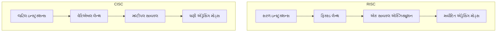
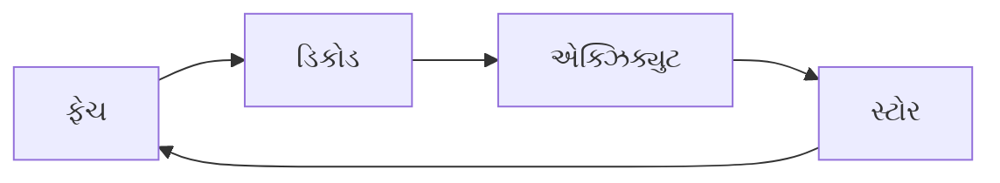
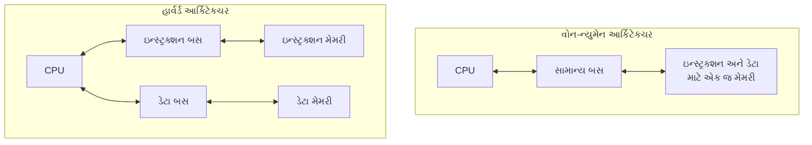
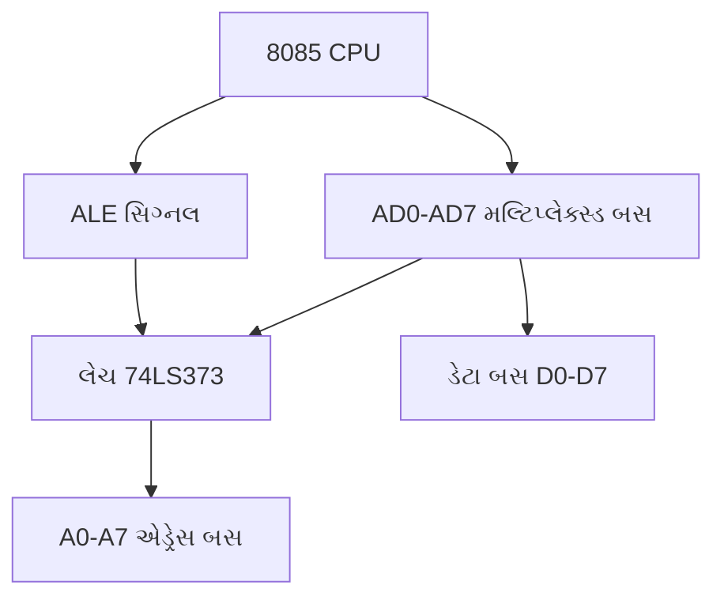
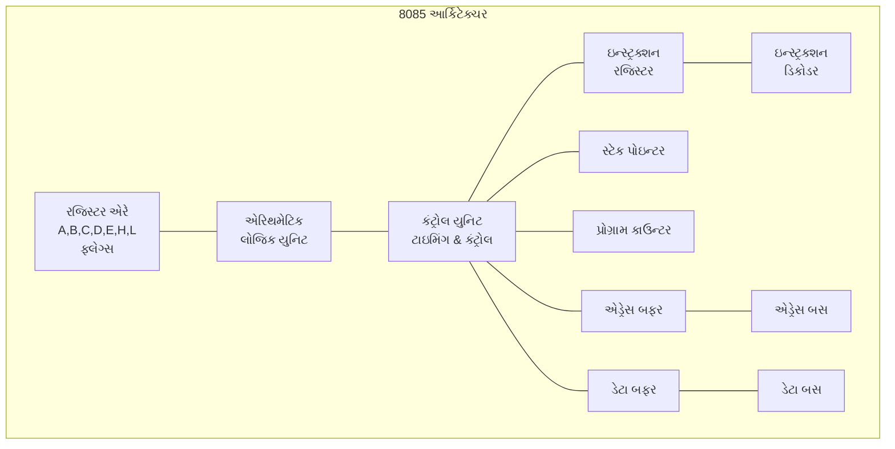
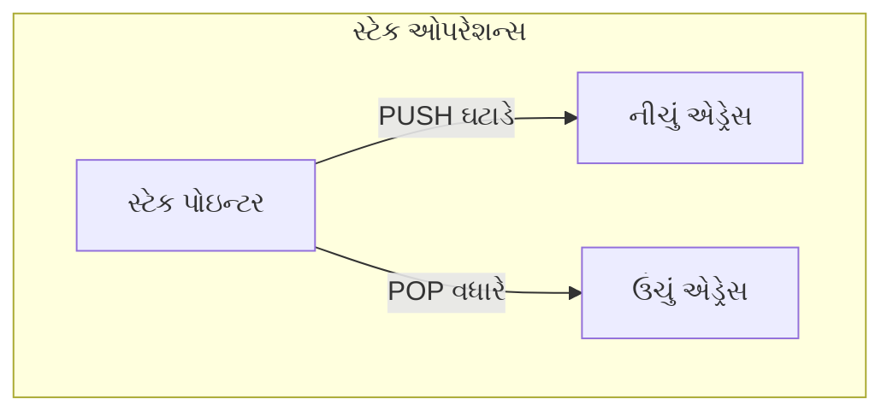
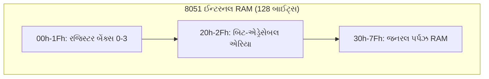
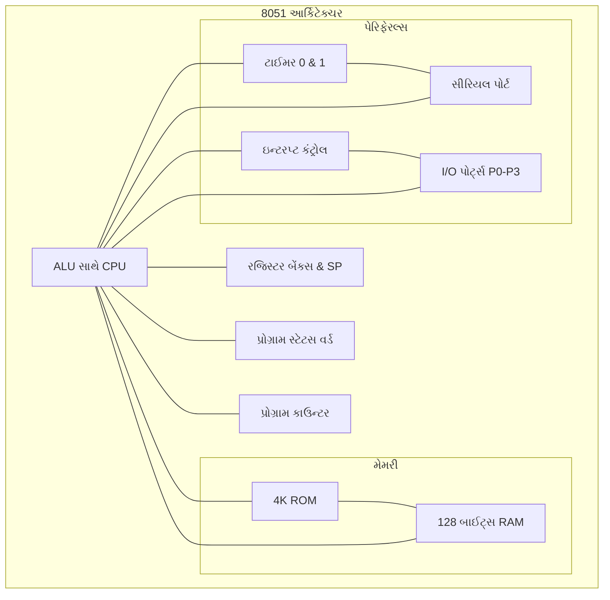

# 4341101 - માઇક્રોપ્રોસેસર અને માઇક્રોકન્ટ્રોલર - Summer 2023 પેપર સોલ્યુશન

## પ્રશ્ન 1(અ): માઇક્રોપ્રોસેસર અને માઇક્રોકન્ટ્રોલરની સરખામણી કરો. (ગુણ: 3)

**જવાબ 1(અ):**

| લક્ષણ | **માઇક્રોપ્રોસેસર** | **માઇક્રોકન્ટ્રોલર** |
|---------|-------------------|---------------------|
| વ્યાખ્યા | સિંગલ ચિપ પર CPU | સિંગલ ચિપ પર સંપૂર્ણ કમ્પ્યુટર |
| મેમરી | બાહ્ય RAM/ROM જરૂરી | અંદર જ RAM/ROM |
| I/O પોર્ટ્સ | બાહ્ય ચિપ્સ જોઈએ | ચિપમાં જ સમાવિષ્ટ |
| ઉદાહરણ | Intel 8085, 8086 | 8051, PIC, AVR |

**યાદ રાખવાની ટ્રિક:** "માઇક્રોપ્રોસેસર-બાહ્ય, માઇક્રોકન્ટ્રોલર-અંદર"

## પ્રશ્ન 1(બ): RISC અને CISC ની સરખામણી કરો. (ગુણ: 4)

**જવાબ 1(બ):**

| લક્ષણ | **RISC** | **CISC** |
|---------|----------|----------|
| પૂર્ણ નામ | Reduced Instruction Set Computer | Complex Instruction Set Computer |
| ઇન્સ્ટ્રક્શન્સ | **સરળ** & **ફિક્સ્ડ લેન્થ** | **જટિલ** & **વેરિએબલ લેન્થ** |
| એક્ઝિક્યુશન | દરેક ઇન્સ્ટ્રક્શન માટે એક સાયકલ | દરેક ઇન્સ્ટ્રક્શન માટે મલ્ટીપલ સાયકલ |
| મેમરી એક્સેસ | ફક્ત load/store દ્વારા | ઘણી એડ્રેસિંગ મોડ્સ |
| ઉદાહરણ | ARM, MIPS | x86, 8086 |



**યાદ રાખવાની ટ્રિક:** "RISC: સરળ, ફિક્સ્ડ, એક સાયકલ"

## પ્રશ્ન 1(ક): વ્યાખ્યાયિત કરો: માઇક્રોપ્રોસેસર, ઓપરેન્ડ, ઈન્સ્ટ્રક્શન સાયકલ, ઓપકોડ, ALU, મશીન સાયકલ, ટી-સ્ટેટ (ગુણ: 7)

**જવાબ 1(ક):**

- **માઇક્રોપ્રોસેસર**: સિંગલ ઇન્ટીગ્રેટેડ સર્કિટ ચિપ પર CPU જે ગણિત/લોજિક ઓપરેશન કરે છે
  
- **ઓપરેન્ડ**: ડેટા વેલ્યુ અથવા મેમરી એડ્રેસ જેના પર ઇન્સ્ટ્રક્શન કામ કરે છે

- **ઈન્સ્ટ્રક્શન સાયકલ**: ઇન્સ્ટ્રક્શન ફેચ, ડિકોડ અને એક્ઝિક્યુટ કરવાની સંપૂર્ણ પ્રક્રિયા
  


- **ઓપકોડ**: ઇન્સ્ટ્રક્શનનો એ ભાગ જે ઓપરેશનની સ્પષ્ટતા કરે છે

- **ALU**: એરિથમેટિક લોજિક યુનિટ જે ગાણિતિક અને તાર્કિક ઓપરેશન કરે છે

- **મશીન સાયકલ**: મેમરી, I/O એક્સેસ કરવા અથવા ઇન્ટરપ્ટને સ્વીકારવા માટેનો સમય

- **ટી-સ્ટેટ**: માઇક્રોપ્રોસેસર ઓપરેશનમાં બેઝિક ટાઇમિંગ યુનિટ, એક ક્લોક પીરિયડ

**યાદ રાખવાની ટ્રિક:** "મારા ઓપરેશન ઇનપુટ આઉટપુટ અને મશીન ટાઇમ" (MOIOAMT)

## પ્રશ્ન 1(ક OR): વોન-ન્યુમેન અને હાર્વર્ડ આર્કિટેક્ચરની તુલના કરો. (ગુણ: 7)

**જવાબ 1(ક OR):**

| લક્ષણ | **વોન-ન્યુમેન આર્કિટેક્ચર** | **હાર્વર્ડ આર્કિટેક્ચર** |
|---------|------------------------------|--------------------------|
| મેમરી | પ્રોગ્રામ અને ડેટા માટે **એક જ મેમરી** | પ્રોગ્રામ અને ડેટા માટે **અલગ મેમરી** |
| બસ | એક સામાન્ય બસ | અલગ ડેટા અને ઇન્સ્ટ્રક્શન બસ |
| એક્સેસ | સિક્વેન્શિયલ એક્સેસ | ડેટા અને ઇન્સ્ટ્રક્શન્સને એક સાથે એક્સેસ |
| સ્પીડ | બોટલનેક ને કારણે ધીમું | પેરેલલ એક્સેસને કારણે ઝડપી |
| ફ્લેક્સિબિલિટી | વધુ ફ્લેક્સિબલ | ઓછું ફ્લેક્સિબલ |
| એપ્લિકેશન્સ | જનરલ પર્પઝ કમ્પ્યુટિંગ | DSP, માઇક્રોકન્ટ્રોલર |



**યાદ રાખવાની ટ્રિક:** "વોન-એક-એક" (વોન-ન્યુમેન: એક મેમરી, એક પછી એક એક્સેસ)

## પ્રશ્ન 2(અ): 8085 માઇક્રોપ્રોસેસરનું ફ્લેગ રજીસ્ટર દોરો અને તેને સમજાવો. (ગુણ: 3)

**જવાબ 2(અ):**

```
D7  D6  D5  D4  D3  D2  D1  D0
S   Z   0   AC  0   P   1   CY
```

- **S (સાઇન ફ્લેગ)**: જો પરિણામ **નેગેટિવ** (MSB=1) હોય તો સેટ થાય
- **Z (ઝીરો ફ્લેગ)**: જો પરિણામ **શૂન્ય** હોય તો સેટ થાય
- **AC (ઓક્ઝિલરી કેરી)**: બિટ 3 થી બિટ 4 માં કેરી જાય તો સેટ થાય
- **P (પેરિટી ફ્લેગ)**: જો પરિણામમાં **ઇવન પેરિટી** હોય તો સેટ થાય
- **CY (કેરી ફ્લેગ)**: જો પરિણામમાં **કેરી** જનરેટ થાય તો સેટ થાય

**યાદ રાખવાની ટ્રિક:** "સાઇન ઝીરો એસી પેરિટી કેરી" (બિન-ઝીરો બિટ્સ માટે)

## પ્રશ્ન 2(બ): 8085 માઇક્રોપ્રોસેસર માટે એડ્રેસ અને ડેટાબસોનું ડી-મલ્ટીપ્લેક્સીંગ સમજાવો. (ગુણ: 4)

**જવાબ 2(બ):**

8085 માઇક્રોપ્રોસેસરમાં પિન્સ બચાવવા માટે AD₀-AD₇ પિન્સ **મલ્ટિપ્લેક્સ્ડ** છે. ડી-મલ્ટિપ્લેક્સિંગ એટલે આ ડેટાને અલગ કરવાની પ્રક્રિયા.



**પ્રક્રિયા:**

- **ALE** (એડ્રેસ લેચ એનેબલ) **હાઈ** થાય → AD₀-AD₇ પર લોઅર એડ્રેસ (A₀-A₇) દેખાય
- જ્યારે ALE હાઈ હોય ત્યારે 74LS373 **લેચ** એડ્રેસ પકડે છે
- ALE **લો** થાય → AD₀-AD₇ ડેટા કેરી કરે
- ડેટાની અવર-જવર દરમિયાન એડ્રેસ **લેચ્ડ** રહે છે

**યાદ રાખવાની ટ્રિક:** "ALE હાઈ: એડ્રેસ, ALE લો: ડેટા"

## પ્રશ્ન 2(ક): આકૃતિની મદદથી 8085 માઇક્રોપ્રોસેસરના આર્કિટેક્ચરનું વર્ણન કરો. (ગુણ: 7)

**જવાબ 2(ક):**



**મુખ્ય ઘટકો:**

- **ALU**: **ગાણિતિક** અને **તાર્કિક** ઓપરેશન કરે છે
- **રજિસ્ટર્સ**: અસ્થાયી **ડેટા સ્ટોરેજ** (A,B,C,D,E,H,L,ફ્લેગ્સ)
- **કંટ્રોલ યુનિટ**: **ટાઇમિંગ** અને **કંટ્રોલ** સિગ્નલ જનરેટ કરે છે
- **પ્રોગ્રામ કાઉન્ટર**: આગલા ઇન્સ્ટ્રક્શનનું **એડ્રેસ** ધરાવે છે
- **સ્ટેક પોઇન્ટર**: મેમરીમાં સ્ટેકના **ટોપ** તરફ પોઇન્ટ કરે છે
- **ઇન્સ્ટ્રક્શન રજિસ્ટર**: વર્તમાન **ઇન્સ્ટ્રક્શન** ધરાવે છે
- **એડ્રેસ & ડેટા બફર**: બાહ્ય **બસ** સાથે ઇન્ટરફેસ કરે છે

**યાદ રાખવાની ટ્રિક:** "ARCS-PID" (ALU, રજિસ્ટર્સ, કંટ્રોલ, સ્ટેક-PC, ઇન્સ્ટ્રક્શન, ડિકોડર)

## પ્રશ્ન 2(અ OR): 8085 માઇક્રોપ્રોસેસરનું બસ ઓર્ગેનાઈઝેશન સમજાવો. (ગુણ: 3)

**જવાબ 2(અ OR):**

8085 માઇક્રોપ્રોસેસરમાં કમ્યુનિકેશન માટે **ત્રણ બસ** છે:

1. **એડ્રેસ બસ** (16 બિટ્સ):
   - **યુનિડિરેક્શનલ** (CPU થી પેરિફેરલ્સ)
   - **16-બિટ એડ્રેસ** (A₀-A₁₅) વહન કરે છે
   - **64KB** મેમરી એડ્રેસ કરી શકે (2¹⁶)

2. **ડેટા બસ** (8 બિટ્સ):
   - **બાઇડિરેક્શનલ** (CPU ↔ પેરિફેરલ્સ)
   - **8-બિટ ડેટા** (D₀-D₇) ટ્રાન્સફર કરે છે
   - લોઅર એડ્રેસ બિટ્સ (A₀-A₇) ડેટા સાથે મલ્ટિપ્લેક્સ્ડ છે

3. **કંટ્રોલ બસ**:
   - **RD̅**, **WR̅**: મેમરી/IO રીડ/રાઇટ સિગ્નલ્સ
   - **ALE**: એડ્રેસ લેચ એનેબલ
   - **IO/M̅**: I/O અથવા મેમરી ઓપરેશન વચ્ચે તફાવત દર્શાવે

**યાદ રાખવાની ટ્રિક:** "ADC" (એડ્રેસ, ડેટા, કંટ્રોલ)

## પ્રશ્ન 2(બ OR): સમજાવો: પ્રોગ્રામ કાઉન્ટર અને સ્ટેક પોઇન્ટર (ગુણ: 4)

**જવાબ 2(બ OR):**

### પ્રોગ્રામ કાઉન્ટર (PC):

- આગલા ઇન્સ્ટ્રક્શનનું **મેમરી એડ્રેસ** ધરાવતું **16-બિટ** રજિસ્ટર
- ઇન્સ્ટ્રક્શન ફેચ કર્યા પછી **આપોઆપ વધે** છે
- પ્રોગ્રામના **સિક્વન્સ કંટ્રોલ**માં વપરાય છે
- **જમ્પ** ઇન્સ્ટ્રક્શન દ્વારા તેમાં ફેરફાર થઈ શકે છે
- પ્રોસેસર રીસેટ થાય ત્યારે 0000H થી **શરૂ** થાય છે

### સ્ટેક પોઇન્ટર (SP):

- સ્ટેકના **ટોપ** તરફ પોઇન્ટ કરતું **16-બિટ** રજિસ્ટર
- સ્ટેક એ **LIFO** (લાસ્ટ ઇન ફર્સ્ટ આઉટ) મેમરી એરિયા છે
- **સબરૂટિન્સ** (CALL/RET) અને **ઇન્ટરપ્ટ્સ**માં વપરાય છે
- PUSH પહેલાં SP **ઘટે** છે, POP પછી **વધે** છે
- સ્ટેક ઓપરેશન્સ વાપરતા પહેલાં તેને **ઇનિશિયલાઇઝ** કરવું જરૂરી છે

**યાદ રાખવાની ટ્રિક:** "PC-આગળ, SP-ટોપ" (PC આગલા ઇન્સ્ટ્રક્શન તરફ, SP સ્ટેકના ટોપ તરફ પોઇન્ટ કરે છે)

## પ્રશ્ન 2(ક OR): આકૃતિની મદદથી 8085 માઇક્રોપ્રોસેસરના પિન ડાયાગ્રામનું વર્ણન કરો. (ગુણ: 7)

**જવાબ 2(ક OR):**

```
            _____________
           |             |
X1, X2 --->|             |---> SID
RESET IN -->|             |---> SOD
RESET OUT <--|             |<--- HOLD
READY ----->|             |---> HLDA
CLKOUT <----|    8085     |
           |             |<--- INTR
IO/M <-----|             |<--- RST 7.5
S0, S1 <----|             |<--- RST 6.5
ALE <-------|             |<--- RST 5.5
           |             |<--- TRAP
WR <-------|             |
RD <-------|             |
AD0-AD7 <->|             |<--> A8-A15
VCC, GND -->|_____________|
```

**મહત્વના પિન્સ:**

- **પાવર & ક્લોક**: VCC, GND, X1, X2, CLK
- **મલ્ટિપ્લેક્સ્ડ બસ**: AD₀-AD₇ (એડ્રેસ/ડેટા)
- **એડ્રેસ બસ**: A₈-A₁₅ (હાઈ ઓર્ડર એડ્રેસ)
- **કંટ્રોલ સિગ્નલ્સ**: ALE, RD̅, WR̅, IO/M̅, S₀, S₁
- **ઇન્ટરપ્ટ્સ**: INTR, RST 7.5, RST 6.5, RST 5.5, TRAP
- **DMA**: HOLD, HLDA
- **સીરિયલ I/O**: SID, SOD
- **READY**: મેમરી/IO સિંક્રોનાઇઝેશન

**યાદ રાખવાની ટ્રિક:** "PACES-IR" (પાવર, એડ્રેસ, કંટ્રોલ, એક્સટર્નલ સિંક, સીરિયલ, ઇન્ટરપ્ટ, રીસેટ)

## પ્રશ્ન 3(અ): સ્ટેક, સ્ટેક પોઇન્ટર અને સ્ટેક ઓપરેશન સમજાવો. (ગુણ: 3)

**જવાબ 3(અ):**

### સ્ટેક:

- **LIFO** (લાસ્ટ ઇન ફર્સ્ટ આઉટ) RAM માં મેમરી એરિયા
- **રિટર્ન એડ્રેસ** અને **રજિસ્ટર વેલ્યુ** સ્ટોર કરે છે
- **ઉંચા** થી **નીચા** મેમરી એડ્રેસ તરફ વધે છે

### સ્ટેક પોઇન્ટર (SP):

- સ્ટેકના **ટોપ** એલિમેન્ટ તરફ પોઇન્ટ કરતું **16-બિટ** રજિસ્ટર
- PUSH પહેલાં **ઘટે** છે, POP પછી **વધે** છે

### સ્ટેક ઓપરેશન્સ:

1. **PUSH Rp**: (SP-1) ← Rh, (SP-2) ← Rl, SP ← SP-2
   * રજિસ્ટર પેર સ્ટેક પર સેવ કરે છે
2. **POP Rp**: Rl ← (SP), Rh ← (SP+1), SP ← SP+2
   * સ્ટેક પરથી રજિસ્ટર પેર મેળવે છે



**યાદ રાખવાની ટ્રિક:** "LIFO-ઊથન" (LIFO, ઉંચાથી નીચે ગતિ)

## પ્રશ્ન 3(બ): 8051 માઇક્રોકન્ટ્રોલરનો ટાઈમર્સ/કાઉન્ટર્સનો લોજિક ડાયાગ્રામ દોરો અને તેને સમજાવો. (ગુણ: 4)

**જવાબ 3(બ):**

```
                  ┌──────────┐    ┌─────┐
                  │   TMOD   │    │ TCON│
                  └──────────┘    └─────┘
                       │            │
                       ▼            ▼
           ┌───────┐       ┌───────────────┐
T0 Pin ───>│કંટ્રોલ │─ ─ ─ >│   ટાઈમર 0     │─ ─>TF0
           │ લોજિક │       │ TH0    TL0    │
           └───────┘       └───────────────┘
                  
           ┌───────┐       ┌───────────────┐
T1 Pin ───>│કંટ્રોલ │─ ─ ─ >│   ટાઈમર 1     │─ ─>TF1
           │ લોજિક │       │ TH1    TL1    │
           └───────┘       └───────────────┘
```

**8051માં બે 16-બિટ ટાઈમર/કાઉન્ટર છે:**

- **ટાઈમર/કાઉન્ટર રજિસ્ટર્સ**:
  * **ટાઈમર 0**: TH0 (હાઈ બાઈટ) + TL0 (લો બાઈટ)
  * **ટાઈમર 1**: TH1 (હાઈ બાઈટ) + TL1 (લો બાઈટ)

- **કંટ્રોલ રજિસ્ટર્સ**:
  * **TMOD**: ટાઈમર **મોડ** રજિસ્ટર (મોડ પસંદગી)
  * **TCON**: ટાઈમર **કંટ્રોલ** રજિસ્ટર (ચાલુ/બંધ)

- **ઓપરેશનના મોડ્સ**:
  * **મોડ 0**: 13-બિટ ટાઈમર
  * **મોડ 1**: 16-બિટ ટાઈમર
  * **મોડ 2**: 8-બિટ ઓટો-રિલોડ
  * **મોડ 3**: સ્પ્લિટ ટાઈમર મોડ

**યાદ રાખવાની ટ્રિક:** "TMOD-13-16-8-S" (TMOD સેટ કરે: 13-બિટ, 16-બિટ, 8-બિટ-ઓટો, સ્પ્લિટ મોડ્સ)

## પ્રશ્ન 3(ક): આકૃતિની મદદથી 8051 માઇક્રોકન્ટ્રોલરનો પિન ડાયાગ્રામ સમજાવો. (ગુણ: 7)

**જવાબ 3(ક):**

```
                  8051
         ┌─────────────────────┐
         │ 1             40    │
P1.0 ◄──►│                     │◄──► VCC
P1.1 ◄──►│                     │◄──► P0.0/AD0
P1.2 ◄──►│                     │◄──► P0.1/AD1
P1.3 ◄──►│                     │◄──► P0.2/AD2
P1.4 ◄──►│                     │◄──► P0.3/AD3
P1.5 ◄──►│                     │◄──► P0.4/AD4
P1.6 ◄──►│                     │◄──► P0.5/AD5
P1.7 ◄──►│                     │◄──► P0.6/AD6
RST ───►│                     │◄──► P0.7/AD7
RXD ◄───│                     │◄─── EA/VPP
TXD ───►│                     │◄─── ALE/PROG
INT0 ───►│                     │◄─── PSEN
INT1 ───►│                     │◄──► P2.7/A15
T0 ────►│                     │◄──► P2.6/A14
T1 ────►│                     │◄──► P2.5/A13
WR ────►│                     │◄──► P2.4/A12
RD ────►│                     │◄──► P2.3/A11
XTAL2 ◄──│                     │◄──► P2.2/A10
XTAL1 ──►│                     │◄──► P2.1/A9
GND ────│                     │◄──► P2.0/A8
         └─────────────────────┘
```

**પિન ફંક્શન્સ:**

1. **પાવર & ક્લોક પિન્સ**:
   - **VCC** (પિન 40): +5V સપ્લાય
   - **GND** (પિન 20): ગ્રાઉન્ડ
   - **XTAL1, XTAL2** (પિન 19, 18): ક્રિસ્ટલ ઓસિલેટર કનેક્શન

2. **I/O પોર્ટ્સ**:
   - **પોર્ટ 0** (પિન 32-39): ડ્યુઅલ-પર્પઝ (એડ્રેસ/ડેટા બસ, I/O)
   - **પોર્ટ 1** (પિન 1-8): જનરલ-પર્પઝ I/O
   - **પોર્ટ 2** (પિન 21-28): ડ્યુઅલ-પર્પઝ (હાઈ એડ્રેસ બાઈટ, I/O)
   - **પોર્ટ 3** (પિન 10-17): સ્પેશિયલ ફંક્શન્સ (ઇન્ટરપ્ટ, ટાઈમર, સીરિયલ)

3. **કંટ્રોલ પિન્સ**:
   - **RST** (પિન 9): રીસેટ ઇનપુટ
   - **EA** (પિન 31): એક્સટર્નલ એક્સેસ એનેબલ
   - **ALE** (પિન 30): એડ્રેસ લેચ એનેબલ
   - **PSEN** (પિન 29): પ્રોગ્રામ સ્ટોર એનેબલ

**યાદ રાખવાની ટ્રિક:** "PIPER" (પાવર, I/O પોર્ટ્સ, પ્રોગ્રામ કંટ્રોલ, એક્સટર્નલ એક્સેસ, રીસેટ)

## પ્રશ્ન 3(અ OR): 8051 માઇક્રોકન્ટ્રોલર માટે સીરીયલ કોમ્યુનિકેશન મોડ્સ સમજાવો. (ગુણ: 3)

**જવાબ 3(અ OR):**

8051માં એક ઓન-ચિપ UART સાથે 4 સીરિયલ કોમ્યુનિકેશન મોડ છે:

1. **મોડ 0**: 
   - **શિફ્ટ રજિસ્ટર** મોડ
   - **સિંક્રોનસ** ટ્રાન્સમિશન
   - **બોડ રેટ** f<sub>osc</sub>/12 પર ફિક્સ્ડ
   - 8-બિટ ડેટા TXD થ્રુ ટ્રાન્સમિટ થાય
   - ક્લોક પલ્સ RXD પર

2. **મોડ 1**:
   - **સ્ટાન્ડર્ડ UART** મોડ 
   - **એસિંક્રોનસ** ટ્રાન્સમિશન
   - 8-બિટ ડેટા, 1 સ્ટાર્ટ બિટ, 1 સ્ટોપ બિટ
   - **બોડ રેટ** વેરિયેબલ (ટાઈમર 1 દ્વારા કંટ્રોલ)

3. **મોડ 2**:
   - **9-બિટ UART** મોડ
   - **એસિંક્રોનસ** ટ્રાન્સમિશન
   - 9-બિટ ડેટા (8 ડેટા + 1 પ્રોગ્રામેબલ)
   - **ફિક્સ્ડ બોડ રેટ** (f<sub>osc</sub>/32 અથવા f<sub>osc</sub>/64)

4. **મોડ 3**:
   - **મોડ 2** જેવો પણ **વેરિયેબલ બોડ રેટ** સાથે
   - ટાઈમર 1 દ્વારા કંટ્રોલ

**યાદ રાખવાની ટ્રિક:** "SSAV" (શિફ્ટ રજિસ્ટર, સ્ટાન્ડર્ડ UART, એડવાન્સ્ડ 9-બિટ, વેરિયેબલ રેટ 9-બિટ)

## પ્રશ્ન 3(બ OR): 8051 માઇક્રોકન્ટ્રોલરનું ઈન્ટરનલ રેમ ઓર્ગેનાઇઝેશન સમજાવો. (ગુણ: 4)

**જવાબ 3(બ OR):**



**8051 ઈન્ટરનલ RAM આ રીતે ઓર્ગેનાઇઝ થયેલ છે:**

1. **રજિસ્ટર બેંક્સ** (00H-1FH):
   - **ચાર** રજિસ્ટર બેંક્સ (0-3)
   - દરેક બેંકમાં **આઠ** રજિસ્ટર (R0-R7)
   - બેંક સિલેક્શન **PSW** રજિસ્ટર દ્વારા
   - **ફાસ્ટ એક્સેસ** વેરિએબલ્સ માટે વપરાય

2. **બિટ-એડ્રેસેબલ એરિયા** (20H-2FH):
   - 16 બાઈટ્સ (128 બિટ્સ) જે બિટ બાય બિટ એડ્રેસ થઈ શકે
   - **બુલિયન** ઓપરેશન્સ અને **ફ્લેગ્સ** માટે વપરાય
   - દરેક બિટને પોતાનું એડ્રેસ (00H-7FH) હોય છે

3. **જનરલ પર્પઝ RAM** (30H-7FH):
   - **યુઝર ડેટા** માટે 80 બાઈટ્સ
   - **ડાયરેક્ટ** અને **ઇનડાયરેક્ટ** એડ્રેસિંગ દ્વારા એક્સેસ
   - **વેરિએબલ્સ** અને **સ્ટેક** માટે વપરાય

**યાદ રાખવાની ટ્રિક:** "RBG" (રજિસ્ટર બેંક્સ, બિટ-એડ્રેસેબલ એરિયા, જનરલ પર્પઝ RAM)

## પ્રશ્ન 3(ક OR): આકૃતિની મદદથી 8051 માઇક્રોકન્ટ્રોલરનું આર્કિટેક્ચર સમજાવો. (ગુણ: 7)

**જવાબ 3(ક OR):**



**મુખ્ય ઘટકો:**

1. **CPU કોર**:
   - **ALU**: ગાણિતિક/તાર્કિક ઓપરેશન કરે છે
   - **એક્યુમ્યુલેટર** (A): ગાણિતિક ઓપરેશન માટે મુખ્ય રજિસ્ટર
   - **B રજિસ્ટર**: ગુણાકાર/ભાગાકાર ઓપરેશન માટે વપરાય
   - **PSW**: સ્ટેટસ ફ્લેગ્સ સ્ટોર કરે (CY, AC, OV, P)

2. **મેમરી**:
   - **4K ROM**: પ્રોગ્રામ મેમરી
   - **128 બાઈટ્સ RAM**: રજિસ્ટર બેંક્સ સાથે ડેટા મેમરી
   - **SFRs**: કંટ્રોલ માટે સ્પેશિયલ ફંક્શન રજિસ્ટર્સ

3. **પેરિફેરલ્સ**:
   - **ટાઈમર/કાઉન્ટર્સ**: બે 16-બિટ ટાઈમર
   - **સીરિયલ પોર્ટ**: ફુલ ડુપ્લેક્સ UART
   - **ઇન્ટરપ્ટ સિસ્ટમ**: 2 પ્રાયોરિટી લેવલ સાથે 5 ઇન્ટરપ્ટ સોર્સ
   - **I/O પોર્ટ્સ**: ચાર 8-બિટ બાઇડિરેક્શનલ પોર્ટ્સ (P0-P3)

**યાદ રાખવાની ટ્રિક:** "CPU-MIS" (CPU, મેમરી, I/O, સ્પેશિયલ પેરિફેરલ્સ)

## પ્રશ્ન 4(અ): રજિસ્ટર R5 અને R6 ના લોઅર નિબલને બદલવા માટે 8051 એસેમ્બલી લેંગ્વેજ પ્રોગ્રામ લખો. (ગુણ: 3)

**જવાબ 4(અ):**

```assembly
; R5 અને R6 ના લોઅર નિબલ એક્સચેન્જ કરવાનો પ્રોગ્રામ
        MOV     A, R5      ; R5 ને એક્યુમ્યુલેટરમાં કોપી કરો
        ANL     A, #0FH    ; અપર નિબલ માસ્ક કરો (ફક્ત લોઅર નિબલ રાખો)
        MOV     B, A       ; R5 નો લોઅર નિબલ B માં રાખો
        
        MOV     A, R6      ; R6 ને એક્યુમ્યુલેટરમાં કોપી કરો
        ANL     A, #0FH    ; અપર નિબલ માસ્ક કરો (ફક્ત લોઅર નિબલ રાખો)
        MOV     C, A       ; R6 નો લોઅર નિબલ અસ્થાયી રૂપે R7 માં રાખો
        
        MOV     A, R5      ; R5 ફરીથી મેળવો
        ANL     A, #F0H    ; R5 નો ફક્ત અપર નિબલ રાખો
        ORL     A, C       ; R6 ના લોઅર નિબલ સાથે જોડો
        MOV     R5, A      ; R5 માં પાછું સ્ટોર કરો
        
        MOV     A, R6      ; R6 ફરીથી મેળવો
        ANL     A, #F0H    ; R6 નો ફક્ત અપર નિબલ રાખો
        ORL     A, B       ; R5 ના લોઅર નિબલ સાથે જોડો
        MOV     R6, A      ; R6 માં પાછું સ્ટોર કરો
        
        END
```

**મુખ્ય સ્ટેપ્સ:**

1. લોઅર નિબલ્સ **એક્સટ્રેક્ટ** કરો
2. તેમને અસ્થાયી રૂપે **સ્ટોર** કરો
3. અપર નિબલ્સ **જાળવી** રાખો
4. અપર + સ્વેપ કરેલા લોઅર નિબલ્સ **જોડો**

## પ્રશ્ન 4(બ): પોર્ટ P1.0 પર ઇન્ટરફેસ કરેલ LED ને 1ms ના સમય અંતરાલ પર બ્લિંક કરવા માટે 8051 એસેમ્બલી લેંગ્વેજ પ્રોગ્રામ લખો. (ગુણ: 4)

**જવાબ 4(બ):**

```assembly
; P1.0 પર LED ને 1ms ડિલે સાથે બ્લિંક કરવાનો પ્રોગ્રામ
        ORG     0000H
MAIN:   SETB    P1.0        ; LED ચાલુ કરો
        ACALL   DELAY_1MS   ; 1ms ડિલેને કોલ કરો
        CLR     P1.0        ; LED બંધ કરો
        ACALL   DELAY_1MS   ; 1ms ડિલેને કોલ કરો
        SJMP    MAIN        ; હંમેશાં રિપીટ કરો

; 1ms ડિલે સબરૂટિન (12MHz ક્રિસ્ટલ માટે)
DELAY_1MS:
        MOV     R7, #250    ; R7 = 250 (આઉટર લૂપ)
AGAIN:  MOV     R6, #4      ; R6 = 4 (ઇનર લૂપ)
HERE:   DJNZ    R6, HERE    ; R6 ઝીરો ન થાય ત્યાં સુધી ઘટાડો
        DJNZ    R7, AGAIN   ; R7 ઝીરો ન થાય ત્યાં સુધી ઘટાડો
        RET                 ; સબરૂટિનમાંથી પાછા ફરો
        
        END
```

**મુખ્ય ઘટકો:**

- **મેઇન લૂપ**: LED ટૉગલ કરો અને ડિલે કોલ કરો
- **ડિલે રૂટિન**: ટાઇમિંગ માટે નેસ્ટેડ લૂપ
- **ક્રિસ્ટલ**: 12MHz ધારેલ છે
- **LED કનેક્શન**: P1.0 પર એક્ટિવ હાઈ

## પ્રશ્ન 4(ક): 8051 માઇક્રોકન્ટ્રોલરના એડ્રેસિંગ મોડ્સની યાદી બનાવો અને ઓછામાં ઓછા એક ઉદાહરણ સાથે તેમને સમજાવો. (ગુણ: 7)

**જવાબ 4(ક):**

8051 માઇક્રોકન્ટ્રોલરમાં 7 એડ્રેસિંગ મોડ્સ છે:

1. **ઇમીડિયેટ એડ્રેસિંગ**:
   - ઓપરેન્ડ ઇન્સ્ટ્રક્શનમાં જ હોય
   - ઉદાહરણ: `MOV A, #25H` (25H ને A માં લોડ કરો)

2. **રજિસ્ટર એડ્રેસિંગ**:
   - ઓપરેન્ડ રજિસ્ટરમાં હોય
   - ઉદાહરણ: `MOV A, R0` (R0 ને A માં કોપી કરો)

3. **ડાયરેક્ટ એડ્રેસિંગ**:
   - ઓપરેન્ડ આપેલા મેમરી એડ્રેસ પર હોય
   - ઉદાહરણ: `MOV A, 30H` (મેમરી 30H ની કન્ટેન્ટ્સ A માં કોપી કરો)

4. **રજિસ્ટર ઇનડાયરેક્ટ એડ્રેસિંગ**:
   - રજિસ્ટરમાં ઓપરેન્ડનું એડ્રેસ હોય
   - ઉદાહરણ: `MOV A, @R0` (R0 એ દર્શાવેલ મેમરી લોકેશનની કન્ટેન્ટ્સ A માં કોપી કરો)

5. **ઇન્ડેક્સ્ડ એડ્રેસિંગ**:
   - બેઝ એડ્રેસ + ઇન્ડેક્સ રજિસ્ટર
   - ઉદાહરણ: `MOVC A, @A+DPTR` (ટેબલ લુકઅપ માટે)

6. **ઇમ્પ્લિસિટ એડ્રેસિંગ**:
   - ઓપરેન્ડ ઇમ્પ્લિસિટલી સ્ટેટેડ હોય
   - ઉદાહરણ: `RRC A` (A ને રાઇટ થ્રુ કેરી રોટેટ કરો)

7. **બિટ એડ્રેસિંગ**:
   - વ્યક્તિગત બિટ ઓપરેશન્સ
   - ઉદાહરણ: `SETB P1.0` (પોર્ટ 1 ના બિટ 0 ને સેટ કરો)

**યાદ રાખવાની ટ્રિક:** "I-R-DIR-I-B" (ઇમીડિયેટ, રજિસ્ટર, ડાયરેક્ટ, ઇનડાયરેક્ટ, ઇન્ડેક્સ્ડ, બિટ)

## પ્રશ્ન 4(અ OR): રજિસ્ટર R2 અને R3 નાં બાઈટ નો સરવાળો કરવા માટે 8051 એસેમ્બલી લેંગ્વેજ પ્રોગ્રામ લખો, પરિણામ બાહ્ય RAM માં2040h (LSB) અને 2041h (MSB) મૂકો. (ગુણ: 3)

**જવાબ 4(અ OR):**

```assembly
; R2 અને R3 ના સરવાળાને એક્સટર્નલ RAM 2040H (LSB), 2041H (MSB) માં સ્ટોર કરવાનો પ્રોગ્રામ
        ORG     0000H
        
        MOV     A, R2      ; R2 ને એક્યુમ્યુલેટરમાં કોપી કરો
        ADD     A, R3      ; એક્યુમ્યુલેટરમાં R3 ઉમેરો
        
        MOV     DPTR, #2040H  ; DPTR ને ડેસ્ટિનેશન એડ્રેસ પર સેટ કરો
        MOVX    @DPTR, A      ; LSB (એક્યુમ્યુલેટર) 2040H માં સ્ટોર કરો
        
        MOV     A, #00H    ; એક્યુમ્યુલેટર ક્લિયર કરો
        ADDC    A, #00H    ; એક્યુમ્યુલેટરમાં કેરી ફ્લેગ ઉમેરો
        INC     DPTR       ; DPTR ને 2041H માટે ઇન્ક્રિમેન્ટ કરો
        MOVX    @DPTR, A   ; MSB (કેરી) 2041H માં સ્ટોર કરો
        
        END
```

**મુખ્ય સ્ટેપ્સ:**

1. R2 અને R3 નો એક્યુમ્યુલેટરમાં **સરવાળો** કરો
2. પરિણામ બાઈટ 2040H માં **સ્ટોર** કરો
3. કેરી ફ્લેગને A માં **કેપ્ચર** કરો
4. કેરી બાઈટ 2041H માં **સ્ટોર** કરો

## પ્રશ્ન 4(બ OR): 12 MHz ની ક્રિસ્ટલ ફ્રિકવન્સી સાથે 8051 માઇક્રોકન્ટ્રોલર માટે, 5ms નો ડીલેય જનરેટ કરો. (ગુણ: 4)

**જવાબ 4(બ OR):**

```assembly
; 12MHz ક્રિસ્ટલ સાથે 8051 માટે 5ms ડિલે રૂટિન
        ORG     0000H
DELAY_5MS:
        MOV     R7, #5     ; આઉટર લૂપ 5 ઇટરેશન માટે સેટ કરો (5 x 1ms)
OUTER:  MOV     R6, #250   ; મિડલ લૂપ (250 ઇટરેશન) સેટ કરો
MIDDLE: MOV     R5, #4     ; ઇનર લૂપ (4 ઇટરેશન) સેટ કરો
INNER:  DJNZ    R5, INNER  ; 2 સાયકલ x 4 = 8 સાયકલ
        DJNZ    R6, MIDDLE ; 2 સાયકલ x 250 = 500 સાયકલ
        DJNZ    R7, OUTER  ; 5 મિલિસેકન્ડ કાઉન્ટ કરો
        RET
        
        END
```

**કેલ્ક્યુલેશન:**

- 12MHz ક્રિસ્ટલ → 1μs = 12 ક્લોક સાયકલ
- મશીન સાયકલ = 12 ક્લોક સાયકલ
- 1ms = 1000μs = 1000 મશીન સાયકલ
- 1ms માટે: 1000 સાયકલ જોઈએ
- નેસ્ટેડ લૂપ એપ્રોચ: 2(DJNZ) × 4 × 250 × 5 = 10,000 સાયકલ
- 10,000 ÷ 1000 = લગભગ 5ms

**નોંધ:** એકદમ ચોક્કસ ટાઇમિંગ અન્ય ઇન્સ્ટ્રક્શન્સ અને લૂપ ઓવરહેડ પર નિર્ભર છે.

## પ્રશ્ન 4(ક OR): 8051 માઇક્રોકન્ટ્રોલર માટે કોઈપણ સાત એરિથમેટિક ઈન્સ્ટ્રક્શન ઉદાહરણ સાથે સમજાવો. (ગુણ: 7)

**જવાબ 4(ક OR):**

1. **ADD A, src**
   - **ફંક્શન**: એક્યુમ્યુલેટરમાં સોર્સ ઉમેરો
   - **ઉદાહરણ**: `ADD A, #30H` (A = A + 30H)
   - **ફ્લેગ્સ**: C, AC, OV, P

2. **ADDC A, src**
   - **ફંક્શન**: એક્યુમ્યુલેટરમાં સોર્સ અને કેરી ઉમેરો
   - **ઉદાહરણ**: `ADDC A, R0` (A = A + R0 + C)
   - **ફ્લેગ્સ**: C, AC, OV, P

3. **SUBB A, src**
   - **ફંક્શન**: એક્યુમ્યુલેટરમાંથી સોર્સ અને બોરો બાદ કરો
   - **ઉદાહરણ**: `SUBB A, 50H` (A = A - 50H - C)
   - **ફ્લેગ્સ**: C, AC, OV, P

4. **INC src**
   - **ફંક્શન**: સોર્સમાં 1 વધારો
   - **ઉદાહરણ**: `INC R3` (R3 = R3 + 1)
   - **ફ્લેગ્સ**: કોઈ નહીં

5. **DEC src**
   - **ફંક્શન**: સોર્સમાંથી 1 ઘટાડો
   - **ઉદાહરણ**: `DEC A` (A = A - 1)
   - **ફ્લેગ્સ**: કોઈ નહીં

6. **MUL AB**
   - **ફંક્શન**: A અને B નો ગુણાકાર, પરિણામ BA માં (B=MSB, A=LSB)
   - **ઉદાહરણ**: `MUL AB` (BA = A × B)
   - **ફ્લેગ્સ**: C, OV

7. **DIV AB**
   - **ફંક્શન**: A ને B વડે ભાગો, ભાગફળ A માં, શેષ B માં
   - **ઉદાહરણ**: `DIV AB` (A = A ÷ B, B = A % B)
   - **ફ્લેગ્સ**: C, OV

**યાદ રાખવાની ટ્રિક:** "AASI-DMD" (Add, Add-with-Carry, Subtract-with-Borrow, Increment, Decrement, Multiply, Divide)

## પ્રશ્ન 5(અ): વિવિધ ક્ષેત્રોમાં માઇક્રોકન્ટ્રોલરની એપ્લિકેશનોની સૂચિ બનાવો. (ગુણ: 3)

**જવાબ 5(અ):**

**વિવિધ ક્ષેત્રોમાં માઇક્રોકન્ટ્રોલરની એપ્લિકેશન્સ:**

1. **કન્ઝ્યુમર ઇલેક્ટ્રોનિક્સ**:
   - સ્માર્ટ ટીવી, વોશિંગ મશીન, માઇક્રોવેવ ઓવન
   - રિમોટ કંટ્રોલ્સ, ડિજિટલ કેમેરા

2. **ઓટોમોટિવ**:
   - એન્જિન કંટ્રોલ યુનિટ્સ (ECU)
   - એન્ટી-લોક બ્રેકિંગ સિસ્ટમ્સ (ABS)
   - એરબેગ કંટ્રોલ, ડેશબોર્ડ ઇન્સ્ટ્રુમેન્ટ્સ

3. **ઇન્ડસ્ટ્રિયલ ઓટોમેશન**:
   - PLCs, ટેમ્પરેચર કંટ્રોલર્સ
   - મોટર કંટ્રોલ્સ, રોબોટિક સિસ્ટમ્સ

4. **મેડિકલ ડિવાઇસિસ**:
   - પેશન્ટ મોનિટરિંગ સિસ્ટમ્સ
   - ડિજિટલ થર્મોમીટર, ગ્લુકોઝ મીટર

5. **સ્માર્ટ હોમ**:
   - હોમ ઓટોમેશન સિસ્ટમ્સ
   - સિક્યુરિટી સિસ્ટમ્સ, સ્માર્ટ એપ્લાયન્સિસ

**યાદ રાખવાની ટ્રિક:** "CAIMS" (Consumer, Automotive, Industrial, Medical, Smart home)

## પ્રશ્ન 5(બ): 8051 માઇક્રોકન્ટ્રોલર સાથે રિલે ઇન્ટરફેસ કરો. (ગુણ: 4)

**જવાબ 5(બ):**

```
                 VCC
                  │
                  ▼
                ┌───┐
                │   │
P2.0 ────►|────┤ULN│     ┌─────┐   AC/DC લોડ
          1N4148│2003├────┤રિલે ├───/\/\/\/\───
                │   │     └─────┘
                └───┘         │
                  │           │
                  ▼           ▼
                 GND         GND
```

**જરૂરી કોમ્પોનન્ટ્સ:**

- **ULN2003** અથવા **ULN2803**: ડાર્લિંગટન ટ્રાન્ઝિસ્ટર એરે ડ્રાઇવર
- **1N4148**: પ્રોટેક્શન ડાયોડ (ULN2003માં આગળથી જ બિલ્ટ-ઇન છે)
- **રિલે**: ઇલેક્ટ્રોમેગ્નેટિક સ્વિચ (5V અથવા 12V કોઇલ)

**કનેક્શન સ્ટેપ્સ:**

1. 8051 પિન **P2.0** ને ULN2003 **ઇનપુટ** સાથે કનેક્ટ કરો
2. ULN2003 **આઉટપુટ** ને રિલે **કોઇલ** સાથે કનેક્ટ કરો
3. રિલે કોઇલના બીજા છેડાને **VCC** સાથે કનેક્ટ કરો
4. ULN2003 **ગ્રાઉન્ડ** પિન સિસ્ટમ **ગ્રાઉન્ડ** સાથે કનેક્ટ કરો

**કંટ્રોલ કોડ:**

```assembly
SETB P2.0    ; રિલે ચાલુ કરો
CLR P2.0     ; રિલે બંધ કરો
```

**યાદ રાખવાની ટ્રિક:** "MURD" (Microcontroller, ULN driver, Relay, Device)

## પ્રશ્ન 5(ક): 8051 માઇક્રોકન્ટ્રોલર સાથે LCD ઇન્ટરફેસ કરો. (ગુણ: 7)

**જવાબ 5(ક):**

```
   8051                 16×2 LCD
┌─────────┐         ┌─────────────┐
│     P1.0├────────►│D0           │
│     P1.1├────────►│D1           │
│     P1.2├────────►│D2           │
│     P1.3├────────►│D3           │
│     P1.4├────────►│D4           │
│     P1.5├────────►│D5           │
│     P1.6├────────►│D6           │
│     P1.7├────────►│D7           │
│         │         │             │
│     P3.0├────────►│RS           │
│     P3.1├────────►│R/W          │
│     P3.2├────────►│E            │
└─────────┘         └─────────────┘
```

**કનેક્શન વિગતો:**

- **ડેટા પિન્સ**: P1.0-P1.7 ને LCD D0-D7 સાથે (8-બિટ મોડ)
- **કંટ્રોલ પિન્સ**:
  * P3.0 ને RS (રજિસ્ટર સિલેક્ટ) સાથે
  * P3.1 ને R/W (રીડ/રાઈટ) સાથે
  * P3.2 ને E (એનેબલ) સાથે

**બેઝિક ઇનિશિયલાઇઝેશન કોડ:**

```assembly
    MOV P1, #38H    ; 2 લાઇન્સ, 5×7 મેટ્રિક્સ
    ACALL COMMAND   ; કમાન્ડ મોકલો
    MOV P1, #0EH    ; ડિસ્પ્લે ON, કર્સર ON
    ACALL COMMAND   ; કમાન્ડ મોકલો
    MOV P1, #01H    ; ડિસ્પ્લે ક્લિયર કરો
    ACALL COMMAND   ; કમાન્ડ મોકલો
    MOV P1, #06H    ; કર્સર ઇન્ક્રિમેન્ટ કરો
    ACALL COMMAND   ; કમાન્ડ મોકલો
    
COMMAND:
    CLR P3.0        ; RS=0 કમાન્ડ માટે
    CLR P3.1        ; R/W=0 રાઇટ માટે
    SETB P3.2       ; E=1 હાઈ પલ્સ માટે
    NOP             ; થોડો ડિલેય
    NOP             ; થોડો ડિલેય
    CLR P3.2        ; E=0 લો પલ્સ માટે
    RET
```

**યાદ રાખવાની ટ્રિક:** "DR-ESI" (Data pins, RS-RW-E control, Send command, Initialize)

## પ્રશ્ન 5(અ OR): 8051 માઇક્રોકન્ટ્રોલર સાથે LED નું ઇન્ટરફેસિંગ દોરો. (ગુણ: 3)

**જવાબ 5(અ OR):**

```
    8051
┌─────────┐         VCC
│         │          │
│         │          │
│     P1.0├──────────┤330Ω├──────┬─┨LED├───┐
│         │          રેસિસ્ટર     │         │
└─────────┘                      GND       GND
```

**જરૂરી કોમ્પોનન્ટ્સ:**

- **LED**: લાઇટ એમિટિંગ ડાયોડ
- **રેસિસ્ટર**: 330Ω (કરંટ લિમિટિંગ)

**બે કનેક્શન મેથડ્સ:**

1. **એક્ટિવ હાઈ** (ઉપર દર્શાવેલ):
   - LED એનોડ રેસિસ્ટર સાથે, કેથોડ ગ્રાઉન્ડ સાથે
   - LED ON: `SETB P1.0`
   - LED OFF: `CLR P1.0`

2. **એક્ટિવ લો** (વૈકલ્પિક):
   - LED કેથોડ રેસિસ્ટર સાથે, એનોડ VCC સાથે
   - LED ON: `CLR P1.0`
   - LED OFF: `SETB P1.0`

**સિમ્પલ બ્લિંકિંગ કોડ:**

```assembly
MAIN: SETB P1.0    ; LED ચાલુ કરો
      ACALL DELAY  ; થોડો સમય રાહ જુઓ
      CLR P1.0     ; LED બંધ કરો
      ACALL DELAY  ; થોડો સમય રાહ જુઓ
      SJMP MAIN    ; રિપીટ કરો
```

**યાદ રાખવાની ટ્રિક:** "LRC" (LED, Resistor, Controller pin)

## પ્રશ્ન 5(બ OR): 8051 માઇક્રોકન્ટ્રોલર સાથે DC મોટર ઇન્ટરફેસ કરો. (ગુણ: 4)

**જવાબ 5(બ OR):**

```
          +5V
           │
           ▼
         ┌───┐
P1.0────►│   │◄──┐       DC મોટર
         │ULN│   │    ┌──────────┐
P1.1────►│2003│   │    │          │
         │   ├───┼────┤      M    │
         └───┘   │    │          │
           │     │    └──────────┘
           ▼     │
          GND    │
                 │
         ┌───────┘
         │
L293D/   │
H-Bridge └──► ડાયરેક્શન કંટ્રોલ
```

**જરૂરી કોમ્પોનન્ટ્સ:**

- **ULN2003**: મોટર માટે ડ્રાઇવર
- **L293D અથવા H-Bridge**: ડાયરેક્શન કંટ્રોલ માટે (વૈકલ્પિક)
- **DC મોટર**: કંટ્રોલ કરવાની એક્ચ્યુએટર
- **કેપેસિટર્સ**: નોઇઝ ઘટાડવા માટે (દર્શાવેલ નથી)

**કનેક્શન સ્ટેપ્સ:**

1. 8051 પિન **P1.0** ને ULN2003 **ઇનપુટ** સાથે કનેક્ટ કરો
2. ULN2003 **આઉટપુટ** ને મોટર **ટર્મિનલ** સાથે કનેક્ટ કરો
3. મોટરના બીજા ટર્મિનલને **ગ્રાઉન્ડ** સાથે કનેક્ટ કરો
4. બાઇડિરેક્શનલ કંટ્રોલ માટે, **L293D** વાપરો:
   - P1.0 અને P1.1 ડાયરેક્શન કંટ્રોલ કરે
   - એનેબલ પિન સ્પીડ કંટ્રોલ કરે (PWM સાથે કનેક્ટ થઈ શકે)

**બેઝિક કંટ્રોલ કોડ:**

```assembly
SETB P1.0    ; મોટર ચાલુ કરો
CLR P1.0     ; મોટર બંધ કરો

; બાઇડિરેક્શનલ માટે (L293D સાથે)
SETB P1.0    ; ફોર્વર્ડ
CLR P1.1     ; 
; અથવા
SETB P1.1    ; રિવર્સ
CLR P1.0     ; 
```

**યાદ રાખવાની ટ્રિક:** "DUMP" (Driver, ULN, Motor, Power)

## પ્રશ્ન 5(ક OR): 8051 માઇક્રોકન્ટ્રોલર સાથે DAC0808 ઇન્ટરફેસ કરો. (ગુણ: 7)

**જવાબ 5(ક OR):**

```
    8051                DAC0808
┌─────────┐         ┌─────────────┐
│     P1.0├────────►│D0           │
│     P1.1├────────►│D1           │
│     P1.2├────────►│D2           │
│     P1.3├────────►│D3       Iout├───┬──┐
│     P1.4├────────►│D4           │   │  │
│     P1.5├────────►│D5           │   R  │
│     P1.6├────────►│D6           │   │  │
│     P1.7├────────►│D7           │   │  │
│         │         │             │   │  │
│     P3.0├────────►│CS           │   │  │
└─────────┘         └─────────────┘   ▼  ▼
                           │        -Vref GND
                           ▼
                         +Vref
```

**જરૂરી કોમ્પોનન્ટ્સ:**

- **DAC0808**: 8-બિટ ડિજિટલ-ટુ-એનાલોગ કન્વર્ટર
- **ઓપ-એમ્પ**: કરંટ-ટુ-વોલ્ટેજ કન્વર્ટર (દર્શાવેલ નથી)
- **રેસિસ્ટર્સ**: રેફરન્સ વોલ્ટેજ અને ફીડબેક માટે

**કનેક્શન વિગતો:**

1. **P1.0-P1.7** ને DAC0808 **ડેટા ઇનપુટ D0-D7** સાથે કનેક્ટ કરો
2. **P3.0** ને DAC0808 **CS** (ચિપ સિલેક્ટ) સાથે કનેક્ટ કરો
3. **+Vref** ને રેફરન્સ વોલ્ટેજ ઇનપુટ સાથે કનેક્ટ કરો
4. **-Vref** ને રેફરન્સ વોલ્ટેજ રિટર્ન સાથે કનેક્ટ કરો
5. **Iout** ને કરંટને વોલ્ટેજમાં કન્વર્ટ કરવા માટે ઓપ-એમ્પ સર્કિટ સાથે કનેક્ટ કરો

**સોટૂથ વેવ જનરેટ કરવાનો સેમ્પલ કોડ:**

```assembly
START:  MOV R7, #0      ; 0 થી શરૂ કરો
LOOP:   MOV P1, R7      ; DAC ને આઉટપુટ આપો
        INC R7          ; વેલ્યુ વધારો
        ACALL DELAY     ; નાનો ડિલેય
        SJMP LOOP       ; રિપીટ કરો
```

**એપ્લિકેશન્સ:**

- **વેવફોર્મ જનરેશન**: સાઇન, સ્ક્વેર, ટ્રાયએંગલ
- **ઓડિયો આઉટપુટ**: મ્યુઝિક, સ્પીચ
- **કંટ્રોલ સિસ્ટમ્સ**: મોટર કંટ્રોલ, ટેમ્પરેચર કંટ્રોલ

**યાદ રાખવાની ટ્રિક:** "DRIVE" (DAC, Reference, I-out, Voltage conversion, Eight bits)
