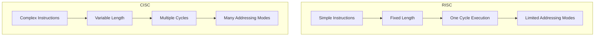
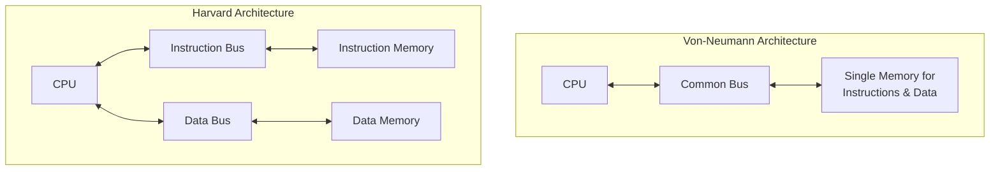
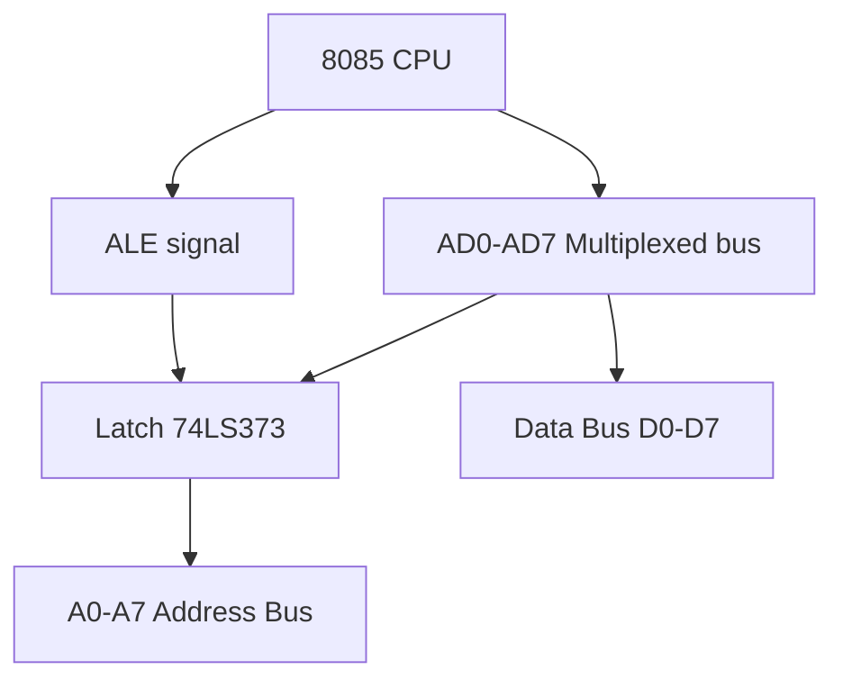
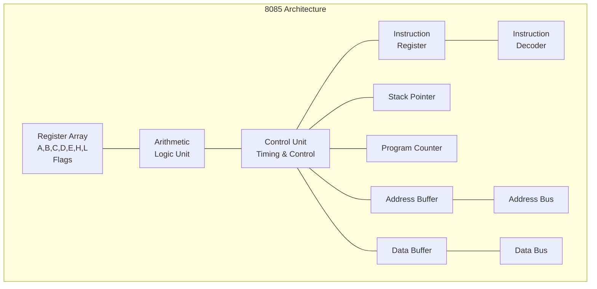
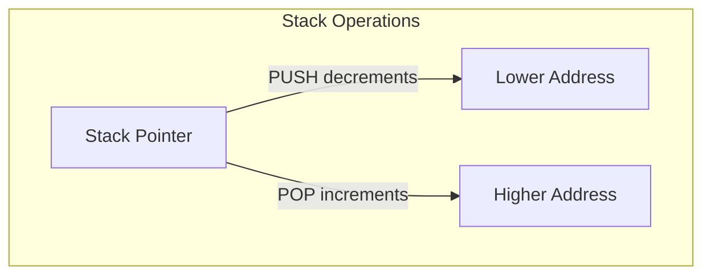
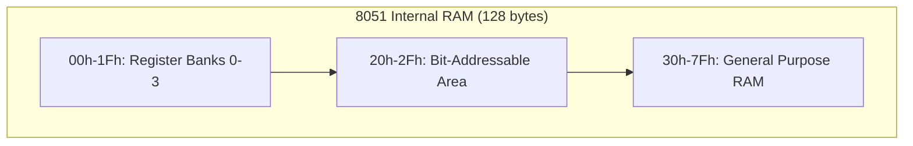
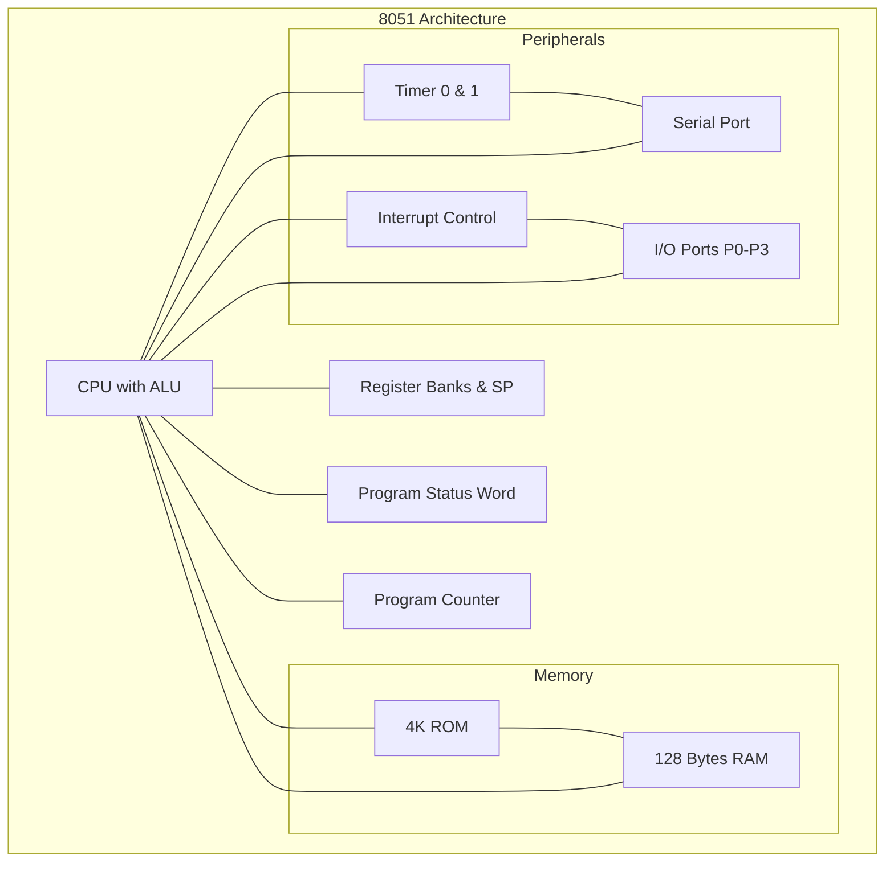

# 4341101 - Microprocessor and Microcontroller - Summer 2023 Complete Paper Solution

## Question 1(a): Compare Microprocessor and Microcontroller. (Marks: 3)

**Answer 1(a):**

| Feature | **Microprocessor** | **Microcontroller** |
|---------|-------------------|---------------------|
| Definition | CPU on a single chip | Complete computer on a chip |
| Memory | External RAM/ROM needed | Built-in RAM/ROM |
| I/O Ports | Requires external chips | Integrated on-chip |
| Example | Intel 8085, 8086 | 8051, PIC, AVR |

**Mnemonic:** "MP-EC, MC-IC" (MicroProcessor-External Components, MicroController-Integrated Components)

## Question 1(b): Compare RISC and CISC. (Marks: 4)

**Answer 1(b):**

| Feature | **RISC** | **CISC** |
|---------|----------|----------|
| Full Form | Reduced Instruction Set Computer | Complex Instruction Set Computer |
| Instructions | **Simple** & **fixed length** | **Complex** & **variable length** |
| Execution | Single cycle per instruction | Multiple cycles per instruction |
| Memory Access | Only through load/store | Many addressing modes |
| Examples | ARM, MIPS | x86, 8086 |



**Mnemonic:** "RISC-SF-1" (RISC: Simple, Fixed-length, 1 cycle)

## Question 1(c): Define: Microprocessor, Operand, Instruction Cycle, Opcode, ALU, Machine Cycle, T-State (Marks: 7)

**Answer 1(c):**

- **Microprocessor**: Central Processing Unit (CPU) on a single integrated circuit chip that performs arithmetic/logic operations
  
- **Operand**: Data value or memory address that the instruction operates on

- **Instruction Cycle**: Complete process of fetching, decoding, and executing an instruction
  


- **Opcode**: Operation code part of instruction that specifies the operation to be performed

- **ALU**: Arithmetic Logic Unit that performs mathematical and logical operations

- **Machine Cycle**: Time required to complete one operation of accessing memory, I/O, or acknowledging an interrupt

- **T-State**: Basic timing unit (Time State) in microprocessor operations, one clock period

**Mnemonic:** "MOIOAMT" → "My Operators Input Output And Make Time"

## Question 1(c OR): Compare Von-Neumann and Harvard architecture. (Marks: 7)

**Answer 1(c OR):**

| Feature | **Von-Neumann Architecture** | **Harvard Architecture** |
|---------|------------------------------|--------------------------|
| Memory | **Single memory** for both program and data | **Separate memories** for program and data |
| Bus | One common bus | Separate data and instruction buses |
| Access | Sequential access | Simultaneous access to data and instructions |
| Speed | Slower due to bottleneck | Faster due to parallel access |
| Flexibility | More flexible | Less flexible |
| Applications | General purpose computing | DSP, microcontrollers |



**Mnemonic:** "Von-S-S" (Von-Neumann: Single memory, Sequential access)

## Question 2(a): Draw Flag Register of 8085 microprocessor & explain it. (Marks: 3)

**Answer 2(a):**

```
D7  D6  D5  D4  D3  D2  D1  D0
S   Z   0   AC  0   P   1   CY
```

- **S (Sign Flag)**: Set if result is **negative** (MSB=1)
- **Z (Zero Flag)**: Set if result is **zero**
- **AC (Auxiliary Carry)**: Set if carry from bit 3 to bit 4
- **P (Parity Flag)**: Set if result has **even parity**
- **CY (Carry Flag)**: Set if result generates **carry**

**Mnemonic:** "SiZe AC Parking CY" (for non-zero bits)

## Question 2(b): Explain De-multiplexing of Address and Data buses for 8085 Microprocessor. (Marks: 4)

**Answer 2(b):**

8085 microprocessor has **multiplexed** AD₀-AD₇ pins to save pins. De-multiplexing is needed to separate this data.



**Process:**

- **ALE** (Address Latch Enable) goes **HIGH** → Lower address (A₀-A₇) appears on AD₀-AD₇
- 74LS373 **latch** captures address when ALE is HIGH
- ALE goes **LOW** → AD₀-AD₇ carries data
- Address remains **latched** while data flows independently

**Mnemonic:** "ALE High: Address, ALE Low: Data"

## Question 2(c): Describe architecture of 8085 microprocessor with the help of neat diagram. (Marks: 7)

**Answer 2(c):**



**Main components:**

- **ALU**: Performs **arithmetic** and **logical** operations
- **Registers**: Temporary **data storage** (A,B,C,D,E,H,L,Flags)
- **Control Unit**: Generates **timing** and **control** signals
- **Program Counter**: Holds **address** of next instruction
- **Stack Pointer**: Points to the **top** of stack in memory
- **Instruction Register**: Holds current **instruction**
- **Address & Data Buffer**: Interface with external **buses**

**Mnemonic:** "ARCS-PID" (ALU, Registers, Control, Stack-PC, Instruction, Decoder)

## Question 2(a OR): Explain Bus Organization of 8085 microprocessor. (Marks: 3)

**Answer 2(a OR):**

8085 has **three buses** for communication:

1. **Address Bus** (16 bits):
   - **Unidirectional** (CPU to peripherals)
   - Carries **16-bit address** (A₀-A₁₅)
   - Can address **64KB** memory (2¹⁶)

2. **Data Bus** (8 bits):
   - **Bidirectional** (CPU ↔ peripherals)
   - Transfers **8-bit data** (D₀-D₇)
   - Lower address bits (A₀-A₇) multiplexed with data

3. **Control Bus**:
   - **RD̅**, **WR̅**: Memory/IO read/write signals
   - **ALE**: Address Latch Enable
   - **IO/M̅**: Distinguishes I/O or memory operation

**Mnemonic:** "ADC" (Address, Data, Control)

## Question 2(b OR): Explain: Program Counter & Stack pointer (Marks: 4)

**Answer 2(b OR):**

### Program Counter (PC):

- **16-bit** register that holds the **memory address** of next instruction
- **Automatically increments** after fetching instruction
- Used in **sequence control** of program execution
- Can be modified by **jump** instructions to create branches
- **Initialized** to 0000H when the processor is reset

### Stack Pointer (SP):

- **16-bit** register that points to the **top of stack**
- Stack is a **LIFO** (Last In First Out) memory area
- Used during **subroutines** (CALL/RET) and **interrupts**
- SP is **decremented** before PUSH, **incremented** after POP
- Must be **initialized** before using stack operations

**Mnemonic:** "PC-Next, SP-Top" (PC points to Next instruction, SP points to Top of stack)

## Question 2(c OR): Describe Pin diagram of 8085 microprocessor with the help of neat diagram. (Marks: 7)

**Answer 2(c OR):**

```
            _____________
           |             |
X1, X2 --->|             |---> SID
RESET IN -->|             |---> SOD
RESET OUT <--|             |<--- HOLD
READY ----->|             |---> HLDA
CLKOUT <----|    8085     |
           |             |<--- INTR
IO/M <-----|             |<--- RST 7.5
S0, S1 <----|             |<--- RST 6.5
ALE <-------|             |<--- RST 5.5
           |             |<--- TRAP
WR <-------|             |
RD <-------|             |
AD0-AD7 <->|             |<--> A8-A15
VCC, GND -->|_____________|
```

**Key pins:**

- **Power & Clock**: VCC, GND, X1, X2, CLK
- **Multiplexed Bus**: AD₀-AD₇ (Address/Data)
- **Address Bus**: A₈-A₁₅ (High order address)
- **Control Signals**: ALE, RD̅, WR̅, IO/M̅, S₀, S₁
- **Interrupts**: INTR, RST 7.5, RST 6.5, RST 5.5, TRAP
- **DMA**: HOLD, HLDA
- **Serial I/O**: SID, SOD
- **READY**: Memory/IO synchronization

**Mnemonic:** "PACES-IR" (Power, Address, Control, External sync, Serial, Interrupt, Reset)

## Question 3(a): Explain Stack, Stack Pointer and Stack operation. (Marks: 3)

**Answer 3(a):**

### Stack:

- **LIFO** (Last In First Out) memory area in RAM
- Stores **return addresses** and **register values**
- Grows from **higher** to **lower** memory addresses

### Stack Pointer (SP):

- **16-bit** register pointing to the **top** element
- **Decrements** before PUSH, **increments** after POP

### Stack Operations:

1. **PUSH Rp**: (SP-1) ← Rh, (SP-2) ← Rl, SP ← SP-2
   * Saves register pair on stack
2. **POP Rp**: Rl ← (SP), Rh ← (SP+1), SP ← SP+2
   * Retrieves register pair from stack



**Mnemonic:** "LIFO-DTU" (LIFO, Down To Up movement)

## Question 3(b): Draw Timers/Counters logic diagram of 8051 microcontroller and explain it. (Marks: 4)

**Answer 3(b):**

```
                  ┌──────────┐    ┌─────┐
                  │   TMOD   │    │ TCON│
                  └──────────┘    └─────┘
                       │            │
                       ▼            ▼
           ┌───────┐       ┌───────────────┐
T0 Pin ───>│Control│─ ─ ─ >│   Timer 0     │─ ─>TF0
           │ Logic │       │ TH0    TL0    │
           └───────┘       └───────────────┘
                  
           ┌───────┐       ┌───────────────┐
T1 Pin ───>│Control│─ ─ ─ >│   Timer 1     │─ ─>TF1
           │ Logic │       │ TH1    TL1    │
           └───────┘       └───────────────┘
```

**8051 has two 16-bit timers/counters:**

- **Timer/Counter Registers**:
  * **Timer 0**: TH0 (high byte) + TL0 (low byte)
  * **Timer 1**: TH1 (high byte) + TL1 (low byte)

- **Control Registers**:
  * **TMOD**: Timer **mode** register (mode selection)
  * **TCON**: Timer **control** register (run/stop)

- **Modes of Operation**:
  * **Mode 0**: 13-bit timer
  * **Mode 1**: 16-bit timer
  * **Mode 2**: 8-bit auto-reload
  * **Mode 3**: Split timer mode

**Mnemonic:** "TMOD-13-16-8-S" (TMOD sets: 13-bit, 16-bit, 8-bit-auto, Split modes)

## Question 3(c): With the help of neat diagram explain Pin diagram of 8051 microcontroller. (Marks: 7)

**Answer 3(c):**

```
                  8051
         ┌─────────────────────┐
         │ 1             40    │
P1.0 ◄──►│                     │◄──► VCC
P1.1 ◄──►│                     │◄──► P0.0/AD0
P1.2 ◄──►│                     │◄──► P0.1/AD1
P1.3 ◄──►│                     │◄──► P0.2/AD2
P1.4 ◄──►│                     │◄──► P0.3/AD3
P1.5 ◄──►│                     │◄──► P0.4/AD4
P1.6 ◄──►│                     │◄──► P0.5/AD5
P1.7 ◄──►│                     │◄──► P0.6/AD6
RST ───►│                     │◄──► P0.7/AD7
RXD ◄───│                     │◄─── EA/VPP
TXD ───►│                     │◄─── ALE/PROG
INT0 ───►│                     │◄─── PSEN
INT1 ───►│                     │◄──► P2.7/A15
T0 ────►│                     │◄──► P2.6/A14
T1 ────►│                     │◄──► P2.5/A13
WR ────►│                     │◄──► P2.4/A12
RD ────►│                     │◄──► P2.3/A11
XTAL2 ◄──│                     │◄──► P2.2/A10
XTAL1 ──►│                     │◄──► P2.1/A9
GND ────│                     │◄──► P2.0/A8
         └─────────────────────┘
```

**Pin Functions:**

1. **Power & Clock Pins**:
   - **VCC** (Pin 40): +5V supply
   - **GND** (Pin 20): Ground
   - **XTAL1, XTAL2** (Pins 19, 18): Crystal oscillator connection

2. **I/O Ports**:
   - **Port 0** (Pins 32-39): Dual-purpose (address/data bus, I/O)
   - **Port 1** (Pins 1-8): General-purpose I/O
   - **Port 2** (Pins 21-28): Dual-purpose (high address byte, I/O)
   - **Port 3** (Pins 10-17): Special functions (interrupts, timers, serial)

3. **Control Pins**:
   - **RST** (Pin 9): Reset input
   - **EA** (Pin 31): External Access enable
   - **ALE** (Pin 30): Address Latch Enable
   - **PSEN** (Pin 29): Program Store Enable

**Mnemonic:** "PIPER" (Power, I/O Ports, Program control, External access, Reset)

## Question 3(a OR): Explain Serial communication modes of 8051 microcontroller. (Marks: 3)

**Answer 3(a OR):**

8051 has an on-chip UART with 4 serial communication modes:

1. **Mode 0**: 
   - **Shift register** mode
   - **Synchronous** transmission
   - **Baud rate** fixed at f<sub>osc</sub>/12
   - 8-bit data transmitted through TXD
   - Clock pulses at RXD

2. **Mode 1**:
   - **Standard UART** mode 
   - **Asynchronous** transmission
   - 8-bit data, 1 start bit, 1 stop bit
   - **Baud rate** variable (controlled by Timer 1)

3. **Mode 2**:
   - **9-bit UART** mode
   - **Asynchronous** transmission
   - 9-bit data (8 data + 1 programmable)
   - **Fixed baud rate** (f<sub>osc</sub>/32 or f<sub>osc</sub>/64)

4. **Mode 3**:
   - Similar to **Mode 2** but with **variable baud rate**
   - Controlled by Timer 1

**Mnemonic:** "SSAV" (Shift register, Standard UART, Advanced 9-bit, Variable rate 9-bit)

## Question 3(b OR): Explain Internal RAM Organization of 8051 microcontroller. (Marks: 4)

**Answer 3(b OR):**



**8051 Internal RAM is organized as:**

1. **Register Banks** (00H-1FH):
   - **Four** register banks (0-3)
   - **Eight** registers (R0-R7) per bank
   - Bank selection via **PSW** register
   - Used for **fast access** variables

2. **Bit-Addressable Area** (20H-2FH):
   - 16 bytes (128 bits) that can be addressed bit by bit
   - Used for **boolean** operations and **flags**
   - Every bit has its own address (00H-7FH)

3. **General Purpose RAM** (30H-7FH):
   - 80 bytes for **user data**
   - Accessed by **direct** and **indirect** addressing
   - Used for **variables** and **stack**

**Mnemonic:** "RBG" (Register Banks, Bit-addressable area, General purpose RAM)

## Question 3(c OR): Explain architecture of 8051 microcontroller with the help of neat diagram. (Marks: 7)

**Answer 3(c OR):**



**Main components:**

1. **CPU Core**:
   - **ALU**: Performs arithmetic/logical operations
   - **Accumulator** (A): Primary register for arithmetic
   - **B Register**: Used for multiply/divide operations
   - **PSW**: Stores status flags (CY, AC, OV, P)

2. **Memory**:
   - **4K ROM**: Program memory
   - **128 Bytes RAM**: Data memory with register banks
   - **SFRs**: Special Function Registers for control

3. **Peripherals**:
   - **Timers/Counters**: Two 16-bit timers
   - **Serial Port**: Full duplex UART
   - **Interrupt System**: 5 interrupt sources with 2 priority levels
   - **I/O Ports**: Four 8-bit bidirectional ports (P0-P3)

**Mnemonic:** "CPU-MIS" (CPU, Memory, I/O, Special peripherals)

## Question 4(a): Write an 8051 Assembly Language Program to Exchange lower nibbles of register R5 and R6. (Marks: 3)

**Answer 4(a):**

```assembly
; Program to exchange lower nibbles of R5 and R6
        MOV     A, R5      ; Copy R5 to accumulator
        ANL     A, #0FH    ; Mask upper nibble (keep only lower nibble)
        MOV     B, A       ; Store R5's lower nibble in B
        
        MOV     A, R6      ; Copy R6 to accumulator
        ANL     A, #0FH    ; Mask upper nibble (keep only lower nibble)
        MOV     C, A       ; Store R6's lower nibble temporarily in R7
        
        MOV     A, R5      ; Get R5 again
        ANL     A, #F0H    ; Keep only upper nibble of R5
        ORL     A, C       ; Combine with R6's lower nibble
        MOV     R5, A      ; Store back to R5
        
        MOV     A, R6      ; Get R6 again
        ANL     A, #F0H    ; Keep only upper nibble of R6
        ORL     A, B       ; Combine with R5's lower nibble
        MOV     R6, A      ; Store back to R6
        
        END
```

**Key steps:**

1. **Extract** lower nibbles
2. **Store** them temporarily
3. **Preserve** upper nibbles
4. **Combine** upper + swapped lower

## Question 4(b): Write an 8051 Assembly Language Program to blink LED interfaced at port P1.0. (Marks: 4)

**Answer 4(b):**

```assembly
; Program to blink LED at P1.0 with 1ms delay
        ORG     0000H
MAIN:   SETB    P1.0        ; Turn ON LED
        ACALL   DELAY_1MS   ; Call 1ms delay
        CLR     P1.0        ; Turn OFF LED
        ACALL   DELAY_1MS   ; Call 1ms delay
        SJMP    MAIN        ; Repeat forever

; 1ms delay subroutine (at 12MHz crystal)
DELAY_1MS:
        MOV     R7, #250    ; R7 = 250 (outer loop)
AGAIN:  MOV     R6, #4      ; R6 = 4 (inner loop)
HERE:   DJNZ    R6, HERE    ; Decrement R6 until zero
        DJNZ    R7, AGAIN   ; Decrement R7 until zero
        RET                 ; Return from subroutine
        
        END
```

**Key components:**

- **Main loop**: Toggle LED and call delay
- **Delay routine**: Nested loops for timing
- **Crystal**: 12MHz assumed
- **LED connection**: Active high at P1.0

## Question 4(c): List Addressing Modes of 8051 Microcontroller and explain them with examples. (Marks: 7)

**Answer 4(c):**

8051 microcontroller has 7 addressing modes:

1. **Immediate Addressing**:
   - Operand is in the instruction
   - Example: `MOV A, #25H` (Load 25H into A)

2. **Register Addressing**:
   - Operand is in a register
   - Example: `MOV A, R0` (Copy R0 to A)

3. **Direct Addressing**:
   - Operand is at the given memory address
   - Example: `MOV A, 30H` (Copy contents of memory 30H to A)

4. **Register Indirect Addressing**:
   - Register contains the address of operand
   - Example: `MOV A, @R0` (Copy contents of memory pointed by R0 to A)

5. **Indexed Addressing**:
   - Base address + index register
   - Example: `MOVC A, @A+DPTR` (For table lookups)

6. **Implicit Addressing**:
   - Operand is implicitly stated
   - Example: `RRC A` (Rotate A right through carry)

7. **Bit Addressing**:
   - Individual bit operations
   - Example: `SETB P1.0` (Set bit 0 of port 1)

**Mnemonic:** "I-R-DIR-I-B" (Immediate, Register, Direct, Indirect, Indexed, Bit)

## Question 4(a OR): Write an 8051 Assembly Language Program to add R2 and R3, put result in RAM. (Marks: 3)

**Answer 4(a OR):**

```assembly
; Program to add R2 and R3, result in external RAM locations 2040H (LSB) and 2041H (MSB)
        ORG     0000H
        
        MOV     A, R2      ; Copy R2 to accumulator
        ADD     A, R3      ; Add R3 to accumulator
        
        MOV     DPTR, #2040H  ; Set DPTR to destination address
        MOVX    @DPTR, A      ; Store LSB (accumulator) to 2040H
        
        MOV     A, #00H    ; Clear accumulator
        ADDC    A, #00H    ; Add carry flag to accumulator
        INC     DPTR       ; Increment DPTR to 2041H
        MOVX    @DPTR, A   ; Store MSB (carry) to 2041H
        
        END
```

**Key steps:**

1. **Add** R2 and R3 in accumulator
2. **Store** result byte at 2040H
3. **Capture** carry flag in A
4. **Store** carry byte at 2041H

## Question 4(b OR): For 8051 Microcontroller with 12 MHz crystal, generate a delay of 5ms. (Marks: 4)

**Answer 4(b OR):**

```assembly
; 5ms delay routine for 8051 with 12MHz crystal
        ORG     0000H
DELAY_5MS:
        MOV     R7, #5     ; Set outer loop for 5 iterations (5 x 1ms)
OUTER:  MOV     R6, #250   ; Set middle loop (250 iterations)
MIDDLE: MOV     R5, #4     ; Set inner loop (4 iterations)
INNER:  DJNZ    R5, INNER  ; 2 cycles x 4 = 8 cycles
        DJNZ    R6, MIDDLE ; 2 cycles x 250 = 500 cycles
        DJNZ    R7, OUTER  ; Count 5 milliseconds
        RET
        
        END
```

**Calculation:**

- 12MHz crystal → 1μs = 12 clock cycles
- Machine cycle = 12 clock cycles
- 1ms = 1000μs = 1000 machine cycles
- For 1ms: We need 1000 cycles
- Nested loop approach: 2(DJNZ) × 4 × 250 × 5 = 10,000 cycles
- 10,000 ÷ 1000 = approximately 5ms

**Note:** The exact timing depends on other instructions and loop overhead.

## Question 4(c OR): Explain any seven Arithmetic Instructions with example for 8051 Microcontroller. (Marks: 7)

1. **ADD A, src**
   - **Function**: Add source to accumulator
   - **Example**: `ADD A, #30H` (A = A + 30H)
   - **Flags**: C, AC, OV, P

2. **ADDC A, src**
   - **Function**: Add source and carry to accumulator
   - **Example**: `ADDC A, R0` (A = A + R0 + C)
   - **Flags**: C, AC, OV, P

3. **SUBB A, src**
   - **Function**: Subtract source and borrow from accumulator
   - **Example**: `SUBB A, 50H` (A = A - 50H - C)
   - **Flags**: C, AC, OV, P

4. **INC src**
   - **Function**: Increment source by 1
   - **Example**: `INC R3` (R3 = R3 + 1)
   - **Flags**: None

5. **DEC src**
   - **Function**: Decrement source by 1
   - **Example**: `DEC A` (A = A - 1)
   - **Flags**: None

6. **MUL AB**
   - **Function**: Multiply A and B, result in BA (B=MSB, A=LSB)
   - **Example**: `MUL AB` (BA = A × B)
   - **Flags**: C, OV

7. **DIV AB**
   - **Function**: Divide A by B, quotient in A, remainder in B
   - **Example**: `DIV AB` (A = A ÷ B, B = A % B)
   - **Flags**: C, OV

**Mnemonic:** "AASI-DMD" (Add, Add-with-Carry, Subtract-with-Borrow, Increment, Decrement, Multiply, Divide)

## Question 5(a): List Applications of microcontroller in various fields. (Marks: 3)

**Answer 5(a):**

**Applications of microcontrollers in various fields:**

1. **Consumer Electronics**:
   - Smart TVs, washing machines, microwave ovens
   - Remote controls, digital cameras

2. **Automotive**:
   - Engine control units (ECU)
   - Anti-lock braking systems (ABS)
   - Airbag control, dashboard instruments

3. **Industrial Automation**:
   - PLCs, temperature controllers
   - Motor controls, robotic systems

4. **Medical Devices**:
   - Patient monitoring systems
   - Digital thermometers, glucose meters

5. **Smart Home**:
   - Home automation systems
   - Security systems, smart appliances

**Mnemonic:** "CAIMS" (Consumer, Automotive, Industrial, Medical, Smart home)

## Question 5(b): Interface Relay with 8051 microcontroller. (Marks: 4)

**Answer 5(b):**

```
                 VCC
                  │
                  ▼
                ┌───┐
                │   │
P2.0 ────►|────┤ULN│     ┌─────┐   AC/DC Load
          1N4148│2003├────┤Relay├───/\/\/\/\───
                │   │     └─────┘
                └───┘         │
                  │           │
                  ▼           ▼
                 GND         GND
```

**Components needed:**

- **ULN2003** or **ULN2803**: Darlington transistor array driver
- **1N4148**: Protection diode (already built into ULN2003)
- **Relay**: Electromagnetic switch (5V or 12V coil)

**Connection steps:**

1. Connect 8051 pin **P2.0** to ULN2003 **input**
2. Connect ULN2003 **output** to relay **coil**
3. Connect other end of relay coil to **VCC**
4. Connect ULN2003 **ground** pin to system **ground**

**Control code:**

```assembly
SETB P2.0    ; Turn ON relay
CLR P2.0     ; Turn OFF relay
```

**Mnemonic:** "MURD" (Microcontroller, ULN driver, Relay, Device)

## Question 5(c): Interface LCD with 8051 microcontroller. (Marks: 7)

**Answer 5(c):**

```
   8051                 16×2 LCD
┌─────────┐         ┌─────────────┐
│     P1.0├────────►│D0           │
│     P1.1├────────►│D1           │
│     P1.2├────────►│D2           │
│     P1.3├────────►│D3           │
│     P1.4├────────►│D4           │
│     P1.5├────────►│D5           │
│     P1.6├────────►│D6           │
│     P1.7├────────►│D7           │
│         │         │             │
│     P3.0├────────►│RS           │
│     P3.1├────────►│R/W          │
│     P3.2├────────►│E            │
└─────────┘         └─────────────┘
```

**Connection details:**

- **Data pins**: P1.0-P1.7 to LCD D0-D7 (8-bit mode)
- **Control pins**:
  * P3.0 to RS (Register Select)
  * P3.1 to R/W (Read/Write)
  * P3.2 to E (Enable)

**Basic initialization code:**

```assembly
    MOV P1, #38H    ; 2 lines, 5×7 matrix
    ACALL COMMAND   ; Send command
    MOV P1, #0EH    ; Display ON, cursor ON
    ACALL COMMAND   ; Send command
    MOV P1, #01H    ; Clear display
    ACALL COMMAND   ; Send command
    MOV P1, #06H    ; Increment cursor
    ACALL COMMAND   ; Send command
    
COMMAND:
    CLR P3.0        ; RS=0 for command
    CLR P3.1        ; R/W=0 for write
    SETB P3.2       ; E=1 for high pulse
    NOP             ; Short delay
    NOP             ; Short delay
    CLR P3.2        ; E=0 for low pulse
    RET
```

**Mnemonic:** "DR-ESI" (Data pins, RS-RW-E control, Send command, Initialize)

## Question 5(a OR): Draw Interfacing of LED with 8051 microcontroller. (Marks: 3)

**Answer 5(a OR):**

```
    8051
┌─────────┐         VCC
│         │          │
│         │          │
│     P1.0├──────────┤330Ω├──────┬─┨LED├───┐
│         │          resistor     │         │
└─────────┘                      GND       GND
```

**Components required:**

- **LED**: Light Emitting Diode
- **Resistor**: 330Ω (current limiting)

**Two connection methods:**

1. **Active HIGH** (shown above):
   - LED anode to resistor, cathode to ground
   - LED ON: `SETB P1.0`
   - LED OFF: `CLR P1.0`

2. **Active LOW** (alternative):
   - LED cathode to resistor, anode to VCC
   - LED ON: `CLR P1.0`
   - LED OFF: `SETB P1.0`

**Simple blinking code:**

```assembly
MAIN: SETB P1.0    ; Turn ON LED
      ACALL DELAY  ; Wait
      CLR P1.0     ; Turn OFF LED
      ACALL DELAY  ; Wait
      SJMP MAIN    ; Repeat
```

**Mnemonic:** "LRC" (LED, Resistor, Controller pin)

## Question 5(b OR): Interface DC Motor with 8051 microcontroller. (Marks: 4)

**Answer 5(b OR):**

```
          +5V
           │
           ▼
         ┌───┐
P1.0────►│   │◄──┐       DC Motor
         │ULN│   │    ┌──────────┐
P1.1────►│2003│   │    │          │
         │   ├───┼────┤      M    │
         └───┘   │    │          │
           │     │    └──────────┘
           ▼     │
          GND    │
                 │
         ┌───────┘
         │
L293D/   │
H-Bridge └──► Direction Control
```

**Components needed:**

- **ULN2003**: Driver for motor
- **L293D or H-Bridge**: For direction control (optional)
- **DC Motor**: Actuator to be controlled
- **Capacitors**: To reduce noise (not shown)

**Connection steps:**

1. Connect 8051 pin **P1.0** to ULN2003 **input**
2. Connect ULN2003 **output** to motor **terminal**
3. Connect other motor terminal to **ground**
4. For bidirectional control, use **L293D**:
   - P1.0 and P1.1 control direction
   - Enable pin controls speed (can be connected to PWM)

**Basic control code:**

```assembly
SETB P1.0    ; Turn motor ON
CLR P1.0     ; Turn motor OFF

; For bidirectional (with L293D)
SETB P1.0    ; Forward
CLR P1.1     ; 
; or
SETB P1.1    ; Reverse
CLR P1.0     ; 
```

**Mnemonic:** "DUMP" (Driver, ULN, Motor, Power)

## Question 5(c OR): Interface DAC0808 with 8051 microcontroller. (Marks: 7)

**Answer 5(c OR):**

```
    8051                DAC0808
┌─────────┐         ┌─────────────┐
│     P1.0├────────►│D0           │
│     P1.1├────────►│D1           │
│     P1.2├────────►│D2           │
│     P1.3├────────►│D3       Iout├───┬──┐
│     P1.4├────────►│D4           │   │  │
│     P1.5├────────►│D5           │   R  │
│     P1.6├────────►│D6           │   │  │
│     P1.7├────────►│D7           │   │  │
│         │         │             │   │  │
│     P3.0├────────►│CS           │   │  │
└─────────┘         └─────────────┘   ▼  ▼
                           │        -Vref GND
                           ▼
                         +Vref
```

**Components needed:**

- **DAC0808**: 8-bit Digital-to-Analog Converter
- **Op-amp**: Current-to-voltage converter (not shown)
- **Resistors**: For reference voltage and feedback

**Connection details:**

1. Connect **P1.0-P1.7** to DAC0808 **data inputs D0-D7**
2. Connect **P3.0** to DAC0808 **CS** (Chip Select)
3. Connect **+Vref** to reference voltage input
4. Connect **-Vref** to reference voltage return
5. Connect **Iout** to op-amp circuit to convert current to voltage

**Sample code for generating sawtooth wave:**

```assembly
START:  MOV R7, #0      ; Start from 0
LOOP:   MOV P1, R7      ; Output to DAC
        INC R7          ; Increment value
        ACALL DELAY     ; Small delay
        SJMP LOOP       ; Repeat
```

**Applications:**

- **Waveform generation**: Sine, square, triangle
- **Audio output**: Music, speech
- **Control systems**: Motor control, temperature control

**Mnemonic:** "DRIVE" (DAC, Reference, I-out, Voltage conversion, Eight bits)
