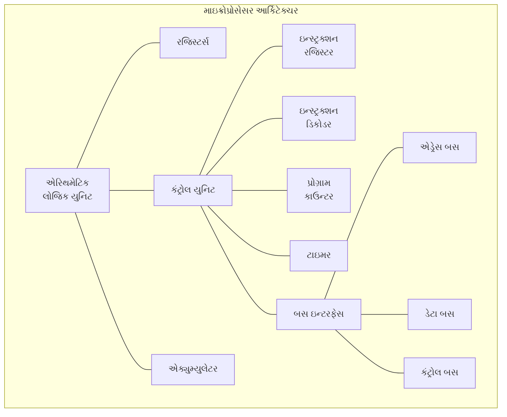
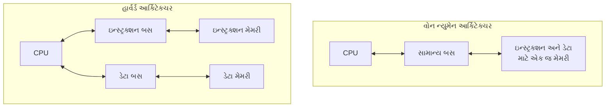
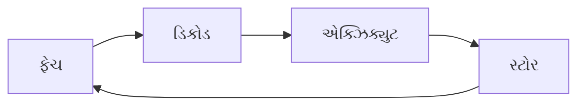
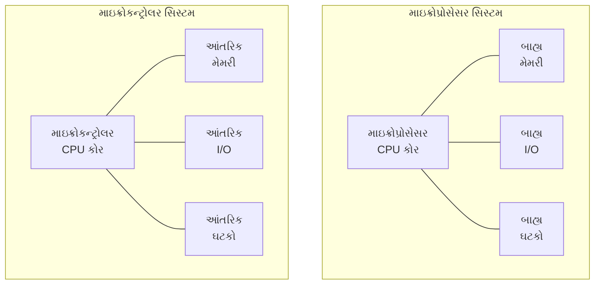
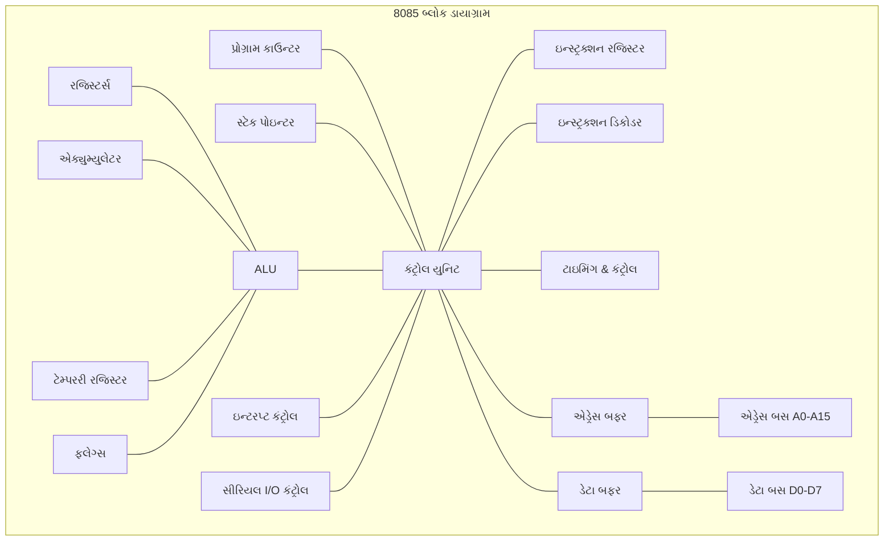
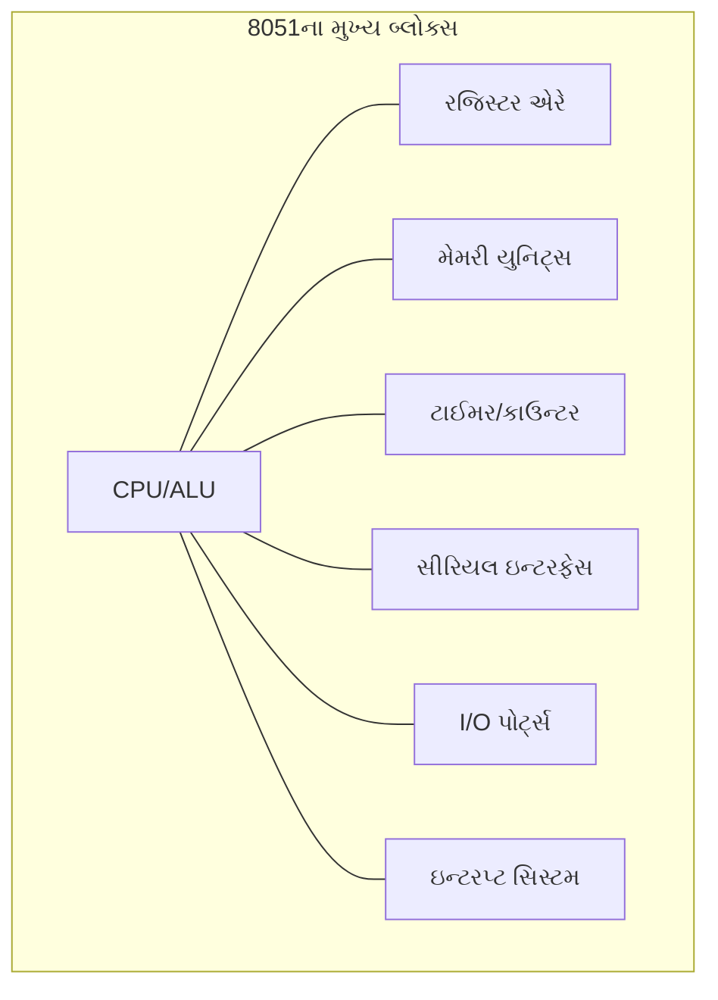
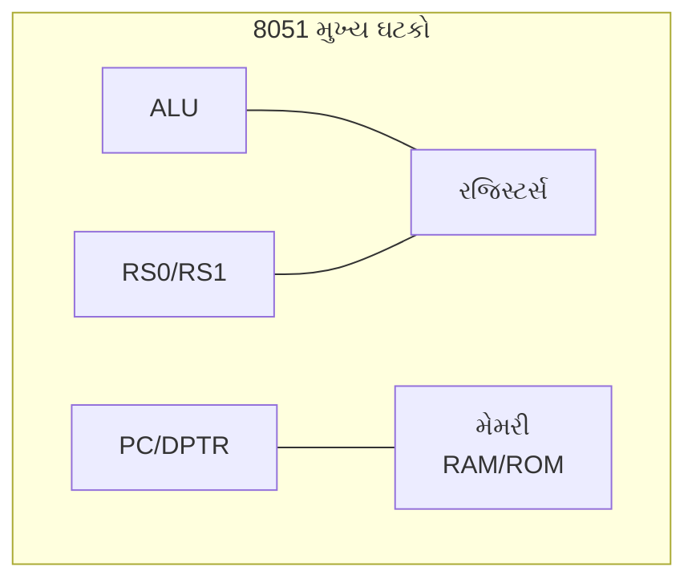
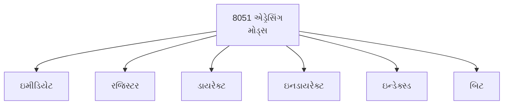
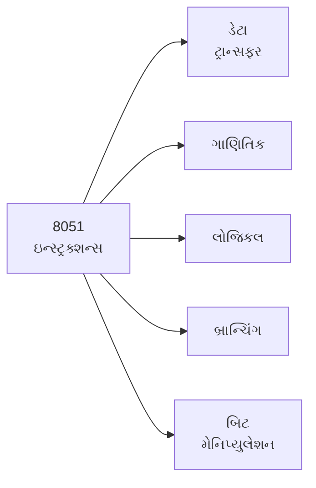

# 4341101 - માઇક્રોપ્રોસેસર અને માઇક્રોકન્ટ્રોલર - Summer 2024 પેપર સોલ્યુશન

## પ્રશ્ન 1(અ): 8051 માઇક્રોકન્ટ્રોલરના કોઈપણ એક પોર્ટ કન્ફિગરેશનનું વર્ણન કરો. (ગુણ: 3)

**જવાબ 1(અ):**

**પોર્ટ 1 કન્ફિગરેશન** of 8051:

```
   8051
┌─────────┐
│         │
│     P1.0│◄──► જનરલ પર્પઝ I/O
│     P1.1│◄──► જનરલ પર્પઝ I/O
│     P1.2│◄──► જનરલ પર્પઝ I/O
│     P1.3│◄──► જનરલ પર્પઝ I/O
│     P1.4│◄──► જનરલ પર્પઝ I/O
│     P1.5│◄──► જનરલ પર્પઝ I/O
│     P1.6│◄──► જનરલ પર્પઝ I/O
│     P1.7│◄──► જનરલ પર્પઝ I/O
│         │
└─────────┘
```

- **પોર્ટ 1 (P1.0-P1.7)**: ટ્રુ બાયડિરેક્શનલ I/O પોર્ટ
- **ઇન્ટરનલ પુલ-અપ્સ** ધરાવે છે - પિન્સને 1 લખીને ઇનપુટ તરીકે વાપરી શકાય
- ઇનપુટ તરીકે વપરાય ત્યારે, બાહ્ય રીતે લો ખેંચાયેલી પિન્સ કરંટ આપશે
- **SFR એડ્રેસ**: 90H
- કોઈ **ડ્યુઅલ ફંક્શનાલિટી** નથી (અન્ય પોર્ટ્સથી વિપરિત)

**યાદ રાખવાની ટ્રિક:** "P1-GPS" (પોર્ટ 1 - જનરલ પર્પઝ સિમ્પલ)

## પ્રશ્ન 1(બ): માઇક્રોપ્રોસેસર આર્કિટેક્ચરનું વર્ણન કરો. (ગુણ: 4)

**જવાબ 1(બ):**



**મુખ્ય ઘટકો:**

- **ALU**: **ગાણિતિક** અને **લોજિકલ** ઓપરેશન કરે છે
- **રજિસ્ટર્સ**: ડેટા અને એડ્રેસ માટે અસ્થાયી **સ્ટોરેજ**
- **કંટ્રોલ યુનિટ**: **ઇન્સ્ટ્રક્શન એક્ઝિક્યુશન** અને સિગ્નલ ટાઇમિંગ મેનેજ કરે છે
- **પ્રોગ્રામ કાઉન્ટર**: **આગલા ઇન્સ્ટ્રક્શન**ના એડ્રેસને ટ્રેક કરે છે
- **બસ ઇન્ટરફેસ**: બાહ્ય ઘટકોને કનેક્ટ કરે છે:
  * **એડ્રેસ બસ**: યુનિડિરેક્શનલ (મેમરી/I/O લોકેટ કરે)
  * **ડેટા બસ**: બાઇડિરેક્શનલ (ડેટા ટ્રાન્સફર કરે)
  * **કંટ્રોલ બસ**: વિવિધ કંટ્રોલ સિગ્નલ્સ (રીડ/રાઇટ/વગેરે)

**યાદ રાખવાની ટ્રિક:** "ARCB" (ALU, રજિસ્ટર્સ, કંટ્રોલ યુનિટ, બસ ઇન્ટરફેસ)

## પ્રશ્ન 1(ક): વોન ન્યુમેન અને હાર્વર્ડ આર્કિટેક્ચરની તુલના કરો. (ગુણ: 7)

**જવાબ 1(ક):**

| લક્ષણ | **વોન ન્યુમેન આર્કિટેક્ચર** | **હાર્વર્ડ આર્કિટેક્ચર** |
|---------|------------------------------|--------------------------|
| મેમરી | પ્રોગ્રામ અને ડેટા માટે **એક જ મેમરી** | પ્રોગ્રામ અને ડેટા માટે **અલગ મેમરી** |
| બસ | એક સામાન્ય બસ | અલગ ડેટા અને ઇન્સ્ટ્રક્શન બસ |
| એક્ઝિક્યુશન | સીક્વેન્શિયલ ફેચ અને એક્ઝિક્યુટ | પેરેલેલ ફેચ અને એક્ઝિક્યુટ શક્ય |
| સ્પીડ | બસ બોટલનેક ને કારણે ધીમું | સિમલ્ટેનિયસ એક્સેસથી ઝડપી |
| ફ્લેક્સિબિલિટી | વધુ ફ્લેક્સિબલ અને અડેપ્ટેબલ | ઓછું ફ્લેક્સિબલ, પણ વધુ સ્પેશિયલાઇઝ્ડ |
| પ્રોગ્રામિંગ | સરળ પ્રોગ્રામિંગ મોડેલ | વધુ જટિલ મેમરી મેનેજમેન્ટ |
| એપ્લિકેશન્સ | જનરલ પર્પઝ કમ્પ્યુટર્સ | DSPs, માઇક્રોકન્ટ્રોલર્સ, એમ્બેડેડ સિસ્ટમ્સ |



**વોન ન્યુમેનના ફાયદા:**

- **ઇકોનોમિકલ** - ઓછા હાર્ડવેરની જરૂર
- **ફ્લેક્સિબલ** - પ્રોગ્રામ ડેટા ઇન્સ્ટ્રક્શન તરીકે અને વાઇસ વર્સા ટ્રીટ થઈ શકે

**હાર્વર્ડના ફાયદા:**

- **પરફોર્મન્સ** - ઇન્સ્ટ્રક્શન અને ડેટા વચ્ચે બસ કન્ટેન્શન નથી
- **સિક્યોરિટી** - કોડ કરપ્શન સામે વધુ સારું રક્ષણ
- **પેરેલલિઝમ** - વર્તમાન ઇન્સ્ટ્રક્શન એક્ઝિક્યુટ કરતી વખતે આગલું ફેચ કરી શકે

**યાદ રાખવાની ટ્રિક:** "SSPPFPA" (Single vs Separate, Performance, Parallelism, Flexibility, Purpose-specific Applications)

## પ્રશ્ન 1(ક OR): RISC, CISC, Opcode, Operand, Instruction Cycle, Machine Cycle, અને T State ને વ્યાખ્યાયિત કરો. (ગુણ: 7)

**જવાબ 1(ક OR):**

1. **RISC (રિડ્યુસ્ડ ઇન્સ્ટ્રક્શન સેટ કમ્પ્યુટર)**:
   - **સરળ** ઇન્સ્ટ્રક્શન્સ સાથે કમ્પ્યુટર ડિઝાઇન જે **એક ક્લોક સાયકલમાં** એક્ઝિક્યુટ થાય
   - ફિક્સ્ડ ઇન્સ્ટ્રક્શન લેન્થ, મર્યાદિત એડ્રેસિંગ મોડ્સ
   - ઉદાહરણ: ARM, MIPS

2. **CISC (કોમ્પ્લેક્સ ઇન્સ્ટ્રક્શન સેટ કમ્પ્યુટર)**:
   - **જટિલ** ઇન્સ્ટ્રક્શન્સ સાથે કમ્પ્યુટર ડિઝાઇન જે **મલ્ટિપલ ક્લોક સાયકલમાં** એક્ઝિક્યુટ થાય
   - વેરિએબલ ઇન્સ્ટ્રક્શન લેન્થ, ઘણા એડ્રેસિંગ મોડ્સ
   - ઉદાહરણ: x86, 8086

3. **Opcode (ઓપરેશન કોડ)**:
   - ઇન્સ્ટ્રક્શનનો ભાગ જે કયું **ઓપરેશન** કરવાનું છે તે સ્પષ્ટ કરે છે
   - સામાન્ય રીતે ઇન્સ્ટ્રક્શન બાઇટનો પ્રથમ ભાગ હોય છે

4. **Operand (ઓપરેન્ડ)**:
   - ડેટા અથવા એડ્રેસ વેલ્યુ જેના પર ઇન્સ્ટ્રક્શન **ઓપરેટ** કરે છે
   - રજિસ્ટર, મેમરી, અથવા ઇમીડિયેટ (ઇન્સ્ટ્રક્શનમાં) હોઈ શકે છે

5. **Instruction Cycle (ઇન્સ્ટ્રક્શન સાયકલ)**:
   - ઇન્સ્ટ્રક્શનને **ફેચ, ડિકોડ, અને એક્ઝિક્યુટ** કરવાની સંપૂર્ણ પ્રક્રિયા
   - પ્રોસેસર ઓપરેશનનો બેઝિક સિક્વન્સ



6. **Machine Cycle (મશીન સાયકલ)**:
   - **મેમરી રીડ/રાઇટ** જેવું બેઝિક ઓપરેશન અથવા I/O ઓપરેશન
   - એક ફંડામેન્ટલ ઓપરેશન માટે જરૂરી T-સ્ટેટ્સનો સિક્વન્સ

7. **T-State (ટાઇમ સ્ટેટ)**:
   - પ્રોસેસરનો એક **ક્લોક પીરિયડ**
   - પ્રોસેસર ઓપરેશનમાં સમયનો બેઝિક એકમ

**યાદ રાખવાની ટ્રિક:** "RC-OOIMS" (RISC, CISC, Opcode, Operand, Instruction, Machine, State)

## પ્રશ્ન 2(અ): ડેટા બસ, એડ્રેસ બસ અને કંટ્રોલ બસ વ્યાખ્યાયિત કરો. (ગુણ: 3)

**જવાબ 2(અ):**

1. **ડેટા બસ**:
   - CPU અને અન્ય ઘટકો વચ્ચે ડેટા લઈ જતી **બાઇડિરેક્શનલ** બસ
   - તેની વિડ્થ પ્રોસેસરની ડેટા હેન્ડલિંગ કેપેસિટી નક્કી કરે છે (8/16/32/64 બિટ્સ)
   - ઉદાહરણ: 8085માં, D0-D7 એ 8-બિટ ડેટા બસ છે

2. **એડ્રેસ બસ**:
   - CPU પરથી મેમરી/IO ડિવાઇસ એડ્રેસ લઈ જતી **યુનિડિરેક્શનલ** બસ
   - તેની વિડ્થ મહત્તમ એડ્રેસેબલ મેમરી નક્કી કરે છે (2^n બાઇટ્સ)
   - ઉદાહરણ: 8085માં, A0-A15 એ 16-બિટ એડ્રેસ બસ છે (64KB મેક્સ)

3. **કંટ્રોલ બસ**:
   - CPU અને પેરિફેરલ્સ વચ્ચેના **કંટ્રોલ સિગ્નલ્સ**નો સમૂહ
   - ટાઇમિંગ અને કોઓર્ડિનેશન સિગ્નલ્સ પ્રદાન કરે છે
   - ઉદાહરણ: RD̅, WR̅, IO/M̅, ALE, વગેરે.

```
CPU <-------> Memory/IO
    ડેટા બસ  (બાઇડિરેક્શનલ)
    એડ્રેસ બસ (યુનિડિરેક્શનલ)
    કંટ્રોલ બસ (વિવિધ સિગ્નલ્સ)
```

**યાદ રાખવાની ટ્રિક:** "DAC-BUO" (ડેટા-બાઇડિરેક્શનલ, એડ્રેસ-યુનિડિરેક્શનલ, કંટ્રોલ-ઓપરેશન સિગ્નલ્સ)

## પ્રશ્ન 2(બ): માઇક્રોપ્રોસેસર અને માઇક્રોકન્ટ્રોલરની સરખામણી કરો. (ગુણ: 4)

**જવાબ 2(બ):**

| લક્ષણ | **માઇક્રોપ્રોસેસર** | **માઇક્રોકન્ટ્રોલર** |
|---------|-------------------|---------------------|
| વ્યાખ્યા | સિંગલ ચિપ પર CPU | સિંગલ ચિપ પર સંપૂર્ણ કમ્પ્યુટર સિસ્ટમ |
| મેમરી | બાહ્ય RAM/ROM જરૂરી | અંદર જ RAM/ROM |
| I/O પોર્ટ્સ | બાહ્ય I/O ઇન્ટરફેસ જરૂરી | ઇન્ટિગ્રેટેડ I/O પોર્ટ્સ |
| કોસ્ટ | બાહ્ય ઘટકોને કારણે ઊંચો સિસ્ટમ ખર્ચ | ઇન્ટિગ્રેશનને કારણે ઓછો સિસ્ટમ ખર્ચ |
| પાવર વપરાશ | વધારે | ઓછો |
| એપ્લિકેશન્સ | જનરલ કમ્પ્યુટિંગ, PCs | એમ્બેડેડ સિસ્ટમ્સ, સ્પેસિફિક કંટ્રોલ એપ્લિકેશન્સ |
| ઉદાહરણ | Intel 8085, 8086 | 8051, PIC, AVR |



**યાદ રાખવાની ટ્રિક:** "MECI-PAC" (મેમરી-બાહ્ય/આંતરિક, ખર્ચ-ઇન્ટિગ્રેશન, પાવર, એપ્લિકેશન્સ-જનરલ/કંટ્રોલ)

## પ્રશ્ન 2(ક): 8085 બ્લોક ડાયાગ્રામ સ્કેચ કરો અને સમજાવો. (ગુણ: 7)

**જવાબ 2(ક):**



**મુખ્ય ઘટકો:**

1. **ALU (એરિથમેટિક લોજિક યુનિટ)**:
   - **ગાણિતિક** અને **લોજિકલ** ઓપરેશન કરે છે
   - એક્યુમ્યુલેટર અને ટેમ્પરરી રજિસ્ટર સાથે કનેક્ટેડ

2. **રજિસ્ટર્સ**:
   - **જનરલ પર્પઝ**: B, C, D, E, H, L (6 રજિસ્ટર્સ, 8-બિટ દરેક)
   - **સ્પેશિયલ પર્પઝ**: 
     * **એક્યુમ્યુલેટર (A)**: ગાણિતિક ઓપરેશન માટે મુખ્ય રજિસ્ટર
     * **ફ્લેગ્સ**: સાઇન, ઝીરો, ઓક્ઝિલરી કેરી, પેરિટી, કેરી
     * **પ્રોગ્રામ કાઉન્ટર (PC)**: આગલા ઇન્સ્ટ્રક્શન તરફ પોઇન્ટ કરે છે
     * **સ્ટેક પોઇન્ટર (SP)**: સ્ટેક ટોપ તરફ પોઇન્ટ કરે છે

3. **કંટ્રોલ યુનિટ**:
   - **ઇન્સ્ટ્રક્શન રજિસ્ટર (IR)**: વર્તમાન ઇન્સ્ટ્રક્શન ધરાવે છે
   - **ઇન્સ્ટ્રક્શન ડિકોડર**: ઇન્સ્ટ્રક્શન્સ ડિકોડ કરે છે
   - **કંટ્રોલ લોજિક**: કંટ્રોલ સિગ્નલ્સ જનરેટ કરે છે

4. **બસેસ**:
   - **એડ્રેસ બસ**: 16-બિટ (A0-A15)
   - **ડેટા બસ**: 8-બિટ (D0-D7)
   - **કંટ્રોલ બસ**: વિવિધ કંટ્રોલ સિગ્નલ્સ

5. **I/O & ઇન્ટરપ્ટ્સ**:
   - ઇન્ટરપ્ટ કંટ્રોલ સર્કિટરી
   - સીરિયલ I/O કંટ્રોલ

**યાદ રાખવાની ટ્રિક:** "ARCI-B" (ALU, રજિસ્ટર્સ, કંટ્રોલ યુનિટ, I/O, બસેસ)

## પ્રશ્ન 2(અ OR): એક્યુમ્યુલેટર, પ્રોગ્રામ કાઉન્ટર અને સ્ટેક પોઇન્ટર સમજાવો. (ગુણ: 3)

**જવાબ 2(અ OR):**

1. **એક્યુમ્યુલેટર (A)**:
   - **8-બિટ** સ્પેશિયલ પર્પઝ રજિસ્ટર
   - ગાણિતિક અને લોજિકલ ઓપરેશન માટે **પ્રાયમરી** રજિસ્ટર
   - ઓપરેશન્સના પરિણામ સ્ટોર કરે છે (ADD, SUB, વગેરે)
   - અન્ય રજિસ્ટર્સ કરતાં એક્સેસ **ઝડપી** છે

2. **પ્રોગ્રામ કાઉન્ટર (PC)**:
   - **આગલા ઇન્સ્ટ્રક્શન**નું એડ્રેસ ધરાવતું **16-બિટ** રજિસ્ટર
   - ઇન્સ્ટ્રક્શન ફેચ કર્યા પછી **આપોઆપ વધે** છે
   - જમ્પ/કોલ ઇન્સ્ટ્રક્શન દ્વારા પ્રોગ્રામ ફ્લો બદલવા માટે મોડિફાઇ થઈ શકે છે
   - રીસેટ પર 0000H પર ઇનિશિયલાઇઝ થાય છે

3. **સ્ટેક પોઇન્ટર (SP)**:
   - સ્ટેકના **ટોચ** તરફ પોઇન્ટ કરતું **16-બિટ** રજિસ્ટર
   - સ્ટેક એ LIFO (લાસ્ટ ઇન ફર્સ્ટ આઉટ) મેમરી એરિયા છે
   - PUSH પહેલાં **ઘટે** છે, POP પછી **વધે** છે
   - અસ્થાયી સ્ટોરેજ અને સબરૂટિન કોલ્સ માટે વપરાય છે

**યાદ રાખવાની ટ્રિક:** "APS" (એક્યુમ્યુલેટર-પ્રાયમરી ઓપરેશન્સ, પ્રોગ્રામ કાઉન્ટર-આગલું ઇન્સ્ટ્રક્શન, સ્ટેક પોઇન્ટર-અસ્થાયી સ્ટોરેજ)

## પ્રશ્ન 2(બ OR): એડ્રેસ બસ અને ડેટા બસનું ડિમલ્ટિપ્લેક્સીંગ સ્કેચ કરો અને સમજાવો. (ગુણ: 4)

**જવાબ 2(બ OR):**

```
    8085                   એડ્રેસ લેચ
┌─────────┐               ┌───────────┐
│         │   AD0-AD7     │           │    A0-A7
│         ├───────────────►           ├──────────►
│         │               │           │
│         │   ALE         │           │
│         ├───────────────►           │
│         │               │           │
│         │               └───────────┘
│         │                    ▲
│         │                    │
│         │                    │
│    A8-15│                    │
│         ├────────────────────┘
└─────────┘
               │
               │
               ▼
            ડેટા બસ તરફ
```

**ડિમલ્ટિપ્લેક્સિંગ પ્રોસેસ:**

1. 8085 પાસે પિન્સ બચાવવા માટે **મલ્ટિપ્લેક્સ્ડ** AD₀-AD₇ પિન્સ છે જે એડ્રેસ અને ડેટા બંને કેરી કરે છે
2. એડ્રેસને ડેટાથી અલગ કરવા માટે **ડિમલ્ટિપ્લેક્સિંગ** જરૂરી છે

**કાર્યપદ્ધતિ:**

- જ્યારે **ALE** (એડ્રેસ લેચ એનેબલ) **હાઈ** હોય:
  * લોઅર એડ્રેસ બિટ્સ (A₀-A₇) AD₀-AD₇ પિન્સ પર દેખાય છે
  * બાહ્ય **લેચ** (74LS373) આ એડ્રેસ બિટ્સ કેપ્ચર કરે છે
  
- જ્યારે **ALE** **લો** થાય:
  * AD₀-AD₇ પિન્સ હવે **ડેટા** કેરી કરે છે
  * એડ્રેસ લેચમાં સ્થિર રહે છે
  * અપર એડ્રેસ બિટ્સ (A₈-A₁₅) સીધા ઉપલબ્ધ હોય છે (મલ્ટિપ્લેક્સ નથી થતા)

**પરિણામ:**

- સમગ્ર મશીન સાયકલ દરમિયાન સંપૂર્ણ 16-બિટ એડ્રેસ (A₀-A₁₅) ઉપલબ્ધ રહે છે
- 8-બિટ ડેટા બસ અલગ અને ડેટા ટ્રાન્સફર માટે ઉપલબ્ધ રહે છે

**યાદ રાખવાની ટ્રિક:** "HALD" (હાઈ ALE-એડ્રેસ, લો ALE-ડેટા)

## પ્રશ્ન 2(ક OR): 8085 ની કોઈપણ સાત વિશેષતાઓની યાદી આપો. (ગુણ: 7)

**જવાબ 2(ક OR):**

**8085ની સાત મુખ્ય વિશેષતાઓ:**

1. **8-બિટ ડેટા બસ**:
   - એક સમયે 8 બિટ ડેટા પ્રોસેસ કરી શકે છે
   - સિંગલ બાઇટ ઓપરેશન્સ કાર્યક્ષમ

2. **16-બિટ એડ્રેસ બસ**:
   - 2¹⁶ = 64 KB સુધી મેમરી એડ્રેસ કરી શકે છે
   - 0000H થી FFFFH સુધીના મેમરી એડ્રેસ

3. **6 જનરલ-પર્પઝ રજિસ્ટર્સ**:
   - B, C, D, E, H, L (જોડી તરીકે વાપરી શકાય BC, DE, HL)
   - મેમરી રેફરન્સ વિના ઝડપી ડેટા એક્સેસ

4. **મલ્ટિપ્લેક્સ્ડ એડ્રેસ/ડેટા બસ**:
   - નીચેના 8 બિટ્સ (AD₀-AD₇) એડ્રેસ અને ડેટા માટે મલ્ટિપ્લેક્સ્ડ
   - પિન્સ બચાવે છે, બાહ્ય લેચિંગની જરૂર પડે છે

5. **બિલ્ટ-ઇન ક્લોક જનરેટર**:
   - ફક્ત બાહ્ય ક્રિસ્ટલ અને કેપેસિટર્સની જરૂર પડે છે
   - સિસ્ટમ ડિઝાઇન સરળ બનાવે છે

6. **5 ઇન્ટરપ્ટ લેવલ્સ**:
   - TRAP (સૌથી ઉંચી પ્રાયોરિટી, નોન-માસ્કેબલ)
   - RST 7.5, 6.5, 5.5 (માસ્કેબલ)
   - INTR (સૌથી નીચી પ્રાયોરિટી, માસ્કેબલ)

7. **સીરિયલ I/O સપોર્ટ**:
   - SID (સીરિયલ ઇનપુટ ડેટા) અને SOD (સીરિયલ આઉટપુટ ડેટા) પિન્સ
   - બેઝિક સીરિયલ કોમ્યુનિકેશન કેપેબિલિટી

**વધારાની વિશેષતાઓ:**

- 1.3 μs ઇન્સ્ટ્રક્શન સાયકલ (3 MHz પર)
- +5V સિંગલ પાવર સપ્લાય
- 74 બેઝિક ઇન્સ્ટ્રક્શન્સ
- 4 વેક્ટર્ડ ઇન્ટરપ્ટ્સ

**યાદ રાખવાની ટ્રિક:** "DRAGMS" (ડેટા બસ 8-બિટ, રજિસ્ટર 6 પ્રકાર, એડ્રેસ બસ 16-બિટ, જનરેટર ક્લોક માટે, મલ્ટિપ્લેક્સ્ડ બસ, સીરિયલ I/O)

## પ્રશ્ન 3(અ): 8051 ના કોઈપણ એક ટાઈમર મોડને સમજાવો. (ગુણ: 3)

**જવાબ 3(અ):**

**ટાઈમર મોડ 1 (16-બિટ ટાઈમર)**:

```
        ┌────┐        ┌────┐        ┌────┐
        │    │        │    │        │    │
C/T=0 ──►0   │        │    │        │    │
        │ MUX│        │    │        │    │
Ext Pin ►1   │        │    │        │    │
        └─┬──┘        │    │        │    │
          │           │    │        │    │
          │     ┌─────┴────┴─┐ ઓવરફ્લો   │
          └────►│ TL (8 બિટ) ├─────────┐ │
                └─────┬──────┘         │ │
                      │                │ │
                ┌─────┴──────┐         │ │
                │ TH (8 બિટ) ├─────────┘ │
                └─────┬──────┘           │
                      │                  │
                      └────────►TF       │
                                         │
      TR ──────────────────────────────►&├───►ટાઈમર રન
                                         │
```

**ટાઈમર મોડ 1ની વિશેષતાઓ:**

- **પૂર્ણ 16-બિટ** ટાઈમર/કાઉન્ટર ઓપરેશન
- **TL** અને **TH** રજિસ્ટર્સ 16-બિટ કાઉન્ટર ફોર્મ કરે છે
- જ્યારે બધા બિટ્સ FFFFH થી 0000H માં ઓવરફ્લો થાય, ત્યારે ટાઈમર ફ્લેગ **TF** સેટ થાય
- **C/T** બિટ ક્લોક સોર્સ પસંદ કરે: 
  * C/T=0: ઇન્ટરનલ ક્લોક (1/12 ઓસિલેટર)
  * C/T=1: Tx પિન પરથી એક્સટર્નલ ઇનપુટ (ફોલિંગ એજ કાઉન્ટ)
- **TR** બિટ ટાઈમર ચાલુ/બંધ કરે છે

**કન્ફિગરેશન:**

- TMOD રજિસ્ટર વેલ્યુ: ટાઈમર 0 માટે 0x01, ટાઈમર 1 માટે 0x10
- SETB TR0 (ટાઈમર 0) અથવા SETB TR1 (ટાઈમર 1) સાથે ટાઈમર શરૂ કરો

**યાદ રાખવાની ટ્રિક:** "M1-FS" (મોડ 1, ફુલ 16-બિટ, સેપરેટ TL & TH)

## પ્રશ્ન 3(બ): 8051 માટે ALE, PSEN, RESET અને TXD પિનનું ફંક્શન લખો. (ગુણ: 4)

**જવાબ 3(બ):**

1. **ALE (એડ્રેસ લેચ એનેબલ)** - પિન 30:
   - એડ્રેસ/ડેટા ડિમલ્ટિપ્લેક્સિંગ માટે **આઉટપુટ** સિગ્નલ
   - બસ સાયકલના એડ્રેસ ફેઝ દરમિયાન **હાઈ** જાય છે
   - બાહ્ય લેચ **ફોલિંગ એજ** પર એડ્રેસ કેપ્ચર કરે છે
   - ઓસિલેટર ફ્રિક્વન્સીના 1/6 પર **ક્લોક આઉટપુટ** તરીકે વાપરી શકાય
   - SFRમાં બિટ સેટ કરવાથી MOVX અથવા MOVC સિવાય ALE ડિસેબલ થાય છે

2. **PSEN (પ્રોગ્રામ સ્ટોર એનેબલ)** - પિન 29:
   - બાહ્ય પ્રોગ્રામ મેમરી માટે **રીડ સ્ટ્રોબ** તરીકે **આઉટપુટ** સિગ્નલ
   - બાહ્ય મેમરીથી ફેચ દરમિયાન દરેક મશીન સાયકલ માં બે વખત એક્ટિવેટ (લો) થાય
   - આંતરિક ROM એક્સેસ દરમિયાન એક્ટિવેટ થતું નથી
   - આંતરિક પ્રોગ્રામ એક્ઝિક્યુશન દરમિયાન હાઈ રહે છે

3. **RESET** - પિન 9:
   - માઇક્રોકન્ટ્રોલરને ઇનિશિયલાઇઝ કરવા માટે **ઇનપુટ** સિગ્નલ
   - યોગ્ય રીસેટ માટે ઓછામાં ઓછા **2 મશીન સાયકલ** માટે હાઈ રાખવી જોઈએ
   - બધા SFRsને તેમના પ્રારંભિક મૂલ્યો પર રીસેટ કરે છે
   - પ્રોગ્રામ કાઉન્ટર 0000H પર રીસેટ કરે છે
   - RESET લો થાય ત્યાં સુધી બધી પ્રવૃત્તિઓ બંધ રાખે છે

4. **TXD (ટ્રાન્સમિટ ડેટા)** - પિન 11:
   - UART સીરિયલ કોમ્યુનિકેશન માટે **આઉટપુટ** પિન
   - સીરિયલ મોડમાં સીરિયલ ડેટા આઉટપુટ
   - સીરિયલ કોમ્યુનિકેશન માટે ન વપરાય ત્યારે જનરલ I/O પિન (P3.1)
   - સીરિયલ ટ્રાન્સમિશનમાં બિટ-બાય-બિટ ડેટા મોકલવા માટે વપરાય છે

**યાદ રાખવાની ટ્રિક:** "APRT" (ALE-એડ્રેસ લેચ, PSEN-પ્રોગ્રામ રીડ, RESET-રીસ્ટાર્ટ, TXD-ટ્રાન્સમિટ)

## પ્રશ્ન 3(ક): 8051 માઇક્રોકન્ટ્રોલરના દરેક બ્લોકના કાર્યો સમજાવો. (ગુણ: 7)

**જવાબ 3(ક):**



**દરેક બ્લોકના કાર્યો:**

1. **CPU/ALU**:
   - માઇક્રોકન્ટ્રોલરના સમગ્ર ઓપરેશનને **કંટ્રોલ** કરે છે
   - પ્રોગ્રામ મેમરીથી ઇન્સ્ટ્રક્શન્સ **એક્ઝિક્યુટ** કરે છે
   - **ગાણિતિક** (એડ, સબસ્ટ્રેક્ટ) અને **લોજિકલ** ઓપરેશન્સ (AND, OR) કરે છે
   - વિવિધ બ્લોક્સ વચ્ચે ડેટા ફ્લો મેનેજ કરે છે

2. **રજિસ્ટર એરે**:
   - **વર્કિંગ રજિસ્ટર્સ** (R0-R7): 4 પસંદગીયોગ્ય બેંકમાં ગોઠવાયેલા 8 રજિસ્ટર્સ
   - **સ્પેશિયલ ફંક્શન રજિસ્ટર્સ (SFRs)**: પેરિફેરલ્સ માટે કંટ્રોલ રજિસ્ટર્સ
   - **એક્યુમ્યુલેટર (ACC)**: ગાણિતિક ઓપરેશન્સ માટે મુખ્ય રજિસ્ટર
   - **B રજિસ્ટર**: મુખ્યત્વે ગુણાકાર અને ભાગાકાર માટે વપરાય છે
   - **પ્રોગ્રામ સ્ટેટસ વર્ડ (PSW)**: ફ્લેગ્સ અને બેંક સિલેક્શન બિટ્સ ધરાવે છે

3. **મેમરી યુનિટ્સ**:
   - **ROM** (4KB): પ્રોગ્રામ કોડ અને કોન્સ્ટન્ટ્સ સ્ટોર કરે છે
   - **RAM** (128 બાઇટ્સ): નીચે મુજબ વિભાજિત:
     * રજિસ્ટર બેંક્સ (32 બાઇટ્સ)
     * બિટ-એડ્રેસેબલ એરિયા (16 બાઇટ્સ)
     * જનરલ-પર્પઝ RAM (80 બાઇટ્સ)
   - **એક્સટર્નલ મેમરી ઇન્ટરફેસ**: વધારાના મેમરી એક્સપાન્શન માટે

4. **ટાઈમર/કાઉન્ટર્સ**:
   - બે 16-બિટ ટાઈમર/કાઉન્ટર (T0 અને T1)
   - વિવિધ ટાઇમિંગ એપ્લિકેશન્સ માટે ચાર ઓપરેટિંગ મોડ્સ
   - બાહ્ય ઈવેન્ટ્સ કાઉન્ટ અથવા ટાઇમ ઇન્ટરવલ્સ મેઝર કરી શકે છે

5. **સીરિયલ ઇન્ટરફેસ**:
   - ફુલ-ડુપ્લેક્સ UART કોમ્યુનિકેશન
   - SPI-જેવા કોમ્યુનિકેશન માટે શિફ્ટ રજિસ્ટર મોડ
   - ટાઈમર 1 વાપરીને પ્રોગ્રામેબલ બોડ રેટ

6. **I/O પોર્ટ્સ**:
   - ચાર 8-બિટ બાઇડિરેક્શનલ I/O પોર્ટ્સ (P0, P1, P2, P3)
   - દરેક પોર્ટ પિન અલગથી કંટ્રોલ કરી શકાય
   - પોર્ટ્સ ડ્યુઅલ ફંક્શન ધરાવે છે (વૈકલ્પિક પેરિફેરલ ફંક્શન્સ)

7. **ઇન્ટરપ્ટ સિસ્ટમ**:
   - બે પ્રાયોરિટી લેવલ સાથે પાંચ ઇન્ટરપ્ટ સોર્સ
   - બાહ્ય ઇન્ટરપ્ટ્સ (INT0, INT1)
   - ટાઈમર ઇન્ટરપ્ટ્સ (TF0, TF1)
   - સીરિયલ પોર્ટ ઇન્ટરપ્ટ (RI/TI)

**યાદ રાખવાની ટ્રિક:** "CRMT-SIP" (CPU, રજિસ્ટર્સ, મેમરી, ટાઈમર્સ, સીરિયલ, I/O, પ્રોગ્રામ ઇન્ટરપ્ટ્સ)

## પ્રશ્ન 3(અ OR): 8051 ના કોઈપણ એક સીરિયલ કોમ્યુનિકેશન મોડને સમજાવો. (ગુણ: 3)

**જવાબ 3(અ OR):**

**સીરિયલ મોડ 1 (8-બિટ UART)**:

```
       ┌───┬───┬───┬───┬───┬───┬───┬───┬───┬───┐
       │ ST│ D0│ D1│ D2│ D3│ D4│ D5│ D6│ D7│ SP│
       └───┴───┴───┴───┴───┴───┴───┴───┴───┴───┘
         0   ←  8 ડેટા બિટ્સ (LSB ફર્સ્ટ)  →   1
```

- સ્ટાન્ડર્ડ **એસિંક્રોનસ** UART કોમ્યુનિકેશન
- **10-બિટ** ફ્રેમ: 1 સ્ટાર્ટ બિટ (0), 8 ડેટા બિટ્સ, 1 સ્ટોપ બિટ (1)
- **વેરિયેબલ બોડ રેટ** ટાઈમર 1 દ્વારા જનરેટ થાય
- SCON = 0x50 (મોડ 1, રિસીવર એનેબલ)

**યાદ રાખવાની ટ્રિક:** "મોડ1-V8F" (વેરિયેબલ બોડ, 8 બિટ, ફુલ-ડુપ્લેક્સ)

## પ્રશ્ન 3(બ OR): 8051 માટે RXD, INT0, T0 અને PROG પિનનું ફંક્શન લખો. (ગુણ: 4)

**જવાબ 3(બ OR):**

1. **RXD** (પિન 10):
   - સીરિયલ **ડેટા ઇનપુટ** પિન
   - મોડ 0 માં શિફ્ટ ક્લોક ઇનપુટ
   - જનરલ I/O પિન P3.0 તરીકે પણ વપરાય

2. **INT0** (પિન 12):
   - **બાહ્ય ઇન્ટરપ્ટ** 0 માટે ઇનપુટ
   - લેવલ અથવા એજ ટ્રિગર્ડ સેટ કરી શકાય
   - પાવર-ડાઉન મોડમાંથી **વેક-અપ** મેકેનિઝમ

3. **T0** (પિન 14):
   - ટાઈમર/કાઉન્ટર 0 માં **બાહ્ય કાઉન્ટિંગ** ઇનપુટ
   - કાઉન્ટર મોડમાં ફોલિંગ એજ કાઉન્ટ કરે
   - P3.4 તરીકે જનરલ I/O

4. **PROG** (પિન 30):
   - ડ્યુઅલ-ફંક્શન: **ALE** અને PROG
   - એડ્રેસ લેચિંગ માટે ALE સિગ્નલ
   - EPROM પ્રોગ્રામિંગ દરમિયાન પલ્સ ઇનપુટ

**યાદ રાખવાની ટ્રિક:** "RITP" (રિસીવ, ઇન્ટરપ્ટ, ટાઈમર, પ્રોગ્રામિંગ)

## પ્રશ્ન 3(ક OR): 8051 માટે ALU, PC, DPTR, RS0, RS1, આંતરિક RAM અને આંતરિક ROM નું વર્ણન કરો. (ગુણ: 7)

**જવાબ 3(ક OR):**

1. **ALU**:
   - **ગાણિતિક** ઓપરેશન્સ: ADD, SUB, MUL, DIV
   - **લોજિકલ** ઓપરેશન્સ: AND, OR, XOR
   - PSW ફ્લેગ્સ સેટ કરે, 8-બિટ ડેટા પાથ

2. **PC** (પ્રોગ્રામ કાઉન્ટર):
   - આગામી ઇન્સ્ટ્રક્શનનું **16-બિટ** એડ્રેસ
   - ઓટોમેટિક **ઇન્ક્રિમેન્ટ** થાય
   - રીસેટ પર 0000H થી શરૂ થાય

3. **DPTR** (ડેટા પોઇન્ટર):
   - બાહ્ય મેમરી માટે **16-બિટ** પોઇન્ટર
   - DPL (લો બાઇટ) + DPH (હાઇ બાઇટ)
   - ડેટા ટેબલ્સ એક્સેસ માટે વપરાય

4. **RS0, RS1**:
   - PSWમાં **રજિસ્ટર બેંક** સિલેક્ટ બિટ્સ
   - 4 રજિસ્ટર બેંક (00H-1FH) પસંદ કરે
   - 00=બેંક0, 01=બેંક1, 10=બેંક2, 11=બેંક3

5. **આંતરિક RAM**:
   - **128 બાઇટ્સ** (00H-7FH) ઓન-ચિપ RAM
   - રજિસ્ટર બેંક્સ (00H-1FH)
   - બિટ-એડ્રેસેબલ (20H-2FH)
   - જનરલ-પર્પઝ RAM (30H-7FH)

6. **આંતરિક ROM**:
   - **4KB** પ્રોગ્રામ મેમરી (0000H-0FFFH)
   - પ્રોગ્રામ ઇન્સ્ટ્રક્શન્સ અને કોન્સ્ટન્ટ્સ
   - નોન-વોલેટાઇલ મેમરી



**યાદ રાખવાની ટ્રિક:** "APD-RR" (ALU, PC, DPTR, રજિસ્ટર સિલેક્ટ, RAM/ROM)

## પ્રશ્ન 4(અ): 08H ને 02H થી વિભાજિત કરવા માટે એસેમ્બલી ભાષામા પ્રોગ્રામ વિકસાવો. (ગુણ: 3)

**જવાબ 4(અ):**

```assembly
; 08H ને 02H થી ભાગવાનો પ્રોગ્રામ
        MOV     A, #08H     ; ડિવિડન્ડ 08H એક્યુમ્યુલેટરમાં લોડ કરો
        MOV     B, #02H     ; ડિવાઇઝર 02H B રજિસ્ટરમાં લોડ કરો
        DIV     AB          ; A ને B વડે ભાગો
                            ; પરિણામ: A=04H (ભાગફળ), B=00H (શેષ)
        MOV     R0, A       ; ભાગફળ R0માં સ્ટોર કરો (વૈકલ્પિક)
        MOV     R1, B       ; શેષ R1માં સ્ટોર કરો (વૈકલ્પિક)
```

- **DIV AB** દ્વારા 8÷2 ભાગાકાર
- ભાગફળ **A** (4) માં આવે
- શેષ **B** (0) માં આવે
- સરળ 8-બિટ ડિવિઝન ઓપરેશન

**યાદ રાખવાની ટ્રિક:** "LLD" (લોડ ડિવિડન્ડ, લોડ ડિવાઇઝર, ડિવાઇડ)

## પ્રશ્ન 4(બ): 76H અને 32H ઉમેરવા માટે એસેમ્બલી ભાષામા પ્રોગ્રામ વિકસાવો. (ગુણ: 4)

**જવાબ 4(બ):**

```assembly
; 76H અને 32H ઉમેરવાનો પ્રોગ્રામ
        MOV     A, #76H     ; 76H એક્યુમ્યુલેટરમાં લોડ કરો
        MOV     R0, #32H    ; 32H R0માં લોડ કરો
        ADD     A, R0       ; A = A + R0 (76H + 32H = A8H)
        
        MOV     R1, #00H    ; હાઇ બાઇટ ઇનિશિયલાઇઝ કરો
        JNC     DONE        ; જો કેરી ન હોય તો DONE પર જાઓ
        INC     R1          ; જો કેરી હોય તો R1 ઇન્ક્રિમેન્ટ કરો
        
DONE:   MOV     R2, A       ; પરિણામ R2માં સ્ટોર કરો
```

- **76H** (118 decimal) + **32H** (50 decimal) = **A8H** (168 decimal)
- પરિણામ **R2** (લો બાઇટ) અને **R1** (હાઇ બાઇટ) માં સ્ટોર થાય
- **કેરી ચેક** કરીને 16-બિટ પરિણામ હેન્ડલ કરે છે
- સરળ એડિશન ઓપરેશન

**યાદ રાખવાની ટ્રિક:** "LACS" (લોડ નંબર્સ, એડ, ચેક કેરી, સ્ટોર)

## પ્રશ્ન 4(ક): એડ્રેસિંગ મોડ શું છે? તેને 8051 માટે વર્ગીકૃત કરો. (ગુણ: 7)

**જવાબ 4(ક):**

**એડ્રેસિંગ મોડ**: ઇન્સ્ટ્રક્શનમાં ઉપલબ્ધ માહિતીના આધારે CPU ઓપરેન્ડનું **એફેક્ટિવ એડ્રેસ** કેવી રીતે કેલ્ક્યુલેટ કરે તે પદ્ધતિ.

| મોડ | વર્ણન | ઉદાહરણ |
|------|-------------|---------|
| **ઇમીડિયેટ** | ઇન્સ્ટ્રક્શનમાં જ વેલ્યુ | `MOV A, #25H` |
| **રજિસ્ટર** | રજિસ્ટરમાં વેલ્યુ | `MOV A, R0` |
| **ડાયરેક્ટ** | મેમરી એડ્રેસ પર વેલ્યુ | `MOV A, 30H` |
| **ઇનડાયરેક્ટ** | રજિસ્ટર એડ્રેસ ધરાવે | `MOV A, @R0` |
| **ઇન્ડેક્સ્ડ** | બેઝ એડ્રેસ + ઓફસેટ | `MOVC A, @A+DPTR` |
| **બિટ** | અલગ બિટ એક્સેસ | `SETB P1.0` |
| **ઇમ્પ્લિસિટ** | ઓપરેન્ડ ઇમ્પ્લાઇડ | `RRC A` |



**મુખ્ય પોઇન્ટ્સ:**

- **રજિસ્ટર મોડ** સૌથી ઝડપી (મેમરી એક્સેસ નથી)
- માત્ર **R0/R1** ઇનડાયરેક્ટ એડ્રેસિંગ માટે વાપરી શકાય
- **બિટ એડ્રેસિંગ** ફક્ત ચોક્કસ મેમરી એરિયા પર કામ કરે
- **ઇન્ડેક્સ્ડ** મોડ લુકઅપ ટેબલ્સ માટે ઉત્તમ

**યાદ રાખવાની ટ્રિક:** "IRDI-BI" (ઇમીડિયેટ, રજિસ્ટર, ડાયરેક્ટ, ઇનડાયરેક્ટ, બિટ, ઇમ્પ્લિસિટ)

## પ્રશ્ન 4(અ OR): 08H અને 02H નો ગુણાકાર કરવા માટે એસેમ્બલી ભાષામા પ્રોગ્રામ વિકસાવો. (ગુણ: 3)

**જવાબ 4(અ OR):**

```assembly
; 08H અને 02H નો ગુણાકાર કરવાનો પ્રોગ્રામ
        MOV     A, #08H     ; 08H એક્યુમ્યુલેટરમાં લોડ કરો
        MOV     B, #02H     ; 02H B રજિસ્ટરમાં લોડ કરો
        MUL     AB          ; A અને B નો ગુણાકાર કરો
                            ; પરિણામ: A=10H (લો બાઇટ), B=00H (હાઇ બાઇટ)
        MOV     R0, A       ; લો બાઇટ R0માં સ્ટોર કરો
        MOV     R1, B       ; હાઇ બાઇટ R1માં સ્ટોર કરો
```

- **MUL AB** દ્વારા 8×2 ગુણાકાર
- 16-બિટ પરિણામ: **A** (લો બાઇટ) અને **B** (હાઇ બાઇટ)
- 08H (8 decimal) × 02H (2 decimal) = 16 decimal = 10H
- નાના નંબર્સ માટે સરળ મલ્ટિપ્લિકેશન

**યાદ રાખવાની ટ્રિક:** "LLM" (લોડ, લોડ, મલ્ટિપ્લાય)

## પ્રશ્ન 4(બ OR): 76H માંથી 32H બાદ કરવા માટે એસેમ્બલી ભાષામા પ્રોગ્રામ વિકસાવો. (ગુણ: 4)

**જવાબ 4(બ OR):**

```assembly
; 76H માંથી 32H બાદ કરવાનો પ્રોગ્રામ
        MOV     A, #76H     ; 76H એક્યુમ્યુલેટરમાં લોડ કરો
        MOV     R0, #32H    ; 32H R0માં લોડ કરો
        
        CLR     C           ; સબસ્ટ્રેક્શન પહેલાં કેરી ક્લિયર કરો
        SUBB    A, R0       ; A = A - R0 - C (76H - 32H = 44H)
                            ; પરિણામ: A=44H, CY=0
        
        MOV     R2, A       ; પરિણામ R2માં સ્ટોર કરો
```

- **નેગેટિવ પરિણામ** 2's કોમ્પ્લિમેન્ટમાં આવશે
- **કેરી ફ્લેગ** બોરો તરીકે કામ કરે
- **76H** (118 decimal) - **32H** (50 decimal) = **44H** (68 decimal)
- સરળ સબસ્ટ્રેક્શન ઓપરેશન

**યાદ રાખવાની ટ્રિક:** "LCS" (લોડ, ક્લિયર કેરી, સબસ્ટ્રેક્ટ)

## પ્રશ્ન 4(ક OR): Instruction set ના પ્રકારોની સૂચિ બનાવો. કોઈપણ ત્રણને એક ઉદાહરણ સાથે સમજાવો. (ગુણ: 7)

**જવાબ 4(ક OR):**

**8051 Instruction Set ના પ્રકારો:**

1. **ડેટા ટ્રાન્સફર ઇન્સ્ટ્રક્શન્સ**:
   - સ્થાનો વચ્ચે ડેટા મૂવ કરે
   - ઉદાહરણ: `MOV A, #55H` - એક્યુમ્યુલેટરમાં 55H લોડ કરે
   - રજિસ્ટર્સ, મેમરી, I/O વચ્ચે ડેટા મૂવમેન્ટ હેન્ડલ કરે

2. **ગાણિતિક ઇન્સ્ટ્રક્શન્સ**:
   - મેથ ઓપરેશન્સ કરે
   - ઉદાહરણ: `ADD A, R0` - R0 એક્યુમ્યુલેટરમાં ઉમેરે
   - ફ્લેગ્સને અસર કરે: CY, AC, OV, P

3. **લોજિકલ ઇન્સ્ટ્રક્શન્સ**:
   - બુલિયન ઓપરેશન્સ કરે
   - ઉદાહરણ: `ANL A, #0FH` - A સાથે 0FH AND ઓપરેશન (ઉપરના 4 બિટ ક્લિયર કરે)
   - બિટ મેનિપ્યુલેશન અને માસ્કિંગ માટે વપરાય

4. **બ્રાન્ચિંગ ઇન્સ્ટ્રક્શન્સ**:
   - પ્રોગ્રામ ફ્લો કંટ્રોલ કરે
   - ઉદાહરણ: `JZ LABEL` - જો A=0 હોય તો LABEL પર જમ્પ કરે
   - નિર્ણય લેવા અને લૂપ્સ માટે વપરાય

5. **બિટ મેનિપ્યુલેશન ઇન્સ્ટ્રક્શન્સ**:
   - અલગ બિટ્સ પર ઓપરેટ કરે
   - ઉદાહરણ: `SETB P1.0` - P1.0 બિટને 1 પર સેટ કરે
   - 8051 આર્કિટેક્ચરની પાવરફુલ ફીચર



**યાદ રાખવાની ટ્રિક:** "DALBB" (ડેટા ટ્રાન્સફર, અંકગણિત, લોજિકલ, બ્રાન્ચિંગ, બિટ)

## પ્રશ્ન 5(અ): 8051 માઇક્રોકન્ટ્રોલર સાથે ચાર એલઇડીનું ઇન્ટરફેસિંગ દોરો. (ગુણ: 3)

**જવાબ 5(અ):**

```
    8051                VCC
┌─────────┐              │
│         │              │
│     P1.0├──────────┤330Ω├───┬─┨LED1├───┐
│     P1.1├──────────┤330Ω├───┬─┨LED2├───┐
│     P1.2├──────────┤330Ω├───┬─┨LED3├───┐
│     P1.3├──────────┤330Ω├───┬─┨LED4├───┐
│         │                    │         │
└─────────┘                   GND       GND
```

- **પોર્ટ 1** (P1.0-P1.3) ચાર LEDs કંટ્રોલ કરવા માટે
- **કરંટ-લિમિટિંગ રેસિસ્ટર્સ** (330Ω) LEDs અને પોર્ટ્સને પ્રોટેક્ટ કરે
- **એક્ટિવ હાઈ** કન્ફિગરેશન (1=ON, 0=OFF)
- કંટ્રોલ કોડ: `SETB P1.0` (ચાલુ), `CLR P1.0` (બંધ)
- પેટર્ન: `MOV P1, #0FH` (બધા ચાલુ)

**યાદ રાખવાની ટ્રિક:** "PRCG" (પોર્ટ પિન્સ, રેસિસ્ટર્સ, કરંટ લિમિટ, ગ્રાઉન્ડ)

## પ્રશ્ન 5(બ): 8051 માઇક્રોકન્ટ્રોલર સાથે 7 સેગમેન્ટ એલઇડીનું ઇન્ટરફેસિંગ દોરો. (ગુણ: 4)

**જવાબ 5(બ):**

```
    8051                      7-સેગમેન્ટ ડિસ્પ્લે
┌─────────┐                  ┌───────────┐
│     P2.0├───────────────┬──┤a          │
│     P2.1├───────────────┬──┤b          │
│     P2.2├──────┤330Ω├───┬──┤c          │
│     P2.3├──────┤330Ω├───┬──┤d     COM  │
│     P2.4├──────┤330Ω├───┬──┤e          ├────┐
│     P2.5├──────┤330Ω├───┬──┤f          │    │
│     P2.6├──────┤330Ω├───┬──┤g          │    │
│     P2.7├──────┤330Ω├───┬──┤dp         │    │
│         │                  └───────────┘    │
└─────────┘                                    │
                                              GND
```

- **કોમન કેથોડ** 7-સેગમેન્ટ ડિસ્પ્લે (કોમન પિન GND પર)
- **પોર્ટ 2** (P2.0-P2.7) બધા સેગમેન્ટ કંટ્રોલ કરે
- દરેક સેગમેન્ટને **કરંટ-લિમિટિંગ રેસિસ્ટર**ની જરૂર
- **ડિસ્પ્લે પેટર્ન ટેબલ**:
  * 0: `10111111` (7FH) [સેગમેન્ટ a-f ON]
  * 1: `00000110` (06H) [સેગમેન્ટ b,c ON]
  * 2: `01011011` (5BH) [સેગમેન્ટ a,b,d,e,g ON]

```assembly
; 7-સેગમેન્ટ પર '0' ડિસ્પ્લે કરો
MOV P2, #7FH  ; '0' માટે કોમન કેથોડ પેટર્ન
```

**યાદ રાખવાની ટ્રિક:** "PRCL" (પોર્ટ કનેક્શન, રેસિસ્ટર્સ, કોમન કેથોડ, લોજિકલ પેટર્ન)

## પ્રશ્ન 5(ક): 8051 માઇક્રોકન્ટ્રોલર સાથે DAC નું ઇન્ટરફેસિંગ સમજાવો અને જરૂરી પ્રોગ્રામ લખો. (ગુણ: 7)

**જવાબ 5(ક):**

```
    8051                DAC0808
┌─────────┐         ┌─────────────┐
│     P1.0├────────►│D0           │
│     P1.1├────────►│D1           │
│     P1.2├────────►│D2           │
│     P1.3├────────►│D3       Iout├───┬─────┐
│     P1.4├────────►│D4           │   │     │
│     P1.5├────────►│D5           │   R     │
│     P1.6├────────►│D6           │   │     │
│     P1.7├────────►│D7           │   │    ┌┴┐
│         │         │             │   │    │ │
│     P3.0├────────►│CS           │   │    │O│ આઉટપુટ
└─────────┘         └─────────────┘   │    │P│
                           │          │    └┬┘
                          Vref        │     │
                                      │     │
                                      GND   GND
```

- **DAC0808**: 8-બિટ ડિજિટલ-ટુ-એનાલોગ કન્વર્ટર
- **P1.0-P1.7** ડેટા ઇનપુટ D0-D7 સાથે કનેક્ટ થાય
- **P3.0** ચિપ સિલેક્ટ (CS) કંટ્રોલ કરે
- **ઓપ-એમ્પ** કરંટ આઉટપુટને વોલ્ટેજમાં કન્વર્ટ કરે
- **ડિજિટલ વેલ્યુ** (0-255) થી **એનાલોગ આઉટપુટ** (0-Vref)

**ટ્રાયએંગલ વેવ માટે સિમ્પલ પ્રોગ્રામ:**

```assembly
START:  MOV R7, #0      ; 0 થી શરૂ કરો
UP:     MOV P1, R7      ; DACને આઉટપુટ
        INC R7          ; વેલ્યુ ઇન્ક્રિમેન્ટ
        CJNE R7, #255, UP ; 255 સુધી ચાલુ રાખો
        
DOWN:   MOV P1, R7      ; DACને આઉટપુટ
        DEC R7          ; વેલ્યુ ડિક્રિમેન્ટ
        CJNE R7, #0, DOWN ; 0 સુધી ચાલુ રાખો
        SJMP START      ; ફરીથી શરૂ કરો
```

**એપ્લિકેશન્સ**:

- **વેવફોર્મ જનરેશન** (સાઇન, ટ્રાયએંગલ)
- **ઓડિયો આઉટપુટ**
- **કંટ્રોલ સિસ્ટમ્સ**

**યાદ રાખવાની ટ્રિક:** "PCOV" (પોર્ટ કનેક્શન, કરંટ આઉટપુટ, ઓપ-એમ્પ કન્વર્ઝન, વેરિયિંગ આઉટપુટ)

## પ્રશ્ન 5(અ OR): 8051 માઇક્રોકન્ટ્રોલર સાથે ચાર સ્વીચોનું ઇન્ટરફેસિંગ દોરો. (ગુણ: 3)

**જવાબ 5(અ OR):**

```
         8051                     
    ┌─────────┐          VCC     
    │         │           │      
    │         │           │      
    │     P1.0│◄────┬────┴────┐ 
    │         │     │         │ 
    │         │    10K        │ 
    │         │     │  SW1    │ 
    │         │     ├───/───◄─┘ 
    │         │     │         │ 
    │     P1.1│◄────┼────┬────┘ 
    │         │     │    │      
    │         │    10K   │      
    │         │     │  SW2     │ 
    │         │     ├───/───◄──┘
    │         │     │          │
    │         │     └──┐       │
    │         │        │       │
    └─────────┘       GND      │
```

- **સ્વીચેસ** P1.0-P1.3 ઇનપુટ પિન્સ સાથે કનેક્ટેડ
- **પુલ-અપ રેસિસ્ટર્સ** (10K) સ્વીચેસને VCC સાથે કનેક્ટ કરે
- સ્વીચ પ્રેસ થાય ત્યારે ઇનપુટ **લો** (0) થાય
- સ્વીચ રિલીઝ થાય ત્યારે ઇનપુટ **હાઈ** (1) રહે
- **ડિબાઉન્સિંગ**ની જરૂર પડી શકે (સોફ્ટવેર અથવા હાર્ડવેર)

```assembly
; સ્વીચની સ્થિતિ ચેક કરવાનો પ્રોગ્રામ
    MOV P1, #0FFH    ; P1 ઇનપુટ તરીકે સેટ કરો
WAIT: JB P1.0, WAIT   ; P1.0 હાઈ રહે ત્યાં સુધી લૂપ
      ; સ્વીચ પ્રેસ થયું છે
```

**યાદ રાખવાની ટ્રિક:** "PRLA" (પુલ-અપ રેસિસ્ટર્સ, રીડ લો એક્ટિવ)

## પ્રશ્ન 5(બ OR): 8051 માઇક્રોકન્ટ્રોલર સાથે સ્ટેપર મોટરનું ઇન્ટરફેસિંગ દોરો. (ગુણ: 4)

**જવાબ 5(બ OR):**

```
    8051                ULN2003
┌─────────┐          ┌─────────┐      સ્ટેપર મોટર
│     P1.0├─────────►│IN1   OUT1├────┐
│     P1.1├─────────►│IN2   OUT2├────┤
│     P1.2├─────────►│IN3   OUT3├────┤
│     P1.3├─────────►│IN4   OUT4├────┤
│         │          │         │     │
└─────────┘          └─────────┘     │
                          │          │
                         GND      ┌──┴──┐
                                  │     │
                                  │  M  │
                                  │     │
                                  └─────┘
                                     │
                                    VCC
```

- **4-કોઇલ** યુનિપોલર સ્ટેપર મોટર દર્શાવેલ છે
- **ULN2003** હાઈ-કરંટ ડ્રાઇવર IC વપરાય
- **P1.0-P1.3** 4 ફેઝ કંટ્રોલ કરે
- **સ્ટેપિંગ સિક્વન્સ**:
  * ફુલ સ્ટેપ: 1000 → 0100 → 0010 → 0001
  * હાફ સ્ટેપ: 1000 → 1100 → 0100 → 0110 → 0010 → 0011 → 0001 → 1001

```assembly
; ફુલ સ્ટેપ મોડમાં મોટર ચલાવવાનો પ્રોગ્રામ
    MOV A, #8         ; ફર્સ્ટ ફેઝ (1000)
LOOP: MOV P1, A       ; કોઇલ એક્ટિવેટ
      ACALL DELAY     ; થોડો સમય રાહ જુઓ
      RR A            ; રોટેટ રાઇટ (આગલા ફેઝ માટે)
      SJMP LOOP       ; રિપીટ
```

**યાદ રાખવાની ટ્રિક:** "PUFS" (પોર્ટ કનેક્શન, ULN ડ્રાઇવર, ફેઝ સિક્વન્સ, સ્ટેપિંગ મોડ)

## પ્રશ્ન 5(ક OR): 8051 માઇક્રોકન્ટ્રોલર સાથે ADC નું ઇન્ટરફેસિંગ સમજાવો અને જરૂરી પ્રોગ્રામ લખો. (ગુણ: 7)

**જવાબ 5(ક OR):**

```
    8051                ADC0804
┌─────────┐         ┌─────────────┐
│     P1.0├◄────────┤D0           │
│     P1.1├◄────────┤D1           │
│     P1.2├◄────────┤D2           │
│     P1.3├◄────────┤D3      Vin(+)├──┐
│     P1.4├◄────────┤D4           │  │ એનાલોગ
│     P1.5├◄────────┤D5       Vin(-)├──┘ ઇનપુટ
│     P1.6├◄────────┤D6           │
│     P1.7├◄────────┤D7           │
│         │         │             │
│     P3.0├────────►│CS           │
│     P3.1├────────►│RD           │
│     P3.2├────────►│WR           │
└─────────┘         └─────────────┘
```

- **ADC0804**: 8-બિટ એનાલોગ-ટુ-ડિજિટલ કન્વર્ટર
- **P1.0-P1.7** ડેટા બસ D0-D7 સાથે કનેક્ટ થાય
- **કંટ્રોલ પિન્સ**:
  * P3.0 → CS (ચિપ સિલેક્ટ)
  * P3.1 → RD (રીડ)
  * P3.2 → WR (રાઇટ)
- **8-બિટ રિઝોલ્યુશન** (0-255 વેલ્યુ)

**એનાલોગ ઇનપુટ મેઝર કરવાનો પ્રોગ્રામ:**

```assembly
READ_ADC:
    CLR P3.0      ; CS એક્ટિવ
    CLR P3.2      ; WR એક્ટિવ (કન્વર્ઝન શરૂ)
    NOP
    NOP
    SETB P3.2     ; WR ડિએક્ટિવ
    
WAIT:
    JB INTR, WAIT ; કન્વર્ઝન કમ્પ્લીટ થાય ત્યાં સુધી રાહ જુઓ
    
    CLR P3.1      ; RD એક્ટિવ
    MOV A, P1     ; P1 પરથી ડેટા વાંચો
    SETB P3.1     ; RD ડિએક્ટિવ
    SETB P3.0     ; CS ડિએક્ટિવ
    
    ; A રજિસ્ટરમાં ડિજિટલ વેલ્યુ
```

**સેન્સર એપ્લિકેશન્સ**:

- **તાપમાન** મોનિટરિંગ
- **લાઇટ-લેવલ** ડિટેક્શન
- **કંટ્રોલ સિગ્નલ** પ્રોસેસિંગ

**યાદ રાખવાની ટ્રિક:** "DCRI" (ડેટા બસ, કંટ્રોલ સિગ્નલ્સ, રિઝોલ્યુશન, ઇનપુટ રેન્જ)
