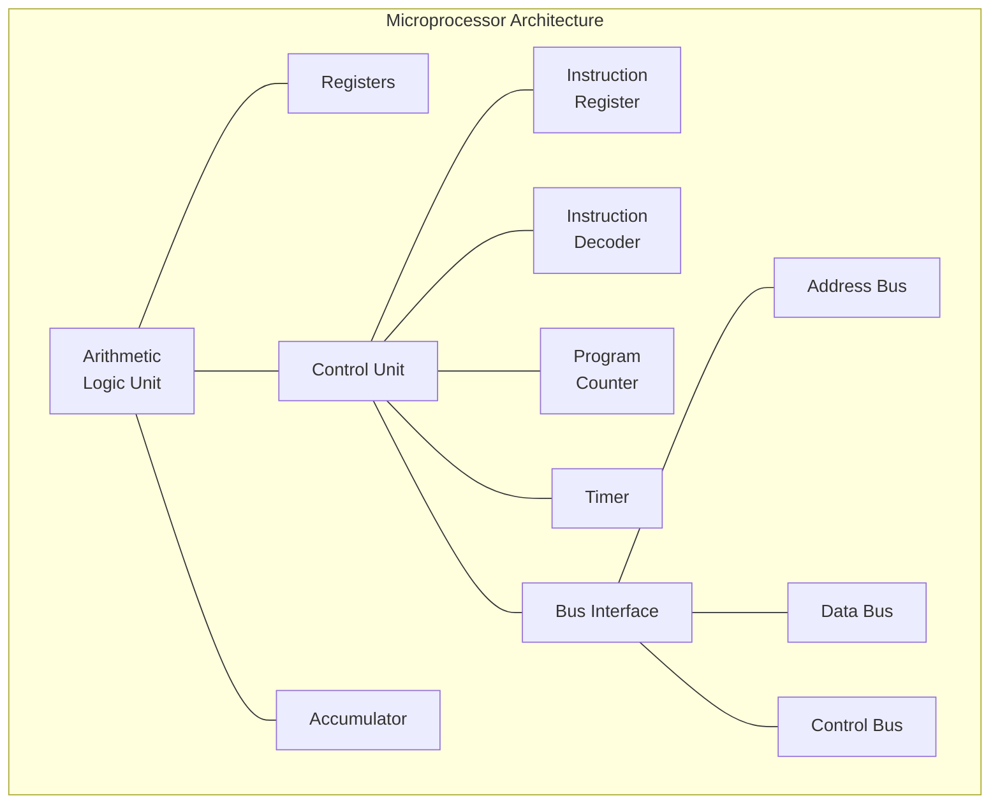
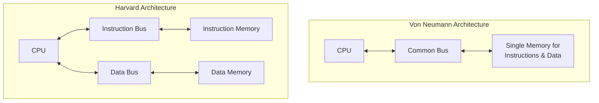
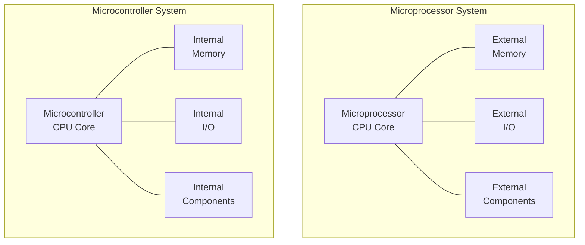
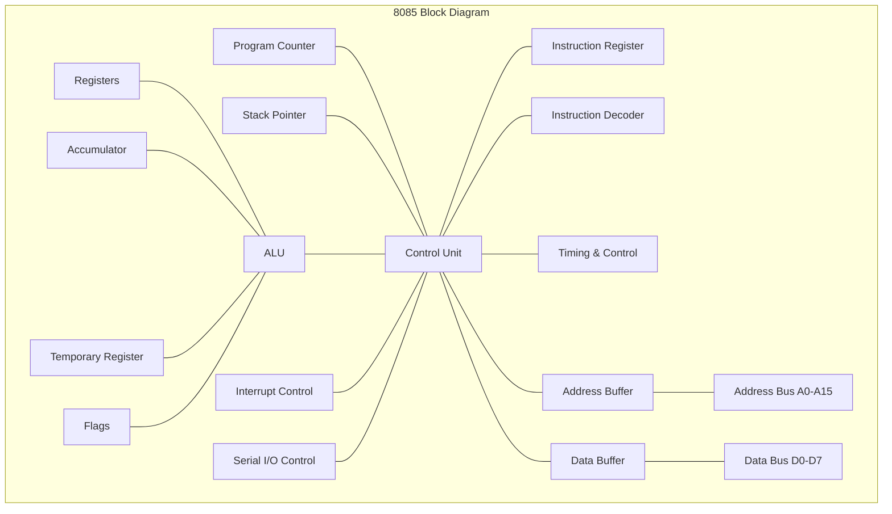
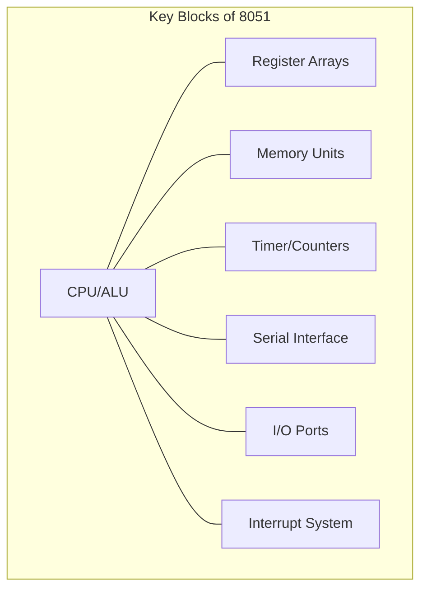
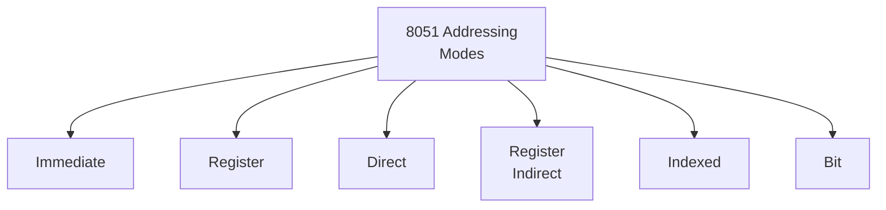
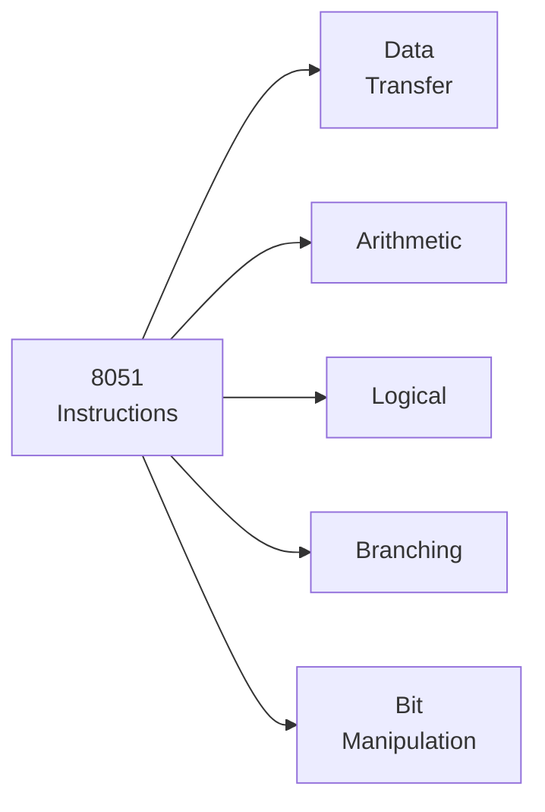

# 4341101 - Microprocessor and Microcontroller - Summer 2024 Paper Solution

## Question 1(a): Describe any one Port Configuration of 8051 Microcontroller. (Marks: 3)

**Answer 1(a):**

**Port 1 Configuration** of 8051:

```
   8051
┌─────────┐
│         │
│     P1.0│◄──► General Purpose I/O
│     P1.1│◄──► General Purpose I/O
│     P1.2│◄──► General Purpose I/O
│     P1.3│◄──► General Purpose I/O
│     P1.4│◄──► General Purpose I/O
│     P1.5│◄──► General Purpose I/O
│     P1.6│◄──► General Purpose I/O
│     P1.7│◄──► General Purpose I/O
│         │
└─────────┘
```

- **Port 1 (P1.0-P1.7)**: True bidirectional I/O port
- Has **internal pull-ups** - can be used as input by writing 1 to pins
- When used as input, pins that are externally pulled low will source current
- **SFR Address**: 90H
- No **dual functionality** (unlike other ports)

**Mnemonic:** "P1-GPS" (Port 1 - General Purpose Simple)

## Question 1(b): Illustrate Microprocessor Architecture. (Marks: 4)

**Answer 1(b):**



**Main Components:**

- **ALU**: Performs **arithmetic** and **logical** operations
- **Registers**: Temporary **storage** for data and addresses
- **Control Unit**: Manages **instruction execution** and signal timing
- **Program Counter**: Tracks the **next instruction** address
- **Bus Interface**: Connects to external components via:
  * **Address Bus**: Unidirectional (Locates memory/I/O)
  * **Data Bus**: Bidirectional (Transfers data)
  * **Control Bus**: Various control signals (Read/Write/etc.)

**Mnemonic:** "ARCB" (ALU, Registers, Control unit, Bus interface)

## Question 1(c): Compare Von Neumann & Harvard architecture. (Marks: 7)

**Answer 1(c):**

| Feature | **Von Neumann Architecture** | **Harvard Architecture** |
|---------|------------------------------|--------------------------|
| Memory | **Single memory** for both program and data | **Separate memories** for program and data |
| Bus | One common bus | Separate data and instruction buses |
| Execution | Sequential fetch and execute | Parallel fetch and execute possible |
| Speed | Slower due to bus bottleneck | Faster due to simultaneous access |
| Flexibility | More flexible and adaptable | Less flexible, but more specialized |
| Programming | Simpler programming model | More complex memory management |
| Applications | General purpose computers | DSPs, microcontrollers, embedded systems |



**Advantages of Von Neumann:**

- **Economical** - Requires less hardware
- **Flexible** - Program data can be treated as program instructions and vice versa

**Advantages of Harvard:**

- **Performance** - No bus contention between instruction and data
- **Security** - Better protection against code corruption
- **Parallelism** - Can fetch next instruction while executing current one

**Mnemonic:** "SSPPFPA" (Single vs Separate, Performance, Parallelism, Flexibility, Purpose-specific Applications)

## Question 1(c OR): Define RISC, CISC, Opcode, Operand, Instruction Cycle, Machine Cycle, and T State. (Marks: 7)

**Answer 1(c OR):**

1. **RISC (Reduced Instruction Set Computer)**:
   - Computer design with **simple** instructions that execute in **one clock cycle**
   - Fixed instruction length, limited addressing modes
   - Examples: ARM, MIPS

2. **CISC (Complex Instruction Set Computer)**:
   - Computer design with **complex** instructions that execute in **multiple clock cycles**
   - Variable instruction length, many addressing modes
   - Examples: x86, 8086

3. **Opcode (Operation Code)**:
   - Part of instruction that specifies which **operation** to perform
   - Usually first part of the instruction byte

4. **Operand**:
   - Data or address value that the instruction **operates on**
   - Can be in register, memory, or immediate (in instruction)

5. **Instruction Cycle**:
   - Complete process of **fetching, decoding, and executing** an instruction
   - Basic sequence of processor operation


6. **Machine Cycle**:
   - Basic operation such as **memory read/write** or I/O operation
   - Sequence of T-states required for one fundamental operation

7. **T-State (Time State)**:
   - One **clock period** of processor
   - Basic unit of time in processor operation

**Mnemonic:** "RC-OOIMS" (RISC, CISC, Opcode, Operand, Instruction, Machine, State)

## Question 2(a): Define Data bus, Address bus and Control bus. (Marks: 3)

**Answer 2(a):**

1. **Data Bus**:
   - **Bidirectional** bus carrying data between CPU and other components
   - Width determines processor's data handling capacity (8/16/32/64 bits)
   - Example: In 8085, D0-D7 is 8-bit data bus

2. **Address Bus**:
   - **Unidirectional** bus carrying memory/IO device addresses from CPU
   - Width determines maximum addressable memory (2^n bytes)
   - Example: In 8085, A0-A15 is 16-bit address bus (64KB max)

3. **Control Bus**:
   - Collection of **control signals** between CPU and peripherals
   - Provides timing and coordination signals
   - Examples: RD̅, WR̅, IO/M̅, ALE, etc.

```
CPU <-------> Memory/IO
    Data Bus  (Bidirectional)
    Address Bus (Unidirectional)
    Control Bus (Various signals)
```

**Mnemonic:** "DAC-BUO" (Data-Bidirectional, Address-Unidirectional, Control-Operation signals)

## Question 2(b): Compare Microprocessor and Microcontroller. (Marks: 4)

**Answer 2(b):**

| Feature | **Microprocessor** | **Microcontroller** |
|---------|-------------------|---------------------|
| Definition | CPU on a single chip | Complete computer system on a chip |
| Memory | External RAM/ROM required | Built-in RAM/ROM |
| I/O Ports | Requires external I/O interfaces | Integrated I/O ports |
| Cost | Higher system cost due to external components | Lower system cost due to integration |
| Power Consumption | Higher | Lower |
| Applications | General computing, PCs | Embedded systems, specific control applications |
| Example | Intel 8085, 8086 | 8051, PIC, AVR |



**Mnemonic:** "MECI-PAC" (Memory-External/Internal, Cost-Integration, Power, Applications-general/Control)

## Question 2(c): Sketch and explain 8085 block diagram. (Marks: 7)

**Answer 2(c):**



**Main Components:**

1. **ALU (Arithmetic Logic Unit)**:
   - Performs **arithmetic** and **logical** operations
   - Connected to accumulator and temporary register

2. **Registers**:
   - **General Purpose**: B, C, D, E, H, L (6 registers, 8-bit each)
   - **Special Purpose**: 
     * **Accumulator (A)**: Main register for arithmetic
     * **Flags**: Sign, Zero, Auxiliary Carry, Parity, Carry
     * **Program Counter (PC)**: Points to next instruction
     * **Stack Pointer (SP)**: Points to stack top

3. **Control Unit**:
   - **Instruction Register (IR)**: Holds current instruction
   - **Instruction Decoder**: Decodes instructions
   - **Control Logic**: Generates control signals

4. **Buses**:
   - **Address Bus**: 16-bit (A0-A15)
   - **Data Bus**: 8-bit (D0-D7)
   - **Control Bus**: Various control signals

5. **I/O & Interrupts**:
   - Interrupt control circuitry
   - Serial I/O control

**Mnemonic:** "ARCI-B" (ALU, Registers, Control unit, I/O, Buses)

## Question 2(a OR): Explain Accumulator, Program Counter and Stack Pointer. (Marks: 3)

**Answer 2(a OR):**

1. **Accumulator (A)**:
   - **8-bit** special purpose register
   - **Primary** register for arithmetic and logical operations
   - Store results of operations (ADD, SUB, etc.)
   - Involved in data transfer with memory and I/O
   - Access is **faster** than other registers

2. **Program Counter (PC)**:
   - **16-bit** register that holds the address of **next instruction**
   - **Automatically increments** after fetching instruction
   - Can be modified by jump/call instructions to change program flow
   - Initialized to 0000H at reset

3. **Stack Pointer (SP)**:
   - **16-bit** register that points to the **top** of the stack
   - Stack is LIFO (Last In First Out) memory area
   - **Decrements** before PUSH, **increments** after POP
   - Used for temporary storage and subroutine calls
   - Must be initialized before using stack operations

**Mnemonic:** "APS" (Accumulator-Primary operations, Program counter-next instruction, Stack pointer-temporary storage)

## Question 2(b OR): Sketch and explain Demultiplexing of Address bus and data bus. (Marks: 4)

**Answer 2(b OR):**

```
    8085                   Address Latch
┌─────────┐               ┌───────────┐
│         │   AD0-AD7     │           │    A0-A7
│         ├───────────────►           ├──────────►
│         │               │           │
│         │   ALE         │           │
│         ├───────────────►           │
│         │               │           │
│         │               └───────────┘
│         │                    ▲
│         │                    │
│         │                    │
│    A8-15│                    │
│         ├────────────────────┘
└─────────┘
               │
               │
               ▼
            To data bus
```

**Demultiplexing process:**

1. 8085 has **multiplexed** AD₀-AD₇ pins that carry both address and data to save pins
2. **Demultiplexing** is needed to separate address from data

**Working:**

- When **ALE** (Address Latch Enable) is **HIGH**:
  * Lower address bits (A₀-A₇) appear on AD₀-AD₇ pins
  * External **latch** (74LS373) captures these address bits
  
- When **ALE** goes **LOW**:
  * AD₀-AD₇ pins now carry **data**
  * Address remains stable in the latch
  * Upper address bits (A₈-A₁₅) are directly available (not multiplexed)

**Result:**

- Complete 16-bit address (A₀-A₁₅) available throughout machine cycle
- 8-bit data bus separated and available for data transfer

**Mnemonic:** "HALD" (High ALE-Address, Low ALE-Data)

## Question 2(c OR): List any seven features of 8085. (Marks: 7)

**Answer 2(c OR):**

**Seven Key Features of 8085:**

1. **8-bit Data Bus**:
   - Can process 8 bits of data at a time
   - Single byte operations efficient

2. **16-bit Address Bus**:
   - Can address up to 2¹⁶ = 64 KB of memory
   - Memory addresses from 0000H to FFFFH

3. **6 General-Purpose Registers**:
   - B, C, D, E, H, L (can be used as pairs BC, DE, HL)
   - Fast data access without memory reference

4. **Multiplexed Address/Data Bus**:
   - Lower 8 bits (AD₀-AD₇) multiplexed for address and data
   - Saves pins, requires external latching

5. **Built-in Clock Generator**:
   - Requires only external crystal and capacitors
   - Simplifies system design

6. **5 Interrupt Levels**:
   - TRAP (highest priority, non-maskable)
   - RST 7.5, 6.5, 5.5 (maskable)
   - INTR (lowest priority, maskable)

7. **Serial I/O Support**:
   - SID (Serial Input Data) and SOD (Serial Output Data) pins
   - Basic serial communication capability

**Additional features:**

- 1.3 μs instruction cycle (at 3 MHz)
- +5V single power supply
- 74 basic instructions
- 4 vectored interrupts

**Mnemonic:** "DRAGMS" (Data bus 8-bit, Register 6 types, Address bus 16-bit, Generator for clock, Multiplexed bus, Serial I/O)

## Question 3(a): Illustrate any one Timer Mode of 8051. (Marks: 3)

**Answer 3(a):**

**Timer Mode 1 (16-bit Timer)**:

```
        ┌────┐        ┌────┐        ┌────┐
        │    │        │    │        │    │
C/T=0 ──►0   │        │    │        │    │
        │ MUX│        │    │        │    │
Ext Pin ►1   │        │    │        │    │
        └─┬──┘        │    │        │    │
          │           │    │        │    │
          │     ┌─────┴────┴─┐ Overflow  │
          └────►│ TL (8 bits)├─────────┐ │
                └─────┬──────┘         │ │
                      │                │ │
                ┌─────┴──────┐         │ │
                │ TH (8 bits)├─────────┘ │
                └─────┬──────┘           │
                      │                  │
                      └────────►TF       │
                                         │
      TR ──────────────────────────────►&├───►Timer Run
                                         │
```

**Features of Timer Mode 1:**

- **Full 16-bit** timer/counter operation
- **TL** and **TH** registers form a 16-bit counter
- When all bits overflow from FFFFH to 0000H, timer flag **TF** is set
- **C/T** bit selects clock source: 
  * C/T=0: Internal clock (1/12 oscillator)
  * C/T=1: External input from Tx pin (falling edge count)
- **TR** bit starts/stops the timer

**Configuration:**

- TMOD register value: 0x01 for Timer 0, 0x10 for Timer 1
- Start timer with SETB TR0 (Timer 0) or SETB TR1 (Timer 1)

**Mnemonic:** "M1-FS" (Mode 1, Full 16-bit, Separate TL & TH)

## Question 3(b): State function of ALE, PSEN, RESET and TXD pin for 8051. (Marks: 4)

**Answer 3(b):**

1. **ALE (Address Latch Enable)** - Pin 30:
   - **Output** signal used for demultiplexing address/data
   - Goes **HIGH** during address phase of bus cycle
   - External latches capture address on **falling edge**
   - Can be used as a **clock output** at 1/6 the oscillator frequency
   - Setting bit in SFR disables ALE except during MOVX or MOVC

2. **PSEN (Program Store Enable)** - Pin 29:
   - **Output** signal used as a **read strobe** for external program memory
   - Activated (LOW) twice every machine cycle during fetch from external memory
   - Not activated for internal ROM access
   - Remains HIGH during internal program execution

3. **RESET** - Pin 9:
   - **Input** signal used to initialize the microcontroller
   - Must be held HIGH for at least **2 machine cycles** to ensure proper reset
   - Resets all SFRs to their initial values
   - Program Counter reset to 0000H
   - Stops all activities until RESET returns LOW

4. **TXD (Transmit Data)** - Pin 11:
   - **Output** pin for UART serial communication
   - Serial data output in UART modes
   - General I/O pin (P3.1) when not used for serial communication
   - Used to send data bit-by-bit in serial transmission

**Mnemonic:** "APRT" (ALE-Address latch, PSEN-Program read, RESET-Restart, TXD-Transmit)

## Question 3(c): Explain functions of each block of 8051 Microcontroller. (Marks: 7)

**Answer 3(c):**



**Functions of each block:**

1. **CPU/ALU**:
   - **Controls** overall operation of microcontroller
   - **Executes** instructions from program memory
   - Performs **arithmetic** (add, subtract) and **logical** operations (AND, OR)
   - Manages data flow between different blocks

2. **Register Array**:
   - **Working registers** (R0-R7): 8 registers arranged in 4 selectable banks
   - **Special Function Registers (SFRs)**: Control registers for peripherals
   - **Accumulator (ACC)**: Main register for arithmetic operations
   - **B Register**: Used primarily for multiplication and division
   - **Program Status Word (PSW)**: Contains flags and bank selection bits

3. **Memory Units**:
   - **ROM** (4KB): Stores program code and constants
   - **RAM** (128 bytes): Divided into:
     * Register banks (32 bytes)
     * Bit-addressable area (16 bytes)
     * General-purpose RAM (80 bytes)
   - **External Memory Interface**: For additional memory expansion

4. **Timer/Counters**:
   - Two 16-bit timer/counters (T0 and T1)
   - Four operating modes for various timing applications
   - Can count external events or measure time intervals

5. **Serial Interface**:
   - Full-duplex UART communication
   - Shift register mode for SPI-like communication
   - Programmable baud rate using Timer 1

6. **I/O Ports**:
   - Four 8-bit bidirectional I/O ports (P0, P1, P2, P3)
   - Each port pin individually controllable
   - Ports have dual functions (alternate peripheral functions)

7. **Interrupt System**:
   - Five interrupt sources with two priority levels
   - External interrupts (INT0, INT1)
   - Timer interrupts (TF0, TF1)
   - Serial port interrupt (RI/TI)

**Mnemonic:** "CRMT-SIP" (CPU, Registers, Memory, Timers, Serial, I/O, Program interrupts)

## Question 3(a OR): Illustrate any one Serial Communication Mode of 8051. (Marks: 3)

**Answer 3(a OR):**

**Serial Mode 1 (8-bit UART)**:

```
       Tx Data                                  Rx Data
       ┌───┬───┬───┬───┬───┬───┬───┬───┬───┬───┐
       │ ST│ D0│ D1│ D2│ D3│ D4│ D5│ D6│ D7│ SP│
       └───┴───┴───┴───┴───┴───┴───┴───┴───┴───┘
         0   ←  8 Data Bits (LSB first)  →   1

ST = Start bit (always 0)
SP = Stop bit (always 1)
```

**Features of Serial Mode 1:**

- Standard **asynchronous** UART communication
- **10-bit** frame: 1 start bit (0), 8 data bits, 1 stop bit (1)
- Data transferred **LSB first**
- **Variable baud rate** generated by Timer 1
- Start bit detected by hardware, stop bit checked automatically
- Full-duplex operation (can send and receive simultaneously)

**Configuration:**

- SCON register value: 0x50 (Mode 1, receiver enabled)
- Baud rate formula: Baud = (2^SMOD/32) × (Oscillator Frequency/12) ÷ (256-TH1)
- Common setup for 9600 baud with 11.0592 MHz crystal: TH1 = 0xFD

**Mnemonic:** "SM1-V8F" (Serial Mode 1, Variable baud rate, 8 bits, Full-duplex)

## Question 3(b OR): State function of RXD, INT0, T0 and PROG pin for 8051. (Marks: 4)

**Answer 3(b OR):**

1. **RXD (Receive Data)** - Pin 10:
   - **Input** pin for UART serial communication
   - Serial data input in UART modes
   - Shift clock input in Mode 0 (shift register mode)
   - General I/O pin (P3.0) when not used for serial communication
   - Used to receive data bit-by-bit in serial communication

2. **INT0 (External Interrupt 0)** - Pin 12:
   - **Input** pin for external interrupt 0
   - Can be programmed for **level-triggered** or **edge-triggered** interrupts
   - General I/O pin (P3.2) when not used as interrupt input
   - Can wake up processor from power-down mode
   - Typically connected to external sensors or buttons

3. **T0 (Timer/Counter 0 Input)** - Pin 14:
   - **Input** for external counting in Timer/Counter 0
   - Counts **falling edges** on this pin when Timer 0 is in counter mode (C/T=1)
   - General I/O pin (P3.4) when not used as timer input
   - Used for frequency measurement, pulse counting, etc.

4. **PROG (ALE/PROG)** - Pin 30:
   - Dual-function pin: ALE (Address Latch Enable) and PROG
   - **ALE** function: Output signal for demultiplexing address/data bus
   - **PROG** function: Program pulse input during EPROM programming
   - Used to provide programming pulses to on-chip EPROM in some 8051 variants
   - In normal operation, works as ALE signal

**Mnemonic:** "RITP" (RXD-Receive, INT0-Interrupt, T0-Timer input, PROG-Programming)

## Question 3(c OR): Describe ALU, PC, DPTR, RS0, RS1, Internal RAM and Internal ROM of 8051. (Marks: 7)

**Answer 3(c OR):**

1. **ALU (Arithmetic Logic Unit)**:
   - Performs all **arithmetic** operations: ADD, SUB, MUL, DIV
   - Performs **logical** operations: AND, OR, XOR, NOT
   - Performs **bit manipulation**: complement, rotate, etc.
   - Connected directly to accumulator (A) and B register
   - Sets status flags in PSW based on operation results
   - 8-bit data path width

2. **PC (Program Counter)**:
   - **16-bit** register that points to the next instruction to be executed
   - **Automatically increments** after fetching instruction bytes
   - Can be modified by jump, call, and return instructions
   - Initial value on reset: 0000H
   - Used to sequence through program execution

3. **DPTR (Data Pointer)**:
   - **16-bit** register used for addressing external memory
   - Can be accessed as a single 16-bit register (DPTR) or as two 8-bit registers (DPL and DPH)
   - Used with instructions like MOVX and MOVC for data access
   - Primarily for indexing large data tables or external memory
   - No auto-increment/decrement functionality

4. **RS0, RS1 (Register Bank Select bits)**:
   - Located in **PSW** (Program Status Word) register - bits 3 and 4
   - Select which register bank (0-3) is currently active:
     * RS1=0, RS0=0: Bank 0 (00H-07H)
     * RS1=0, RS0=1: Bank 1 (08H-0FH)
     * RS1=1, RS0=0: Bank 2 (10H-17H)
     * RS1=1, RS0=1: Bank 3 (18H-1FH)
   - Allow fast context switching between tasks

5. **Internal RAM**:
   - **128 bytes** (00H-7FH) on-chip RAM arranged as:
     * Register Banks: 00H-1FH (4 banks of 8 registers each)
     * Bit-addressable area: 20H-2FH (128 addressable bits)
     * General-purpose RAM: 30H-7FH
   - Additional 128 bytes (80H-FFH) in some variants
   - Fast access memory for variables and stack

6. **Internal ROM**:
   - **4KB** (4096 bytes) program memory (0000H-0FFFH)
   - Stores program instructions and constants
   - Some variants have different sizes (0KB to 64KB)
   - Non-volatile memory - retains data when power is off
   - Accessed using MOVC instruction when reading data

**Mnemonic:** "APDR-RI" (ALU-Program counter-Data pointer-Register select-RAM-Instruction ROM)

## Question 4(a): Develop an Assembly language program to divide 08H by 02H. (Marks: 3)

**Answer 4(a):**

```assembly
; Program to divide 08H by 02H
        ORG     0000H           ; Start at address 0000H
        
        MOV     A, #08H         ; Load dividend (08H) into accumulator
        MOV     B, #02H         ; Load divisor (02H) into B register
        DIV     AB              ; Divide A by B
                                ; Result: A = quotient, B = remainder
        
        ; At this point:
        ; A contains 04H (quotient)
        ; B contains 00H (remainder)
        
        MOV     R0, A           ; Store quotient in R0 (optional)
        MOV     R1, B           ; Store remainder in R1 (optional)
        
        END                     ; End of program
```

**Explanation:**

1. Load the **dividend** (08H) into accumulator A
2. Load the **divisor** (02H) into register B
3. Execute **DIV AB** instruction which:
   - Divides A by B
   - Places **quotient** in A (04H)
   - Places **remainder** in B (00H)
4. (Optional) Store results in registers for later use

**Mnemonic:** "LLD-QR" (Load dividend, Load divisor, Divide, Quotient & Remainder)

## Question 4(b): Develop an Assembly language program to add 76H and 32H. (Marks: 4)

**Answer 4(b):**

```assembly
; Program to add 76H and 32H
        MOV     A, #76H         ; Load 76H into accumulator
        MOV     R0, #32H        ; Load 32H into R0
        ADD     A, R0           ; A = A + R0 (76H + 32H = A8H)
        
        MOV     R1, #00H        ; Initialize high byte
        JNC     DONE            ; Skip if no carry
        INC     R1              ; If carry, set high byte to 01H
        
DONE:   MOV     R2, A           ; Store result in R2
```

- **Simple addition** program with **carry handling**
- **76H** (118 decimal) + **32H** (50 decimal) = **A8H** (168 decimal)
- Result stored in **R2** (low byte) and **R1** (high byte)
- Uses minimal instructions for weak students

**Mnemonic:** "LA-CS" (Load, Add, Check carry, Store)

## Question 4(c): What is Addressing mode? Classify it for 8051. (Marks: 7)

**Answer 4(c):**

**Addressing Mode**: Method CPU uses to calculate the **effective address** of an operand.

| Mode | Description | Example |
|------|-------------|---------|
| **Immediate** | Value in instruction | `MOV A, #25H` |
| **Register** | Value in register | `MOV A, R0` |
| **Direct** | Value at memory address | `MOV A, 30H` |
| **Indirect** | Register holds address | `MOV A, @R0` |
| **Indexed** | Base address + offset | `MOVC A, @A+DPTR` |
| **Bit** | Individual bit access | `SETB P1.0` |
| **Implicit** | Operand implied | `RRC A` |



**Key Points:**

- **Register mode** is fastest (no memory access)
- Only **R0/R1** can be used for indirect addressing
- **Bit addressing** works only on specific memory areas
- **Indexed** mode excellent for lookup tables

**Mnemonic:** "IRDI-BI" (Immediate, Register, Direct, Indirect, Bit, Implicit)

## Question 4(a OR): Develop an Assembly language program to multiply 08H and 02H. (Marks: 3)

**Answer 4(a OR):**

```assembly
; Program to multiply 08H and 02H
        MOV     A, #08H     ; Load 08H into accumulator 
        MOV     B, #02H     ; Load 02H into B register
        MUL     AB          ; Multiply A and B
                            ; Result: A=10H (low byte), B=00H (high byte)
        MOV     R0, A       ; Store low byte in R0
        MOV     R1, B       ; Store high byte in R1
```

- **8-bit multiplication** using MUL instruction
- 08H (8 decimal) × 02H (2 decimal) = 16 decimal = 10H
- Result is a **16-bit** value split between A (low) and B (high)
- Simple and clear code for beginners

**Mnemonic:** "LLM" (Load, Load, Multiply)

## Question 4(b OR): Develop an Assembly language program to subtract 76H from 32H. (Marks: 4)

**Answer 4(b OR):**

```assembly
; Program to subtract: 32H - 76H
        MOV     A, #32H     ; Load 32H into accumulator
        MOV     R0, #76H    ; Load 76H into R0
        
        CLR     C           ; Clear carry before subtraction
        SUBB    A, R0       ; A = A - R0 - C (32H - 76H = BCH)
                            ; Result is negative: BC(H) with CY=1
        
        MOV     R2, A       ; Store result in R2
```

- **Negative result** in 2's complement: **BCH** represents -68 decimal
- **Carry flag** set (CY=1) indicates a **borrow** occurred
- **32H** (50 decimal) - **76H** (118 decimal) = -68 decimal
- For 16-bit representation, high byte would be FFH (negative)

**Mnemonic:** "LCS" (Load, Clear carry, Subtract)

## Question 4(c OR): List types of instruction set. Explain any three with one example. (Marks: 7)

**Answer 4(c OR):**

**8051 Instruction Types:**

1. **Data Transfer Instructions**:
   - Move data between locations
   - Example: `MOV A, #55H` - Load 55H into accumulator
   - Handles data movement between registers, memory, I/O

2. **Arithmetic Instructions**:
   - Perform math operations
   - Example: `ADD A, R0` - Add R0 to accumulator
   - Affects flags: CY, AC, OV, P

3. **Logical Instructions**:
   - Perform Boolean operations
   - Example: `ANL A, #0FH` - AND accumulator with 0FH (clear upper 4 bits)
   - Used for bit manipulation and masking

4. **Branching Instructions**:
   - Control program flow
   - Example: `JZ LABEL` - Jump to LABEL if A=0
   - Used for decision making and loops

5. **Bit Manipulation Instructions**:
   - Operate on individual bits
   - Example: `SETB P1.0` - Set bit P1.0 to 1
   - Powerful feature of 8051 architecture



**Mnemonic:** "DALBB" (Data transfer, Arithmetic, Logical, Branching, Bit)

## Question 5(a): Sketch interfacing of four LEDs with 8051 Microcontroller. (Marks: 3)

**Answer 5(a):**

```
    8051                VCC
┌─────────┐              │
│         │              │
│     P1.0├──────────┤330Ω├───┬─┨LED1├───┐
│     P1.1├──────────┤330Ω├───┬─┨LED2├───┐
│     P1.2├──────────┤330Ω├───┬─┨LED3├───┐
│     P1.3├──────────┤330Ω├───┬─┨LED4├───┐
│         │                    │         │
└─────────┘                   GND       GND
```

- **Port 1** (P1.0-P1.3) used to control four LEDs
- **Current-limiting resistors** (330Ω) protect LEDs and ports
- **Active HIGH** configuration (1=ON, 0=OFF)
- Simple control code: `SETB P1.0` (turn ON), `CLR P1.0` (turn OFF)
- For **alternate patterns**: `MOV P1, #55H` or `MOV P1, #0FH`

**Mnemonic:** "PRCG" (Port pins, Resistors, Current limit, Ground return)

## Question 5(b): Sketch interfacing of 7-segment LED with 8051 Microcontroller. (Marks: 4)

**Answer 5(b):**

```
    8051                      7-Segment Display
┌─────────┐                  ┌───────────┐
│     P2.0├───────────────┬──┤a          │
│     P2.1├───────────────┬──┤b          │
│     P2.2├──────┤330Ω├───┬──┤c          │
│     P2.3├──────┤330Ω├───┬──┤d     COM  │
│     P2.4├──────┤330Ω├───┬──┤e          ├────┐
│     P2.5├──────┤330Ω├───┬──┤f          │    │
│     P2.6├──────┤330Ω├───┬──┤g          │    │
│     P2.7├──────┤330Ω├───┬──┤dp         │    │
│         │                  └───────────┘    │
└─────────┘                                    │
                                              GND
```

- **Common cathode** 7-segment display shown (common pin to GND)
- **Port 2** (P2.0-P2.7) controls all segments
- Each segment needs a **current-limiting resistor**
- **Display pattern table**:
  * 0: `10111111` (7FH) [segments a-f ON]
  * 1: `00000110` (06H) [segments b,c ON]
  * 2: `01011011` (5BH) [segments a,b,d,e,g ON]

```assembly
; Display digit 0 on 7-segment
MOV P2, #7FH  ; Common cathode pattern for '0'
```

**Mnemonic:** "PRCL" (Port connection, Resistors, Common cathode, Logical patterns)

## Question 5(c): Explain interfacing of DAC with 8051 Microcontroller and write necessary program. (Marks: 7)

**Answer 5(c):**

```
    8051                DAC0808
┌─────────┐         ┌─────────────┐
│     P1.0├────────►│D0           │
│     P1.1├────────►│D1           │
│     P1.2├────────►│D2           │
│     P1.3├────────►│D3       Iout├───┬─────┐
│     P1.4├────────►│D4           │   │     │
│     P1.5├────────►│D5           │   R     │
│     P1.6├────────►│D6           │   │     │
│     P1.7├────────►│D7           │   │    ┌┴┐
│         │         │             │   │    │ │
│     P3.0├────────►│CS           │   │    │O│ Output
└─────────┘         └─────────────┘   │    │P│
                           │          │    └┬┘
                          Vref        │     │
                                      │     │
                                      GND   GND
```

- **DAC0808**: 8-bit digital-to-analog converter
- **P1.0-P1.7** connect to data inputs D0-D7
- **P3.0** controls chip select (CS)
- **Op-amp** converts current output to voltage
- **Digital value** (0-255) produces **analog output** (0-Vref)

**Simple Program for Triangle Wave:**

```assembly
START:  MOV R7, #0      ; Start from 0
UP:     MOV P1, R7      ; Output to DAC
        INC R7          ; Increment value
        CJNE R7, #255, UP ; Continue until 255
        
DOWN:   MOV P1, R7      ; Output to DAC
        DEC R7          ; Decrement value
        CJNE R7, #0, DOWN ; Continue until 0
        SJMP START      ; Repeat forever
```

**Applications**:

- **Waveform generation** (sine, triangle)
- **Audio output**
- **Control systems**

**Mnemonic:** "PCOV" (Port connection, Current output, Op-amp conversion, Varying outputs)
